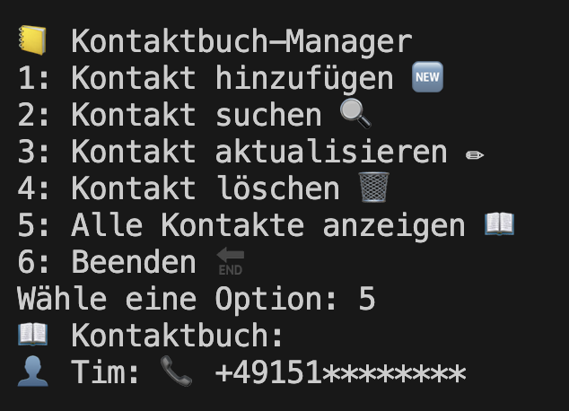
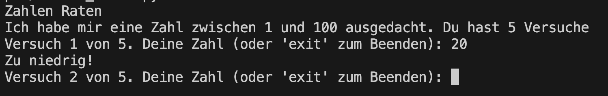
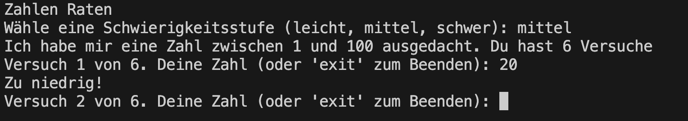

# Dienstag

Ziel des Tages ist es, ein Terminal-Kontaktbuch zu implementieren. Hierbei sollen pro Projektschritt folgende Schritte durchgeführt werden:

1. Implementierung mit Python
2. Dokumentation mit Docstrings
3. Testing mit Unittests
4. Arbeiten mit Git im eigenen Git-Repo

Am Ende der Woche soll jeder ein Repository mit Lösungen zu allen Aufgaben haben.

## Automatische Dokumentation mit pdoc - Philip
Bevor wir mit dem heutigen Projek starten, schauen wir uns an, wie man aus docstrings ganze Dokumentationen generieren kann.

## Tagesprojekt - Terminal-Kontaktbuch


### Konzepte des Zweiten Tages
- [Dictionaries](../python_grundlagen/dictionaries/dictionaries.md)
- [Exception Handling in Python](../python_grundlagen/try_except/try_except.md)
- [Klassen](../python_grundlagen/oop/define_classes/define_classes.md)
- [(Optional) Exkurs: Reguläre Ausdrücke](../python_grundlagen/regex/regex.md)
- [Einführung in Git](https://python-wiki.de/lehrplan/git/git.html)
- [Docstring](../python_grundlagen/docstring/docstring.md)
- [Unittests](../python_grundlagen/oop/unittests/unittests.md)

## Simples zahlen raten 🌶️🌶️


Schreibe ein Programm für ein einfaches Zahlenraten-Spiel.

### Anforderungen
- Das Programm wählt zufällig eine Zahl zwischen 1 und 100
- Der Benutzer hat 5 Versuche.
- Nach jedem Rateversuch gibt das Programm einen Hinweis, ob die geratene Zahl zu hoch, zu niedrig oder korrekt ist. 
- Verwende try und except, um sicherzustellen, dass der Benutzer nur gültige Zahlen eingibt.

??? success "Lösung"

    ```python
    import random

    def number_guesser():
        zielzahl = random.randint(1, 100)
        versuche = 0
        max_versuche = 5

        print("Zahlen Raten")
        print("Ich habe mir eine Zahl zwischen 1 und 100 ausgedacht. Du hast 5 Versuche")

        while versuche < max_versuche:
            try:
                versuche += 1
                eingabe = input(f"Versuch {versuche} von {max_versuche}. Deine Zahl (oder 'exit' zum Beenden): ")
                if eingabe.lower() == 'exit':
                    print("Spiel beendet. Danke fürs Spielen!")
                    break
                geratene_zahl = int(eingabe)
                if geratene_zahl < 1 or geratene_zahl > 100:
                    raise ValueError
                if geratene_zahl < zielzahl:
                    print("Zu niedrig!")
                elif geratene_zahl > zielzahl:
                    print("Zu hoch!")
                else:
                    print(f"Richtig geraten! Die Zahl war {zielzahl}. Du hast {versuche} Versuche gebraucht.")
                    break
            except ValueError:
                print("Bitte gib eine gültige Zahl zwischen 1 und 100 ein.")
                versuche -= 1  # Stellt sicher, dass ungültige Eingaben nicht als Versuch zählen.

        if versuche == max_versuche and geratene_zahl != zielzahl:
            print(f"Leider verloren. Die Zahl war {zielzahl}. Besser Glück beim nächsten Mal!")

    number_guesser()
    ```


## Zahlen raten mit Optionen 🌶️🌶️🌶️


Erweitere das Zahlenraten-Spiel mit Schwierigkeitsgraden die du in einem Dictionary speicherst.

### Anforderungen
- Nutze ein Dictionary um leicht, mittel und schwer als optionen zu speicher
- Nutze Tuple um die untere und obere Grenze sowie die Anzahl der Versuche zu speichern

??? success "Lösung"

    ```python
    import random

    def number_guesser():
        schwierigkeiten = {
            'leicht': (1, 50, 7),
            'mittel': (1, 100, 6),
            'schwer': (1, 200, 5)
        }

        print("Zahlen Raten")
        schwierigkeit = input("Wähle eine Schwierigkeitsstufe (leicht, mittel, schwer): ").lower()

        if schwierigkeit in schwierigkeiten:
            untere_grenze, obere_grenze, max_versuche = schwierigkeiten[schwierigkeit]
        else:
            print("Ungültige Schwierigkeitsstufe. Standardmäßig wird 'mittel' gesetzt.")
            untere_grenze, obere_grenze, max_versuche = schwierigkeiten['mittel']

        zielzahl = random.randint(untere_grenze, obere_grenze)
        versuche = 0

        print(f"Ich habe mir eine Zahl zwischen {untere_grenze} und {obere_grenze} ausgedacht. Du hast {max_versuche} Versuche")

        while versuche < max_versuche:
            try:
                versuche += 1
                eingabe = input(f"Versuch {versuche} von {max_versuche}. Deine Zahl (oder 'exit' zum Beenden): ")
                if eingabe.lower() == 'exit':
                    print("Spiel beendet. Danke fürs Spielen!")
                    break
                geratene_zahl = int(eingabe)
                if geratene_zahl < untere_grenze or geratene_zahl > obere_grenze:
                    raise ValueError
                if geratene_zahl < zielzahl:
                    print("Zu niedrig!")
                elif geratene_zahl > zielzahl:
                    print("Zu hoch!")
                else:
                    print(f"Richtig geraten! Die Zahl war {zielzahl}. Du hast {versuche} Versuche gebraucht.")
                    break
            except ValueError:
                print("Bitte gib eine gültige Zahl zwischen 1 und 100 ein.")
                versuche -= 1  # Stellt sicher, dass ungültige Eingaben nicht als Versuch zählen.

        if versuche == max_versuche and geratene_zahl != zielzahl:
            print(f"Leider verloren. Die Zahl war {zielzahl}. Besser Glück beim nächsten Mal!")

    number_guesser()
    ```


## (Optional) Tinder war gestern, let's Regex 🌶️🌶️🌶️🌶️
Schreibe ein Programm, das eine Liste von Kontaktnamen durchsucht und alle Kontakte ausgibt, die einem vom Benutzer eingegebenen Suchmuster entsprechen.

Bsp.
`suche_kontakte(kontaktliste, suchmuster)`

### Anforderungen
- Verwende Regular Expressions (Regex), um eine flexible und mächtige Suche zu ermöglichen, die Teilübereinstimmungen und verschiedene Suchkriterien unterstützt.

??? success "Lösung"

    ```python
    import re

    def suche_kontakte(kontakte, suchmuster):
        try:
            pattern = re.compile(suchmuster, re.IGNORECASE)
            gefundene_kontakte = [kontakt for kontakt in kontakte if pattern.search(kontakt)]
            if gefundene_kontakte:
                print("Gefundene Kontakte:")
                for kontakt in gefundene_kontakte:
                    print(kontakt)
            else:
                print("Keine Kontakte gefunden.")
        except re.error as e:
            print(f"Regex-Fehler: {e}")

    kontaktliste = [
        "Maria Müller",
        "Max Mustermann",
        "Erika Mustermann",
        "Johannes Gutenberg",
        "Marie Curie",
        "Max Planck",
        "Albert Einstein",
        "Niels Bohr",
        "Lise Meitner",
        "Werner Heisenberg",
        "Richard Feynman",
        "Ada Lovelace",
        "Charles Darwin",
        "Stephen Hawking",
        "Rosalind Franklin",
        "Grace Hopper",
        "Michael Faraday",
        "Carl Friedrich Gauss",
        "Nikola Tesla",
        "Leonardo da Vinci"
    ]

    print(kontaktliste)
    suchmuster = input("Gib ein Suchmuster ein (Regex erlaubt): ")
    suche_kontakte(kontaktliste, suchmuster)
    ```


## Call me maybe! 🌶️🌶️🌶️🌶️

Schreibe ein Programm für einen einfachen Kontaktbuch-Manager im Terminal. Das Programm soll es ermöglichen, Kontakte mit Namen und Telefonnummer zu speichern, zu suchen, zu aktualisieren und zu löschen. 

Nutze Klassen, Dictionaries und Tuples um sowohl den Namen des Kontakts, als auch die Telefonnummer und weitere Infos zu speichern.

### Anforderung
- Kontakte anzeigen: Alle Kontakte im Kontaktbuch können aufgelistet werden.
- Kontakte hinzufügen: Ein neuer Kontakt mit Namen und Telefonnummer kann erstellt werden.
- Kontakte aktualisieren: Ein Kontakt kann basierend auf dem Namen aktualisiert werden.
- Kontakte löschen: Kontakt können aus dem Kontaktbuch gelöscht werden.
- Kontakte suchen: Kontakte können basierend auf dem Namen "gesucht" und ausgegeben werden

### Erweiterungen
- Regex-Basierte Suche: Der Nutzer kann sowohl für den Namen als auch die Telefonnummer ein regex "Pattern" übergeben nachdem gesucht wird.
- Gruppierung von Kontakten: Der Nutzer hat die Möglichkeit, Kontakte in Gruppen oder Kategorien zu organisieren, z.B. Familie, Freunde, Arbeit.

??? success "Lösung"

    ```python
    class Kontakt:
        def __init__(self, name, nummer):
            self.name = name
            self.nummer = nummer

        def __str__(self):
            return f"👤 {self.name}: 📞 {self.nummer}"

    class Kontaktbuch:
        def __init__(self):
            self.kontakte = {}

        def hinzufuegen(self, name, nummer):
            if name in self.kontakte:
                print(f"🚫 {name} existiert bereits im Kontaktbuch.")
            else:
                self.kontakte[name] = Kontakt(name, nummer)
                print(f"✅ Kontakt {name} hinzugefügt.")

        def suchen(self, name):
            try:
                kontakt = self.kontakte[name]
                print(f"🔍 Kontakt gefunden: {kontakt}")
            except KeyError:
                print(f"🚫 Kontakt {name} nicht gefunden.")

        def aktualisieren(self, name, neue_nummer):
            try:
                self.kontakte[name].nummer = neue_nummer
                print(f"✏️ Telefonnummer für {name} aktualisiert.")
            except KeyError:
                print(f"🚫 Kontakt {name} nicht gefunden.")

        def loeschen(self, name):
            try:
                del self.kontakte[name]
                print(f"🗑️ Kontakt {name} gelöscht.")
            except KeyError:
                print(f"🚫 Kontakt {name} nicht gefunden.")

        def anzeigen(self):
            if self.kontakte:
                print("📖 Kontaktbuch:")
                for kontakt in self.kontakte.values():
                    print(kontakt)
            else:
                print("📖 Das Kontaktbuch ist leer.")

    def hauptmenue():
        buch = Kontaktbuch()
        while True:
            print("\n📒 Kontaktbuch-Manager")
            print("1: Kontakt hinzufügen 🆕")
            print("2: Kontakt suchen 🔍")
            print("3: Kontakt aktualisieren ✏️")
            print("4: Kontakt löschen 🗑️")
            print("5: Alle Kontakte anzeigen 📖")
            print("6: Beenden 🔚")
            try:
                auswahl = int(input("Wähle eine Option (1-6): "))
            except ValueError:
                print("🚫 Bitte gib eine gültige Zahl ein.")
                continue

            if auswahl == 1:
                name = input("Name: ")
                nummer = input("Telefonnummer: ")
                buch.hinzufuegen(name, nummer)
            elif auswahl == 2:
                name = input("Name des zu suchenden Kontakts: ")
                buch.suchen(name)
            elif auswahl == 3:
                name = input("Name des zu aktualisierenden Kontakts: ")
                neue_nummer = input("Neue Telefonnummer: ")
                buch.aktualisieren(name, neue_nummer)
            elif auswahl == 4:
                name = input("Name des zu löschenden Kontakts: ")
                buch.loeschen(name)
            elif auswahl == 5:
                buch.anzeigen()
            elif auswahl == 6:
                print("Ciao! 👋")
                break
            else:
                print("🚫 Bitte wähle eine Option zwischen 1 und 6.")

    hauptmenue()
    ```
