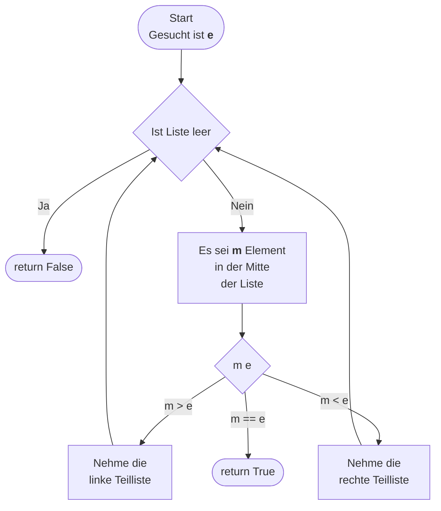

# Donnerstag

Ziel des Tages ist es, ein rekursive Binäre Suche zu implementieren. Hierbei sollen pro Projektschritt folgende Schritte durchgeführt werden:

1. Implementierung mit Python
2. Dokumentation mit Docstrings
3. Testing mit Unittests
4. Arbeiten mit Git im eigenen Git-Repo

Am Ende der Woche soll jeder ein Repository mit Lösungen zu allen Aufgaben haben.

## Exkurs in die Rekursion - Rudi
Bevor wir mit dem heutigen Projek starten, schauen wir das Konzepte der Rekursion mit Rudi an.

## Tagesprojekt - Rekursive Binäre Suche

### Konzepte des Zweiten Tages
- [Klassen](../python_grundlagen/oop/define_classes/define_classes.md)
- [Exkurs: Rekursion](../python_grundlagen/recursion/recursion.md)
- [Algorithmen](../python_grundlagen/sorting_algorithms/sorting_algorithms.md)
- [Git](https://python-wiki.de/lehrplan/git/git.html)
- [Docstring](../python_grundlagen/docstring/docstring.md)
- [Unittests](../python_grundlagen/oop/unittests/unittests.md)

## Aufgaben
- [Aufgaben zu Rekursion](../python_grundlagen/recursion/recursion.md)

### Erweiterungen
- **Visualisierung der Suche**: Entwickle eine Möglichkeit, jeden Schritt deiner Suche zu visualisieren.
- **Multidimensionale Suche**: Generalisiere den Algorithmus für mehrdimensionale Arrays. Stelle dir vor, das Zielelement könnte in einem mehrdimensionalen Raum verborgen sein, und passe deine Suche entsprechend an.
