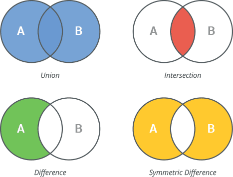

# Sets
{{ youtube_video("https://www.youtube.com/embed/9eilDC1_yfg?si=G1EG0fo6LHgBL_qU") }}

Ein Set ist eine Datenstruktur, die für die Speicherung einer ungeordneten Sammlung von einzigartigen Elementen
verwendet wird. Das heißt, dass sich die Elemente in einem Set nicht wiederholen. 

Sets bieten folgende Eigenschaften:

* **Ungeordnet**: Sets haben keine feste Reihenfolge der Elemente.

* **Einzigartige Elemente**: Jedes Element in einem Set ist einzigartig. Duplikate werden ignoriert und tauchen im Set nur einmal auf.

* **Unveränderliche Elemente**: Sets können nur unveränderliche (immutable) Datentypen als Elemente enthalten, wie Zahlen, Strings und Tupel. Das heißt, Listen und Dictionaries können zum Beispiel nicht in Sets gespeichert werden.

* **Veränderlich**: Sets selbst sind veränderlich, das heißt man kann Elemente hinzufügen und entfernen.

* **Kein Indexzugriff**: Aufgrund der Ungeordnetheit der Elemente gibt es keinen direkten Indexzugriff. Die Mitgliedschaft eines Elements wird mit Methoden wie `in` überprüft.

Sets werden mit geschweiften Klammern `{}` oder der `set()`-Funktion erstellt.

[💻 Link zum Onlinecompiler](https://pythontutor.com/render.html#code=einzigartige_zahlen%20%3D%20%7B1,%202,%203,%202,%201%7D%20%0Abuchstaben%20%3D%20%7B'a',%20'a',%20'b',%20'b'%7D%0A%0Atext%20%3D%20%22Python%20ist%20cool.%20Mathe%20ist%20auch%20cool.%22%0Aunique_words%20%3D%20set%28text.split%28%29%29%0A%0Afor%20word%20in%20unique_words%3A%0A%20%20%20%20print%28word%29&cumulative=false&curInstr=0&heapPrimitives=nevernest&mode=display&origin=opt-frontend.js&py=3&rawInputLstJSON=%5B%5D&textReferences=false)

```python
einzigartige_zahlen = {1, 2, 3, 2, 1} 
buchstaben = {'a', 'a', 'b', 'b'}

text = "Python ist cool. Mathe ist auch cool."
unique_words = set(text.split())

for word in unique_words:
    print(word)
```

{{ youtube_video("https://www.youtube.com/embed/1QHRIBsSNi4?si=sV9Z3edNwUf7YFyb") }}

Hier eine Auswahl über häufig verwendete Funktionen im Zusammenhang mit Sets. 
[Du findest alle Set Methoden hier.](https://docs.python.org/3/library/stdtypes.html#set-types-set-frozenset)

| Funktion                                             | Beschreibung                                                                                           | Beispiel                                 |
|------------------------------------------------------|--------------------------------------------------------------------------------------------------------|------------------------------------------|
| `set1.add(x)`                                        | Fügt das Element `x` zum Set hinzu.                                                                    | `set1.add(5)`                            |
| `set1.remove(x)`                                     | Entfernt das Element `x` aus dem Set. Wirft einen Fehler, falls `x` nicht vorhanden ist.               | `set1.remove(5)`                         |
| `set1.discard(x)`                                    | Entfernt das Element `x` aus dem Set. Kein Fehler, wenn `x` nicht vorhanden ist.                       | `set1.discard(5)`                        |
| `set1.pop()`                                         | Entfernt und gibt ein zufälliges Element aus dem Set zurück.                                           | `element = set1.pop()`                   |
| `set1.clear()`                                       | Entfernt alle Elemente aus dem Set.                                                                    | `set1.clear()`                           |
| `set1.union(set2)` oder `set1 ǀ set2`                | Gibt ein Set zurück, dass die Summe der Elemente von `set1` und `set2` enthält                         | `set3 = set1.union(set2)`                |                                                                                                     | Gibt ein neues Set zurück, das die Vereinigung von `set1` und `set2` ist.                              | `set3 = set1.union(set2)`                |
| `set1.intersection(set2)` oder `set1 & set2`         | Gibt ein neues Set zurück, das die Schnittmenge von `set1` und `set2` ist.                             | `set3 = set1.intersection(set2)`         |
| `set1.difference(set2)` oder `set1 - set2`           | Gibt ein neues Set zurück, das die Elemente von `set1` enthält, die nicht in `set2` sind.              | `set3 = set1.difference(set2)`           |
| `set1.symmetric_difference(set2)` oder `set1 ^ set2` | Gibt ein neues Set zurück, das Elemente enthält, die in `set1` oder `set2`, aber nicht in beiden sind. | `set3 = set1.symmetric_difference(set2)` |



[💻 Link zum Onlinecompiler](https://pythontutor.com/render.html#code=setA%20%3D%20%7B1,2,3,2,1%7D%0AsetB%20%3D%20set%28range%283%29%29%0A%0Aprint%28setA%20%7C%20setB%29%0Aprint%28setA%20%26%20setB%29%0Aprint%28setA%20-%20setB%29%0Aprint%28setB%20-%20setA%29%0Aprint%28setA%20%5E%20setB%29&cumulative=false&curInstr=0&heapPrimitives=nevernest&mode=display&origin=opt-frontend.js&py=3&rawInputLstJSON=%5B%5D&textReferences=false)

```python
setA = {1,2,3,2,1}
setB = set(range(3))

print(setA | setB)
print(setA & setB)
print(setA - setB)
print(setB - setA)
print(setA ^ setB)
```

Häufig werden Sets verwendet, um Duplikate aus Listen zu entfernen oder um zu prüfen, ob Elemente in einer Struktur sind.
Dies ist nämlich aufgrund der internen Struktur von Sets häufig schneller, als bei Listen.

# Aufgaben

[//]: # ([40min])

{{ task(file="tasks/python_grundlagen/sets/sets/01_set_erstellung.yaml") }}
{{ task(file="tasks/python_grundlagen/sets/sets/02_duplikatentfernung.yaml") }}
{{ task(file="tasks/python_grundlagen/sets/sets/03_elemente_hinzufugen.yaml") }}
{{ task(file="tasks/python_grundlagen/sets/sets/04_element_entfernen.yaml") }}
{{ task(file="tasks/python_grundlagen/sets/sets/05_set_durchlaufen.yaml") }}
{{ task(file="tasks/python_grundlagen/sets/sets/06_set_union.yaml") }}
{{ task(file="tasks/python_grundlagen/sets/sets/07_set_schnittmenge.yaml") }}
{{ task(file="tasks/python_grundlagen/sets/sets/08_set_differenz.yaml") }}
{{ task(file="tasks/python_grundlagen/sets/sets/09_symmetrische_differenz.yaml") }}
{{ task(file="tasks/python_grundlagen/sets/sets/10_set_lange.yaml") }}
{{ task(file="tasks/python_grundlagen/sets/sets/11_set_mitgliedschaftstest.yaml") }}
{{ task(file="tasks/python_grundlagen/sets/sets/12_set_leeren.yaml") }}
{{ task(file="tasks/python_grundlagen/sets/sets/13_subsets.yaml") }}
{{ task(file="tasks/python_grundlagen/sets/sets/14_supersets.yaml") }}
## Unveränderliche Sets: `frozenset`

{{ youtube_video("https://www.youtube.com/embed/aMQpjzIbl1o?si=dekfHgM-xNg5LRoh") }}

Möchte man ein Set erstellen, das jedoch unveränderlich (immutable) ist, so steht hier die Struktur `frozenset` bereit.
Wir können hier dieselben nicht manipulierenden Operationen anwenden wie bei normalen Sets.

```python
S = frozenset({'red', 'green', 'blue'})
print(len(S)) # 3

S = frozenset({'red', 'green', 'blue'})
print(S | {'yellow'}) # frozenset({'blue', 'green', 'yellow', 'red'})
```

Versuchen wir jedoch das Set zu verändern, erhalten wir Exceptions:

```python
# Element entfernen
S = frozenset({'red', 'green', 'blue'})
S.pop() # AttributeError: 'frozenset' object has no attribute 'pop'

# Item hinzufügen
S = frozenset({'red', 'green', 'blue'})
S.add('yellow') # AttributeError: 'frozenset' object has no attribute 'add'
```
