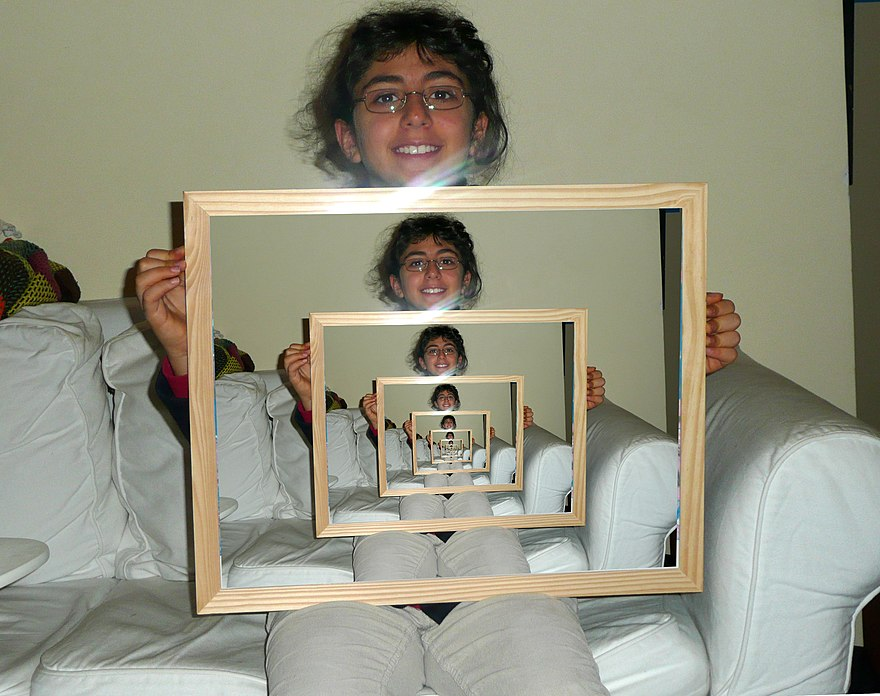
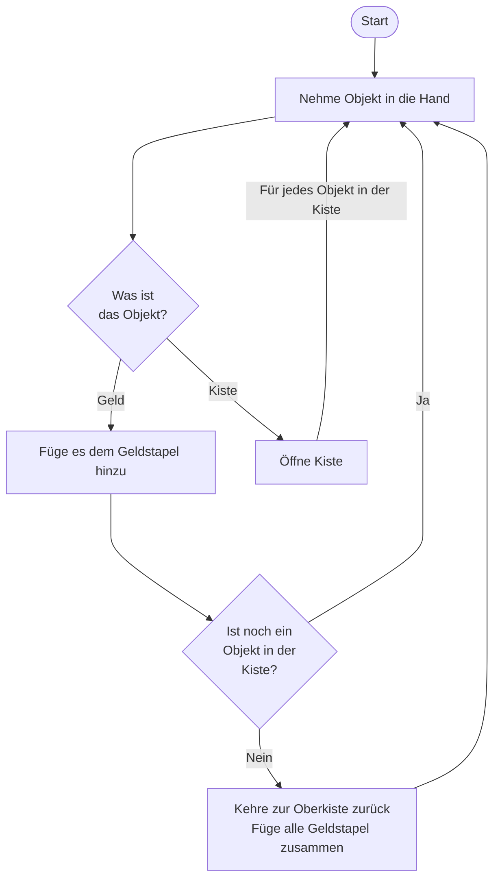
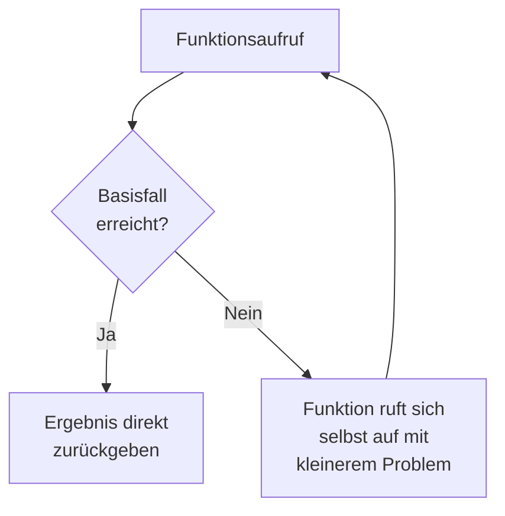
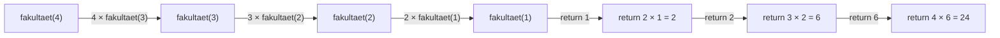

# Rekursion



## Was ist Rekursion?

Eine **rekursive Funktion** ist eine Funktion, die sich selbst aufruft. Das klingt zunächst merkwürdig — wie kann eine Funktion sich selbst benutzen, wenn sie noch gar nicht fertig definiert ist? Aber genau das ist das Prinzip: Eine Aufgabe wird in **kleinere Teilprobleme** zerlegt, die mit der gleichen Methode gelöst werden.

{{ youtube_video("https://www.youtube.com/embed/w_FmtAXTRdc?si=sVXyr44ODVGmXkY3") }}

### Beispiel: Kisten und Geldstücke

Angenommen, du hast eine Kiste mit kleineren Kisten und Geldstücken. In jeder Kiste können
weitere Kisten und/oder Geldstücke sein. Was musst du tun, um alle Geldstücke zu finden?



Der folgende Code beschreibt, wie man dieses Problem in Python umsetzen könnte.

```python
def sum_up(box_or_value):

    if isinstance(box_or_value, list):
        summe = 0

        for obj in box_or_value:
            summe += sum_up(obj)

    else:
        summe = box_or_value

    return summe

all_summed_up = sum_up([[1,2,3], [4,5,[6,7,8]]])
print(all_summed_up)
```

In der Funktion `sum_up` wird zunächst geprüft, ob der übergebene Parameter eine Liste ist oder nicht.
Wenn nicht, so wird das Objekt selbst zurückgegeben. Wenn doch, so wird die Funktion `sum_up` für jedes Objekt
in der Liste wieder aufgerufen. Das Ergebnis von `sum_up` ist am Ende eine Zahl und das können wir der
`summe` hinzufügen.

---

## Aufbau einer rekursiven Funktion

Jede rekursive Funktion besteht aus zwei wesentlichen Teilen:

### 1. Basisfall (Base Case)

Der Basisfall ist die **Abbruchbedingung** — er definiert, wann die Rekursion aufhört. Ohne Basisfall würde sich die Funktion unendlich oft selbst aufrufen und einen `RecursionError` verursachen.

### 2. Rekursiver Fall (Recursive Case)

Im rekursiven Fall ruft die Funktion **sich selbst** auf, jedoch mit einem **veränderten (kleineren) Problem**. Das Problem muss bei jedem Aufruf kleiner werden, damit es irgendwann den Basisfall erreicht.



### Beispiel: Countdown

```python
def countdown(n):
    if n <= 0:          # Basisfall
        print("Start!")
    else:               # Rekursiver Fall
        print(n)
        countdown(n - 1)

countdown(5)
```

Ausgabe:
```
5
4
3
2
1
Start!
```

---

## Klassische Beispiele

### Fakultät

Die Fakultät einer Zahl `n` (geschrieben `n!`) ist das Produkt aller positiven ganzen Zahlen bis `n`:

```
5! = 5 × 4 × 3 × 2 × 1 = 120
```

Rekursive Definition:

- `n! = 1`, wenn `n ≤ 1` (Basisfall)
- `n! = n × (n-1)!` (rekursiver Fall)

```python
def fakultaet(n):
    if n <= 1:
        return 1
    return n * fakultaet(n - 1)

print(fakultaet(5))  # 120
```

### Fibonacci

Die Fibonacci-Folge ist definiert als:

- `fib(0) = 0`
- `fib(1) = 1`
- `fib(n) = fib(n-1) + fib(n-2)`, für `n > 1`

```python
def fib(n):
    if n == 0:
        return 0
    if n == 1:
        return 1
    return fib(n - 1) + fib(n - 2)

print(fib(10))  # 55
```

### Summe einer Liste

```python
def summe(liste):
    if len(liste) == 0:
        return 0
    return liste[0] + summe(liste[1:])

print(summe([1, 2, 3, 4, 5]))  # 15
```

---

## Call Stack und Rekursionstiefe

Bei jedem rekursiven Aufruf wird ein neuer **Stack Frame** auf dem Call Stack abgelegt. Dieser enthält die lokalen Variablen und den Rücksprungpunkt der Funktion.

### Visualisierung am Beispiel `fakultaet(4)`:



### Rekursionstiefe in Python

Python hat eine **maximale Rekursionstiefe** (standardmäßig 1000). Wird diese überschritten, wird ein `RecursionError` ausgelöst:

```python
def endlos(n):
    return endlos(n + 1)

endlos(0)
# RecursionError: maximum recursion depth exceeded
```

Die Rekursionstiefe kann mit `sys.setrecursionlimit()` angepasst werden — das ist aber selten eine gute Idee:

```python
import sys
print(sys.getrecursionlimit())  # 1000
sys.setrecursionlimit(2000)     # Erhöht auf 2000
```

!!! warning "Vorsicht"
    Eine hohe Rekursionstiefe kann zu einem **Stack Overflow** führen. Wenn du die Rekursionstiefe
    erhöhen musst, ist das oft ein Zeichen dafür, dass eine iterative Lösung besser geeignet wäre.

---

## Rekursion vs. Iteration

Jede rekursive Lösung lässt sich auch iterativ (mit Schleifen) umsetzen — und umgekehrt. Beide Ansätze haben Vor- und Nachteile:

| | Rekursion | Iteration |
|---|---|---|
| **Lesbarkeit** | Oft eleganter bei Problemen mit natürlicher rekursiver Struktur (z.B. Bäume) | Besser bei einfachen Wiederholungen |
| **Speicher** | Verbraucht Stack-Speicher für jeden Aufruf | Konstanter Speicherverbrauch |
| **Geschwindigkeit** | Kann langsamer sein (Overhead durch Funktionsaufrufe) | In der Regel schneller |
| **Fehleranfälligkeit** | `RecursionError` bei zu tiefer Rekursion | Endlosschleife bei falschem Abbruch |

### Beispiel: Fakultät iterativ vs. rekursiv

```python
# Rekursiv
def fakultaet_rekursiv(n):
    if n <= 1:
        return 1
    return n * fakultaet_rekursiv(n - 1)

# Iterativ
def fakultaet_iterativ(n):
    ergebnis = 1
    for i in range(2, n + 1):
        ergebnis *= i
    return ergebnis
```

!!! info "Faustregel"
    Verwende Rekursion, wenn das Problem eine **natürliche rekursive Struktur** hat
    (z.B. Baumstrukturen, verschachtelte Daten, Divide-and-Conquer-Algorithmen).
    Für einfache Wiederholungen ist eine Schleife meist die bessere Wahl.

---

## Aufgaben

{{ task(file="tasks/funktionen_fortgeschritten/rekursion/01_multiplizieren.yaml") }}
{{ task(file="tasks/funktionen_fortgeschritten/rekursion/02_umstandlich.yaml") }}
{{ task(file="tasks/funktionen_fortgeschritten/rekursion/03_fakultat_berechnen.yaml") }}
{{ task(file="tasks/funktionen_fortgeschritten/rekursion/04_binare_suche.yaml") }}
{{ task(file="tasks/funktionen_fortgeschritten/rekursion/05_summe_liste.yaml") }}
{{ task(file="tasks/funktionen_fortgeschritten/rekursion/06_string_umkehren.yaml") }}
{{ task(file="tasks/funktionen_fortgeschritten/rekursion/07_fibonacci.yaml") }}
{{ task(file="tasks/funktionen_fortgeschritten/rekursion/08_verschachtelte_liste_flatten.yaml") }}
