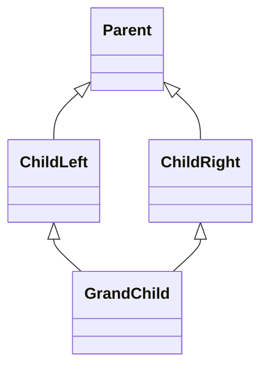

# Mehrfachvererbung, MRO & Diamond Problem

Bei Vererbung muss Python entscheiden, wo eine Methode oder ein Attribut gesucht
wird. Bei einfacher Vererbung ist das meistens offensichtlich. Bei
Mehrfachvererbung braucht Python eine klare Reihenfolge.

Diese Reihenfolge heißt **MRO**.

## Method Resolution Order

MRO steht für **Method Resolution Order**. Sie legt fest, in welcher Reihenfolge
Python Klassen durchsucht.

```python
class Parent:
    pass


class Child(Parent):
    pass


print(Child.__mro__)
```

Die Ausgabe ist:

```python
(<class '__main__.Child'>, <class '__main__.Parent'>, <class 'object'>)
```

Python sucht also zuerst in `Child`, dann in `Parent`, dann in `object`.

## Mehrfachvererbung

Eine Klasse kann von mehreren Klassen erben.

```python
class CanSwim:
    def move(self):
        return "schwimmt"


class CanFly:
    def move(self):
        return "fliegt"


class Duck(CanSwim, CanFly):
    pass


duck = Duck()
print(duck.move())
print(Duck.__mro__)
```

Die Klasse `Duck` erbt zuerst von `CanSwim` und danach von `CanFly`.
Deshalb findet Python `move()` zuerst in `CanSwim`.

!!! note "Merksatz"
    Bei Mehrfachvererbung ist die Reihenfolge im Klassenkopf wichtig:
    `class Duck(CanSwim, CanFly)` ist nicht dasselbe wie
    `class Duck(CanFly, CanSwim)`.

## Das Diamond Problem

Das Diamond Problem entsteht, wenn zwei Klassen von derselben Basisklasse erben
und eine weitere Klasse von beiden Klassen erbt.



```python
class Parent:
    def source(self):
        return "Parent"


class ChildLeft(Parent):
    def source(self):
        return "ChildLeft"


class ChildRight(Parent):
    def source(self):
        return "ChildRight"


class GrandChild(ChildLeft, ChildRight):
    pass


print(GrandChild.__mro__)
print(GrandChild().source())
```

Die MRO ist:

```python
(<class '__main__.GrandChild'>, <class '__main__.ChildLeft'>, <class '__main__.ChildRight'>, <class '__main__.Parent'>, <class 'object'>)
```

`GrandChild` hat keine eigene Methode `source()`. Python sucht weiter in
`ChildLeft`. Dort wird die Methode gefunden. Deshalb ist die Ausgabe:

```text
ChildLeft
```

## Warum wird `Parent` nicht doppelt besucht?

Ohne klare MRO könnte `Parent` über zwei Wege erreicht werden:

```text
GrandChild -> ChildLeft -> Parent
GrandChild -> ChildRight -> Parent
```

Python verwendet eine MRO, in der jede Klasse nur an einer passenden Stelle
vorkommt. Dadurch wird `Parent` nicht doppelt ausgeführt.

## Diamond mit `super()`

Bei Mehrfachvererbung bedeutet `super()` nicht einfach "Elternklasse".
`super()` bedeutet:

**Gehe zur nächsten Klasse in der MRO.**

```python
class Parent:
    def setup(self):
        print("Parent")


class ChildLeft(Parent):
    def setup(self):
        print("ChildLeft")
        super().setup()


class ChildRight(Parent):
    def setup(self):
        print("ChildRight")
        super().setup()


class GrandChild(ChildLeft, ChildRight):
    def setup(self):
        print("GrandChild")
        super().setup()


GrandChild().setup()
print(GrandChild.__mro__)
```

Die Ausgabe ist:

```text
GrandChild
ChildLeft
ChildRight
Parent
```

Die Aufrufkette folgt der MRO:

```text
GrandChild -> ChildLeft -> ChildRight -> Parent -> object
```

## Kooperative Vererbung

Kooperative Vererbung bedeutet: Mehrere Klassen arbeiten in einer
Vererbungskette zusammen und rufen jeweils `super()` auf.

```python
class BaseReport:
    def build(self):
        return ["Inhalt"]


class HeaderMixin(BaseReport):
    def build(self):
        parts = super().build()
        parts.insert(0, "Kopfzeile")
        return parts


class FooterMixin(BaseReport):
    def build(self):
        parts = super().build()
        parts.append("Fusszeile")
        return parts


class PdfReport(HeaderMixin, FooterMixin):
    pass


report = PdfReport()
print(report.build())
print(PdfReport.__mro__)
```

Wichtig: Jede Klasse, die Teil der Kette sein soll, muss `super()` weitergeben.
Wenn eine Klasse `super()` vergisst, endet die Kette dort.

## MRO lesen: Vorgehen

1. Schreibe die MRO auf oder lasse sie mit `Class.__mro__` ausgeben.
2. Suche die Methode von links nach rechts.
3. Wenn die Methode `super()` nutzt, gehe zum nächsten Eintrag in der MRO.
4. Prüfe, ob eine Klasse die Kette unterbricht.

## Häufige Fehler

- `super()` mit "direkte Elternklasse" gleichsetzen
- die Reihenfolge im Klassenkopf ignorieren
- vergessen, dass `object` am Ende der MRO steht
- eine Methode in der Kette ohne `super()` schreiben
- Mehrfachvererbung einsetzen, obwohl Komposition einfacher wäre

{{ task(file="tasks/python_grundlagen/oop/vertiefung_teil2/08_mro_reihenfolge.yaml") }}
{{ task(file="tasks/python_grundlagen/oop/vertiefung_teil2/09_diamond_super.yaml") }}
{{ task(file="tasks/python_grundlagen/oop/vertiefung_teil2/10_super_kette_finden.yaml") }}
{{ task(file="tasks/python_grundlagen/oop/vertiefung_teil2/26_mro_order_swap.yaml") }}
{{ task(file="tasks/python_grundlagen/oop/vertiefung_teil2/27_cooperative_init.yaml") }}
{{ task(file="tasks/python_grundlagen/oop/vertiefung_teil2/28_mro_pcapsnippets.yaml") }}
