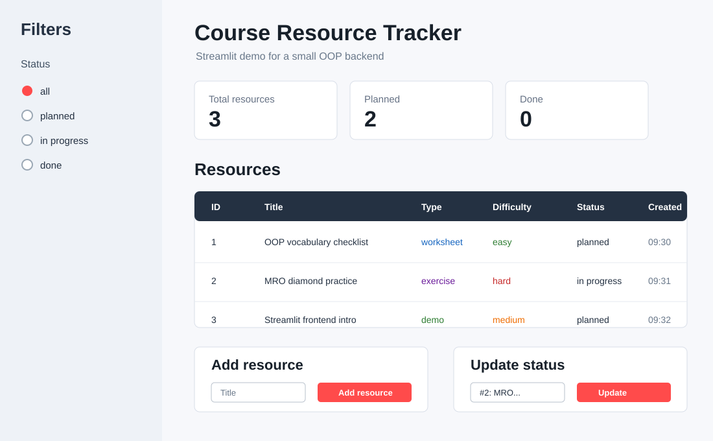
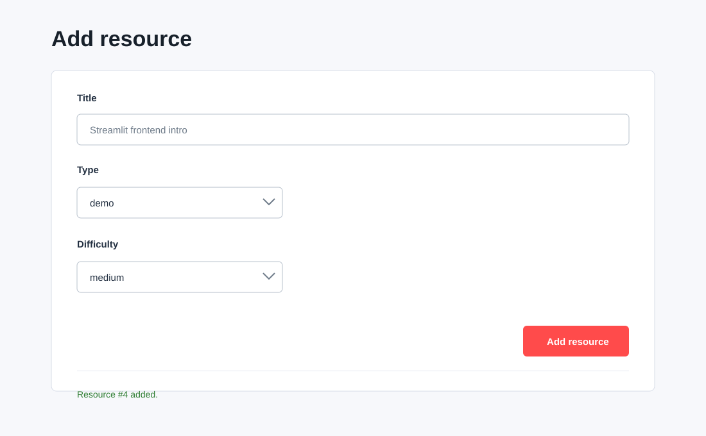

# Streamlit-Einführung: Frontend für Python-Backends

Streamlit ist ein Python-Framework, mit dem aus einem Python-Skript schnell
eine kleine Weboberfläche entsteht. Für OOP-Projekte ist Streamlit interessant,
weil das Backend weiter aus normalen Python-Klassen bestehen kann. Das Frontend
ruft nur Methoden auf und zeigt Rückgabewerte an.

## Installation

In einer aktivierten virtuellen Umgebung:

```bash
pip install streamlit
```

Installation testen:

```bash
streamlit hello
```

Eigene App starten:

```bash
streamlit run resource_tracker_app.py
```

!!! note "Wichtig"
    Streamlit-Dateien werden nicht mit `python app.py` gestartet, sondern mit
    `streamlit run app.py`.

## Grundidee

Eine Streamlit-App ist ein Python-Skript, das bei jeder Interaktion neu von oben
nach unten ausgeführt wird.

Typischer Aufbau:

```python
import streamlit as st

st.set_page_config(page_title="Course Resource Tracker", layout="wide")
st.title("Course Resource Tracker")

st.write("Inhalte anzeigen")

if st.button("Aktion ausführen"):
    st.success("Aktion wurde ausgeführt")
```

Für Werte, die zwischen Interaktionen erhalten bleiben sollen, nutzt man
`st.session_state`.

## Wichtige Elemente

| Element | Typischer Zweck |
|---------|-----------------|
| `st.title()` / `st.header()` | klare Seitenstruktur |
| `st.write()` / `st.markdown()` | Text, Hinweise, Rückgaben anzeigen |
| `st.dataframe()` | Objektliste als Tabelle anzeigen |
| `st.form()` | Objekt anlegen, ohne bei jedem Feld neu zu reagieren |
| `st.text_input()` | Titel, Autor, Suchfeld |
| `st.text_area()` | längere Texte wie Beschreibung oder Kommentar |
| `st.selectbox()` | Status, Priorität, Typ oder Kategorie |
| `st.radio()` | Filter oder Modus wählen |
| `st.button()` | Aktion auslösen |
| `st.columns()` | Oberfläche in Bereiche aufteilen |
| `st.sidebar` | Filter und Navigation |
| `st.success()` / `st.warning()` / `st.error()` | Feedback nach Aktionen |
| `st.session_state` | Objekte während der Session speichern |

## Warum das gut zu OOP-Backends passt

Das Backend sollte weiterhin keine Streamlit-Abhängigkeit besitzen.

Gut:

```python
resource = tracker.add_resource(title, resource_type, difficulty)
rows = tracker.list_resources()
```

Nicht ideal:

```python
class ResourceTracker:
    def add_resource(self):
        title = st.text_input("Titel")
```

Die Streamlit-App ist nur die Oberfläche. Die Klassen bleiben unabhängig und
können später auch mit CLI, Flask, Tests oder einer anderen UI benutzt werden.

## Mock-Screenshots

Übersicht mit Ressourcenliste, Filter und Kennzahlen:



Formular zum Anlegen einer Ressource:



## Beispiel-App

Der folgende Code kann als Datei `resource_tracker_app.py` gespeichert und mit
Streamlit gestartet werden. Die App zeigt eine kleine Streamlit-Oberfläche mit:

- Ressourcenliste
- Filter in der Sidebar
- Formular zum Anlegen neuer Ressourcen
- Statusänderung
- Status einer Ressource ändern
- `st.session_state` als einfacher Speicher
- klarer Trennung zwischen Mini-Backend und UI-Code

Die App ist bewusst nicht das Projekt selbst. Sie zeigt nur dieselben
Frontend-Muster, die später für ein größeres Backend nützlich sind.

## Gesamter Beispielcode

Dateiname:

```text
resource_tracker_app.py
```

```python
from datetime import datetime

import streamlit as st


class LearningResource:
    def __init__(self, resource_id: int, title: str, resource_type: str, difficulty: str) -> None:
        self.resource_id = resource_id
        self.title = title
        self.resource_type = resource_type
        self.difficulty = difficulty
        self.status = "planned"
        self.created_at = datetime.now().strftime("%H:%M")

    def change_status(self, new_status: str) -> None:
        self.status = new_status

    def to_row(self) -> dict:
        return {
            "ID": self.resource_id,
            "Title": self.title,
            "Type": self.resource_type,
            "Difficulty": self.difficulty,
            "Status": self.status,
            "Created": self.created_at,
        }


class ResourceTracker:
    def __init__(self) -> None:
        self.resources: list[LearningResource] = []
        self.next_id = 1

    def add_resource(self, title: str, resource_type: str, difficulty: str) -> LearningResource:
        resource = LearningResource(
            resource_id=self.next_id,
            title=title,
            resource_type=resource_type,
            difficulty=difficulty,
        )
        self.resources.append(resource)
        self.next_id += 1
        return resource

    def list_resources(self, status_filter: str = "all") -> list[LearningResource]:
        if status_filter == "all":
            return self.resources
        return [resource for resource in self.resources if resource.status == status_filter]

    def find_resource(self, resource_id: int) -> LearningResource | None:
        for resource in self.resources:
            if resource.resource_id == resource_id:
                return resource
        return None


def seed_demo_data(tracker: ResourceTracker) -> None:
    tracker.add_resource("OOP vocabulary checklist", "worksheet", "easy")
    mro = tracker.add_resource("MRO diamond practice", "exercise", "hard")
    mro.change_status("in progress")
    tracker.add_resource("Streamlit frontend intro", "demo", "medium")


def get_tracker() -> ResourceTracker:
    if "resource_tracker" not in st.session_state:
        st.session_state.resource_tracker = ResourceTracker()
        seed_demo_data(st.session_state.resource_tracker)
    return st.session_state.resource_tracker


st.set_page_config(page_title="Course Resource Tracker", layout="wide")

tracker = get_tracker()

st.title("Course Resource Tracker")
st.caption("Streamlit demo for a small OOP backend")

with st.sidebar:
    st.header("Filters")
    status_filter = st.radio(
        "Status",
        ["all", "planned", "in progress", "done"],
        index=0,
    )
    st.divider()
    st.write("The same pattern can later filter records, users or priorities.")

visible_resources = tracker.list_resources(status_filter)

total_count = len(tracker.resources)
planned_count = len(tracker.list_resources("planned"))
done_count = len(tracker.list_resources("done"))

metric_left, metric_middle, metric_right = st.columns(3)
metric_left.metric("Total resources", total_count)
metric_middle.metric("Planned", planned_count)
metric_right.metric("Done", done_count)

st.header("Resources")

if visible_resources:
    st.dataframe(
        [resource.to_row() for resource in visible_resources],
        hide_index=True,
        use_container_width=True,
    )
else:
    st.info("No resources match the current filter.")

left, right = st.columns(2)

with left:
    st.header("Add resource")

    with st.form("add-resource-form", clear_on_submit=True):
        title = st.text_input("Title")
        resource_type = st.selectbox("Type", ["demo", "exercise", "reading", "worksheet"])
        difficulty = st.selectbox("Difficulty", ["easy", "medium", "hard"])
        submitted = st.form_submit_button("Add resource")

    if submitted:
        if not title.strip():
            st.error("Title is required.")
        else:
            created = tracker.add_resource(title.strip(), resource_type, difficulty)
            st.success(f"Resource #{created.resource_id} added.")

with right:
    st.header("Update status")

    resource_options = {
        f"#{resource.resource_id}: {resource.title}": resource.resource_id
        for resource in tracker.resources
    }

    if resource_options:
        selected_label = st.selectbox("Select resource", list(resource_options))
        selected_resource = tracker.find_resource(resource_options[selected_label])

        if selected_resource:
            new_status = st.selectbox(
                "New status",
                ["planned", "in progress", "done"],
                index=["planned", "in progress", "done"].index(selected_resource.status),
            )
            if st.button("Update status"):
                selected_resource.change_status(new_status)
                st.success("Status updated.")
    else:
        st.info("Add a resource first.")
```

## Mini-Aufgabe

Erweitere die Beispiel-App um eine dieser Funktionen:

1. Filter nach Schwierigkeit
2. Button, der eine Ressource direkt auf `done` setzt
3. Detailansicht für die ausgewählte Ressource
4. Export der Ressourcenliste als JSON-String mit `st.download_button()`

## Quellen

- [Streamlit Installation](https://docs.streamlit.io/get-started/installation)
- [Streamlit API Reference](https://docs.streamlit.io/develop/api-reference)
