# Testexam 1

Kreuze die passende Antwort an. Die Lösung und Erklärung wird erst nach dem Prüfen angezeigt.

!!! note "Hinweis"

    Einige Code-Snippets liegen als Bilder vor, weil sie im Ausgangsmaterial als Bild gespeichert sind.

## Question 1

Consider the following code snippet:

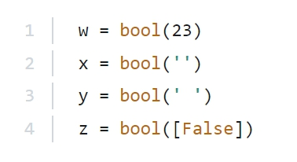

Which of the variables will contain False?

<label class="pcap-option"><input type="checkbox" value="A"> A. w</label>
<label class="pcap-option"><input type="checkbox" value="B"> B. x</label>
<label class="pcap-option"><input type="checkbox" value="C"> C. z</label>
<label class="pcap-option"><input type="checkbox" value="D"> D. y</label>
<button type="button" class="pcap-check">Antwort prüfen</button>

Lösung und Erklärung

**Answer: B.**

Explanation

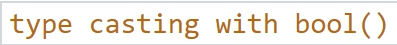

Topic:

Try it yourself:

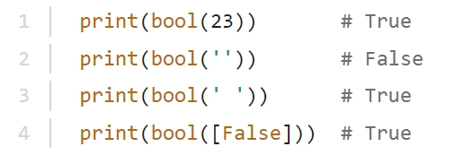

The list with the value False is not empty and therefore it becomes True

<!-- page_16 -->

The string with the space also contain one character and therefore it also becomes True

The values that become False in Python are the following:

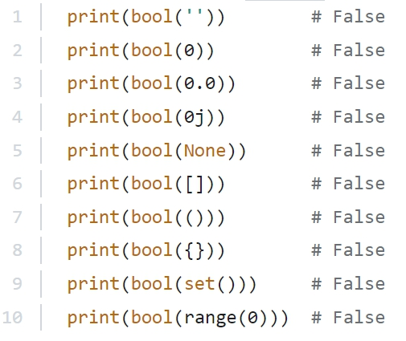

## Question 2

What is the expected output of the following code?

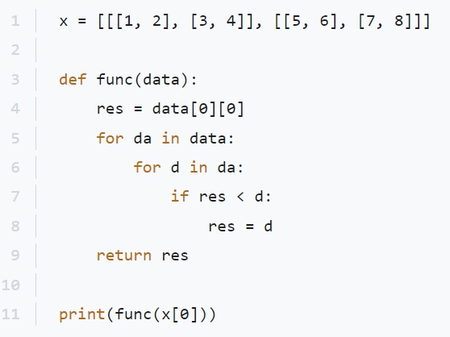

<!-- page_17 -->

<label class="pcap-option"><input type="checkbox" value="A"> A. 4</label>
<label class="pcap-option"><input type="checkbox" value="B"> B. 2</label>
<label class="pcap-option"><input type="checkbox" value="C"> C. 6</label>
<label class="pcap-option"><input type="checkbox" value="D"> D. The code is erroneous.</label>
<label class="pcap-option"><input type="checkbox" value="E"> E. 8</label>
<button type="button" class="pcap-check">Antwort prüfen</button>

Lösung und Erklärung

**Answer: A.**

Explanation

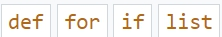

Topics:

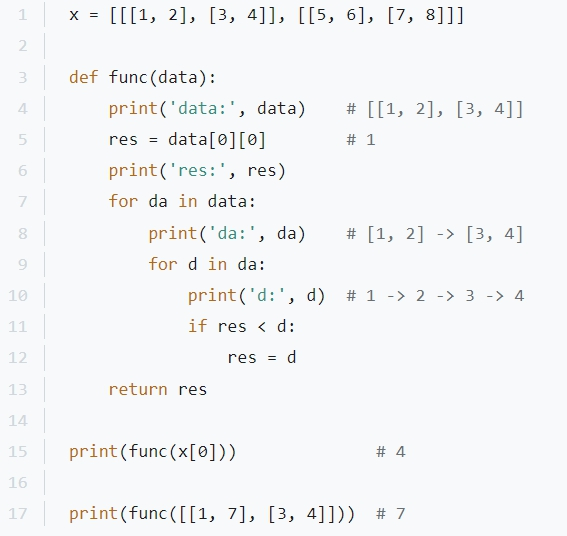

This function looks for the highest element in a two dimensional list (or another iterable).

In the beginning the first number data[0][0] gets taken as a possible result. In the inner for loop every number is compared to the possible result. If one number is higher it becomes the new possible result.

And in the end the result is the highest number.

## Question 3

<!-- page_18 -->

isalnum() checks if a string contains only letters and digits, and this is:

<label class="pcap-option"><input type="checkbox" value="A"> A. A method</label>
<label class="pcap-option"><input type="checkbox" value="B"> B. A module</label>
<label class="pcap-option"><input type="checkbox" value="C"> C. A function</label>
<label class="pcap-option"><input type="checkbox" value="D"> D. A dataset</label>
<button type="button" class="pcap-check">Antwort prüfen</button>

Lösung und Erklärung

**Answer: A.**

Explanation

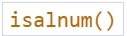

Topic:

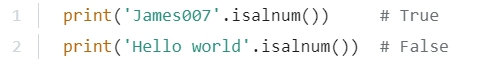

isalnum() is a String-Method.

https://www.w3schools.com/python/ref_string_isalnum.asp

'Hello world' is not alphanumeric, because of the space character.

## Question 4

What is the expected output of the following code?

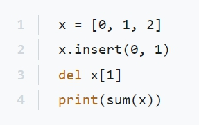

<label class="pcap-option"><input type="checkbox" value="A"> A. 2</label>
<label class="pcap-option"><input type="checkbox" value="B"> B. 4</label>
<label class="pcap-option"><input type="checkbox" value="C"> C. 5</label>
<label class="pcap-option"><input type="checkbox" value="D"> D. 3</label>
<button type="button" class="pcap-check">Antwort prüfen</button>

Lösung und Erklärung

**Answer: B.**

Explanation

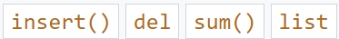

Topics:

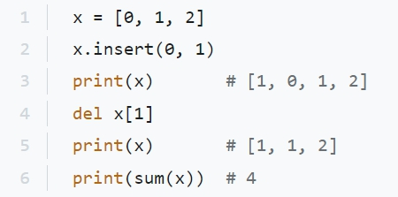

list.insert(i, x)

insert() inserts an item at a given position. The first argument is the index of the element before which to insert.

insert(0, 1) inserts 1 before index 0 (at the front of the list). The del keyword deletes the given object. In this case x[1]

The sum() function adds the items of a list (or a different iterable) and returns the sum.

## Question 5

What will be the output of the following code snippet?

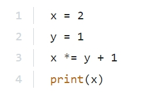

<!-- page_20 -->

<label class="pcap-option"><input type="checkbox" value="A"> A. 3</label>
<label class="pcap-option"><input type="checkbox" value="B"> B. None</label>
<label class="pcap-option"><input type="checkbox" value="C"> C. 1</label>
<label class="pcap-option"><input type="checkbox" value="D"> D. 4</label>
<label class="pcap-option"><input type="checkbox" value="E"> E. 2</label>
<button type="button" class="pcap-check">Antwort prüfen</button>

Lösung und Erklärung

**Answer: D.**

Explanation

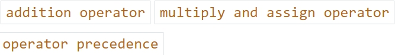

Topics:

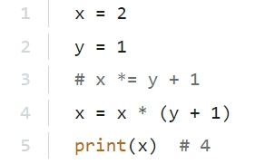

The operator precedence of the addition operator is higher than the operator precedence of the multiply and assign operator

That means the addition takes place before the multiplication.

## Question 6

What is the expected output of the following code?

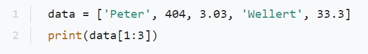

<label class="pcap-option"><input type="checkbox" value="A"> A. [ ‘Peter’, ‘Wellert’ ]</label>
<label class="pcap-option"><input type="checkbox" value="B"> B. [ ‘Peter’, 404, 3.03, ‘Wellert’, 33.3 ]</label>
<label class="pcap-option"><input type="checkbox" value="C"> C. None of the above</label>
<label class="pcap-option"><input type="checkbox" value="D"> D. [ 404, 3.03 ]</label>
<button type="button" class="pcap-check">Antwort prüfen</button>

Lösung und Erklärung

**Answer: D.**

Explanation

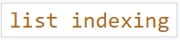

Topic:

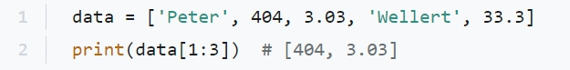

You have a list of five elements of various data types. [1:3] slices inclusive the first index and exclusive the third index. Meaning it slices the first and second index.

## Question 7

What is the expected output of the following code?

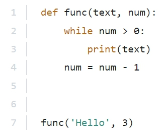

1 | Hello

2 | Hello

3 | Hello

1 | Hello

2 | Hello

<!-- page_22 -->

C.

1 | Hello

2 | Hello

3 | Hello

4 | Hello

!!! warning "Hinweis"

    Bei dieser Frage wurden die Antwortoptionen nicht sauber als Liste erkannt.

<button type="button" class="pcap-reveal">Lösung anzeigen</button>

Lösung und Erklärung

What is the expected output of the following code?

1 | Hello

2 | Hello

3 | Hello

1 | Hello

2 | Hello

<!-- page_22 -->

C.

1 | Hello

2 | Hello

3 | Hello

4 | Hello

**Answer: C.**

Explanation

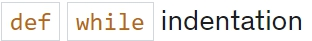

Topics:

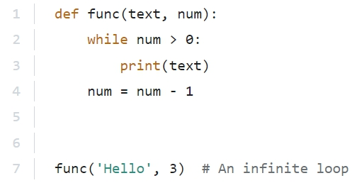

The incrementation of num needs to be inside of the while loop. Otherwise the condition num > 0 will never be False

It should look like this:

<!-- page_23 -->

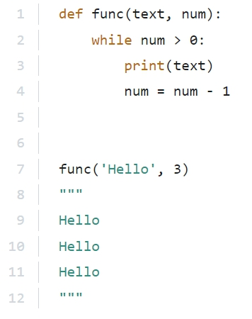

## Question 8

What is the expected output of the following code?

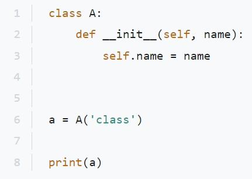

<label class="pcap-option"><input type="checkbox" value="A"> A. class</label>
<label class="pcap-option"><input type="checkbox" value="B"> B. A number</label>
<label class="pcap-option"><input type="checkbox" value="C"> C. name</label>
<label class="pcap-option"><input type="checkbox" value="D"> D. A string ending with a long hexadecimal number.</label>
<button type="button" class="pcap-check">Antwort prüfen</button>

Lösung und Erklärung

**Answer: D.**

<!-- page_24 -->

Explanation

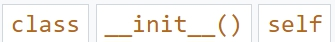

Topics:

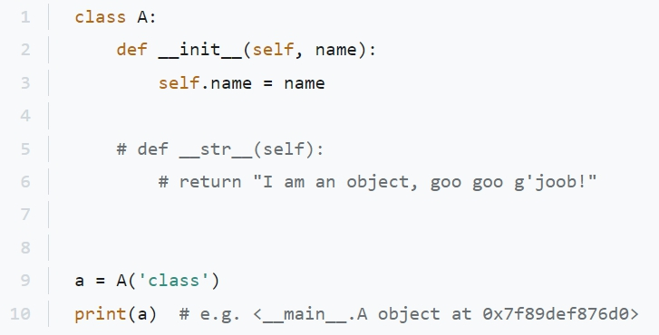

When there is no __str__() method present and you print an object, Python shows the object id in that way.

## Question 9

What is the expected output of the following code?

<!-- page_25 -->

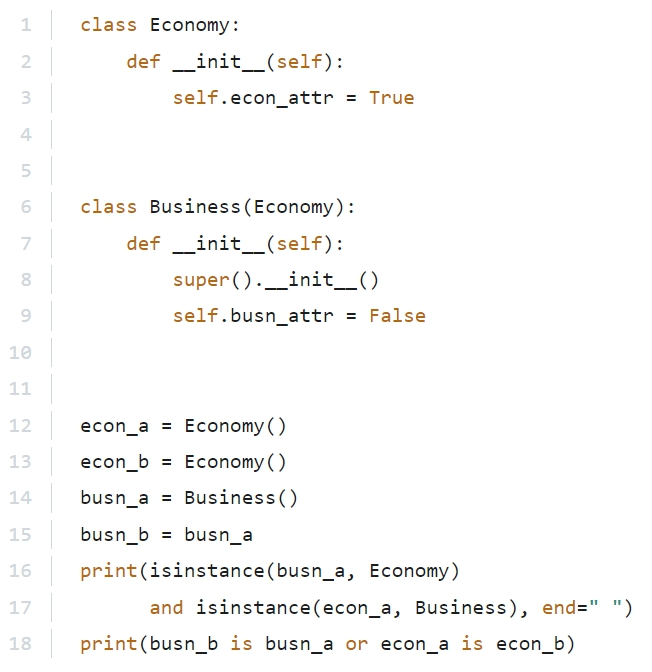

<label class="pcap-option"><input type="checkbox" value="A"> A. 1 | True True</label>
<label class="pcap-option"><input type="checkbox" value="B"> B. 1 | True False</label>
<label class="pcap-option"><input type="checkbox" value="C"> C. 1 | False True</label>
<label class="pcap-option"><input type="checkbox" value="D"> D. 1 | False False</label>
<button type="button" class="pcap-check">Antwort prüfen</button>

Lösung und Erklärung

**Answer: C.**

Explanation

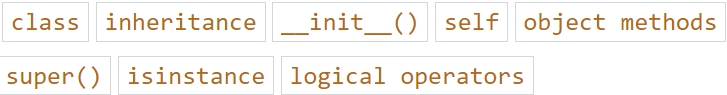

Topics:

<!-- page_26 -->

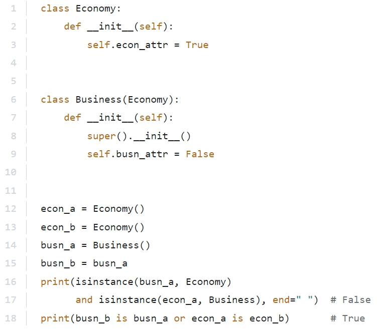

busn_a is an instance of Business and therefore also an instance of the superclass Economy

econ_a is an instance of Economy

and therefore not an instance of the subclass Business

busn_a is referenced to busn_b

and they will point to the same object in the memory.

econ_a and econ_b are different objects.

## Question 10

What is the expected output of the following code if the user enters 2 and 4?

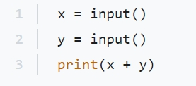

<!-- page_27 -->

<label class="pcap-option"><input type="checkbox" value="A"> A. 4</label>
<label class="pcap-option"><input type="checkbox" value="B"> B. 2</label>
<label class="pcap-option"><input type="checkbox" value="C"> C. 6</label>
<label class="pcap-option"><input type="checkbox" value="D"> D. 24</label>
<button type="button" class="pcap-check">Antwort prüfen</button>

Lösung und Erklärung

**Answer: D.**

Explanation

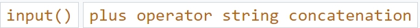

Topics:

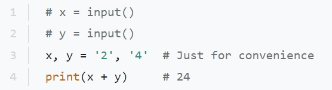

As always the input() function returns a string. Therefore string concatenation takes place and the result is the string 24

(There are similar questions Q509 and Q648.)

## Question 11

The digraph written as #! is used to:

<label class="pcap-option"><input type="checkbox" value="A"> A. make a particular module entity a private one.</label>
<label class="pcap-option"><input type="checkbox" value="B"> B. tell a Unix or Unix-like OS how to execute the contents of a Python file.</label>
<label class="pcap-option"><input type="checkbox" value="C"> C. tell an MS Windows OS how to execute the contents of a Python file.</label>
<label class="pcap-option"><input type="checkbox" value="D"> D. create a docstring.</label>
<button type="button" class="pcap-check">Antwort prüfen</button>

Lösung und Erklärung

**Answer: B.**

Explanation

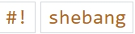

Topic:

<!-- page_28 -->

This is a general UNIX topic. Best read about it here:

https://en.wikipedia.org/wiki/Shebang_(Unix)

## Question 12

Which of the following statements are true? (Select two answers)

<label class="pcap-option"><input type="checkbox" value="A"> A. The first argument of the open() function is an integer value.</label>
<label class="pcap-option"><input type="checkbox" value="B"> B. The input () function reads data from the stdin stream.</label>
<label class="pcap-option"><input type="checkbox" value="C"> C. There are three pre-opened file streams.</label>
<label class="pcap-option"><input type="checkbox" value="D"> D. The readlines () function returns a string.</label>
<button type="button" class="pcap-check">Antwort prüfen</button>

Lösung und Erklärung

**Answer: B, C.**

Explanation

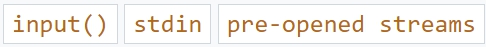

Topics:

stdin, stdout, stderr are names of pre-opened streams. stdin is associated with the keyboard.

stdout and stderr are associated with the console.

https://en.wikipedia.org/wiki/Standard_streams

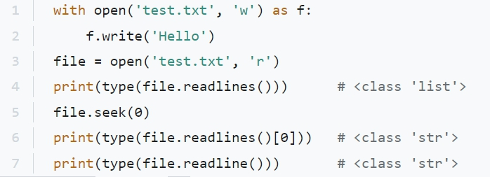

readlines() with an s at the end returns a list of strings. The first argument of the open() function must be a string value with the name of the file.

<!-- page_29 -->

## Question 13

The function body is missing. What snippet would you insert in the line indicated below:

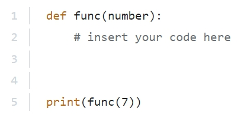

<label class="pcap-option"><input type="checkbox" value="A"> A. return ‘number’</label>
<label class="pcap-option"><input type="checkbox" value="B"> B. print(number)</label>
<label class="pcap-option"><input type="checkbox" value="C"> C. return number</label>
<label class="pcap-option"><input type="checkbox" value="D"> D. print (‘number’)</label>
<button type="button" class="pcap-check">Antwort prüfen</button>

Lösung und Erklärung

**Answer: C.**

Explanation

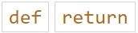

Topics:

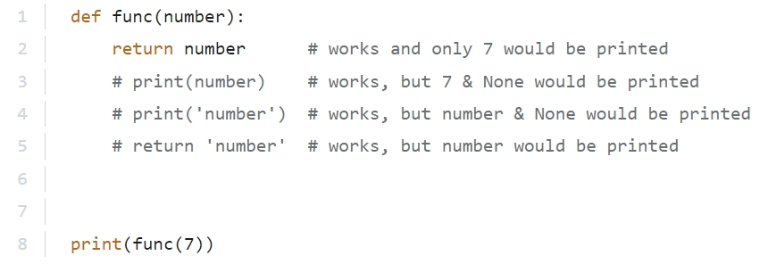

The parameter name is number therefore it can not be in quotes. If you only print something in the function, the function will return None and that is not wanted here, because the return values gets already printed outside of the function.

<!-- page_30 -->

## Question 14

What is the expected output of the following code?

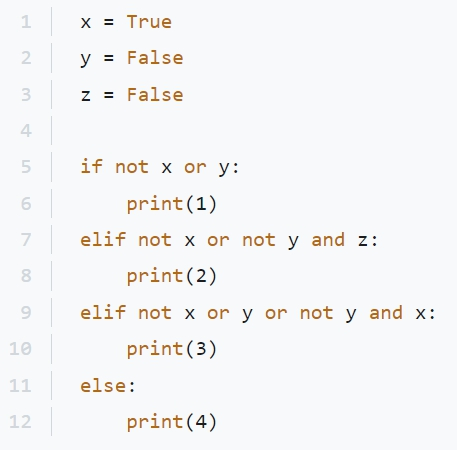

<label class="pcap-option"><input type="checkbox" value="A"> A. 3</label>
<label class="pcap-option"><input type="checkbox" value="B"> B. 1</label>
<label class="pcap-option"><input type="checkbox" value="C"> C. 4</label>
<label class="pcap-option"><input type="checkbox" value="D"> D. 2</label>
<button type="button" class="pcap-check">Antwort prüfen</button>

Lösung und Erklärung

**Answer: A.**

Explanation

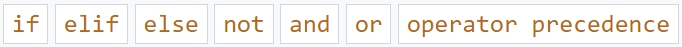

Topics:

<!-- page_31 -->

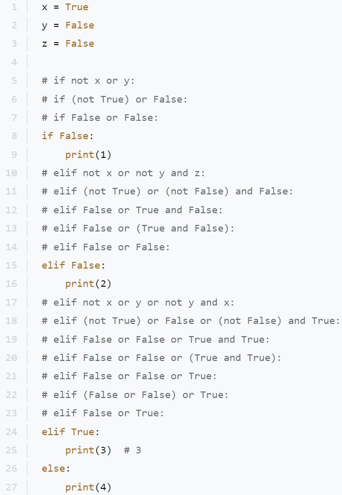

There are three operators at work here. Of them the not operator has the highest precedence, followed by the and operator. The or operator has the lowest precedence.

## Question 15

An operator able to check whether two values are not equal is coded as:

<!-- page_32 -->

<label class="pcap-option"><input type="checkbox" value="A"> A. &lt;&gt;</label>
<label class="pcap-option"><input type="checkbox" value="B"> B. not ==</label>
<label class="pcap-option"><input type="checkbox" value="C"> C. =/=</label>
<label class="pcap-option"><input type="checkbox" value="D"> D. ! =</label>
<button type="button" class="pcap-check">Antwort prüfen</button>

Lösung und Erklärung

**Answer: D.**

Explanation

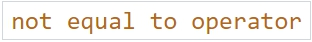

Topic:

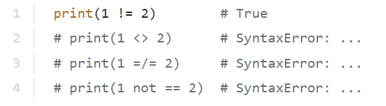

Other languages have <> or =/= as not equal to operators

In Python the not equal to operator is !=

not == does not work like this, because you can not have two operators next to each other.

It would work like that:

print(not(1 == 2)) # True

## Question 16

What will be the output of the following code snippet?

<!-- page_33 -->

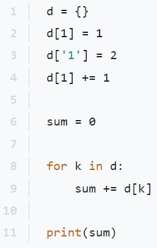

<label class="pcap-option"><input type="checkbox" value="A"> A. 2</label>
<label class="pcap-option"><input type="checkbox" value="B"> B. 3</label>
<label class="pcap-option"><input type="checkbox" value="C"> C. 4</label>
<label class="pcap-option"><input type="checkbox" value="D"> D. 1</label>
<button type="button" class="pcap-check">Antwort prüfen</button>

Lösung und Erklärung

**Answer: C.**

Explanation

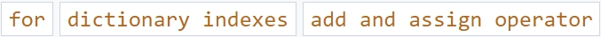

Topics:

<!-- page_34 -->

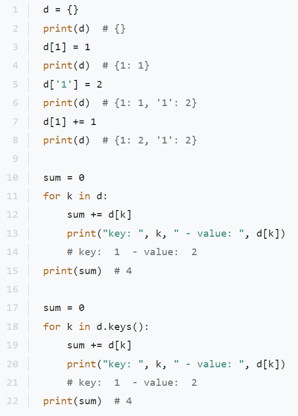

The knowledge you need here is that a dictionary can have indexes of different data types.

Therefore d[1] is a different index than d['1'] and they can both exist in the same dictionary.

To iterate through a dictionary is the same as iterating through dict.keys()

In k will be the keys of the dictionary. In this case 1 and '1'

The value of the first key will be 2 and the value of the other key will also be 2 and therefore (the) sum is 4

<!-- page_35 -->

## Question 17

What is the expected output of the following code?

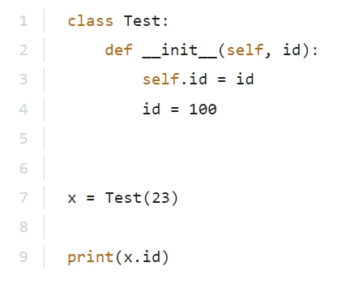

<label class="pcap-option"><input type="checkbox" value="A"> A. The code is erroneous.</label>
<label class="pcap-option"><input type="checkbox" value="B"> B. 23</label>
<label class="pcap-option"><input type="checkbox" value="C"> C. 100</label>
<label class="pcap-option"><input type="checkbox" value="D"> D. None of the above.</label>
<button type="button" class="pcap-check">Antwort prüfen</button>

Lösung und Erklärung

**Answer: B.**

Explanation

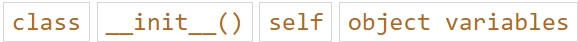

Topics:

<!-- page_36 -->

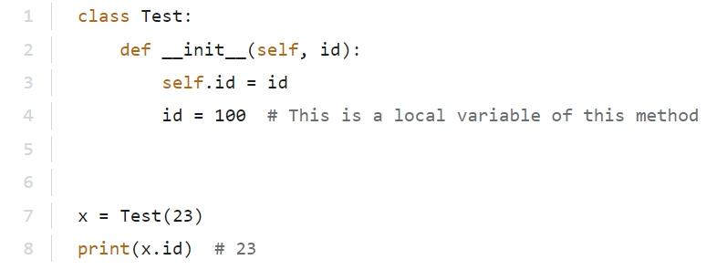

The object variable id does not get changed by the initialisation of the local variable id in the __init__() method. They are two different entities.

## Question 18

What is the expected output of the following code?

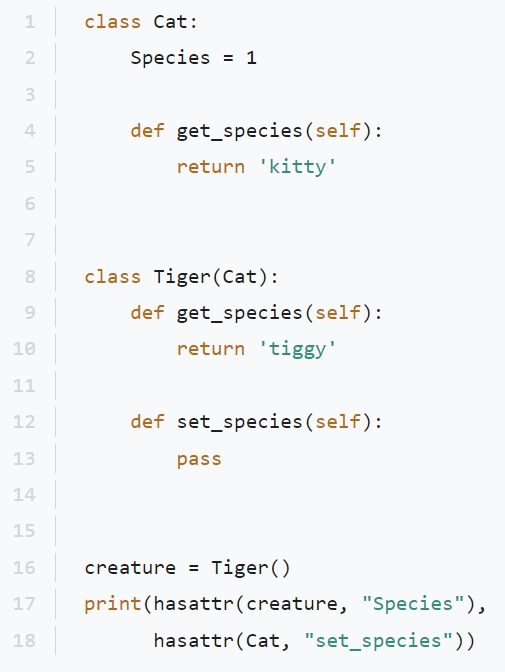

<!-- page_37 -->

<label class="pcap-option"><input type="checkbox" value="A"> A. 1 | True True</label>
<label class="pcap-option"><input type="checkbox" value="B"> B. 1 | False True</label>
<label class="pcap-option"><input type="checkbox" value="C"> C. 1 | False False</label>
<label class="pcap-option"><input type="checkbox" value="D"> D. 1 | True False</label>
<button type="button" class="pcap-check">Antwort prüfen</button>

Lösung und Erklärung

**Answer: D.**

Explanation

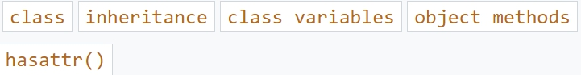

Topics:

The object creature is a Tiger and therefore a Cat and does have the attribute Species

The class Cat doesn't have the method set_species()

That method is defined in its subclass Tiger

<!-- page_38 -->

## Question 19

What is the expected output of the following code?

<label class="pcap-option"><input type="checkbox" value="A"> A. ****</label>
<label class="pcap-option"><input type="checkbox" value="B"> B. *</label>
<label class="pcap-option"><input type="checkbox" value="C"> C. The code is erroneous.</label>
<label class="pcap-option"><input type="checkbox" value="D"> D. **</label>
<button type="button" class="pcap-check">Antwort prüfen</button>

Lösung und Erklärung

**Answer: A.**

Explanation

Topics:

<!-- page_39 -->

The for loop inside of the function will iterate twice. Before the loop res has one star. In the first iteration a second star is added.

res then has two stars.

In the second iteration two more stars are added to those two star and res will end up with four stars.

The for loop outside of the function will just iterate through the string and print every single star.

You could get that easier by just printing the whole return value.

## Question 20

What is the expected output of the following code?

<!-- page_40 -->

<label class="pcap-option"><input type="checkbox" value="A"> A. 2 1 2</label>
<label class="pcap-option"><input type="checkbox" value="B"> B. 1 2 2</label>
<label class="pcap-option"><input type="checkbox" value="C"> C. 1 1 2</label>
<label class="pcap-option"><input type="checkbox" value="D"> D. 1 2 1</label>
<button type="button" class="pcap-check">Antwort prüfen</button>

Lösung und Erklärung

**Answer: C.**

Explanation

Topic:

We have multiple assignments in Python. You can assign multiple values to multiple variables.

<!-- page_41 -->

a, b = 3, 7

It is just shorter than

It does not have practical use, but what also works is

First c becomes 23 and then c becomes 42

You better write

c = 42

The same happens in this question in

z, y, z = 1, 1, 2

First z becomes 1 and then z becomes 2

You can also assign the same value to multiple variables:

## Question 21

Which module in Python supports regular expressions?

<label class="pcap-option"><input type="checkbox" value="A"> A. regex</label>
<label class="pcap-option"><input type="checkbox" value="B"> B. re</label>
<label class="pcap-option"><input type="checkbox" value="C"> C. None of the above</label>
<label class="pcap-option"><input type="checkbox" value="D"> D. pyregex</label>
<button type="button" class="pcap-check">Antwort prüfen</button>

Lösung und Erklärung

**Answer: B.**

Explanation

Topic:

<!-- page_42 -->

Nothing to explain here. You just have to remember the name of the module re

## Question 22

The Exception class contains a property named args and it is a:

<label class="pcap-option"><input type="checkbox" value="A"> A. tuple</label>
<label class="pcap-option"><input type="checkbox" value="B"> B. list</label>
<label class="pcap-option"><input type="checkbox" value="C"> C. string</label>
<label class="pcap-option"><input type="checkbox" value="D"> D. dictionary</label>
<button type="button" class="pcap-check">Antwort prüfen</button>

Lösung und Erklärung

**Answer: A.**

Explanation

Topics:

<!-- page_43 -->

Makes sense. Integers as indexes is enough, therefore no dictionary

You might need more than one elements, therefore no string

You do not want it to be writable later on, therefore no list

That leaves the tuple

## Question 23

A PWG-lead repository, collecting open-source Python code, is called:

<label class="pcap-option"><input type="checkbox" value="A"> A. PWGR</label>
<label class="pcap-option"><input type="checkbox" value="B"> B. PyCR</label>
<label class="pcap-option"><input type="checkbox" value="C"> C. PyPI</label>
<label class="pcap-option"><input type="checkbox" value="D"> D. PyRep</label>
<button type="button" class="pcap-check">Antwort prüfen</button>

Lösung und Erklärung

**Answer: C.**

Explanation

Topic:

These websites describe it best:

https://pypi.org/help/#maintainers

https://en.wikipedia.org/wiki/Python_Package_Index

## Question 24

You want to check, whether the variable obj contains an object of the class A

Which of the following statements can you use?

<label class="pcap-option"><input type="checkbox" value="A"> A. A.isinstance(obj)</label>
<label class="pcap-option"><input type="checkbox" value="B"> B. obj.isinstance(A)</label>
<label class="pcap-option"><input type="checkbox" value="C"> C. isinstance(A, obj)</label>
<label class="pcap-option"><input type="checkbox" value="D"> D. isinstance(obj, A)</label>
<button type="button" class="pcap-check">Antwort prüfen</button>

Lösung und Erklärung

**Answer: D.**

Explanation

<!-- page_44 -->

Topic:

isinstance() is one of Python's built-in functions. There is no method isinstance()

The second argument can be a class or a tuple of classes.

## Question 25

How many elements does the L list contain?

<!-- page_45 -->

<label class="pcap-option"><input type="checkbox" value="A"> A. three</label>
<label class="pcap-option"><input type="checkbox" value="B"> B. two</label>
<label class="pcap-option"><input type="checkbox" value="C"> C. zero</label>
<label class="pcap-option"><input type="checkbox" value="D"> D. one</label>
<button type="button" class="pcap-check">Antwort prüfen</button>

Lösung und Erklärung

**Answer: C.**

Explanation

Topic:

range(-1, -2) has no element and therefore the list L will be empty.

## Question 26

Which of the following lines contain valid Python code? (Select two answers.)

<label class="pcap-option"><input type="checkbox" value="A"> A. 1 | lambda(a,b): return a if a &lt; b else b</label>
<label class="pcap-option"><input type="checkbox" value="B"> B. 1 | lambda a,b: a if a &lt; b else b</label>
<label class="pcap-option"><input type="checkbox" value="C"> C. 1 | lambda a,b = a if a &lt; b else b</label>
<label class="pcap-option"><input type="checkbox" value="D"> D. 1 | lambda a,b: True</label>
<button type="button" class="pcap-check">Antwort prüfen</button>

Lösung und Erklärung

**Answer: B, D.**

Explanation

Topics:

<!-- page_46 -->

Both wrong answers have invalid syntax.

## Question 27

Knowing that a function named randint() resides in the module named random choose the proper way to import it:

<label class="pcap-option"><input type="checkbox" value="A"> A. from randint import random</label>
<label class="pcap-option"><input type="checkbox" value="B"> B. import randint</label>
<label class="pcap-option"><input type="checkbox" value="C"> C. from random import randint</label>
<label class="pcap-option"><input type="checkbox" value="D"> D. import randint from random</label>
<button type="button" class="pcap-check">Antwort prüfen</button>

Lösung und Erklärung

**Answer: C.**

Explanation

Topic:

<!-- page_47 -->

The module name is random

You have to write the module first. And you import from a module.

from the module random you want to import the method randint

## Question 28

What is the expected output of the following code?

<label class="pcap-option"><input type="checkbox" value="A"> A. It outputs None</label>
<label class="pcap-option"><input type="checkbox" value="B"> B. The code is erroneous and will raise an exception.</label>
<label class="pcap-option"><input type="checkbox" value="C"> C. It outputs False</label>
<label class="pcap-option"><input type="checkbox" value="D"> D. It outputs True</label>
<button type="button" class="pcap-check">Antwort prüfen</button>

Lösung und Erklärung

**Answer: C.**

<!-- page_48 -->

Explanation

Topics:

text_1 and text_2 are two different objects.

## Question 29

What is the expected output of the following code?

<label class="pcap-option"><input type="checkbox" value="A"> A. 0</label>
<label class="pcap-option"><input type="checkbox" value="B"> B. 0.0</label>
<label class="pcap-option"><input type="checkbox" value="C"> C. 0.4</label>
<label class="pcap-option"><input type="checkbox" value="D"> D. 0.2</label>
<button type="button" class="pcap-check">Antwort prüfen</button>

Lösung und Erklärung

**Answer: D.**

Explanation

<!-- page_49 -->

Topics:

The operators here come from two different groups: The group "Multiplication, Division, Floor division, Modulus" has a higher precedence than the group "Addition, Subtraction".

Therefore the order of operations here is: // -> / -> +

## Question 30

What is the expected output of the following code?

<label class="pcap-option"><input type="checkbox" value="A"> A. [ 1, 4 ]</label>
<label class="pcap-option"><input type="checkbox" value="B"> B. [ 4, 3 ]</label>
<label class="pcap-option"><input type="checkbox" value="C"> C. [ 1, 3, 4 ]</label>
<label class="pcap-option"><input type="checkbox" value="D"> D. [ 1, 3 ]</label>
<button type="button" class="pcap-check">Antwort prüfen</button>

Lösung und Erklärung

**Answer: B.**

Explanation

<!-- page_50 -->

Topics:

A list is mutable. When you assign it to a different variable, you create a reference of the same object. If afterwards you change one of them, the other one is changed too.

## Question 31

Which of the following commands can be used to read n characters from a file?

<label class="pcap-option"><input type="checkbox" value="A"> A. file.read(n)</label>
<label class="pcap-option"><input type="checkbox" value="B"> B. n = file .read()</label>
<label class="pcap-option"><input type="checkbox" value="C"> C. n = file.readline()</label>
<label class="pcap-option"><input type="checkbox" value="D"> D. file.readline(n)</label>
<button type="button" class="pcap-check">Antwort prüfen</button>

Lösung und Erklärung

**Answer: A.**

Explanation

Topics:

<!-- page_51 -->

The read() method has one optional parameter. If it is given, that number of characters are read.

If it is not given, the whole file is read.

file.readline([size])

The readline() method has also one optional parameter to specify the number of characters to be read. But it would only read that number of characters from the first line. If you want to read more characters, only the read() method will work.

## Question 32

What is the expected output of the following code?

<!-- page_52 -->

<label class="pcap-option"><input type="checkbox" value="A"> A. bcac</label>
<label class="pcap-option"><input type="checkbox" value="B"> B. bca</label>
<label class="pcap-option"><input type="checkbox" value="C"> C. bcbc</label>
<label class="pcap-option"><input type="checkbox" value="D"> D. acac</label>
<label class="pcap-option"><input type="checkbox" value="E"> E. bac</label>
<button type="button" class="pcap-check">Antwort prüfen</button>

Lösung und Erklärung

**Answer: A.**

Explanation

Topics:

<!-- page_53 -->

func(1) will try to execute 1 / 1

That will work fine and therefore not the except block, but the else block will be executed -> b

The finally block always gets executed -> c

func(0) will try to execute 1 / 0

That can not work.

In Python (like in any programming language) you can not divide by zero. In Python a ZeroDivisionError is raised and the except block is executed -> a

<!-- page_54 -->

Therefore the else block is not executed. And again the finally block always gets executed -> c

## Question 33

What is the expected output of the following code?

<label class="pcap-option"><input type="checkbox" value="A"> A. 0</label>
<label class="pcap-option"><input type="checkbox" value="B"> B. 1</label>
<label class="pcap-option"><input type="checkbox" value="C"> C. True</label>
<label class="pcap-option"><input type="checkbox" value="D"> D. False</label>
<button type="button" class="pcap-check">Antwort prüfen</button>

Lösung und Erklärung

**Answer: B.**

Explanation

Topics:

The mathematical constant e is 2.718281828459045

It is true, that is not 16.0 like math.pow(2, 4)

The integer value of True is 1

<!-- page_55 -->

By the way, there is also a Python built-in function pow()

## Question 34

What is the expected output of the following code?

<label class="pcap-option"><input type="checkbox" value="A"> A. 0</label>
<label class="pcap-option"><input type="checkbox" value="B"> B. The code is erroneous and cannot be run.</label>
<label class="pcap-option"><input type="checkbox" value="C"> C. 2</label>
<label class="pcap-option"><input type="checkbox" value="D"> D. 4</label>
<button type="button" class="pcap-check">Antwort prüfen</button>

Lösung und Erklärung

**Answer: D.**

Explanation

Topics:

<!-- page_56 -->

plane * 2 evaluates to CessnaCessna

There are two e and two a and therefore the counter will be 4

## Question 35

Which of the following variable names is illegal?

<label class="pcap-option"><input type="checkbox" value="A"> A. In</label>
<label class="pcap-option"><input type="checkbox" value="B"> B. In_</label>
<label class="pcap-option"><input type="checkbox" value="C"> C. In</label>
<label class="pcap-option"><input type="checkbox" value="D"> D. IN</label>
<button type="button" class="pcap-check">Antwort prüfen</button>

Lösung und Erklärung

**Answer: A.**

Explanation

Topic:

<!-- page_57 -->

You can not name a variable like a Python keyword. Here is a list of all the Python keywords:

Here are the other rules for naming variables in Python:

● A variable name must start with a letter or the underscore character.

● A variable name can not start with a number.

● A variable name can only contain alpha-numeric characters and underscores (a-z, 0-9, and _)

<!-- page_58 -->

Variable names are case-sensitive (age, Age and AGE are three different variables)

## Question 36

What is the expected output of the following code?

7777777

The code is erroneous.

49

77

!!! warning "Hinweis"

    Bei dieser Frage wurden die Antwortoptionen nicht sauber als Liste erkannt.

<button type="button" class="pcap-reveal">Lösung anzeigen</button>

Lösung und Erklärung

What is the expected output of the following code?

7777777

The code is erroneous.

49

77

**Answer: B.**

Explanation

Topic:

As the error message above states, you can only multiply a string by an integer.

## Question 37

What will be the output of the following code snippet?

<!-- page_59 -->

<label class="pcap-option"><input type="checkbox" value="A"> A. 2 1</label>
<label class="pcap-option"><input type="checkbox" value="B"> B. 1 2</label>
<label class="pcap-option"><input type="checkbox" value="C"> C. 1 1</label>
<label class="pcap-option"><input type="checkbox" value="D"> D. 2 2</label>
<button type="button" class="pcap-check">Antwort prüfen</button>

Lösung und Erklärung

**Answer: A.**

Explanation

Topic:

Integer is an immutable data type. The values get copied from one variable to another.

In the end x and y changed their values.

## Question 38

Which of the following statements are true about the __pycache__ directory/folder? (Select two answers.)

<label class="pcap-option"><input type="checkbox" value="A"> A. It is created automatically.</label>
<label class="pcap-option"><input type="checkbox" value="B"> B. It has to be created manually by the module’s creator.</label>
<label class="pcap-option"><input type="checkbox" value="C"> C. It contains semi-compiled module code.</label>
<label class="pcap-option"><input type="checkbox" value="D"> D. It has to be created manually by the module’s user.</label>
<button type="button" class="pcap-check">Antwort prüfen</button>

Lösung und Erklärung

**Answer: A, C.**

<!-- page_60 -->

Explanation

Topics:

Run the code and check your file system.

(Your IDE (e.g. PyCharm) may not show the __pycache__ folder.)

When the module my_module is imported Python automatically creates the folder __pycache__

And in the folder is a file with semi-compiled code

## Question 39

What is the expected output of the following code?

<label class="pcap-option"><input type="checkbox" value="A"> A. 1</label>
<label class="pcap-option"><input type="checkbox" value="B"> B. The code will raise an AttributeError exception.</label>
<label class="pcap-option"><input type="checkbox" value="C"> C. 0</label>
<label class="pcap-option"><input type="checkbox" value="D"> D. 2</label>
<button type="button" class="pcap-check">Antwort prüfen</button>

Lösung und Erklärung

**Answer: B.**

Explanation

Topics:

<!-- page_62 -->

The topics here are private variables and name mangling:

https://docs.python.org/3/tutorial/classes.html#private-variables

If you have instance variables with two leading underscores, you can not just access them from outside of the class. You would need getter and setter like in class B

## Question 40

What is the expected output of the following code?

<label class="pcap-option"><input type="checkbox" value="A"> A. 3 42</label>
<label class="pcap-option"><input type="checkbox" value="B"> B. The code is erroneous.</label>
<label class="pcap-option"><input type="checkbox" value="C"> C. 3 1</label>
<label class="pcap-option"><input type="checkbox" value="D"> D. 1 1</label>
<label class="pcap-option"><input type="checkbox" value="E"> E. 1 42</label>
<button type="button" class="pcap-check">Antwort prüfen</button>

Lösung und Erklärung

**Answer: A.**

Explanation

Topics:

<!-- page_63 -->

This question is about argument passing. It is a big difference, whether you pass a mutable or an immutable data type. The immutable integer in x gets copied to p1 and the change of p1 does not affect x

The mutable list in y gets referenced to p2 and the change of p2 effect y

## Question 41

What is the expected output of the following code?

<label class="pcap-option"><input type="checkbox" value="A"> A. [ 3, 5, 20, 5, 25, 1, 3 ]</label>
<label class="pcap-option"><input type="checkbox" value="B"> B. [ 1, 3, 4, 5, 20, 5, 25 ]</label>
<label class="pcap-option"><input type="checkbox" value="C"> C. [ 1, 3, 3, 4, 5, 5, 20, 25 ]</label>
<label class="pcap-option"><input type="checkbox" value="D"> D. [ 3, 4, 5, 20, 5, 25, 1, 3 ]</label>
<label class="pcap-option"><input type="checkbox" value="E"> E. [ 3, 1, 25, 5, 20, 5, 4 ]</label>
<button type="button" class="pcap-check">Antwort prüfen</button>

Lösung und Erklärung

**Answer: A.**

Explanation

Topics:

list.pop([i])

The index is optional. If the index is given, pop() removes and returns the element at the given index. The default index is -1

Meaning that the last index is removed and returned. Here the index 1 gets removed: the number 4

## Question 42

What is the expected output of the following code?

<!-- page_65 -->

<label class="pcap-option"><input type="checkbox" value="A"> A. 4 4</label>
<label class="pcap-option"><input type="checkbox" value="B"> B. 1 1</label>
<label class="pcap-option"><input type="checkbox" value="C"> C. The code is erroneous.</label>
<label class="pcap-option"><input type="checkbox" value="D"> D. 1 4</label>
<label class="pcap-option"><input type="checkbox" value="E"> E. 4 1</label>
<button type="button" class="pcap-check">Antwort prüfen</button>

Lösung und Erklärung

**Answer: C.**

Explanation

Topics:

<!-- page_66 -->

A variable name shadows into a function. You can use it in an expression like in func2() or you can assign a new value to it like in func3()

BUT you can not do both at the same time like in func()

There is going to be the new variable num and you can not use it in an expression before its first assignment.

## Question 43

What is the expected output of the following code?

<label class="pcap-option"><input type="checkbox" value="A"> A. 1 | 261</label>
<label class="pcap-option"><input type="checkbox" value="B"> B. 1 | ( ‘list index out of range’ ,)</label>
<label class="pcap-option"><input type="checkbox" value="C"> C. 1 | (‘ success’ ,)</label>
<label class="pcap-option"><input type="checkbox" value="D"> D. 1 | 321</label>
<button type="button" class="pcap-check">Antwort prüfen</button>

Lösung und Erklärung

**Answer: B.**

Explanation

Topics:

There is no third last index and an IndexError is raised. The except branch is executed and the args of the exception are printed.

## Question 44

What will be the output of the following code snippet?

<label class="pcap-option"><input type="checkbox" value="A"> A. 0</label>
<label class="pcap-option"><input type="checkbox" value="B"> B. 6/10</label>
<label class="pcap-option"><input type="checkbox" value="C"> C. None of the above.</label>
<label class="pcap-option"><input type="checkbox" value="D"> D. 0.6</label>
<button type="button" class="pcap-check">Antwort prüfen</button>

Lösung und Erklärung

**Answer: D.**

Explanation

Topic:

<!-- page_68 -->

The division operator does its normal job. And remember the division operator ALWAYS returns a float.

## Question 45

What is true about updating already installed Python packages?

<label class="pcap-option"><input type="checkbox" value="A"> A. It’s an automatic process which doesn’t require any user attention.</label>
<label class="pcap-option"><input type="checkbox" value="B"> B. It can be done only by uninstalling the package once again.</label>
<label class="pcap-option"><input type="checkbox" value="C"> C. It’s performed by the install command accompanied by the -U option.</label>
<label class="pcap-option"><input type="checkbox" value="D"> D. It can be done by reinstalling the package using the reinstall command.</label>
<button type="button" class="pcap-check">Antwort prüfen</button>

Lösung und Erklärung

**Answer: C.**

Explanation

Topic:

First use pip list --outdated to list your outdated packages. Then use pip install -U package_name to update one of the packages. If you do pip list --outdated again, you will see, that the chosen package is no longer in the list of outdated packages.

pip install --upgrade package_name would work, too.

You can also use pip show package_name to see the version (and other information) of a package.

## Question 46

<!-- page_69 -->

Select the true statements about the map() function. Choose two.

<label class="pcap-option"><input type="checkbox" value="A"> A. The map() function can accept more than two arguments.</label>
<label class="pcap-option"><input type="checkbox" value="B"> B. The map() function can accept only two arguments.</label>
<label class="pcap-option"><input type="checkbox" value="C"> C. The first map() function argument can be a list.</label>
<label class="pcap-option"><input type="checkbox" value="D"> D. The second map() function argument can be a list.</label>
<button type="button" class="pcap-check">Antwort prüfen</button>

Lösung und Erklärung

**Answer: A, D.**

Explanation

Topic:

Yes, the map() function can accept more than two arguments. The elements of the second parameter of the map() function (here list1) will be assigned to the first parameter of the lambda function (here x).

The elements of the third parameter of the map() function (here list2) will be assigned to the second parameter of the lambda function (here y).

There could even be more parameters. And yes, the second map() function argument (here list1) can be a list. But the first map() function argument must be a function.

## Question 47

<!-- page_70 -->

What is the expected behavior of the following program?

<label class="pcap-option"><input type="checkbox" value="A"> A. The program will raise an exception handled by the first except block.</label>
<label class="pcap-option"><input type="checkbox" value="B"> B. The program will cause a ZeroDivisionError exception and output the following message: Too bad...</label>
<label class="pcap-option"><input type="checkbox" value="C"> C. The program will cause a ValueError exception and output a default error message.</label>
<label class="pcap-option"><input type="checkbox" value="D"> D. The program will cause a ZeroDivisionError exception and output a default error message.</label>
<label class="pcap-option"><input type="checkbox" value="E"> E. The program will cause a ValueError exception and output the following message: Too bad...</label>
<label class="pcap-option"><input type="checkbox" value="F"> F. The program will cause a SyntaxError exception.</label>
<button type="button" class="pcap-check">Antwort prüfen</button>

Lösung und Erklärung

**Answer: F.**

Explanation

Topics:

<!-- page_71 -->

There are two syntax errors:

break can not be used outside of a loop, and the default except must be last.

## Question 48

What is the expected output of the following code?

<!-- page_72 -->

<label class="pcap-option"><input type="checkbox" value="A"> A. I from B is 30</label>
<label class="pcap-option"><input type="checkbox" value="B"> B. I from A is 0</label>
<label class="pcap-option"><input type="checkbox" value="C"> C. I from A is 30</label>
<label class="pcap-option"><input type="checkbox" value="D"> D. I from A is 20</label>
<button type="button" class="pcap-check">Antwort prüfen</button>

Lösung und Erklärung

**Answer: C.**

Explanation

Topics:

<!-- page_73 -->

When b is instantiated as an object of class B its constructor calls the constructor of its parent class A

The classes A and B both have a method named calc() therefore the method in A gets overridden by the method in B

Now the constructor in A (which is called from out of B) will instantiate the object variable i

Then it will call the calc() method and pass 10 as a value. Because we are in B, the calc() method of B is called.

The passed value will be multiplied by 3 and stored in b.i

10 * 3 -> 30

And in the end the print() function will print: i from A is 30

## Question 49

What is the expected output of the following code?

<!-- page_74 -->

1 | Name of the file: data.txt

2 | Peter Wellert

3 |

4 | Hello everybody

1 | Peter Wellert

2 | Hello everybody

!!! warning "Hinweis"

    Bei dieser Frage wurden die Antwortoptionen nicht sauber als Liste erkannt.

<button type="button" class="pcap-reveal">Lösung anzeigen</button>

Lösung und Erklärung

What is the expected output of the following code?

<!-- page_74 -->

1 | Name of the file: data.txt

2 | Peter Wellert

3 |

4 | Hello everybody

1 | Peter Wellert

2 | Hello everybody

**Answer: A.**

Explanation

Topics:

<!-- page_75 -->

open() with the mode w+ opens a file for writing and reading. If the file doesn't exist, it will be created.

First something gets written into the file. Then the file pointer gets set back to the beginning. And then the file gets iterated line by line by the for loop.

## Question 50

<!-- page_76 -->

What is the expected output of the following code?

The code is erroneous,

because the print method is called without an argument.

The code is erroneous,

because the constructor is called without an argument.

!!! warning "Hinweis"

    Bei dieser Frage wurden die Antwortoptionen nicht sauber als Liste erkannt.

<button type="button" class="pcap-reveal">Lösung anzeigen</button>

Lösung und Erklärung

<!-- page_76 -->

What is the expected output of the following code?

The code is erroneous,

because the print method is called without an argument.

The code is erroneous,

because the constructor is called without an argument.

**Answer: D.**

Explanation

Topics:

<!-- page_77 -->

Everything will work fine here. The __init__() method will initialize the object variable s with the value Welcome and the print() method will print just that.

## Question 51

What is the expected output of the following code?

<label class="pcap-option"><input type="checkbox" value="A"> A. 2019/Nov/27 11:27:22</label>
<label class="pcap-option"><input type="checkbox" value="B"> B. 2019/11/27 11:27:22</label>
<label class="pcap-option"><input type="checkbox" value="C"> C. 19/ November/27 11:27:22</label>
<label class="pcap-option"><input type="checkbox" value="D"> D. 19/11/27 11:27:22</label>
<button type="button" class="pcap-check">Antwort prüfen</button>

Lösung und Erklärung

**Answer: C.**

Explanation

Topics:

<!-- page_78 -->

You "just" have to learn these:

https://strftime.org

## Question 52

What would you insert instead ??? so that the program checks for even numbers?

<label class="pcap-option"><input type="checkbox" value="A"> A. x % 1 == 2</label>
<label class="pcap-option"><input type="checkbox" value="B"> B. x % ‘even’ == True</label>
<label class="pcap-option"><input type="checkbox" value="C"> C. x % x == 0</label>
<label class="pcap-option"><input type="checkbox" value="D"> D. x % 2 == 0</label>
<label class="pcap-option"><input type="checkbox" value="E"> E. x % 2 == 1</label>
<button type="button" class="pcap-check">Antwort prüfen</button>

Lösung und Erklärung

**Answer: D.**

Explanation

Topics:

Every number that is divided by two does not leave a rest is even.

<!-- page_79 -->

## Question 53

What will be the output of the following code snippet?

<label class="pcap-option"><input type="checkbox" value="A"> A. [ 8, 9 ]</label>
<label class="pcap-option"><input type="checkbox" value="B"> B. [ 1, 2]</label>
<label class="pcap-option"><input type="checkbox" value="C"> C. [ 1, 2, 3 ]</label>
<label class="pcap-option"><input type="checkbox" value="D"> D. [ 1, 3, 5, 7, 9 ]</label>
<button type="button" class="pcap-check">Antwort prüfen</button>

Lösung und Erklärung

**Answer: D.**

Explanation

Topic:

List slicing: [start(inclusive):end(exclusive):step]

The start and end values are missing here.

If you leave them out, you will slice from the beginning to the end. If you leave the end out it will also be inclusive.

The third value (the step) is 2 therefore every second element gets taken.

## Question 54

You need to find out if a hardware platform utilizes the x86 or armCPU. Which method from the module platform can you use? (Select two answers.)

<label class="pcap-option"><input type="checkbox" value="A"> A. 1 | hardware()</label>
<label class="pcap-option"><input type="checkbox" value="B"> B. 1 | platform()</label>
<label class="pcap-option"><input type="checkbox" value="C"> C. 1 | processor()</label>
<label class="pcap-option"><input type="checkbox" value="D"> D. 1 | node()</label>
<button type="button" class="pcap-check">Antwort prüfen</button>

Lösung und Erklärung

**Answer: B, C.**

Explanation

Topics:

platform.platform()

Returns a single string identifying the underlying platform with as much useful information as possible.

https://docs.python.org/3/library/platform.html#platform.platform

platform.processor()

Returns the (real) processor name, e.g. 'amdk6'.

https://docs.python.org/3/library/platform.html#platform.processor

platform.node()

Returns the computer’s network name (may not be fully qualified!). An empty string is returned if the value cannot be determined.

https://docs.python.org/3/library/platform.html#platform.node

## Question 55

What is the expected output of the following code?

<!-- page_81 -->

<label class="pcap-option"><input type="checkbox" value="A"> A. The code is erroneous.</label>
<label class="pcap-option"><input type="checkbox" value="B"> B. 0</label>
<label class="pcap-option"><input type="checkbox" value="C"> C. 1</label>
<label class="pcap-option"><input type="checkbox" value="D"> D. 2</label>
<button type="button" class="pcap-check">Antwort prüfen</button>

Lösung und Erklärung

**Answer: C.**

Explanation

Topics:

The backslash is the character to escape another character. Here the backslash escapes the following single quote character. Together they are one character.

## Question 56

What is the expected output of the following code?

1 | 0

2 | 2

3 | 4

4 | 6

5 | 8

<!-- page_82 -->

D.

!!! warning "Hinweis"

    Bei dieser Frage wurden die Antwortoptionen nicht sauber als Liste erkannt.

<button type="button" class="pcap-reveal">Lösung anzeigen</button>

Lösung und Erklärung

What is the expected output of the following code?

1 | 0

2 | 2

3 | 4

4 | 6

5 | 8

<!-- page_82 -->

D.

**Answer: B.**

Explanation

Topics:

This list comprehension will iterate through range(5) add each number to itself and assign the sum to the result list.

## Question 57

Which of the following snippets outputs 123 to the screen?

1 | tmp = list (“321”)

2 | tmp.sort ()

3 | print (‘ ‘ .join(tmp))

1 | tmp = “321” .sort()

2 | print(str(tmp) )

!!! warning "Hinweis"

    Bei dieser Frage wurden die Antwortoptionen nicht sauber als Liste erkannt.

<button type="button" class="pcap-reveal">Lösung anzeigen</button>

Lösung und Erklärung

Which of the following snippets outputs 123 to the screen?

1 | tmp = list (“321”)

2 | tmp.sort ()

3 | print (‘ ‘ .join(tmp))

1 | tmp = “321” .sort()

2 | print(str(tmp) )

**Answer:A, B.**

<!-- page_83 -->

Explanation

Topics:

## Question 58

What is the default return value for a function that does not explicitly return any value?

<label class="pcap-option"><input type="checkbox" value="A"> A. void</label>
<label class="pcap-option"><input type="checkbox" value="B"> B. int</label>
<label class="pcap-option"><input type="checkbox" value="C"> C. public</label>
<label class="pcap-option"><input type="checkbox" value="D"> D. None</label>
<label class="pcap-option"><input type="checkbox" value="E"> E. Null</label>
<button type="button" class="pcap-check">Antwort prüfen</button>

Lösung und Erklärung

**Answer: D.**

Explanation

<!-- page_84 -->

Topic:

If a function does not have the keyword return the function will return the value None

The same happens if there is no value after the keyword return

## Question 59

A subclass is usually:

<label class="pcap-option"><input type="checkbox" value="A"> A. More general than its superclass.</label>
<label class="pcap-option"><input type="checkbox" value="B"> B. A twin of its superclass.</label>
<label class="pcap-option"><input type="checkbox" value="C"> C. More specialized than its superclass.</label>
<label class="pcap-option"><input type="checkbox" value="D"> D. None of the above</label>
<button type="button" class="pcap-check">Antwort prüfen</button>

Lösung und Erklärung

**Answer: C.**

Explanation

Topic:

<!-- page_85 -->

The student is more "specialized" than the person. Not only does he have a firstname and a lastname but he has also a graduationyear

## Question 60

What is the expected output of the following code?

1 | 23

2 | 42

<!-- page_86 -->

B.

1 | 42

2 | 23

!!! warning "Hinweis"

    Bei dieser Frage wurden die Antwortoptionen nicht sauber als Liste erkannt.

<button type="button" class="pcap-reveal">Lösung anzeigen</button>

Lösung und Erklärung

What is the expected output of the following code?

1 | 23

2 | 42

<!-- page_86 -->

B.

1 | 42

2 | 23

**Answer: A.**

Explanation

Topic:

The function will try to execute print(23) and succeed. The finally block always gets executed.

## Question 61

Select the true statements. Choose two.

<!-- page_87 -->

<label class="pcap-option"><input type="checkbox" value="A"> A. The version function from the platform module returns a string with your Python version.</label>
<label class="pcap-option"><input type="checkbox" value="B"> B. The version function from the platform module returns a string with your OS version.</label>
<label class="pcap-option"><input type="checkbox" value="C"> C. The processor function from the platform module returns an integer with the number of processes currently running in your OS.</label>
<label class="pcap-option"><input type="checkbox" value="D"> D. The system function from the platform module returns a string with your OS name.</label>
<button type="button" class="pcap-check">Antwort prüfen</button>

Lösung und Erklärung

**Answer: B, D.**

Explanation

Topics:

Yes, the system function returns a string with your OS name and the version function returns a string with your OS version. The processor function returns a string with the name of your processor.

## Question 62

Entering the try: block implies that:

<label class="pcap-option"><input type="checkbox" value="A"> A. none of the instructions from this block will be executed.</label>
<label class="pcap-option"><input type="checkbox" value="B"> B. some of the instructions from this block may not be executed.</label>
<label class="pcap-option"><input type="checkbox" value="C"> C. all of the instructions from this block will be executed.</label>
<label class="pcap-option"><input type="checkbox" value="D"> D. the block will be omitted.</label>
<button type="button" class="pcap-check">Antwort prüfen</button>

Lösung und Erklärung

**Answer: B.**

Explanation

Topic:

<!-- page_88 -->

In this case the multiplication and the printing will not be executed, because the type casting will already raise an exception.

## Question 63

You want to write a code snippet to read the total data from a text file and print it to the monitor. What snippet would you insert in the line indicated below:

<label class="pcap-option"><input type="checkbox" value="A"> A. data = file.load()</label>
<label class="pcap-option"><input type="checkbox" value="B"> B. data = file.readline()</label>
<label class="pcap-option"><input type="checkbox" value="C"> C. data = file.read()</label>
<label class="pcap-option"><input type="checkbox" value="D"> D. data = file.readlines()</label>
<button type="button" class="pcap-check">Antwort prüfen</button>

Lösung und Erklärung

**Answer: C.**

Explanation

Topics:

<!-- page_89 -->

The read() method is the right choice here. It reads the whole content of a file and returns it as a string.

The readline() method only reads one line. The readlines() method also reads the whole content, but returns it as a list of lines. That is definitely not wanted here. And load() is not a method of the file object.

## Question 64

Which of the following are valid Python string literals? (Select two answers.)

<label class="pcap-option"><input type="checkbox" value="A"> A. 1 | “ “ “ The knights Who Say ‘ Ni! ‘ “ “ “</label>
<label class="pcap-option"><input type="checkbox" value="B"> B. 1 | ‘All the king’s horses’</label>
<label class="pcap-option"><input type="checkbox" value="C"> C. 1 | “\”</label>
<label class="pcap-option"><input type="checkbox" value="D"> D. 1 | “king’s Cross Station”</label>
<button type="button" class="pcap-check">Antwort prüfen</button>

Lösung und Erklärung

**Answer: A, D.**

Explanation

<!-- page_90 -->

Topics:

A single quote can be used in a string delimited by double quotes (and vice versa).

And a single quote can be used in a multi-line string delimited by triple double quotes (and vice versa).

## Question 65

Which method is used to break the connection between the file handle and a physical file?

<label class="pcap-option"><input type="checkbox" value="A"> A. disconnect()</label>
<label class="pcap-option"><input type="checkbox" value="B"> B. shutup()</label>
<label class="pcap-option"><input type="checkbox" value="C"> C. lock()</label>
<label class="pcap-option"><input type="checkbox" value="D"> D. close()</label>
<button type="button" class="pcap-check">Antwort prüfen</button>

Lösung und Erklärung

**Answer: D.**

Explanation

Topics:

<!-- page_91 -->

The close() method closes an open file. You should always close your files, in some cases, due to buffering, changes made to a file may not show until you close the file.

https://www.w3schools.com/python/ref_file_close.asp

## Question 66

What is the expected output of the following code?

<label class="pcap-option"><input type="checkbox" value="A"> A. [ 3 ]</label>
<label class="pcap-option"><input type="checkbox" value="B"> B. [ 2 ]</label>
<label class="pcap-option"><input type="checkbox" value="C"> C. [ 1 ]</label>
<label class="pcap-option"><input type="checkbox" value="D"> D. [ ]</label>
<button type="button" class="pcap-check">Antwort prüfen</button>

Lösung und Erklärung

**Answer: B.**

Explanation

<!-- page_92 -->

Topics:

The g() function expects three parameters. It will invoke the third parameter and pass the first two to it. When 1 and 1 are pass as arguments to the lambda function it will slice the list v by [1:2] and return a list like [2]

## Question 67

What is the expected output of the following code?

<label class="pcap-option"><input type="checkbox" value="A"> A. 1*1*1</label>
<label class="pcap-option"><input type="checkbox" value="B"> B. The code is erroneous.</label>
<label class="pcap-option"><input type="checkbox" value="C"> C. x y z</label>
<label class="pcap-option"><input type="checkbox" value="D"> D. 1 1 1</label>
<button type="button" class="pcap-check">Antwort prüfen</button>

Lösung und Erklärung

**Answer: A.**

Explanation

<!-- page_93 -->

Topic:

The print() function has a sep parameter which stands for separator. The default value of the sep parameter is a space character. You can change it to anything you want.

## Question 68

What value will be assigned to the x variable?

<label class="pcap-option"><input type="checkbox" value="A"> A. True</label>
<label class="pcap-option"><input type="checkbox" value="B"> B. False</label>
<label class="pcap-option"><input type="checkbox" value="C"> C. 1</label>
<label class="pcap-option"><input type="checkbox" value="D"> D. 0</label>
<button type="button" class="pcap-check">Antwort prüfen</button>

Lösung und Erklärung

**Answer: A.**

Explanation

Topic:

<!-- page_94 -->

The operators here are from three different groups.

"Comparisons, Identity, Membership operators", "Logical AND", "Logical OR".

The two comparison operators the greater than operator and the less than operator have the highest precedence. Then the logical and operator has a higher precedence than the logical or operator

## Question 69

Consider the following file module.py.

What will be the output, if you run it?

<label class="pcap-option"><input type="checkbox" value="A"> A. _module_</label>
<label class="pcap-option"><input type="checkbox" value="B"> B. _main_</label>
<label class="pcap-option"><input type="checkbox" value="C"> C. main</label>
<label class="pcap-option"><input type="checkbox" value="D"> D. module</label>
<button type="button" class="pcap-check">Antwort prüfen</button>

Lösung und Erklärung

**Answer: B.**

<!-- page_95 -->

Explanation

Topic:

The output will be: __main__

If you import that file, the output would be: module

But that is not asked here.

## Question 70

What happens if you run the following code, assuming that the d directory already exists?

<label class="pcap-option"><input type="checkbox" value="A"> A. A DirectoryExistsError exception will be raised.</label>
<label class="pcap-option"><input type="checkbox" value="B"> B. Python will overwrite the existing directory.</label>
<label class="pcap-option"><input type="checkbox" value="C"> C. A FileExistsError exception will be raised.</label>
<label class="pcap-option"><input type="checkbox" value="D"> D. All of the above.</label>
<button type="button" class="pcap-check">Antwort prüfen</button>

Lösung und Erklärung

**Answer: C.**

Explanation

Topics:

The makedirs() method is to create all the directories. And than mkdir() raises the FileExistsError because the directory d already exists.

See also:

<!-- page_96 -->

https://docs.python.org/3/library/os.html#os.mkdir

## Question 71

The value thirty point eleven times ten raised to the power of nine should be written as:

<label class="pcap-option"><input type="checkbox" value="A"> A. 30.11E9.0</label>
<label class="pcap-option"><input type="checkbox" value="B"> B. 30E11.9</label>
<label class="pcap-option"><input type="checkbox" value="C"> C. 30.11E9</label>
<label class="pcap-option"><input type="checkbox" value="D"> D. 30.11*10^9</label>
<button type="button" class="pcap-check">Antwort prüfen</button>

Lösung und Erklärung

**Answer: C.**

Explanation

Topic:

You could replace the E by * 10 **

## Question 72

What is the output of the following program if the user enters kangaroo at the first prompt and 0 at the second prompt?

<!-- page_97 -->

<label class="pcap-option"><input type="checkbox" value="A"> A. 1 | Wrong value</label>
<label class="pcap-option"><input type="checkbox" value="B"> B. 1 | Do not divide by zero!</label>
<label class="pcap-option"><input type="checkbox" value="C"> C. 1 | 4.0</label>
<label class="pcap-option"><input type="checkbox" value="D"> D. 1 | Error.Error.Error.</label>
<button type="button" class="pcap-check">Antwort prüfen</button>

Lösung und Erklärung

**Answer: C.**

Explanation

Topics:

<!-- page_98 -->

No exception will be thrown. The length of kangaroo is 8 and the length of 0 is 1

1 * 2 -> 2

8 / 2 -> 4.0

## Question 73

Which of the following for loops would output the below number pattern?

1 | for i in range(1, 6)

2 | print(i, i, i, i, i )

<!-- page_99 -->

B.

1 | for i in range(1, 6):

2 | print(str(i) *5 )

1 | for i in range(0, 5):

2 | print(str(i) * 5)

1 | for i in range(1, 5)

2 | print(str(i) * 5)

!!! warning "Hinweis"

    Bei dieser Frage wurden die Antwortoptionen nicht sauber als Liste erkannt.

<button type="button" class="pcap-reveal">Lösung anzeigen</button>

Lösung und Erklärung

Which of the following for loops would output the below number pattern?

1 | for i in range(1, 6)

2 | print(i, i, i, i, i )

<!-- page_99 -->

B.

1 | for i in range(1, 6):

2 | print(str(i) *5 )

1 | for i in range(0, 5):

2 | print(str(i) * 5)

1 | for i in range(1, 5)

2 | print(str(i) * 5)

**Answer: B.**

Explanation

Topics:

<!-- page_100 -->

You need range(1, 6) because the start value 1 is inclusive and the end value 6 is exclusive.

To get the same numbers next to each other (without a space between them) you need to make a string and then use the multiply operator string concatenation

The standard separator of the print() function is one space.

gives you one space between each number. It would work with print(i, i, i, i, i, sep='') but that answer is not offered here.

## Question 74

<!-- page_101 -->

Assuming that the open() invocation has gone successfully, the following snippet will:

<label class="pcap-option"><input type="checkbox" value="A"> A. read the whole file at once.</label>
<label class="pcap-option"><input type="checkbox" value="B"> B. cause an exception.</label>
<label class="pcap-option"><input type="checkbox" value="C"> C. read the file line by line.</label>
<label class="pcap-option"><input type="checkbox" value="D"> D. read the file character by character.</label>
<button type="button" class="pcap-check">Antwort prüfen</button>

Lösung und Erklärung

**Answer: C.**

Explanation

Topic:

The for loop will iterate through the file line by line. The mode 'rt' stands for read & text.

## Question 75

Given the code below, indicate a method which will correctly provide the value of the rack field?

<!-- page_102 -->

1 | def get( ):

2 | return rack

1 | def get (self):

2 | return self.rack

1 | def get(self):

2 | return rack

1 | def get( ):

2 | return self.rack

!!! warning "Hinweis"

    Bei dieser Frage wurden die Antwortoptionen nicht sauber als Liste erkannt.

<button type="button" class="pcap-reveal">Lösung anzeigen</button>

Lösung und Erklärung

Given the code below, indicate a method which will correctly provide the value of the rack field?

<!-- page_102 -->

1 | def get( ):

2 | return rack

1 | def get (self):

2 | return self.rack

1 | def get(self):

2 | return rack

1 | def get( ):

2 | return self.rack

**Answer: B.**

Explanation

Topics:

<!-- page_103 -->

The object method needs to have the object reference self as a parameter and the object variable needs to have self in front. Otherwise it would be a local variable.

## Question 76

A function named f() is included in a module named m and the module is part of a package named p. Which of the following code snippets allows you to properly invoke the function? (Select two answers.)

1 | from p.m import f

2 |

3 | f ( )

1 | import p.m

2 |

3 | p.m.f( )

1 | import p.m.f

2 |

3 | f( )

<!-- page_104 -->

D.

1 | import p

2 |

3 | m.f( )

!!! warning "Hinweis"

    Bei dieser Frage wurden die Antwortoptionen nicht sauber als Liste erkannt.

<button type="button" class="pcap-reveal">Lösung anzeigen</button>

Lösung und Erklärung

A function named f() is included in a module named m and the module is part of a package named p. Which of the following code snippets allows you to properly invoke the function? (Select two answers.)

1 | from p.m import f

2 |

3 | f ( )

1 | import p.m

2 |

3 | p.m.f( )

1 | import p.m.f

2 |

3 | f( )

<!-- page_104 -->

D.

1 | import p

2 |

3 | m.f( )

**Answer: A, B.**

Explanation

Topics:

If you use the from keyword, you can just write the function name. Otherwise you have to write the qualified name in front of the function.

<!-- page_105 -->

## Question 77

You develop a Python application for your company. You have the following code.

Which of the following expressions is equivalent to the expression in the function?

<label class="pcap-option"><input type="checkbox" value="A"> A. (a + b ) * ( c - d )</label>
<label class="pcap-option"><input type="checkbox" value="B"> B. A + ( ( b * c ) - d )</label>
<label class="pcap-option"><input type="checkbox" value="C"> C. None of the above</label>
<label class="pcap-option"><input type="checkbox" value="D"> D. (a + (b * c ) ) - d</label>
<button type="button" class="pcap-check">Antwort prüfen</button>

Lösung und Erklärung

**Answer: D.**

Explanation

Topics:

This question is about operator precedence

<!-- page_106 -->

The multiplication operator has the highest precedence and is therefore executed first.

That leaves the addition operator and the subtraction operator

They both are from the same group and therefore have the same precedence. That group has a left-to-right associativity. The addition operator is on the left and is therefore executed next.

And the last one to be executed is the subtraction operator

## Question 78

What is the expected behavior of the following snippet?

It will:

<label class="pcap-option"><input type="checkbox" value="A"> A. print 6</label>
<label class="pcap-option"><input type="checkbox" value="B"> B. print 8</label>
<label class="pcap-option"><input type="checkbox" value="C"> C. cause a runtime exception on Line 8</label>
<label class="pcap-option"><input type="checkbox" value="D"> D. cause a runtime exception on Line 9</label>
<label class="pcap-option"><input type="checkbox" value="E"> E. print 4</label>
<button type="button" class="pcap-check">Antwort prüfen</button>

Lösung und Erklärung

**Answer: B.**

Explanation

Topics:

<!-- page_107 -->

The first call of the function a() will pass 1 to the function.

2 * 1 -> 2

The function will return 2

2 + 2 -> 4

The second call of the function a() will pass 4 to the function.

2 * 4 -> 8

8 will be printed.

## Question 79

What is the output of the following code snippet?

<!-- page_108 -->

<label class="pcap-option"><input type="checkbox" value="A"> A. 1 3</label>
<label class="pcap-option"><input type="checkbox" value="B"> B. 3 2</label>
<label class="pcap-option"><input type="checkbox" value="C"> C. The code is erroneous.</label>
<label class="pcap-option"><input type="checkbox" value="D"> D. 3 3</label>
<label class="pcap-option"><input type="checkbox" value="E"> E. 2 3</label>
<button type="button" class="pcap-check">Antwort prüfen</button>

Lösung und Erklärung

**Answer: B.**

Explanation

Topics:

Okay, both parameters get the default value of the other one, but for the rest it's business as usual.

## Question 80

What is the expected output of the following code?

<!-- page_109 -->

<label class="pcap-option"><input type="checkbox" value="A"> A. The code is erroneous.</label>
<label class="pcap-option"><input type="checkbox" value="B"> B. False</label>
<label class="pcap-option"><input type="checkbox" value="C"> C. 0</label>
<label class="pcap-option"><input type="checkbox" value="D"> D. 1</label>
<label class="pcap-option"><input type="checkbox" value="E"> E. True</label>
<button type="button" class="pcap-check">Antwort prüfen</button>

Lösung und Erklärung

**Answer: E.**

Explanation

Topics:

<!-- page_110 -->

C is a subclass of A

C is a grandchild of A so to speak.

B is a subclass of A

C is a subclass of B

And therefore C is a subclass of A

## Question 81

What is the expected output of the following code?

<!-- page_111 -->

<label class="pcap-option"><input type="checkbox" value="A"> A. 2 0</label>
<label class="pcap-option"><input type="checkbox" value="B"> B. 4 0</label>
<label class="pcap-option"><input type="checkbox" value="C"> C. 3 1</label>
<label class="pcap-option"><input type="checkbox" value="D"> D. 4 1</label>
<label class="pcap-option"><input type="checkbox" value="E"> E. 3 0</label>
<button type="button" class="pcap-check">Antwort prüfen</button>

Lösung und Erklärung

**Answer: C.**

Explanation

<!-- page_112 -->

Topics:

The object b will inherit the object variable x from class A and get the attribute y from its own class B

The start value of x will be 3 and the start value from y will be 0

The method func() will be from the class B because the function from A with the same name will be overriden. When b.func() is called, y will be incremented and then the output is: 3 1

## Question 82

<!-- page_113 -->

Which of the following expressions evaluates to True and raises no exception?

<label class="pcap-option"><input type="checkbox" value="A"> A. 1 | 10 != ‘1’ + ‘0’</label>
<label class="pcap-option"><input type="checkbox" value="B"> B. 1 | ‘Al’ * 2 != 2 * ‘Al’</label>
<label class="pcap-option"><input type="checkbox" value="C"> C. 1 | 9’ * 3 &gt; ‘9’ * 9</label>
<label class="pcap-option"><input type="checkbox" value="D"> D. 1 | ‘9’ * 1 &lt; 1 * 2</label>
<button type="button" class="pcap-check">Antwort prüfen</button>

Lösung und Erklärung

**Answer: A.**

Explanation

Topics:

<!-- page_114 -->

## Question 83

What is the correct command to shuffle the following list?

<label class="pcap-option"><input type="checkbox" value="A"> A. shuffle(people)</label>
<label class="pcap-option"><input type="checkbox" value="B"> B. people.shuffle( )</label>
<label class="pcap-option"><input type="checkbox" value="C"> C. random,shuffle(people)</label>
<label class="pcap-option"><input type="checkbox" value="D"> D. random.shuffleList(people)</label>
<button type="button" class="pcap-check">Antwort prüfen</button>

Lösung und Erklärung

**Answer: C.**

Explanation

Topics:

import random imports the whole module. If you want to use one of its methods, you have to add it by dot notation. The shuffle() method will change the original list in-place.

## Question 84

<!-- page_115 -->

What is the expected behavior of the following snippet?

<label class="pcap-option"><input type="checkbox" value="A"> A. It outputs anonymous</label>
<label class="pcap-option"><input type="checkbox" value="B"> B. It raises an exception.</label>
<label class="pcap-option"><input type="checkbox" value="C"> C. It outputs an empty line.</label>
<label class="pcap-option"><input type="checkbox" value="D"> D. It outputs Alpha</label>
<button type="button" class="pcap-check">Antwort prüfen</button>

Lösung und Erklärung

**Answer: D.**

Explanation

Topics:

<!-- page_116 -->

Class A will override the get_ID() method of its superclass Team and therefore the output will be Alpha

## Question 85

Which of the following variables will Python consider to be private?

<label class="pcap-option"><input type="checkbox" value="A"> A. 1 | privatedata_</label>
<label class="pcap-option"><input type="checkbox" value="B"> B. 1 | _privatedata</label>
<label class="pcap-option"><input type="checkbox" value="C"> C. 1 | _privatedata_</label>
<label class="pcap-option"><input type="checkbox" value="D"> D. 1 | private_data</label>
<button type="button" class="pcap-check">Antwort prüfen</button>

Lösung und Erklärung

**Answer: B.**

Explanation

Topics:

<!-- page_117 -->

If you want Python to treat your variable as private, you should start its name with two underscores.

## Question 86

The 0o prefix means that the number after it is denoted as:

<label class="pcap-option"><input type="checkbox" value="A"> A. binary</label>
<label class="pcap-option"><input type="checkbox" value="B"> B. octal</label>
<label class="pcap-option"><input type="checkbox" value="C"> C. decimal</label>
<label class="pcap-option"><input type="checkbox" value="D"> D. hexadecimal</label>
<button type="button" class="pcap-check">Antwort prüfen</button>

Lösung und Erklärung

**Answer: B.**

Explanation

Topic:

The octal numeral system, or oct for short, is the base-8 number system, and uses the digits 0 to 7

<!-- page_118 -->

## Question 87

What is the expected output of the following code?

<label class="pcap-option"><input type="checkbox" value="A"> A. The code is erroneous.</label>
<label class="pcap-option"><input type="checkbox" value="B"> B. 1</label>
<label class="pcap-option"><input type="checkbox" value="C"> C. None</label>
<label class="pcap-option"><input type="checkbox" value="D"> D. 2</label>
<button type="button" class="pcap-check">Antwort prüfen</button>

Lösung und Erklärung

**Answer: B.**

Explanation

Topics:

This is a conditional expression.

1 % 2 is 1 and therefore not equal to 0

The condition is True and the inner func() function call returns 1

<!-- page_119 -->

That 1 is passed to the outer function which will also return 1

## Question 88

What is the expected output of the following code?

<label class="pcap-option"><input type="checkbox" value="A"> A. [ ‘ h ‘ , ‘ e ‘ , ‘ l ‘ , ‘ o ‘ ]</label>
<label class="pcap-option"><input type="checkbox" value="B"> B. [ h, e, l, l ,o ]</label>
<label class="pcap-option"><input type="checkbox" value="C"> C. [ ‘ h ‘ ‘ e’ ‘ l ‘ ‘ l ‘ ‘ o ‘ ]</label>
<label class="pcap-option"><input type="checkbox" value="D"> D. None of the above.</label>
<label class="pcap-option"><input type="checkbox" value="E"> E. hello</label>
<button type="button" class="pcap-check">Antwort prüfen</button>

Lösung und Erklärung

**Answer: A.**

Explanation

Topic:

A string is a sequence of characters and works very fine with the list() function. The result is a list of strings, in which every character is a string of its own.

## Question 89

The system that allows you to diagnose input/output errors in Python is called:

<label class="pcap-option"><input type="checkbox" value="A"> A. 1 | error_number</label>
<label class="pcap-option"><input type="checkbox" value="B"> B. 1 | error_string</label>
<label class="pcap-option"><input type="checkbox" value="C"> C. 1 | errno</label>
<label class="pcap-option"><input type="checkbox" value="D"> D. 1 | errcode</label>
<button type="button" class="pcap-check">Antwort prüfen</button>

Lösung und Erklärung

**Answer: D.**

Explanation

Topics:

<!-- page_120 -->

https://docs.python.org/3/library/errno.html

http://www.ioplex.com/%7Emiallen/errcmpp.html

## Question 90

The ABC organics company needs a simple program that their call center will use to enter survey data for a new coffee variety. The program must accept input and return the average rating based on a five-star scale. The output must be rounded to two decimal places. You need to complete the code to meet the requirements.

What should you insert instead of XXX, YYY and ZZZ?

1 | XXX - > float( input( ‘Enter next rating (1-5), -1 for done’ ) )

2 | YYY - > printline( ‘ The average star rating for the new coffee is: ‘

3 | ZZZ - > format(average, ‘.2f’ ) )

1 | XXX - > float(input( ‘Enter next rating (1-5) , -1 for done’ ) )

<!-- page_121 -->

2 | YYY - > print(‘ The average star rating for the new coffee is:

3 | ZZZ - > format(average, ‘ .2d’ ) )

1 | XXX - > float(input(‘Enter next rating (1-5), -1 for done’) )

2 | YYY - > print(‘ the average star rating for the new coffee is: ‘

3 | ZZZ - > format(average, ‘.2f’ ) )

1 | XXX - > input(input(‘ Enter next rating (1-5), -1 for done’ ) )

2 | YYY - > print(‘ The average star rating for the new coffee is: ‘

3 | ZZZ - > format(average, ‘.2d’ ) )

1 | XXX - > float(input(‘Enter next rating (1-5), -1 for done’ ) )

2 | YYY - > output(‘ The average star rating for the new coffee is : ‘

3 | ZZZ - > format(average, ‘.2d’) )

1 | XXX - > print(input(‘ Enter next rating (1-5), -1 for done’ ) )

2 | YYY - > print(‘ The average star rating for the new coffee is: ‘

3 | ZZZ - > format( average, ‘.2f’ ) )

!!! warning "Hinweis"

    Bei dieser Frage wurden die Antwortoptionen nicht sauber als Liste erkannt.

<button type="button" class="pcap-reveal">Lösung anzeigen</button>

Lösung und Erklärung

The ABC organics company needs a simple program that their call center will use to enter survey data for a new coffee variety. The program must accept input and return the average rating based on a five-star scale. The output must be rounded to two decimal places. You need to complete the code to meet the requirements.

What should you insert instead of XXX, YYY and ZZZ?

1 | XXX - > float( input( ‘Enter next rating (1-5), -1 for done’ ) )

2 | YYY - > printline( ‘ The average star rating for the new coffee is: ‘

3 | ZZZ - > format(average, ‘.2f’ ) )

1 | XXX - > float(input( ‘Enter next rating (1-5) , -1 for done’ ) )

<!-- page_121 -->

2 | YYY - > print(‘ The average star rating for the new coffee is:

3 | ZZZ - > format(average, ‘ .2d’ ) )

1 | XXX - > float(input(‘Enter next rating (1-5), -1 for done’) )

2 | YYY - > print(‘ the average star rating for the new coffee is: ‘

3 | ZZZ - > format(average, ‘.2f’ ) )

1 | XXX - > input(input(‘ Enter next rating (1-5), -1 for done’ ) )

2 | YYY - > print(‘ The average star rating for the new coffee is: ‘

3 | ZZZ - > format(average, ‘.2d’ ) )

1 | XXX - > float(input(‘Enter next rating (1-5), -1 for done’ ) )

2 | YYY - > output(‘ The average star rating for the new coffee is : ‘

3 | ZZZ - > format(average, ‘.2d’) )

1 | XXX - > print(input(‘ Enter next rating (1-5), -1 for done’ ) )

2 | YYY - > print(‘ The average star rating for the new coffee is: ‘

3 | ZZZ - > format( average, ‘.2f’ ) )

**Answer: C.**

Explanation

<!-- page_122 -->

Topics:

The input() function always returns a string

You need to cast that string to a float with the float() function. The function to print something to the monitor is called print()

And if you want to round a float to two decimal places, you need the format string '.2f'

## Question 91

What is the expected output of the following code?

<!-- page_123 -->

<label class="pcap-option"><input type="checkbox" value="A"> A. 17</label>
<label class="pcap-option"><input type="checkbox" value="B"> B. 8</label>
<label class="pcap-option"><input type="checkbox" value="C"> C. 8.5</label>
<label class="pcap-option"><input type="checkbox" value="D"> D. 17.5</label>
<button type="button" class="pcap-check">Antwort prüfen</button>

Lösung und Erklärung

**Answer: D.**

Explanation

Topics:

The operators here come from three different groups:

"Exponent" has the highest precedence. Followed by "Multiplication, Division, Floor division, Modulus". "Addition, Subtraction" has the lowest precedence. Therefore the order of operations here is: ** -> / -> // -> + -> +

<!-- page_124 -->

## Question 92

The part of your code where you think an exception may occur should be placed inside:

<label class="pcap-option"><input type="checkbox" value="A"> A. the try: branch</label>
<label class="pcap-option"><input type="checkbox" value="B"> B. the except: branch</label>
<label class="pcap-option"><input type="checkbox" value="C"> C. the exception: branch</label>
<label class="pcap-option"><input type="checkbox" value="D"> D. None of the above</label>
<button type="button" class="pcap-check">Antwort prüfen</button>

Lösung und Erklärung

**Answer: A.**

Explanation

Topics:

Therefore the name try

## Question 93

How many stars will the following code print to the monitor?

<!-- page_125 -->

<label class="pcap-option"><input type="checkbox" value="A"> A. one</label>
<label class="pcap-option"><input type="checkbox" value="B"> B. three</label>
<label class="pcap-option"><input type="checkbox" value="C"> C. zero</label>
<label class="pcap-option"><input type="checkbox" value="D"> D. two</label>
<button type="button" class="pcap-check">Antwort prüfen</button>

Lösung und Erklärung

**Answer: D.**

Explanation

Topic:

In the first iteration of the while loop i is 0

i becomes 2 and the first star is printed. In the second iteration of the while loop i is 2

i becomes 4 and the second star is printed.

i is 4 and therefore 4 <= 3 is False what ends the while loop.

## Question 94

<!-- page_126 -->

When a module is imported, its contents:

<label class="pcap-option"><input type="checkbox" value="A"> A. are executed depending on the contents.</label>
<label class="pcap-option"><input type="checkbox" value="B"> B. are executed as many times as they are imported.</label>
<label class="pcap-option"><input type="checkbox" value="C"> C. are ignored.</label>
<label class="pcap-option"><input type="checkbox" value="D"> D. are executed once.</label>
<button type="button" class="pcap-check">Antwort prüfen</button>

Lösung und Erklärung

**Answer: D.**

Explanation

Topic:

An imported module is executed only once.

## Question 95

What is the expected output of the following code?

<!-- page_127 -->

<label class="pcap-option"><input type="checkbox" value="A"> A. 2222222222</label>
<label class="pcap-option"><input type="checkbox" value="B"> B. Syntax Error</label>
<label class="pcap-option"><input type="checkbox" value="C"> C. 1024</label>
<label class="pcap-option"><input type="checkbox" value="D"> D. 4201</label>
<button type="button" class="pcap-check">Antwort prüfen</button>

Lösung und Erklärung

**Answer: C.**

Explanation

Topic:

This does work, but you should not do it. It violates the programming guideline E731: Do not assign a lambda expression, use a def

## Question 96

How many stars will the following snippet print to the monitor?

<!-- page_128 -->

<label class="pcap-option"><input type="checkbox" value="A"> A. 2</label>
<label class="pcap-option"><input type="checkbox" value="B"> B. 0</label>
<label class="pcap-option"><input type="checkbox" value="C"> C. 1</label>
<label class="pcap-option"><input type="checkbox" value="D"> D. The snippet will enter an infinite loop.</label>
<button type="button" class="pcap-check">Antwort prüfen</button>

Lösung und Erklärung

**Answer: C.**

Explanation

Topics:

In the first iteration the break gets directly triggered. Therefore there will be only one star. The else would only apply, if the break does NOT get triggered.

