# Testfragen 2

Kreuze die passende Antwort an. Die Lösung und Erklärung wird erst nach dem Prüfen angezeigt.

!!! note "Hinweis"

    Einige Code-Snippets liegen als Bilder vor, weil sie im Ausgangsmaterial als Bild gespeichert sind.

## Question 1

What is the expected output of the following code?

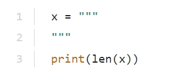

<label class="pcap-option"><input type="checkbox" value="A"> A. 0</label>
<label class="pcap-option"><input type="checkbox" value="B"> B. 2</label>
<label class="pcap-option"><input type="checkbox" value="C"> C. 1</label>
<label class="pcap-option"><input type="checkbox" value="D"> D. The code is erroneous.</label>
<button type="button" class="pcap-check">Antwort prüfen</button>

Lösung und Erklärung

**Answer: C.**

Explanation

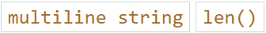

Topics:

<!-- page_130 -->

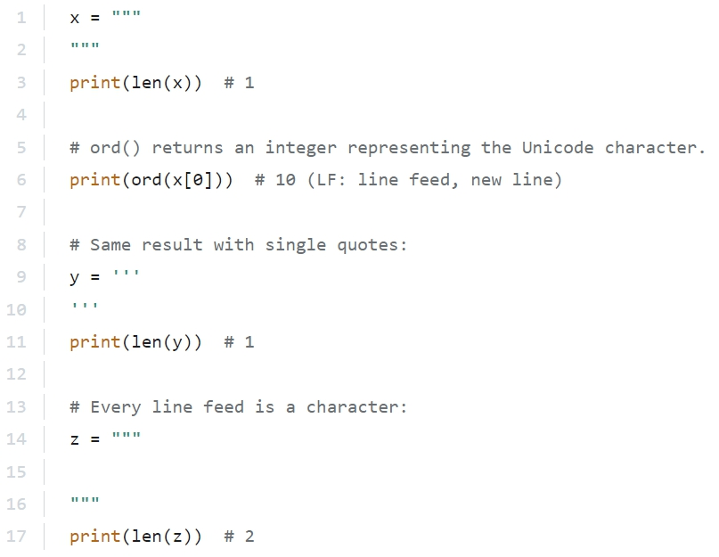

In a multiline string the line feed gets saved like any other character.

## Question 2

What is the expected output of the following code?

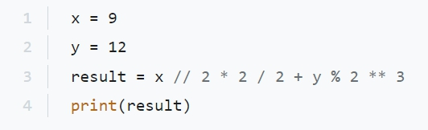

<label class="pcap-option"><input type="checkbox" value="A"> A. 7.0</label>
<label class="pcap-option"><input type="checkbox" value="B"> B. 9.0</label>
<label class="pcap-option"><input type="checkbox" value="C"> C. 8</label>
<label class="pcap-option"><input type="checkbox" value="D"> D. 8.0</label>
<button type="button" class="pcap-check">Antwort prüfen</button>

Lösung und Erklärung

**Answer: D.**

<!-- page_131 -->

Explanation

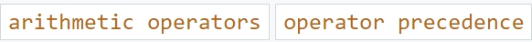

Topics:

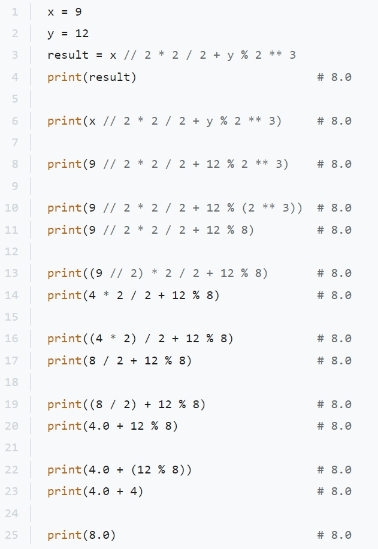

<!-- page_132 -->

The operators here are from three different groups: "Exponent" has the highest precedence. Followed by "Multiplication, Division, Floor division, Modulus". "Addition, Subtraction" has the lowest precedence.

Therefore the order of operations here is: ** -> // -> * -> / -> % -> +

## Question 3

What is the expected output of the following code?

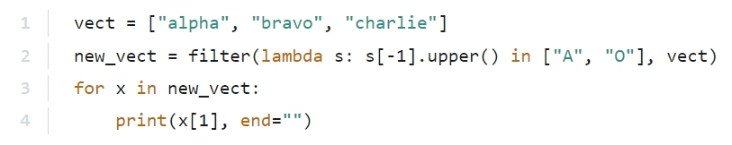

<label class="pcap-option"><input type="checkbox" value="A"> A. 1 | LR</label>
<label class="pcap-option"><input type="checkbox" value="B"> B. 1 | RH</label>
<label class="pcap-option"><input type="checkbox" value="C"> C. 1 | 1r</label>
<label class="pcap-option"><input type="checkbox" value="D"> D. 1 | rh</label>
<button type="button" class="pcap-check">Antwort prüfen</button>

Lösung und Erklärung

**Answer: C.**

Explanation

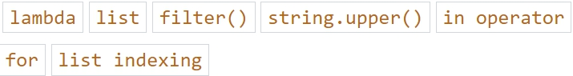

Topics:

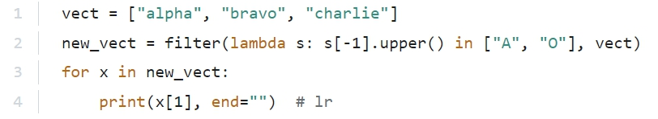

The filter() function returns an iterator were the items are filtered through a function to test if the item is accepted or not.

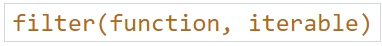

<!-- page_133 -->

https://www.w3schools.com/python/ref_func_filter.asp

The lambda function will return True if the last character of its passed string is an "A" or an "O"

Otherwise it will return False. Therefore "alpha" and "bravo" end up in new_vect

At index 1 of "alpha" is "l" and at index 1 of "bravo" is "r". Therefore "lr" is printed.

## Question 4

You know that a function named func() resides in a module named mod

The module has been imported using the following line:

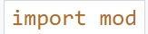

How can you invoke the function?

<label class="pcap-option"><input type="checkbox" value="A"> A. mod::func()</label>
<label class="pcap-option"><input type="checkbox" value="B"> B. func()</label>
<label class="pcap-option"><input type="checkbox" value="C"> C. mod.func()</label>
<label class="pcap-option"><input type="checkbox" value="D"> D. mod-.func()</label>
<button type="button" class="pcap-check">Antwort prüfen</button>

Lösung und Erklärung

**Answer: C.**

Explanation

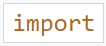

Topic:

<!-- page_134 -->

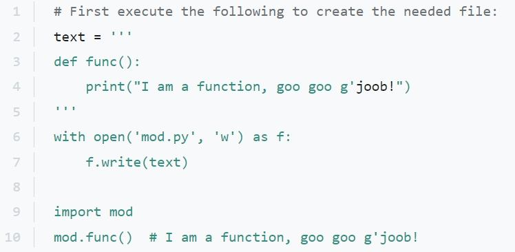

If you import the whole module you have to add the entity by dot notation.

## Question 5

Assuming that the following code has been executed successfully, indicate the expressions which evaluate to True and don't raise any exceptions.

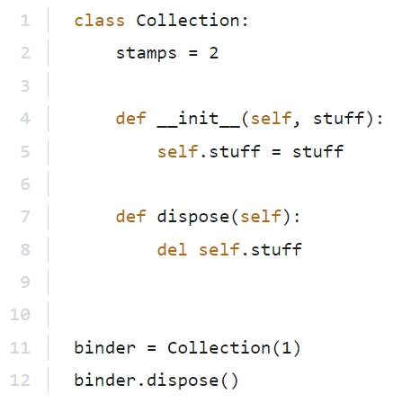

<!-- page_135 -->

(Select two answers.)

<label class="pcap-option"><input type="checkbox" value="A"> A. 1 | "stuff" in binder.__dict__</label>
<label class="pcap-option"><input type="checkbox" value="B"> B. 1 | len(binder.__dict__) != len(Collection.__dict__)</label>
<label class="pcap-option"><input type="checkbox" value="C"> C. 1 | "stamps" in Collection.__dict__</label>
<label class="pcap-option"><input type="checkbox" value="D"> D. 1 | len(binder.__dict__) &gt; 0</label>
<button type="button" class="pcap-check">Antwort prüfen</button>

Lösung und Erklärung

**Answer: B, C.**

Explanation

Topics:

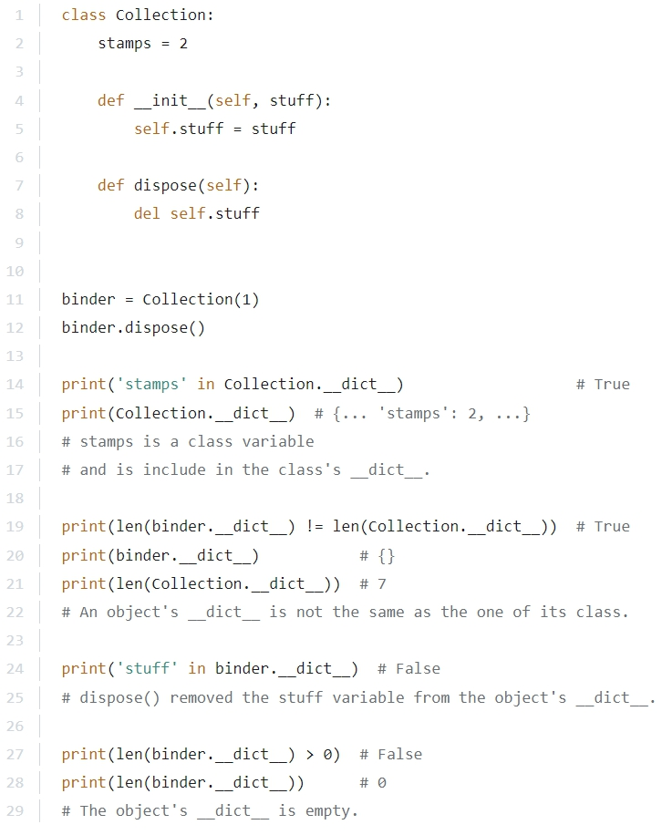

<!-- page_136 -->

## Question 6

What is the expected output of the following code?

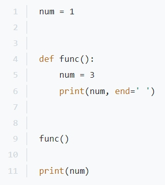

<label class="pcap-option"><input type="checkbox" value="A"> A. The code is erroneous.</label>
<label class="pcap-option"><input type="checkbox" value="B"> B. 3 1</label>
<label class="pcap-option"><input type="checkbox" value="C"> C. 1 3</label>
<label class="pcap-option"><input type="checkbox" value="D"> D. 1 1</label>
<label class="pcap-option"><input type="checkbox" value="E"> E. 3 3</label>
<button type="button" class="pcap-check">Antwort prüfen</button>

Lösung und Erklärung

**Answer: B.**

Explanation

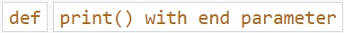

Topics: scope

<!-- page_137 -->

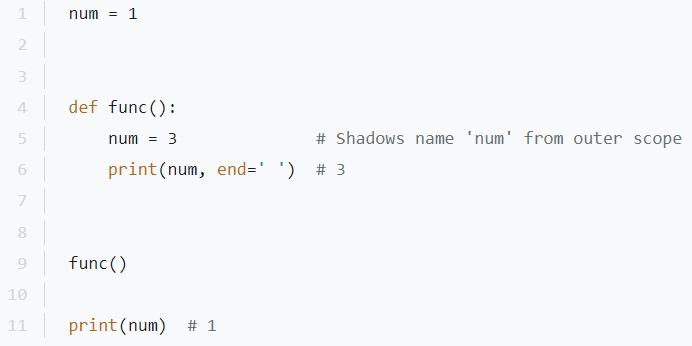

The num variable inside the function scope will be a different variable. It will shadow the name of the num variable from the outer scope, but it will be a different entity.

## Question 7

The following statement ...

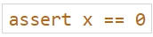

<label class="pcap-option"><input type="checkbox" value="A"> A. is erroneous.</label>
<label class="pcap-option"><input type="checkbox" value="B"> B. has no effect.</label>
<label class="pcap-option"><input type="checkbox" value="C"> C. will stop the program if x is equal to O</label>
<label class="pcap-option"><input type="checkbox" value="D"> D. will stop the program if xis not equal to O</label>
<button type="button" class="pcap-check">Antwort prüfen</button>

Lösung und Erklärung

**Answer: D.**

Explanation

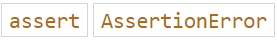

Topic:

<!-- page_138 -->

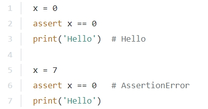

If the assertion (here x == 0) is True, the program will continue. Otherwise an AssertionError occurs.

## Question 8

Which of the following statements are true?

(Select two answers.)

<label class="pcap-option"><input type="checkbox" value="A"> A. The print() function writes its output to the stdout stream.</label>
<label class="pcap-option"><input type="checkbox" value="B"> B. The open() function returns False when its operation fails.</label>
<label class="pcap-option"><input type="checkbox" value="C"> C. Stdin, stdout, stderr are names of pre-opened streams.</label>
<label class="pcap-option"><input type="checkbox" value="D"> D. The second argument of the open() function is an integer value.</label>
<button type="button" class="pcap-check">Antwort prüfen</button>

Lösung und Erklärung

**Answer: A, C.**

Explanation

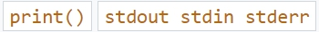

Topics:

● stdin, stdout, stderr are names of pre-opened streams.

● stdout and stderr are associated with the console.

● stdin is associated with the keyboard.

https://en.wikipedia.org/wiki/Standard_streams

## Question 9

What is the expected output of the following code?

<!-- page_139 -->

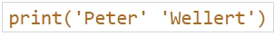

<label class="pcap-option"><input type="checkbox" value="A"> A. The code is erroneous.</label>
<label class="pcap-option"><input type="checkbox" value="B"> B. Peter</label>
<label class="pcap-option"><input type="checkbox" value="C"> C. PeterWellert</label>
<label class="pcap-option"><input type="checkbox" value="D"> D. Wellert</label>
<button type="button" class="pcap-check">Antwort prüfen</button>

Lösung und Erklärung

**Answer: C.**

Explanation

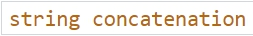

Topic:

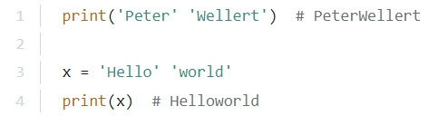

String literals that are delimited by whitespace are automatically concatenated.

## Question 10

Which of the following functions immediately terminates a program?

<label class="pcap-option"><input type="checkbox" value="A"> A. sys.terminate()</label>
<label class="pcap-option"><input type="checkbox" value="B"> B. sys.exit()</label>
<label class="pcap-option"><input type="checkbox" value="C"> C. sys.halt()</label>
<label class="pcap-option"><input type="checkbox" value="D"> D. None</label>
<label class="pcap-option"><input type="checkbox" value="E"> E. sys.stop()</label>
<button type="button" class="pcap-check">Antwort prüfen</button>

Lösung und Erklärung

**Answer: B.**

Explanation

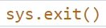

Topic:

<!-- page_140 -->

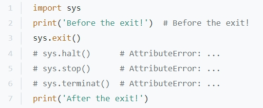

The method in Python to immediately terminate a program is sys.exit()

The others methods do not exist.

## Question 11

What is the expected output of the following code?

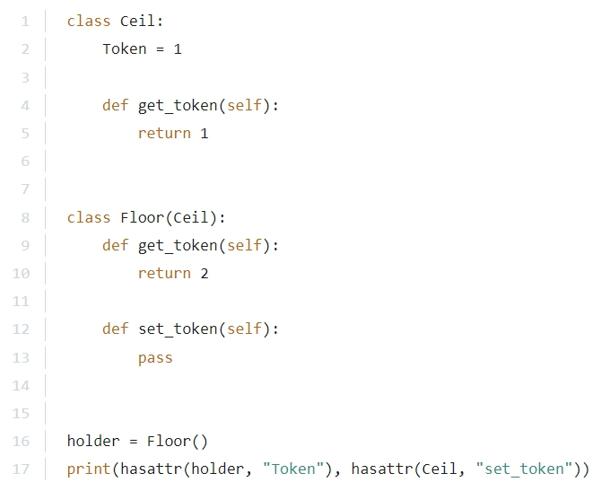

<!-- page_141 -->

<label class="pcap-option"><input type="checkbox" value="A"> A. 1 | False True</label>
<label class="pcap-option"><input type="checkbox" value="B"> B. 1 | True False</label>
<label class="pcap-option"><input type="checkbox" value="C"> C. 1 | False False</label>
<label class="pcap-option"><input type="checkbox" value="D"> D. 1 | True True</label>
<button type="button" class="pcap-check">Antwort prüfen</button>

Lösung und Erklärung

**Answer: B.**

Explanation

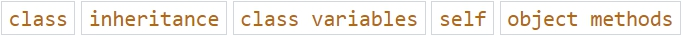

Topics:

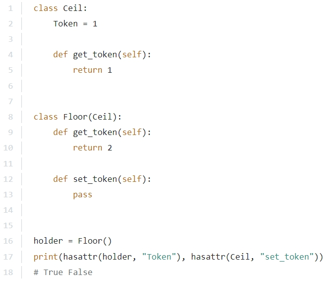

Yes, the holder object has the Token attribute because it is derived from its superclass.

No, The Ceil class doesn't have the set_token() method of its subclass.

## Question 12

What is the expected output of the following code:

<!-- page_142 -->

if there is no file named non_existing_file in the working directory/folder, and the open() function invocation is successful?

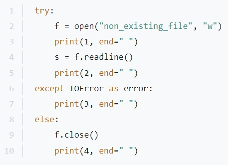

<label class="pcap-option"><input type="checkbox" value="A"> A. 1 | 1 2 4</label>
<label class="pcap-option"><input type="checkbox" value="B"> B. 1 | 1 2 3 4</label>
<label class="pcap-option"><input type="checkbox" value="C"> C. 1 | 2 4</label>
<label class="pcap-option"><input type="checkbox" value="D"> D. 1 | 1 3</label>
<button type="button" class="pcap-check">Antwort prüfen</button>

Lösung und Erklärung

**Answer: D.**

Explanation

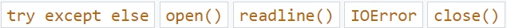

Topics:

<!-- page_143 -->

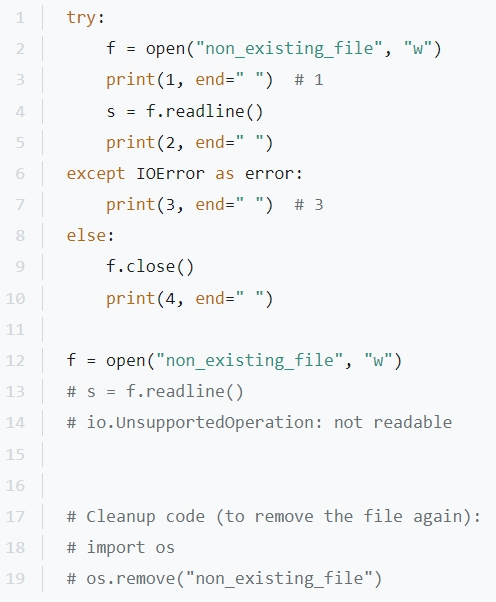

The file is only opened in write mode. Then 1 is printed. If you try to read from that file you get an IOError

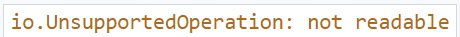

Therefore the except branch is executed and 3 is printed.

## Question 13

What is the expected output of the following code?

<!-- page_144 -->

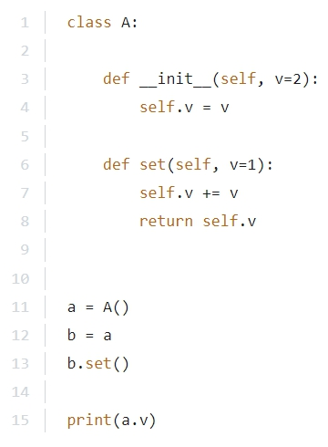

<label class="pcap-option"><input type="checkbox" value="A"> A. 3</label>
<label class="pcap-option"><input type="checkbox" value="B"> B. 0</label>
<label class="pcap-option"><input type="checkbox" value="C"> C. 1</label>
<label class="pcap-option"><input type="checkbox" value="D"> D. 2</label>
<button type="button" class="pcap-check">Antwort prüfen</button>

Lösung und Erklärung

**Answer: A.**

Explanation

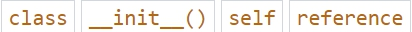

Topics:

<!-- page_145 -->

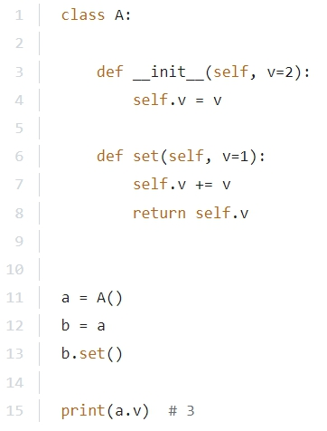

The constructor will initialize a.v with the default value 2

An object is a mutable data type. Assigning it will create a reference to the same object.

b.set() will increment b.v to 3 and because it is a reference a.v is also changed to 3

## Question 14

A code point is:

<label class="pcap-option"><input type="checkbox" value="A"> A. A number which makes up a character.</label>
<label class="pcap-option"><input type="checkbox" value="B"> B. A code containing a point.</label>
<label class="pcap-option"><input type="checkbox" value="C"> C. A point used to write a code.</label>
<label class="pcap-option"><input type="checkbox" value="D"> D. None of the above.</label>
<button type="button" class="pcap-check">Antwort prüfen</button>

Lösung und Erklärung

**Answer: A.**

Explanation

Topic:

<!-- page_146 -->

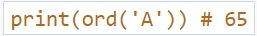

For example in ASCII the number 65 makes up the character A

https://en.wikipedia.org/wiki/Code_point

## Question 15

The part of your code where the handling of an exception takes place should be placed inside:

<label class="pcap-option"><input type="checkbox" value="A"> A. the except: branch</label>
<label class="pcap-option"><input type="checkbox" value="B"> B. the exception: branch</label>
<label class="pcap-option"><input type="checkbox" value="C"> C. the try: branch</label>
<label class="pcap-option"><input type="checkbox" value="D"> D. None of the above</label>
<button type="button" class="pcap-check">Antwort prüfen</button>

Lösung und Erklärung

**Answer: A.**

Explanation

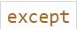

Topic:

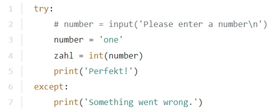

It is about exceptions, but the branch is called except:

## Question 16

Consider the following code.

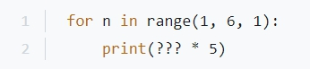

<!-- page_147 -->

What would you insert instead of ???

so that the program prints the following pattern to the monitor?

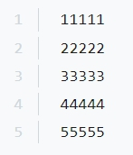

<label class="pcap-option"><input type="checkbox" value="A"> A. 1</label>
<label class="pcap-option"><input type="checkbox" value="B"> B. 2</label>
<label class="pcap-option"><input type="checkbox" value="C"> C. n</label>
<label class="pcap-option"><input type="checkbox" value="D"> D. str(n)</label>
<label class="pcap-option"><input type="checkbox" value="E"> E. -1</label>
<button type="button" class="pcap-check">Antwort prüfen</button>

Lösung und Erklärung

**Answer: D.**

Explanation

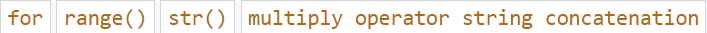

Topics:

<!-- page_148 -->

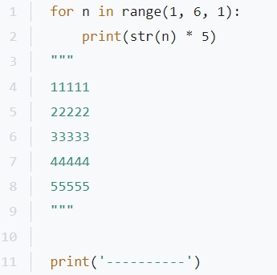

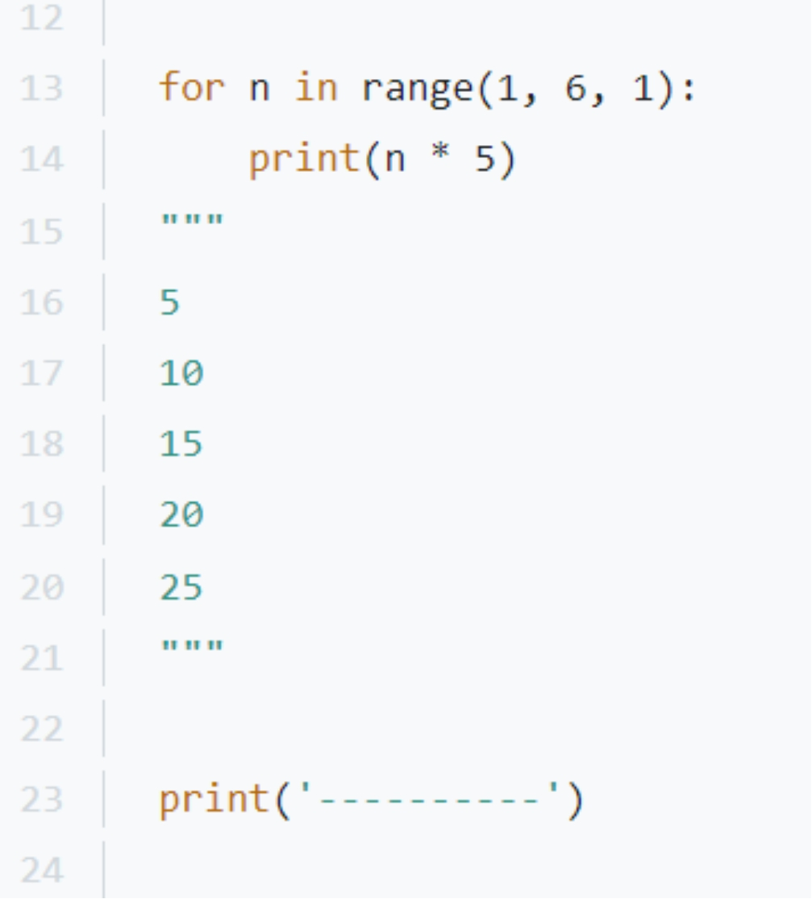

<!-- page_149 -->

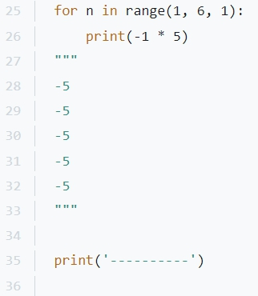

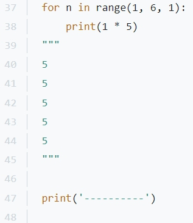

<!-- page_150 -->

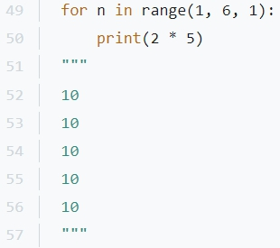

range(1, 6, 1) delivers the right numbers 1, 2, 3, 4, 5. (It would also works without step 1, because that's the default value.)

You need the str() function here to get more numbers. Otherwise a calculation takes place and you end up with one number per row. By string concatenation you get the right result:

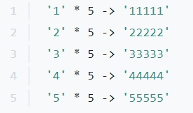

## Question 17

Which of the following function calls can be used to invoke the below function definition?

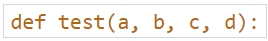

Choose three.

<!-- page_151 -->

<label class="pcap-option"><input type="checkbox" value="A"> A. test(1, 2, 3, 4)</label>
<label class="pcap-option"><input type="checkbox" value="B"> B. test(1, 2, 3, d=4)</label>
<label class="pcap-option"><input type="checkbox" value="C"> C. test(a=1, b=2, c=3, 4)</label>
<label class="pcap-option"><input type="checkbox" value="D"> D. test(a=1, b=2, c=3, d=4)</label>
<label class="pcap-option"><input type="checkbox" value="E"> E. test(a=1, 2, 3, 4)</label>
<button type="button" class="pcap-check">Antwort prüfen</button>

Lösung und Erklärung

**Answer: A, B, D.**

Explanation

Topics:

The keyword arguments always have to be at the end.

## Question 18

If the class’s constructor is declared as below, which one of the assignments is valid?

<!-- page_152 -->

<label class="pcap-option"><input type="checkbox" value="A"> A. Object = Class(object)</label>
<label class="pcap-option"><input type="checkbox" value="B"> B. object = Class()</label>
<label class="pcap-option"><input type="checkbox" value="C"> C. object = Class(self)</label>
<label class="pcap-option"><input type="checkbox" value="D"> D. object = Class</label>
<button type="button" class="pcap-check">Antwort prüfen</button>

Lösung und Erklärung

**Answer: B.**

Explanation

Topics:

It needs to be Class()

Class without parentheses does not raise an exception, but you do not assign an object of Class

Instead you would create a reference.

## Question 19

What is the expected output of the following code?

<!-- page_153 -->

<label class="pcap-option"><input type="checkbox" value="A"> A. 0</label>
<label class="pcap-option"><input type="checkbox" value="B"> B. The code is erroneous.</label>
<label class="pcap-option"><input type="checkbox" value="C"> C. 1</label>
<label class="pcap-option"><input type="checkbox" value="D"> D. 2</label>
<button type="button" class="pcap-check">Antwort prüfen</button>

Lösung und Erklärung

**Answer: B.**

Explanation

Topics:

range(2) has two elements: 0 and 1

Therefore the outer list will have two elements. And data[2] does not exist.

## Question 20

Which of the following variable names is illegal?

<label class="pcap-option"><input type="checkbox" value="A"> A. true</label>
<label class="pcap-option"><input type="checkbox" value="B"> B. TRUE</label>
<label class="pcap-option"><input type="checkbox" value="C"> C. True</label>
<label class="pcap-option"><input type="checkbox" value="D"> D. true</label>
<button type="button" class="pcap-check">Antwort prüfen</button>

Lösung und Erklärung

**Answer: C.**

Explanation

Topic:

<!-- page_154 -->

You can not name a variable like a Python keyword.

## Question 21

How many stars will the following code print to the monitor?

<label class="pcap-option"><input type="checkbox" value="A"> A. one</label>
<label class="pcap-option"><input type="checkbox" value="B"> B. two</label>
<label class="pcap-option"><input type="checkbox" value="C"> C. four</label>
<label class="pcap-option"><input type="checkbox" value="D"> D. eight</label>
<button type="button" class="pcap-check">Antwort prüfen</button>

Lösung und Erklärung

**Answer: C.**

Explanation

Topics:

<!-- page_155 -->

Left shift by one, a classic way to double values. Every value goes to the bit on its left and thereby doubles in value. And 1, 2, 4, 8 are all smaller than 10 but not the 16 and therefore four stars will be printed.

## Question 22

The += operator, when applied to strings, performs:

<label class="pcap-option"><input type="checkbox" value="A"> A. Concatenation</label>
<label class="pcap-option"><input type="checkbox" value="B"> B. Multiplication</label>
<label class="pcap-option"><input type="checkbox" value="C"> C. Subtraction</label>
<label class="pcap-option"><input type="checkbox" value="D"> D. None of the above.</label>
<button type="button" class="pcap-check">Antwort prüfen</button>

Lösung und Erklärung

**Answer: A.**

Explanation

Topic:

<!-- page_156 -->

The add and assign operator when applied to strings, performs a string concatenation.

Just like the addition operator

## Question 23

Consider the following code.

Which of the following statements best describes the behavior of the random.shuffle() method?

<label class="pcap-option"><input type="checkbox" value="A"> A. It shuffles the elements of the list in-place.</label>
<label class="pcap-option"><input type="checkbox" value="B"> B. It will not modify the list. This function is just a placeholder and yet to be implemented.</label>
<label class="pcap-option"><input type="checkbox" value="C"> C. It returns a list where the elements 10, 20, and 30 would be at random positions.</label>
<label class="pcap-option"><input type="checkbox" value="D"> D. It shuffles the elements for the number of times equal to the size of the list.</label>
<button type="button" class="pcap-check">Antwort prüfen</button>

Lösung und Erklärung

**Answer: A.**

Explanation

Topics:

The original list gets shuffled in-place. The return value is None

## Question 24

What is the expected output of the following code?

<label class="pcap-option"><input type="checkbox" value="A"> A. 4</label>
<label class="pcap-option"><input type="checkbox" value="B"> B. 4.0</label>
<label class="pcap-option"><input type="checkbox" value="C"> C. 3</label>
<label class="pcap-option"><input type="checkbox" value="D"> D. 3.5</label>
<button type="button" class="pcap-check">Antwort prüfen</button>

Lösung und Erklärung

**Answer: D.**

Explanation

Topics:

<!-- page_158 -->

The operators here are from two different groups:

The group "Multiplication, Division, Floor division, Modulus" has a higher precedence than the group "Addition, Subtraction".

Therefore the order of operations here is: // -> / -> + -> + -> +

## Question 25

Is there a way to check if a class is a subclass of another class?

<label class="pcap-option"><input type="checkbox" value="A"> A. Yes, there is a function that can do that.</label>
<label class="pcap-option"><input type="checkbox" value="B"> B. No.</label>
<label class="pcap-option"><input type="checkbox" value="C"> C. It may be possible, but only under special conditions.</label>
<label class="pcap-option"><input type="checkbox" value="D"> D. None of the above.</label>
<button type="button" class="pcap-check">Antwort prüfen</button>

Lösung und Erklärung

**Answer: A.**

Explanation

<!-- page_159 -->

Topic:

And the name of the function is issubclass()

## Question 26

What is the expected output of the following code?

<label class="pcap-option"><input type="checkbox" value="A"> A. abcdef</label>
<label class="pcap-option"><input type="checkbox" value="B"> B. An empty line.</label>
<label class="pcap-option"><input type="checkbox" value="C"> C. ace</label>
<label class="pcap-option"><input type="checkbox" value="D"> D. bdf</label>
<button type="button" class="pcap-check">Antwort prüfen</button>

Lösung und Erklärung

**Answer: C.**

<!-- page_160 -->

Explanation

Topics:

The generator function will return every second element of the passed data.

## Question 27

Which of the following is false?

<label class="pcap-option"><input type="checkbox" value="A"> A. A try statement can have one or more except clauses.</label>
<label class="pcap-option"><input type="checkbox" value="B"> B. A try statement can have a finally clause and an except clause.</label>
<label class="pcap-option"><input type="checkbox" value="C"> C. A try statement can have one or more final clauses.</label>
<label class="pcap-option"><input type="checkbox" value="D"> D. A try statement can have a final clause without an except clause.</label>
<button type="button" class="pcap-check">Antwort prüfen</button>

Lösung und Erklärung

**Answer: C.**

Explanation

Topics:

<!-- page_161 -->

<!-- page_162 -->

● Yes, a try statement can have one or more except clauses.

● Yes, a try statement can have a finally clause and an except clause.

● Yes, a try statement can have a finally clause without an except clause.

● But NO, a try statement can NOT have more finally clauses.

## Question 28

What is the expected output of the following code?

<!-- page_163 -->

<label class="pcap-option"><input type="checkbox" value="A"> A. 1 | spin default</label>
<label class="pcap-option"><input type="checkbox" value="B"> B. 1 | spin spin</label>
<label class="pcap-option"><input type="checkbox" value="C"> C. 1 | default default</label>
<label class="pcap-option"><input type="checkbox" value="D"> D. 1 | default spin</label>
<button type="button" class="pcap-check">Antwort prüfen</button>

Lösung und Erklärung

**Answer: D.**

Explanation

Topics:

<!-- page_164 -->

The FixedWing class doesn't have its own start() method and therefore the start() method of its superclass Aircraft is executed and default is returned and printed.

The RotorCraft class on the other hand does have its own start() method which overrides the start() method of its superclass Aircraft and therefore in the second iteration spin is returned and printed.

## Question 29

What is the expected output of the following code?

<!-- page_165 -->

<label class="pcap-option"><input type="checkbox" value="A"> A. I'm gonna make him an offer he can't refuse.</label>
<label class="pcap-option"><input type="checkbox" value="B"> B. The code is erroneous.</label>
<label class="pcap-option"><input type="checkbox" value="C"> C. ["I'm", 'gonna', 'make', 'him', 'an', 'offer', 'he', "can't", 'refuse.']</label>
<label class="pcap-option"><input type="checkbox" value="D"> D. I</label>
<button type="button" class="pcap-check">Antwort prüfen</button>

Lösung und Erklärung

**Answer: C.**

Explanation

Topics:

<!-- page_166 -->

The method readlines() always returns a list. In this case there is only one line in the file and readlines() returns a list with one element.

Therefore the for loop only has one iteration. The one element is a string.

The split() method with no argument passed will split the string at its whitespaces and return a list of the parts. At the end this list gets printed.

Actually the for loop is superfluous. The following would have sufficed:

## Question 30

Select the true statements. Choose two.

<label class="pcap-option"><input type="checkbox" value="A"> A. The lambda function can evaluate multiple expressions.</label>
<label class="pcap-option"><input type="checkbox" value="B"> B. The lambda function can evaluate only one expression.</label>
<label class="pcap-option"><input type="checkbox" value="C"> C. The lambda function can accept a maximum of two arguments.</label>
<label class="pcap-option"><input type="checkbox" value="D"> D. The lambda function can accept any number of arguments.</label>
<button type="button" class="pcap-check">Antwort prüfen</button>

Lösung und Erklärung

**Answer: B, D.**

Explanation

Topic:

"Lambda functions can have any number of arguments but only one expression. The expression is evaluated and returned. Lambda functions can be used wherever function objects are required."

<!-- page_167 -->

https://www.programiz.com/python-programming/anonymous-function#how

## Question 31

How many stars will the following code print to the monitor?

<label class="pcap-option"><input type="checkbox" value="A"> A. one</label>
<label class="pcap-option"><input type="checkbox" value="B"> B. zero</label>
<label class="pcap-option"><input type="checkbox" value="C"> C. two</label>
<label class="pcap-option"><input type="checkbox" value="D"> D. The snippet will enter an infinite loop.</label>
<button type="button" class="pcap-check">Antwort prüfen</button>

Lösung und Erklärung

**Answer: D.**

Explanation

Topics:

<!-- page_168 -->

i gets incremented inside the while loop, BUT i will always be smaller than i + 2

Therefore the whole condition will always be True and we build ourselves a nice infinite loop.

## Question 32

Consider the following code.

The value eventually assigned to x is equal to:

<label class="pcap-option"><input type="checkbox" value="A"> A. False</label>
<label class="pcap-option"><input type="checkbox" value="B"> B. 1</label>
<label class="pcap-option"><input type="checkbox" value="C"> C. True</label>
<label class="pcap-option"><input type="checkbox" value="D"> D. 0</label>
<button type="button" class="pcap-check">Antwort prüfen</button>

Lösung und Erklärung

**Answer: C.**

Explanation

Topic:

x has the value 1

x gets compared with the equal to operator with itself.

It is true, that x is equal to x

True gets stored in the same variable, in x

<!-- page_169 -->

## Question 33

Which program will produce the following output:

<label class="pcap-option"><input type="checkbox" value="A"> A. 1 | import calendar 2 | print(calendar.week)</label>
<label class="pcap-option"><input type="checkbox" value="B"> B. 1 | import calendar 2 | print(calendar.weekheader(3))</label>
<label class="pcap-option"><input type="checkbox" value="C"> C. 1 | import calendar 2 | print(calendar.weekheader())</label>
<label class="pcap-option"><input type="checkbox" value="D"> D. 1 | import calendar 2 | print(calendar.weekheader(2))</label>
<button type="button" class="pcap-check">Antwort prüfen</button>

Lösung und Erklärung

**Answer: D.**

Explanation

Topics:

The argument has to be 2 because you want two letters per day of the week.

https://www.includehelp.com/python/calendar-weekheader-method-with-example.aspx

<!-- page_170 -->

## Question 34

What is the expected output of the following code?

<label class="pcap-option"><input type="checkbox" value="A"> A. 1,3</label>
<label class="pcap-option"><input type="checkbox" value="B"> B. 1.3</label>
<label class="pcap-option"><input type="checkbox" value="C"> C. The code is erroneous.</label>
<label class="pcap-option"><input type="checkbox" value="D"> D. 13</label>
<button type="button" class="pcap-check">Antwort prüfen</button>

Lösung und Erklärung

**Answer: B.**

Explanation

Topic:

The function float() does its normal job here and converts the string to a float.

## Question 35

What is the expected output of the following code?

<label class="pcap-option"><input type="checkbox" value="A"> A. abdef</label>
<label class="pcap-option"><input type="checkbox" value="B"> B. The code is erroneous.</label>
<label class="pcap-option"><input type="checkbox" value="C"> C. abcef</label>
<label class="pcap-option"><input type="checkbox" value="D"> D. acdef</label>
<button type="button" class="pcap-check">Antwort prüfen</button>

Lösung und Erklärung

**Answer: B.**

Explanation

Topics:

A string is immutable. You can not change it. You can read something by indexing, BUT you can not write something by indexing.

## Question 36

What is true about object-oriented programming (OOP)? (Select two answers.)

<!-- page_172 -->

<label class="pcap-option"><input type="checkbox" value="A"> A. A class is like a blueprint used to construct objects.</label>
<label class="pcap-option"><input type="checkbox" value="B"> B. A class may exist without its objects, while objects cannot exist without their class.</label>
<label class="pcap-option"><input type="checkbox" value="C"> C. A relation between superclass and its subclass is known as fraternity.</label>
<label class="pcap-option"><input type="checkbox" value="D"> D. Polymorphism is a phenomenon which allows you to have many classes of the same name.</label>
<button type="button" class="pcap-check">Antwort prüfen</button>

Lösung und Erklärung

**Answer: A, B.**

Explanation

Topics:

Yes, a class is like a blueprint used to construct objects.

Yes, a class may exist without its objects, while objects cannot exist without their class.

A relation between a superclass and its subclass is known as inheritance. Polymorphism is the use of a single symbol to represent different types.

https://en.wikipedia.org/wiki/Polymorphism_(computer_science)

https://www.geeksforgeeks.org/polymorphism-in-python/

## Question 37

What value will be assigned to the x variable?

<!-- page_173 -->

<label class="pcap-option"><input type="checkbox" value="A"> A. 1</label>
<label class="pcap-option"><input type="checkbox" value="B"> B. 0</label>
<label class="pcap-option"><input type="checkbox" value="C"> C. true</label>
<label class="pcap-option"><input type="checkbox" value="D"> D. False</label>
<button type="button" class="pcap-check">Antwort prüfen</button>

Lösung und Erklärung

**Answer: D.**

Explanation

Topics:

The operators here are from three different groups.

"Comparisons, Identity, Membership operators", "Logical AND", "Logical OR".

The three different comparison operators

have the highest precedence.

<!-- page_174 -->

Then the logical `and` operator has a higher precedence than the logical `or` operator.

## Question 38

What is the expected output of the following code?

<label class="pcap-option"><input type="checkbox" value="A"> A. Hello Python</label>
<label class="pcap-option"><input type="checkbox" value="B"> B. AttributeError: 'Test' object has no attribute 's'</label>
<label class="pcap-option"><input type="checkbox" value="C"> C. NameError: name 's' is not defined</label>
<label class="pcap-option"><input type="checkbox" value="D"> D. TypeError: Test() takes no arguments</label>
<button type="button" class="pcap-check">Antwort prüfen</button>

Lösung und Erklärung

**Answer: C.**

Explanation

Topics:

<!-- page_175 -->

s is a local variable inside of the method Test.print()

What you want here is self.s

## Question 39

What is the expected output of the following code?

<label class="pcap-option"><input type="checkbox" value="A"> A. 1 | 4</label>
<label class="pcap-option"><input type="checkbox" value="B"> B. 1 | e</label>
<label class="pcap-option"><input type="checkbox" value="C"> C. 1 | 2</label>
<label class="pcap-option"><input type="checkbox" value="D"> D. 1 | ;</label>
<button type="button" class="pcap-check">Antwort prüfen</button>

Lösung und Erklärung

**Answer: A.**

Explanation

Topics:

<!-- page_176 -->

The split() method will return a list like: ['John', 'Doe', '42'] and the join() method will turn it to a string again but without the commas.

The second last element will be 4

## Question 40

What is the expected output of the following code?

<label class="pcap-option"><input type="checkbox" value="A"> A. 1 | 2</label>
<label class="pcap-option"><input type="checkbox" value="B"> B. 1 | 0</label>
<label class="pcap-option"><input type="checkbox" value="C"> C. 1 | 4</label>
<label class="pcap-option"><input type="checkbox" value="D"> D. The code is erroneous and cannot be run.</label>
<button type="button" class="pcap-check">Antwort prüfen</button>

Lösung und Erklärung

**Answer: D.**

Explanation

Topics:

<!-- page_177 -->

plane + 2 will not work.

In Python you cannot add an integer to a string.

## Question 41

Which of the following expressions evaluates to True and raises no exception? (Select two answers.)

<label class="pcap-option"><input type="checkbox" value="A"> A. " " in " alphabet"</label>
<label class="pcap-option"><input type="checkbox" value="B"> B. "xyz" not in "uvwxyz"</label>
<label class="pcap-option"><input type="checkbox" value="C"> C. " " not in " "</label>
<label class="pcap-option"><input type="checkbox" value="D"> D. "b" in "abc "</label>
<button type="button" class="pcap-check">Antwort prüfen</button>

Lösung und Erklärung

**Answer: A, D.**

Explanation

Topics:

<!-- page_178 -->

## Question 42

What is the expected output of the following code?

<label class="pcap-option"><input type="checkbox" value="A"> A. 1 | 3</label>
<label class="pcap-option"><input type="checkbox" value="B"> B. 1 | -3</label>
<label class="pcap-option"><input type="checkbox" value="C"> C. 1 | -2</label>
<label class="pcap-option"><input type="checkbox" value="D"> D. 1 | 2</label>
<button type="button" class="pcap-check">Antwort prüfen</button>

Lösung und Erklärung

**Answer: B.**

Explanation

Topics:

<!-- page_179 -->

The math.floor() method rounds a number DOWN to the nearest integer.

https://www.w3schools.com/python/ref_math_floor.asp

The math.ceil() method rounds a number UP to the nearest integer

https://www.w3schools.com/python/ref_math_ceil.asp

The abs() function returns the absolute value of a given number.

https://www.w3schools.com/python/ref_func_abs.asp

## Question 43

What is the expected output of the following code?

<!-- page_180 -->

<label class="pcap-option"><input type="checkbox" value="A"> A. 2</label>
<label class="pcap-option"><input type="checkbox" value="B"> B. The code is erroneous.</label>
<label class="pcap-option"><input type="checkbox" value="C"> C. 3</label>
<label class="pcap-option"><input type="checkbox" value="D"> D. 1</label>
<button type="button" class="pcap-check">Antwort prüfen</button>

Lösung und Erklärung

**Answer: C.**

Explanation

Topics:

<!-- page_181 -->

Peter is a different index than peter because P is a different character than p and therefore the dictionary will have three entries.

## Question 44

Which of the following is an example of a Python built-in concrete exception?

<label class="pcap-option"><input type="checkbox" value="A"> A. ArithmeticError</label>
<label class="pcap-option"><input type="checkbox" value="B"> B. IndexError</label>
<label class="pcap-option"><input type="checkbox" value="C"> C. ImportError</label>
<label class="pcap-option"><input type="checkbox" value="D"> D. BaseException</label>
<button type="button" class="pcap-check">Antwort prüfen</button>

Lösung und Erklärung

**Answer: B.**

Explanation

Topics:

<!-- page_182 -->

IndexError is the only built-in concrete exception here. In the meaning that you can get an error message saying: IndexError ...

Since Python 3.6 the ImportError has the subclass ModuleNotFoundError and ImportError is not a Python built-in concrete exception anymore.

ArithmeticError is also not a built-in concrete exception. For example, you would get a ZeroDivisionError

BaseException is the base class for all built-in exceptions, which makes it the opposite of a built-in concrete exception.

https://docs.python.org/3/library/exceptions.html#exception-hierarchy

## Question 45

What can you do to indicate that a module entity should be treated as private? Choose two.

<!-- page_183 -->

<label class="pcap-option"><input type="checkbox" value="A"> A. You can mark the entity with the _ (single underscore) prefix.</label>
<label class="pcap-option"><input type="checkbox" value="B"> B. You can mark the entity with the __ (double underscore) prefix.</label>
<label class="pcap-option"><input type="checkbox" value="C"> C. You can mark the entity with the # (hashtag) prefix.</label>
<label class="pcap-option"><input type="checkbox" value="D"> D. Nothing - all module entities are private by default.</label>
<button type="button" class="pcap-check">Antwort prüfen</button>

Lösung und Erklärung

**Answer: A, B.**

Explanation

Topics:

<!-- page_184 -->

If you use a private entity you need a getter and setter to deal with the entity. Using a single underscore you can still access the entity from outside the class, but a good IDE like PyCharm would already complain about it:

"Access to protected member _a of a class"

Using a double underscore you can not just access the entity from outside the class.

## Question 46

How many stars will the following snippet print to the monitor?

<!-- page_185 -->

<label class="pcap-option"><input type="checkbox" value="A"> A. zero</label>
<label class="pcap-option"><input type="checkbox" value="B"> B. one</label>
<label class="pcap-option"><input type="checkbox" value="C"> C. two</label>
<label class="pcap-option"><input type="checkbox" value="D"> D. three</label>
<button type="button" class="pcap-check">Antwort prüfen</button>

Lösung und Erklärung

**Answer: B.**

Explanation

Topics:

i % 2 == 0 is known as test for even numbers.

In the first iteration i is an odd 1 and therefore the break does not get triggered and a star gets printed. In the second iteration i is an even 2 the break gets triggered and there is no more stars.

## Question 47

What is the expected output of the following code?

<!-- page_186 -->

<label class="pcap-option"><input type="checkbox" value="A"> A. ['.', 'large', 'medium', 'small']</label>
<label class="pcap-option"><input type="checkbox" value="B"> B. ['large', 'medium', 'small']</label>
<label class="pcap-option"><input type="checkbox" value="C"> C. ['.', '..', 'large', 'small']</label>
<label class="pcap-option"><input type="checkbox" value="D"> D. []</label>
<button type="button" class="pcap-check">Antwort prüfen</button>

Lösung und Erklärung

**Answer: B.**

Explanation

Topics:

<!-- page_187 -->

This is pretty straight forward. You make the directory thumbnails you change into it, you make the three directories small medium large and then you list them.

But you need the knowledge, that listdir() never includes the special entries . and ..

https://www.tutorialspoint.com/python/os_listdir.htm

## Question 48

Complete the sentence. UTF‑8 is ...

<label class="pcap-option"><input type="checkbox" value="A"> A. a Python version name.</label>
<label class="pcap-option"><input type="checkbox" value="B"> B. a synonym for "byte"</label>
<label class="pcap-option"><input type="checkbox" value="C"> C. the 9th version of the UTF Standard.</label>
<label class="pcap-option"><input type="checkbox" value="D"> D. an encoding form of the Unicode Standard.</label>
<button type="button" class="pcap-check">Antwort prüfen</button>

Lösung und Erklärung

**Answer: D.**

Explanation

<!-- page_188 -->

Topic:

UTF-8 is one of three encoding forms of the Unicode Standard. The others are UTF-16 and UTF-32. UTF-8 is the most popular one, because it is the most flexible. UTF-8 requires 8, 16, 24 or 32 bits (one to four bytes) to encode a Unicode character, UTF-16 requires either 16 or 32 bits to encode a character, and UTF-32 always requires 32 bits to encode a character.

## Question 49

Select the true statements about the filter() function. Choose two.

<label class="pcap-option"><input type="checkbox" value="A"> A. The filter function returns an iterator.</label>
<label class="pcap-option"><input type="checkbox" value="B"> B. The filter() function has the following syntax: filter(function, iterable)</label>
<label class="pcap-option"><input type="checkbox" value="C"> C. The filter() function does not return an iterator.</label>
<label class="pcap-option"><input type="checkbox" value="D"> D. The filter() function has the following syntax: filter(iterable, function)</label>
<button type="button" class="pcap-check">Antwort prüfen</button>

Lösung und Erklärung

**Answer: A, B.**

Explanation

Topic:

<!-- page_189 -->

The filter() function returns a filter object, which is an iterator. The for loop can iterate through it, it has the attribute __iter__ and is an instance of collections.abc.Iterable

That is more than enough proof. And the order of the arguments has to be: first the function and second an iterable.

https://www.programiz.com/python-programming/methods/built-in/filter

## Question 50

Which of the following statements is false?

<label class="pcap-option"><input type="checkbox" value="A"> A. Multiplication precedes addition.</label>
<label class="pcap-option"><input type="checkbox" value="B"> B. The ** operator has right-to-left associativity.</label>
<label class="pcap-option"><input type="checkbox" value="C"> C. The result of the / operator is always an integer value.</label>
<label class="pcap-option"><input type="checkbox" value="D"> D. The right argument of the % operator can not be zero.</label>
<button type="button" class="pcap-check">Antwort prüfen</button>

Lösung und Erklärung

**Answer: C.**

<!-- page_190 -->

Explanation

Topic:

As written above, the result of the division operator is always a float value. Even if it operates with two integer values.

## Question 51

What is the expected output of the following code?

<label class="pcap-option"><input type="checkbox" value="A"> A. 2</label>
<label class="pcap-option"><input type="checkbox" value="B"> B. 4</label>
<label class="pcap-option"><input type="checkbox" value="C"> C. 3</label>
<label class="pcap-option"><input type="checkbox" value="D"> D. 5</label>
<button type="button" class="pcap-check">Antwort prüfen</button>

Lösung und Erklärung

**Answer: A.**

Explanation

Topics:

Remember to bring your best reading glasses to the exam. The second parameter will determine where the count() method will start its counting.

The first parameter (in this case ab) is what count() will look for.

count() will start at index 1 and therefore it will not find the ab right at the beginning of the string. That leaves two more ab to find.

## Question 52

What is the expected output of the following code?

<label class="pcap-option"><input type="checkbox" value="A"> A. The code is erroneous.</label>
<label class="pcap-option"><input type="checkbox" value="B"> B. 4</label>
<label class="pcap-option"><input type="checkbox" value="C"> C. 1</label>
<label class="pcap-option"><input type="checkbox" value="D"> D. 2</label>
<button type="button" class="pcap-check">Antwort prüfen</button>

Lösung und Erklärung

**Answer: D.**

Explanation

Topics:

<!-- page_192 -->

The backslash is the character to escape another character. If you write '\' the backslash escapes the ending single quote to a normal character.

It takes its syntactical meaning and the single quote becomes a normal character and it looses its ability to end the string. And therefore we get the syntax error.

If you write '\\' the one backslash escapes the other and you end up with a string with one normal backslash. If you write '\\\\' it is kind of the same and you end up with a string with two normal backslashes.

## Question 53

What is the expected output of the following code?

<label class="pcap-option"><input type="checkbox" value="A"> A. 1 | False</label>
<label class="pcap-option"><input type="checkbox" value="B"> B. 1 | None</label>
<label class="pcap-option"><input type="checkbox" value="C"> C. 1 | True</label>
<label class="pcap-option"><input type="checkbox" value="D"> D. 1 | 0</label>
<button type="button" class="pcap-check">Antwort prüfen</button>

Lösung und Erklärung

**Answer: C.**

Explanation

<!-- page_193 -->

Topics:

The lambda function will return the Boolean conjunction of its argument and True

The f() function will invoke it and pass its second parameter as an argument. 1 > 0 is True will be the argument which is passed to the lambda function.

True and True is True and therefore True is returned by the lambda function and then by the f() function and finally printed.

## Question 54

Which of the following statements is false?

<label class="pcap-option"><input type="checkbox" value="A"> A. The None value may not be used outside functions.</label>
<label class="pcap-option"><input type="checkbox" value="B"> B. The None value can not be used as an argument of arithmetic operators.</label>
<label class="pcap-option"><input type="checkbox" value="C"> C. The None value can be compared with variables.</label>
<label class="pcap-option"><input type="checkbox" value="D"> D. The None value can be assigned to variables.</label>
<button type="button" class="pcap-check">Antwort prüfen</button>

Lösung und Erklärung

**Answer: A.**

Explanation

Topic:

<!-- page_194 -->

It is true that the None value can not be used as an argument of arithmetic operators.

But the None value can be assigned and compared to variables. And that can absolutely happen outside of a function.

## Question 55

Which of the following function headers is correct?

<label class="pcap-option"><input type="checkbox" value="A"> A. def func(a=1, b, c=2):</label>
<label class="pcap-option"><input type="checkbox" value="B"> B. def func(a =1, b=1, c=2, d):</label>
<label class="pcap-option"><input type="checkbox" value="C"> C. def func(a=1, b):</label>
<label class="pcap-option"><input type="checkbox" value="D"> D. def func(a=1, b=1, c=2):</label>
<button type="button" class="pcap-check">Antwort prüfen</button>

Lösung und Erklärung

**Answer: D.**

Explanation

Topics:

<!-- page_195 -->

The default argument(s) have to be at the end.

## Question 56

What is the expected output of the following code?

<label class="pcap-option"><input type="checkbox" value="A"> A. 1 | Hello 2 | WelcomeWelcomeWelcome</label>
<label class="pcap-option"><input type="checkbox" value="B"> B. 1 | Hello 2 | Welcome Welcome Welcome</label>
<label class="pcap-option"><input type="checkbox" value="C"> C. 1 | Hello 2 | Viewers</label>
<label class="pcap-option"><input type="checkbox" value="D"> D. 1 | Hello 2 | Welcome, Welcome, Welcome</label>
<button type="button" class="pcap-check">Antwort prüfen</button>

Lösung und Erklärung

**Answer: A.**

Explanation

Topics:

In the function a string concatenation by multiplication takes place.

Once with the default value of num (1) and once with the one passed by argument (3)

## Question 57

What is the expected output of the following code?

<!-- page_197 -->

<label class="pcap-option"><input type="checkbox" value="A"> A. counter is 101, number of times is 101</label>
<label class="pcap-option"><input type="checkbox" value="B"> B. counter is 100, number of times is 100</label>
<label class="pcap-option"><input type="checkbox" value="C"> C. counter is 100, number of times is 0</label>
<label class="pcap-option"><input type="checkbox" value="D"> D. counter is 101, number of times is 0</label>
<button type="button" class="pcap-check">Antwort prüfen</button>

Lösung und Erklärung

**Answer: C.**

Explanation

Topics:

<!-- page_198 -->

This question is about argument passing. It is a big difference, whether you pass a mutable or an immutable data type. When you pass the immutable integer, it gets copied to the parameter num

The changes of num do not influence the variable number

On the other hand when you pass the mutable object, it gets referenced to to parameter c

c and counter point to the same object. You change one and the other is changed, too.

## Question 58

Which of the following sentences correctly describes the output of the below Python code?

<!-- page_199 -->

<label class="pcap-option"><input type="checkbox" value="A"> A. res is the average of all the numbers in the list</label>
<label class="pcap-option"><input type="checkbox" value="B"> B. res is the smallest number in the list.</label>
<label class="pcap-option"><input type="checkbox" value="C"> C. res is the largest number in the list.</label>
<label class="pcap-option"><input type="checkbox" value="D"> D. res is the sum of all the numbers in the list</label>
<label class="pcap-option"><input type="checkbox" value="E"> E. None of the above.</label>
<button type="button" class="pcap-check">Antwort prüfen</button>

Lösung und Erklärung

**Answer: B.**

Explanation

Topics:

Classic way to find the smallest number. Take the first element as a possible result. Compare the next number with the possible result.

<!-- page_200 -->

If the next number is smaller, it becomes the new possible result and so forth. In the end the result is the smallest number.

## Question 59

What is the expected output of the following code?

<label class="pcap-option"><input type="checkbox" value="A"> A. 4</label>
<label class="pcap-option"><input type="checkbox" value="B"> B. 1</label>
<label class="pcap-option"><input type="checkbox" value="C"> C. 0</label>
<label class="pcap-option"><input type="checkbox" value="D"> D. 10</label>
<label class="pcap-option"><input type="checkbox" value="E"> E. 3</label>
<label class="pcap-option"><input type="checkbox" value="F"> F. 2</label>
<button type="button" class="pcap-check">Antwort prüfen</button>

Lösung und Erklärung

**Answer: A.**

Explanation

Topics:

A set can not have duplicates.

## Question 60

If you want to import pi from math, which line will you use?

<!-- page_201 -->

<label class="pcap-option"><input type="checkbox" value="A"> A. from pi import math</label>
<label class="pcap-option"><input type="checkbox" value="B"> B. from math import pi</label>
<label class="pcap-option"><input type="checkbox" value="C"> C. import pi from math</label>
<label class="pcap-option"><input type="checkbox" value="D"> D. import pi</label>
<button type="button" class="pcap-check">Antwort prüfen</button>

Lösung und Erklärung

**Answer: B.**

Explanation

Topics:

The order is from big to small.

First the module than the variable: From the math module import the variable pi.

## Question 61

Consider the following code.

Which of the assignments below is invalid?

<label class="pcap-option"><input type="checkbox" value="A"> A. obj = Test(1)</label>
<label class="pcap-option"><input type="checkbox" value="B"> B. obj = Test("1")</label>
<label class="pcap-option"><input type="checkbox" value="C"> C. obj = Test(1,2)</label>
<label class="pcap-option"><input type="checkbox" value="D"> D. obj = Test()</label>
<button type="button" class="pcap-check">Antwort prüfen</button>

Lösung und Erklärung

**Answer: C.**

Explanation

Topics:

<!-- page_202 -->

In Python the first parameter of a method is the object reference. Technically it could have any name, but you should always call it self

That only leaves the parameter x to receive an argument.

x has a default value. Therefore you can pass one argument or none at all.

## Question 62

Given the code below, which of the expressions will evaluate to True?

<!-- page_203 -->

(Select two answers.)

<label class="pcap-option"><input type="checkbox" value="A"> A. 1 | selection is element</label>
<label class="pcap-option"><input type="checkbox" value="B"> B. 1 | selection.my_ID == 2</label>
<label class="pcap-option"><input type="checkbox" value="C"> C. 1 | start.myID == -2</label>
<label class="pcap-option"><input type="checkbox" value="D"> D. 1 | isinstance(start, Button)</label>
<button type="button" class="pcap-check">Antwort prüfen</button>

Lösung und Erklärung

**Answer: B, D.**

Explanation

Topics:

<!-- page_204 -->

## Question 63

What is the expected output of the following code?

<!-- page_205 -->

<label class="pcap-option"><input type="checkbox" value="A"> A. False True</label>
<label class="pcap-option"><input type="checkbox" value="B"> B. True True</label>
<label class="pcap-option"><input type="checkbox" value="C"> C. False False</label>
<label class="pcap-option"><input type="checkbox" value="D"> D. True False</label>
<button type="button" class="pcap-check">Antwort prüfen</button>

Lösung und Erklärung

**Answer: D.**

Explanation

Topics:

Nothing changes here. The variables always get assigned the value they had before.

## Question 64

What is the expected output of the following code?

<!-- page_206 -->

<label class="pcap-option"><input type="checkbox" value="A"> A. 1 5 9 13</label>
<label class="pcap-option"><input type="checkbox" value="B"> B. 4 8 12 16</label>
<label class="pcap-option"><input type="checkbox" value="C"> C. 13 14 15 16</label>
<label class="pcap-option"><input type="checkbox" value="D"> D. 1 2 3 4</label>
<button type="button" class="pcap-check">Antwort prüfen</button>

Lösung und Erklärung

**Answer: B.**

Explanation

Topics:

<!-- page_207 -->

data is a two dimensional list. In every iteration of the for loop,

pop() removes the last element of the corresponding inner list. That last element gets printed. The default value of the print() functions end parameter is the line feed. That gets overwritten here by a single space character.

## Question 65

What is the expected output of the following code?

<!-- page_208 -->

<label class="pcap-option"><input type="checkbox" value="A"> A. False</label>
<label class="pcap-option"><input type="checkbox" value="B"> B. 0</label>
<label class="pcap-option"><input type="checkbox" value="C"> C. True</label>
<label class="pcap-option"><input type="checkbox" value="D"> D. The code is erroneous.</label>
<button type="button" class="pcap-check">Antwort prüfen</button>

Lösung und Erklärung

**Answer: C.**

Explanation

Topics:

The function hasattr() checks whether an object has the given object variable. It also works with a class and a class variable

## Question 66

What is the expected output of the following code?

<!-- page_209 -->

<label class="pcap-option"><input type="checkbox" value="A"> A. 2</label>
<label class="pcap-option"><input type="checkbox" value="B"> B. True</label>
<label class="pcap-option"><input type="checkbox" value="C"> C. False</label>
<label class="pcap-option"><input type="checkbox" value="D"> D. 1</label>
<button type="button" class="pcap-check">Antwort prüfen</button>

Lösung und Erklärung

**Answer: B.**

Explanation

Topics:

<!-- page_210 -->

This question is about operator overloading.

__eq__() overloads the equal to operator if used with objects of the class A

If you use the equal to operator with two object of the class A

the __eq__() method is called and the two objects are passed to it. The return value is going to be the result of the comparison. And because 1 * 2 == 2 * 1 the result is True

## Question 67

What is the expected result of the following code?

<!-- page_211 -->

<label class="pcap-option"><input type="checkbox" value="A"> A. b</label>
<label class="pcap-option"><input type="checkbox" value="B"> B. a</label>
<label class="pcap-option"><input type="checkbox" value="C"> C. The code will cause a syntax error.</label>
<label class="pcap-option"><input type="checkbox" value="D"> D. 1</label>
<button type="button" class="pcap-check">Antwort prüfen</button>

Lösung und Erklärung

**Answer: C.**

Explanation

Topics:

<!-- page_212 -->

As the error message claims: default 'except:' must be last

## Question 68

What is the expected behavior of the following program?

<!-- page_213 -->

<label class="pcap-option"><input type="checkbox" value="A"> A. The program will output 1 to the screen.</label>
<label class="pcap-option"><input type="checkbox" value="B"> B. The program will cause a AttributeEror exception.</label>
<label class="pcap-option"><input type="checkbox" value="C"> C. The program will cause a ValueError exception.</label>
<label class="pcap-option"><input type="checkbox" value="D"> D. The program will cause a SyntaxError exception.</label>
<label class="pcap-option"><input type="checkbox" value="E"> E. The program will cause a TypeError exception.</label>
<button type="button" class="pcap-check">Antwort prüfen</button>

Lösung und Erklärung

**Answer: C.**

Explanation

Topics:

The tuple.index() method expects a value and looks for that value in the tuple. It will return the index of the first value it finds. If it does not find the value, it raises a ValueError

https://www.w3schools.com/python/ref_tuple_index.asp

## Question 69

A list of package's dependencies can be obtained from pip using its command named:

<label class="pcap-option"><input type="checkbox" value="A"> A. list</label>
<label class="pcap-option"><input type="checkbox" value="B"> B. dir</label>
<label class="pcap-option"><input type="checkbox" value="C"> C. show</label>
<label class="pcap-option"><input type="checkbox" value="D"> D. deps</label>
<button type="button" class="pcap-check">Antwort prüfen</button>

Lösung und Erklärung

**Answer: C.**

Explanation

Topic:

With pip list you get a list with all your installed packages. Choose one of your packages and enter pip show package-name

Under Requires: you find a list of the package's dependencies.

<!-- page_214 -->

## Question 70

A programmer needs to use the following functions:

Which modules have to be imported to make this possible? (Select two answers.)

<label class="pcap-option"><input type="checkbox" value="A"> A. 1 | math</label>
<label class="pcap-option"><input type="checkbox" value="B"> B. 1 | random</label>
<label class="pcap-option"><input type="checkbox" value="C"> C. 1 | tkinter</label>
<label class="pcap-option"><input type="checkbox" value="D"> D. 1 | platform</label>
<button type="button" class="pcap-check">Antwort prüfen</button>

Lösung und Erklärung

**Answer: B, D.**

Explanation

Topics:

Explanation:

https://www.w3schools.com/python/ref_random_choice.asp

https://docs.python.org/3/library/platform.html#platform.machine

https://docs.python.org/3/library/platform.html#platform.system

## Question 71

PyPI is often referred to as:

<!-- page_215 -->

<label class="pcap-option"><input type="checkbox" value="A"> A. Python Play</label>
<label class="pcap-option"><input type="checkbox" value="B"> B. Py Software Store</label>
<label class="pcap-option"><input type="checkbox" value="C"> C. pyTT</label>
<label class="pcap-option"><input type="checkbox" value="D"> D. Cheese Shop</label>
<button type="button" class="pcap-check">Antwort prüfen</button>

Lösung und Erklärung

**Answer: D.**

Explanation

Topic:

https://en.wikipedia.org/wiki/Python_Package_Index

## Question 72

What is the expected output of the following code?

<label class="pcap-option"><input type="checkbox" value="A"> A. z</label>
<label class="pcap-option"><input type="checkbox" value="B"> B. a</label>
<label class="pcap-option"><input type="checkbox" value="C"> C. x</label>
<label class="pcap-option"><input type="checkbox" value="D"> D. y</label>
<button type="button" class="pcap-check">Antwort prüfen</button>

Lösung und Erklärung

**Answer: C.**

Explanation

Topics:

ord() returns an integer representing the Unicode character.

chr() turns that integer back to the Unicode character. You don't need to remember the number of every character, but like in the alphabet x is two before z

## Question 73

What is the expected output of the following code?

<!-- page_216 -->

<label class="pcap-option"><input type="checkbox" value="A"> A. 1 | finally 2 | except</label>
<label class="pcap-option"><input type="checkbox" value="B"> B. 1 | finally 2 | try</label>
<label class="pcap-option"><input type="checkbox" value="C"> C. 1 | except 2 | finally</label>
<label class="pcap-option"><input type="checkbox" value="D"> D. 1 | try 2 | finally</label>
<button type="button" class="pcap-check">Antwort prüfen</button>

Lösung und Erklärung

**Answer: D.**

Explanation

Topic:

The snippet will try to execute print('try') and succeed. The finally block always gets executed.

<!-- page_217 -->

## Question 74

What is the expected output of the following code?

<label class="pcap-option"><input type="checkbox" value="A"> A. 0 0</label>
<label class="pcap-option"><input type="checkbox" value="B"> B. 0 1</label>
<label class="pcap-option"><input type="checkbox" value="C"> C. 1 0</label>
<label class="pcap-option"><input type="checkbox" value="D"> D. The code is erroneous.</label>
<button type="button" class="pcap-check">Antwort prüfen</button>

Lösung und Erklärung

**Answer: D.**

Explanation

Topics:

This question is a little tricky. Everything seems to be fine, BUT the right name of the dictionary method is values()

## Question 75

What is the expected output of the following code?

<!-- page_218 -->

<label class="pcap-option"><input type="checkbox" value="A"> A. None</label>
<label class="pcap-option"><input type="checkbox" value="B"> B. The code is erroneous.</label>
<label class="pcap-option"><input type="checkbox" value="C"> C. Value</label>
<label class="pcap-option"><input type="checkbox" value="D"> D. 1</label>
<label class="pcap-option"><input type="checkbox" value="E"> E. Peter</label>
<button type="button" class="pcap-check">Antwort prüfen</button>

Lösung und Erklärung

**Answer: A.**

Explanation

Topics:

func() has no return statement. Therefore None gets returned.

## Question 76

What is the expected output of the following code?

<!-- page_219 -->

<label class="pcap-option"><input type="checkbox" value="A"> A. 2 3 4 5 6 6</label>
<label class="pcap-option"><input type="checkbox" value="B"> B. 2 3 4 5 6 1</label>
<label class="pcap-option"><input type="checkbox" value="C"> C. 1 2 3 4 5 6</label>
<label class="pcap-option"><input type="checkbox" value="D"> D. 1 1 2 3 4 5</label>
<button type="button" class="pcap-check">Antwort prüfen</button>

Lösung und Erklärung

**Answer: A.**

Explanation

Topics:

In the first for loop, the five last values of data get written to the first five indexes of data

The value of the last index stays the same.

range(1, 6) will produce the numbers 1, 2, 3, 4, 5

<!-- page_220 -->

And because the first of these number is 1 we need the data[i -1] to start at index 0

The old value at index 1 is 2. That gets written at index 0 and so forth ...

## Question 77

Given the code below, complete the print() method body in a way that will ensure that the get() method is properly invoked.

(Select two answers.)

<label class="pcap-option"><input type="checkbox" value="A"> A. 1 | print(get())</label>
<label class="pcap-option"><input type="checkbox" value="B"> B. 1 | print(Storage.get())</label>
<label class="pcap-option"><input type="checkbox" value="C"> C. 1 | print(self.get())</label>
<label class="pcap-option"><input type="checkbox" value="D"> D. 1 | print(Storage.get(self))</label>
<button type="button" class="pcap-check">Antwort prüfen</button>

Lösung und Erklärung

**Answer: C, D.**

Explanation

Topics:

<!-- page_221 -->

You can always invoke the method with the object reference self in front. If you invoke the same method at class level you have to pass the object reference self as an argument.

## Question 78

What is the expected output of the following code if the user enters 11 and 4 ?

<label class="pcap-option"><input type="checkbox" value="A"> A. 3</label>
<label class="pcap-option"><input type="checkbox" value="B"> B. 1</label>
<label class="pcap-option"><input type="checkbox" value="C"> C. 2</label>
<label class="pcap-option"><input type="checkbox" value="D"> D. 4</label>
<button type="button" class="pcap-check">Antwort prüfen</button>

Lösung und Erklärung

**Answer: B.**

Explanation

Topics:

input() returns strings, but the int() function casts them to integers. Then you have to concentrate with all the modulus operators.

## Question 79

What is the expected output of the following code?

<label class="pcap-option"><input type="checkbox" value="A"> A. 2</label>
<label class="pcap-option"><input type="checkbox" value="B"> B. 3</label>
<label class="pcap-option"><input type="checkbox" value="C"> C. 1</label>
<label class="pcap-option"><input type="checkbox" value="D"> D. The code is erroneous.</label>
<button type="button" class="pcap-check">Antwort prüfen</button>

Lösung und Erklärung

**Answer: B.**

<!-- page_223 -->

Explanation

Topics:

If you raise an Exception you can pass a list of arguments. They will be assigned as a tuple to the args attribute of the Exception object.

## Question 80

How many elements does the my_list list contain?

<label class="pcap-option"><input type="checkbox" value="A"> A. three</label>
<label class="pcap-option"><input type="checkbox" value="B"> B. one</label>
<label class="pcap-option"><input type="checkbox" value="C"> C. two</label>
<label class="pcap-option"><input type="checkbox" value="D"> D. None of the above.</label>
<button type="button" class="pcap-check">Antwort prüfen</button>

Lösung und Erklärung

**Answer: C.**

Explanation

Topic:

<!-- page_224 -->

range(1, 3) will be 1 & 2 and therefore the for loop will iterate twice. Both times 0 will be appended to the list.

## Question 81

You develop a Python application for your company. A list named employees contains 200 employee names, the last five being company management. You need to slice the list to display all employees excluding management. Which code segments can you use? Choose two.

<label class="pcap-option"><input type="checkbox" value="A"> A. Employees[ 1:-5 ]</label>
<label class="pcap-option"><input type="checkbox" value="B"> B. Employees[ : -5 ]</label>
<label class="pcap-option"><input type="checkbox" value="C"> C. Employees[0:-5]</label>
<label class="pcap-option"><input type="checkbox" value="D"> D. Employees[0:-4 ]</label>
<label class="pcap-option"><input type="checkbox" value="E"> E. Employees[1:-4 ]</label>
<button type="button" class="pcap-check">Antwort prüfen</button>

Lösung und Erklärung

**Answer: B, C.**

Explanation

Topic:

<!-- page_225 -->

List slicing: [start(inclusive):end(exclusive)]

The default value for the start is 0. Meaning you can write it or leave it out. The negative index counts from the end. The end is exclusive.

-1 cuts out one element.

-5 cuts out five elements.

And that is what you need here for the five managers.

## Question 82

Which of the following statements are true? (Select two answers.)

<!-- page_226 -->

<label class="pcap-option"><input type="checkbox" value="A"> A. The open() function raises an exception when its operation fails.</label>
<label class="pcap-option"><input type="checkbox" value="B"> B. Trying to write a file opened in read-only mode removes its contents.</label>
<label class="pcap-option"><input type="checkbox" value="C"> C. Read, write, and delete are the names of file open modes.</label>
<label class="pcap-option"><input type="checkbox" value="D"> D. The second argument of the open() function is a string.</label>
<button type="button" class="pcap-check">Antwort prüfen</button>

Lösung und Erklärung

**Answer: A, D.**

Explanation

Topics:

Yes, the second argument of the open() function is a string, the open mode.

● Yes, the open() function raises a FileNotFoundError when its operation fails.

● No, trying to write a file opened in read-only mode will not remove its contents. It will produced an error:

<!-- page_227 -->

● No, read, write, and delete are not the names of file open modes. delete is not. read, write, append and create are open modes.

https://www.programiz.com/python-programming/methods/built-in/open

## Question 83

What is the expected output of the following code?

<label class="pcap-option"><input type="checkbox" value="A"> A. 0.0</label>
<label class="pcap-option"><input type="checkbox" value="B"> B. 0.16666666666666666</label>
<label class="pcap-option"><input type="checkbox" value="C"> C. 4.5</label>
<label class="pcap-option"><input type="checkbox" value="D"> D. 0</label>
<button type="button" class="pcap-check">Antwort prüfen</button>

Lösung und Erklärung

**Answer: D.**

Explanation

Topics:

There are only operators from the group "Multiplication, Division, Floor division, Modulus".

The group has a left-to-right associativity, meaning the left one gets evaluated first.

Therefore the order of operations here is: // -> *

## Question 84

<!-- page_228 -->

What is the expected output of the following code?

<label class="pcap-option"><input type="checkbox" value="A"> A. 1 | -1</label>
<label class="pcap-option"><input type="checkbox" value="B"> B. An error message appears on the screen.</label>
<label class="pcap-option"><input type="checkbox" value="C"> C. 1 | -2</label>
<label class="pcap-option"><input type="checkbox" value="D"> D. 1 | -INF</label>
<button type="button" class="pcap-check">Antwort prüfen</button>

Lösung und Erklärung

**Answer: A.**

Explanation

Topics:

Dividing by 0.0 raises the ZeroDivisionError which is a subclass of ArithmeticError

Therefore the except branch is executed.

## Question 85

<!-- page_229 -->

Which of the following are not valid Python string literals? (Select two answers.)

<label class="pcap-option"><input type="checkbox" value="A"> A. 1 | "this is a quote: \""</label>
<label class="pcap-option"><input type="checkbox" value="B"> B. 1 | "\\"</label>
<label class="pcap-option"><input type="checkbox" value="C"> C. 1 | 'whether 'tis nobler in the mind to suffer'</label>
<label class="pcap-option"><input type="checkbox" value="D"> D. 1 | ''' To be, or not to be, 2 | that is the question"""</label>
<button type="button" class="pcap-check">Antwort prüfen</button>

Lösung und Erklärung

**Answer: C, D.**

Explanation

Topics:

<!-- page_230 -->

## Question 86

Consider the following code.

The code causes the import of …

<label class="pcap-option"><input type="checkbox" value="A"> A. entity y from module x from package z</label>
<label class="pcap-option"><input type="checkbox" value="B"> B. entity z from module y from package x</label>
<label class="pcap-option"><input type="checkbox" value="C"> C. entity x from module y from package z</label>
<label class="pcap-option"><input type="checkbox" value="D"> D. entity z from module x from package y</label>
<button type="button" class="pcap-check">Antwort prüfen</button>

Lösung und Erklärung

**Answer: B.**

Explanation

<!-- page_231 -->

Topics:

The order is from big to small:

from package.module import entity

## Question 87

How many stars will the following code send to the monitor?

<!-- page_232 -->

<label class="pcap-option"><input type="checkbox" value="A"> A. zero</label>
<label class="pcap-option"><input type="checkbox" value="B"> B. two</label>
<label class="pcap-option"><input type="checkbox" value="C"> C. one</label>
<label class="pcap-option"><input type="checkbox" value="D"> D. three</label>
<button type="button" class="pcap-check">Antwort prüfen</button>

Lösung und Erklärung

**Answer: D.**

Explanation

Topics:

When x is 2, 4 and 6 the if condition is True and the continue gets triggered. The iteration ends directly and the print() function doesn't get executed.

When x is 1, 3 and 5 the if condition is False, the continue does not get triggered and those three times the print() function gets executed. Therefore there will be three stars printed.

## Question 88

What is the expected result of the following code?

<!-- page_233 -->

<label class="pcap-option"><input type="checkbox" value="A"> A. 3</label>
<label class="pcap-option"><input type="checkbox" value="B"> B. bytearray(0, 0, 0)</label>
<label class="pcap-option"><input type="checkbox" value="C"> C. bytearray(b"\x00\x00\x00")</label>
<label class="pcap-option"><input type="checkbox" value="D"> D. bytearray(b"3")</label>
<button type="button" class="pcap-check">Antwort prüfen</button>

Lösung und Erklärung

**Answer: C.**

Explanation

Topic:

https://www.programiz.com/python-programming/methods/built-in/bytearray

## Question 89

Which of the following items are present in the function header?

<label class="pcap-option"><input type="checkbox" value="A"> A. return value</label>
<label class="pcap-option"><input type="checkbox" value="B"> B. function name and parameter list</label>
<label class="pcap-option"><input type="checkbox" value="C"> C. function name</label>
<label class="pcap-option"><input type="checkbox" value="D"> D. parameter list</label>
<button type="button" class="pcap-check">Antwort prüfen</button>

Lösung und Erklärung

**Answer: B.**

Explanation

Topics:

<!-- page_234 -->

In the function header is the keyword def the function name and the parameter list.

## Question 90

The errno.ENOENT symbol refers to an error described as:

<label class="pcap-option"><input type="checkbox" value="A"> A. No such file or directory</label>
<label class="pcap-option"><input type="checkbox" value="B"> B. Operation not permitted</label>
<label class="pcap-option"><input type="checkbox" value="C"> C. Permission denied</label>
<label class="pcap-option"><input type="checkbox" value="D"> D. No child processes</label>
<button type="button" class="pcap-check">Antwort prüfen</button>

Lösung und Erklärung

**Answer: A.**

Explanation

Topics:

https://docs.python.org/3/library/errno.html#errno.ENOENT

## Question 91

What is the expected output of the following code?

<!-- page_235 -->

<label class="pcap-option"><input type="checkbox" value="A"> A. 1</label>
<label class="pcap-option"><input type="checkbox" value="B"> B. This can not be evaluated.</label>
<label class="pcap-option"><input type="checkbox" value="C"> C. This can not be predicted.</label>
<label class="pcap-option"><input type="checkbox" value="D"> D. 1.0</label>
<button type="button" class="pcap-check">Antwort prüfen</button>

Lösung und Erklärung

**Answer: D.**

Explanation

Topic:

All you have to know here is, that the division operator always returns a float.

Even if it is operating with two integers.

## Question 92

Which of the following statements are true? (Select two answers.)

<label class="pcap-option"><input type="checkbox" value="A"> A. A source file named __init__.py is used to mark a directory/folder as containing a Python package, and to initiate the package.</label>
<label class="pcap-option"><input type="checkbox" value="B"> B. A programmer is obliged to manually create a directory/folder named __pycache__ inside every package.</label>
<label class="pcap-option"><input type="checkbox" value="C"> C. The variable named __name__ is a string containing the module name.</label>
<label class="pcap-option"><input type="checkbox" value="D"> D. The .phy extension marks files that contain Python semi-compiled byte-code.</label>
<button type="button" class="pcap-check">Antwort prüfen</button>

Lösung und Erklärung

**Answer: A, C.**

Explanation

Topics:

<!-- page_236 -->

The __name__ variable can be used to determine whether the code has been run standalone (when the variable contains "__main__") or whether it has been imported as a module (when it contains the module name).

https://www.geeksforgeeks.org/__name__-special-variable-python/ https://docs.python.org/3/library/__main__.html

A source file named __init__.py is used to mark a directory/folder as containing a Python package, and to initialize the package.

https://docs.python.org/3/tutorial/modules.html#packages

## Question 93

<!-- page_237 -->

The ABC Video company needs a way to determine the cost that a customer will pay for renting a DVD. The cost is dependent on the time of day the DVD is returned. However, there are also special rates on Thursdays and Sundays. The fee structure is shown in the following list:

The cost is $1.59 per night. If the DVD is returned after 8 PM, the customer will be charged an extra day. If the video is rented on a Sunday, the customer gets 30% off for as long as they keep the video. If the video is rented on a Thursday, the customer gets 50% off for as long as they keep the video.

You need to write code to meet the requirements.

What should you insert instead of XXX, YYY and ZZZ?

<label class="pcap-option"><input type="checkbox" value="A"> A. 1 | XXX -> == "n": 2 | YYY -> == "Sunday": 3 | ZZZ -> == "Thursday":</label>
<label class="pcap-option"><input type="checkbox" value="B"> B. 1 | XXX -> != "n": 2 | YYY -> is "Sunday": 3 | ZZZ -> is "Thursday":</label>
<label class="pcap-option"><input type="checkbox" value="C"> C. 1 | XXX -> == "y": 2 | YYY -> &gt;= "Sunday": 3 | ZZZ -> &gt;= "Thursday":</label>
<label class="pcap-option"><input type="checkbox" value="D"> D. 1 | XXX -> == "y": 2 | YYY -> == "Sunday": 3 | ZZZ -> == "Thursday":</label>
<label class="pcap-option"><input type="checkbox" value="E"> E. 1 | XXX -> == "n": 2 | YYY -> is "Sunday": 3 | ZZZ -> is "Thursday":</label>
<button type="button" class="pcap-check">Antwort prüfen</button>

Lösung und Erklärung

**Answer: A.**

Explanation

Topics:

<!-- page_239 -->

<!-- page_240 -->

At this company, to return a video on time means to return it before 8 PM. Otherwise one day is added to the amount of rented days. If you return your video on a Sunday you get 30% off.

Meaning you only pay 70%. And if you return your video on a Thursday, you pay only half (50%).

## Question 94

What is the expected output of the following snippet?

<label class="pcap-option"><input type="checkbox" value="A"> A. python</label>
<label class="pcap-option"><input type="checkbox" value="B"> B. P y t h o n</label>
<label class="pcap-option"><input type="checkbox" value="C"> C. The code is erroneous.</label>
<label class="pcap-option"><input type="checkbox" value="D"> D. P Y T H O N</label>
<label class="pcap-option"><input type="checkbox" value="E"> E. PYTHON</label>
<label class="pcap-option"><input type="checkbox" value="F"> F. Python</label>
<button type="button" class="pcap-check">Antwort prüfen</button>

Lösung und Erklärung

**Answer: A.**

Explanation

Topics:

<!-- page_241 -->

A string is immutable. You can not change it, even if you tried. Here it is not even tried otherwise the code would cause a TypeError

## Question 95

What is the expected output of the following code?

<label class="pcap-option"><input type="checkbox" value="A"> A. [ 4, 3, 2, 1 ]</label>
<label class="pcap-option"><input type="checkbox" value="B"> B. [4, 3, 2 ]</label>
<label class="pcap-option"><input type="checkbox" value="C"> C. The code is erroneous.</label>
<label class="pcap-option"><input type="checkbox" value="D"> D. [ 4, 3 ]</label>
<button type="button" class="pcap-check">Antwort prüfen</button>

Lösung und Erklärung

**Answer: B.**

Explanation

Topic:

List slicing:

The step is negative here. That makes the slice be build from right to left (start interchanges with end). The start is the index 3 (inclusive) and the end is index 0 (exclusive).

Therefore we will get index 3 index 2 and index 1 which are the numbers 4, 3, 2

## Question 96

What is the expected output of the following code?

<!-- page_242 -->

<label class="pcap-option"><input type="checkbox" value="A"> A. ['red\n', 'yellow\n', 'blue\n']</label>
<label class="pcap-option"><input type="checkbox" value="B"> B. redyellowblue</label>
<label class="pcap-option"><input type="checkbox" value="C"> C. 1 | red 2 | 3 | yellow 4 | 5 | blue</label>
<label class="pcap-option"><input type="checkbox" value="D"> D. The code is erroneous.</label>
<button type="button" class="pcap-check">Antwort prüfen</button>

Lösung und Erklärung

**Answer: D.**

Explanation

Topics:

<!-- page_243 -->

The file gets closed too early. All operations on the file need the be finished before you can close it.

