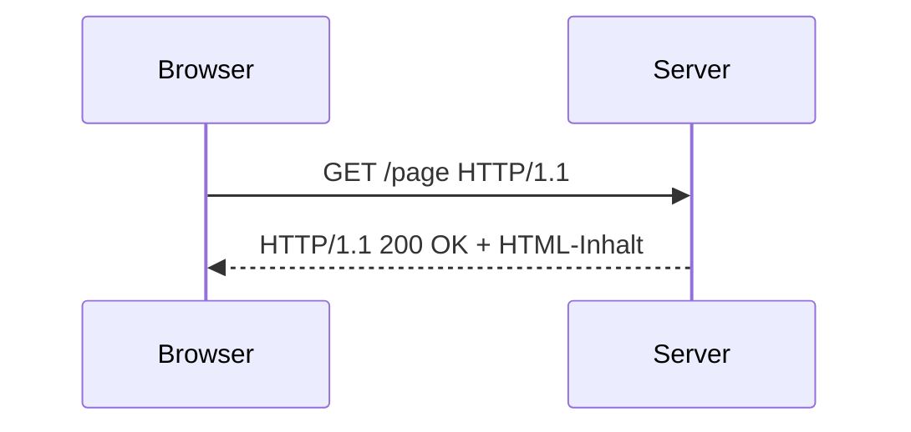

# HTTP & Requests

## Was ist HTTP?

**HTTP** (HyperText Transfer Protocol) ist das Protokoll, über das Webbrowser und Server kommunizieren. Wenn du eine Webseite im Browser öffnest, passiert im Hintergrund folgendes:



1. Dein Browser sendet eine **Anfrage (Request)** an den Server
2. Der Server antwortet mit einer **Antwort (Response)**, die den HTML-Inhalt und einen **Statuscode** enthält

### HTTP-Methoden

| Methode | Beschreibung | Beispiel |
|---------|-------------|----------|
| `GET` | Daten abrufen | Webseite laden |
| `POST` | Daten senden | Formular abschicken |
| `PUT` | Daten aktualisieren | Profil bearbeiten |
| `DELETE` | Daten löschen | Account löschen |

Für Web Scraping verwenden wir fast ausschließlich **GET-Requests**.

---

## HTTP-Statuscodes

Der Server antwortet mit einem **Statuscode**, der den Erfolg oder Misserfolg der Anfrage anzeigt:

| Code | Bedeutung | Beschreibung |
|------|-----------|-------------|
| `200` | OK | Anfrage erfolgreich |
| `301` | Moved Permanently | Seite wurde verschoben (Weiterleitung) |
| `403` | Forbidden | Zugriff verweigert |
| `404` | Not Found | Seite nicht gefunden |
| `429` | Too Many Requests | Zu viele Anfragen (Rate Limiting) |
| `500` | Internal Server Error | Serverfehler |

---

## Die `requests`-Bibliothek

`requests` ist die Standard-Bibliothek für HTTP-Requests in Python. Sie macht das Senden von Anfragen einfach und intuitiv.

### Einen GET-Request senden

```python
import requests

response = requests.get("https://quotes.toscrape.com")
print(type(response))  # <class 'requests.models.Response'>
```

### Das Response-Objekt

Das Response-Objekt enthält alle Informationen über die Server-Antwort:

```python
import requests

response = requests.get("https://quotes.toscrape.com")

# Statuscode
print(response.status_code)    # 200

# War die Anfrage erfolgreich?
print(response.ok)             # True (bei Statuscode 200-299)

# HTML-Inhalt als String
print(response.text[:200])     # Erste 200 Zeichen des HTML

# Zeichenkodierung
print(response.encoding)      # utf-8

# Response-Header
print(response.headers["Content-Type"])  # text/html; charset=utf-8
```

### Fehlerbehandlung

Bei Netzwerkfehlern oder ungültigen Antworten solltest du Fehler abfangen:

```python
import requests

try:
    response = requests.get("https://quotes.toscrape.com")
    response.raise_for_status()  # Wirft Exception bei 4xx/5xx Statuscodes
    print(f"Erfolg! {len(response.text)} Zeichen geladen")
except requests.exceptions.ConnectionError:
    print("Verbindungsfehler – ist das Internet verfügbar?")
except requests.exceptions.HTTPError as e:
    print(f"HTTP-Fehler: {e}")
except requests.exceptions.RequestException as e:
    print(f"Allgemeiner Fehler: {e}")
```

!!! info "Exception-Hierarchie von requests"
    ```
    RequestException
    ├── ConnectionError
    ├── HTTPError          (durch raise_for_status())
    ├── URLRequired
    ├── TooManyRedirects
    ├── Timeout
    └── ...
    ```

---

## Aufgaben

{{ task('tasks/projekt_webscraping/01_erster_request.yaml') }}

{{ task('tasks/projekt_webscraping/02_statuscode_pruefen.yaml') }}
