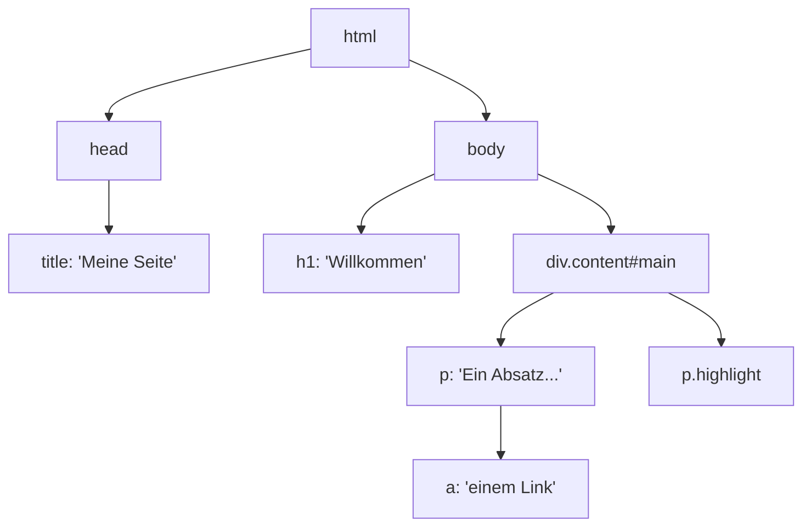

# HTML Parsing mit BeautifulSoup

## HTML-Grundlagen

Bevor wir mit BeautifulSoup arbeiten, müssen wir verstehen, wie HTML aufgebaut ist. HTML (HyperText Markup Language) beschreibt die **Struktur** einer Webseite mit verschachtelten **Tags**.

### Tags, Attribute und Verschachtelung

```html
<html>
  <head>
    <title>Meine Seite</title>
  </head>
  <body>
    <h1>Willkommen</h1>
    <div class="content" id="main">
      <p>Ein Absatz mit <a href="https://example.com">einem Link</a>.</p>
      <p class="highlight">Ein hervorgehobener Absatz.</p>
    </div>
  </body>
</html>
```

Wichtige Konzepte:

| Konzept | Beispiel | Erklärung |
|---------|----------|-----------|
| **Tag** | `<p>...</p>` | Ein HTML-Element mit öffnendem und schließendem Tag |
| **Attribut** | `class="content"` | Zusatzinformation an einem Tag |
| **ID** | `id="main"` | Eindeutige Kennung (kommt nur einmal vor) |
| **Klasse** | `class="highlight"` | Gruppierung (kann mehrfach vorkommen) |
| **Verschachtelung** | `<div><p>...</p></div>` | Tags können ineinander verschachtelt sein |

### HTML als Baumstruktur

HTML bildet eine **Baumstruktur** (DOM – Document Object Model):



Diese Baumstruktur ist zentral für das Verständnis von BeautifulSoup – wir navigieren durch diesen Baum, um Daten zu finden.

---

## BeautifulSoup: Erste Schritte

### Ein BeautifulSoup-Objekt erstellen

```python
from bs4 import BeautifulSoup

# Aus einem String
html = "<html><body><h1>Hallo Welt</h1></body></html>"
soup = BeautifulSoup(html, "html.parser")

# Aus einer heruntergeladenen Webseite
import requests
response = requests.get("https://quotes.toscrape.com")
soup = BeautifulSoup(response.text, "html.parser")
```

!!! info "Parser"
    `"html.parser"` ist der eingebaute Python-Parser. Es gibt auch `"lxml"` (schneller, muss installiert werden) und `"html5lib"` (toleranter bei fehlerhaftem HTML).

### Durch den Baum navigieren

```python
from bs4 import BeautifulSoup

html = """
<html>
  <head><title>Beispiel</title></head>
  <body>
    <h1>Überschrift</h1>
    <div class="content">
      <p>Erster Absatz</p>
      <p>Zweiter Absatz</p>
    </div>
  </body>
</html>
"""
soup = BeautifulSoup(html, "html.parser")

# Direkt auf Tags zugreifen
print(soup.title)        # <title>Beispiel</title>
print(soup.title.text)   # Beispiel
print(soup.h1.text)      # Überschrift

# Verschachtelte Navigation
print(soup.body.div.p.text)  # Erster Absatz
```

---

## `find()` – Ein einzelnes Element finden

`find()` sucht das **erste** Element, das den Kriterien entspricht:

```python
import requests
from bs4 import BeautifulSoup

response = requests.get("https://quotes.toscrape.com")
soup = BeautifulSoup(response.text, "html.parser")

# Nach Tag-Name suchen
h1 = soup.find("h1")
print(h1.text)  # "Quotes to Scrape"

# Nach Tag-Name UND Klasse suchen
zitat = soup.find("span", class_="text")
print(zitat.text)  # Das erste Zitat

# Nach Tag-Name UND Attribut suchen
zitat = soup.find("span", attrs={"class": "text"})
print(zitat.text)  # Gleich wie oben

# find() gibt None zurück, wenn nichts gefunden wird
result = soup.find("span", class_="nichtexistent")
print(result)  # None
```

!!! warning "Achtung: `class_` mit Unterstrich!"
    Da `class` ein reserviertes Schlüsselwort in Python ist, verwendet BeautifulSoup `class_` (mit Unterstrich) als Parametername:
    ```python
    # ✅ Richtig
    soup.find("div", class_="quote")

    # ❌ Falsch – SyntaxError!
    soup.find("div", class="quote")
    ```

---

## `find_all()` – Alle passenden Elemente finden

`find_all()` gibt eine **Liste** aller passenden Elemente zurück:

```python
import requests
from bs4 import BeautifulSoup

response = requests.get("https://quotes.toscrape.com")
soup = BeautifulSoup(response.text, "html.parser")

# Alle Zitate finden
zitate = soup.find_all("span", class_="text")
print(f"Anzahl Zitate: {len(zitate)}")

for zitat in zitate:
    print(f"  - {zitat.text[:50]}...")

# Alle Autoren finden
autoren = soup.find_all("small", class_="author")
for autor in autoren:
    print(f"  Autor: {autor.text}")
```

### Anzahl begrenzen

```python
# Nur die ersten 3 Zitate
erste_drei = soup.find_all("span", class_="text", limit=3)
```

---

## `.text` vs `.string` vs `.get_text()`

Es gibt mehrere Wege, den Textinhalt eines Elements zu bekommen:

```python
from bs4 import BeautifulSoup

html = '<p>Hallo <b>Welt</b>!</p>'
soup = BeautifulSoup(html, "html.parser")
p = soup.find("p")

# .text / .get_text() – Gibt den gesamten Text aller Kind-Elemente zurück
print(p.text)          # "Hallo Welt!"
print(p.get_text())    # "Hallo Welt!"

# .string – Nur wenn das Element genau EINEN Text-Knoten hat
print(p.string)        # None (weil <b> dazwischen ist)
print(p.b.string)      # "Welt" (nur ein Text-Knoten)
```

**Empfehlung:** Verwende `.text` – es funktioniert immer und gibt den gesamten Text zurück.

---

## Attribute auslesen mit `.attrs`

HTML-Elemente können Attribute haben (z.B. `href`, `class`, `id`). So liest du sie aus:

```python
import requests
from bs4 import BeautifulSoup

response = requests.get("https://quotes.toscrape.com")
soup = BeautifulSoup(response.text, "html.parser")

# Alle Attribute eines Elements als Dictionary
link = soup.find("a")
print(link.attrs)       # {'href': '/', 'style': '...'}

# Einzelnes Attribut auslesen
print(link["href"])     # "/"

# Sicherer Zugriff (gibt None zurück statt KeyError)
print(link.get("href"))    # "/"
print(link.get("target"))  # None

# Beispiel: Alle Links auf der Seite extrahieren
for a_tag in soup.find_all("a"):
    href = a_tag.get("href", "kein Link")
    print(f"  {a_tag.text.strip()} → {href}")
```

---

## Praxis: HTML-Struktur von quotes.toscrape.com

Schauen wir uns die HTML-Struktur eines Zitats auf der Seite an:

```html
<div class="quote" itemscope itemtype="http://schema.org/CreativeWork">
    <span class="text" itemprop="text">
        "The world as we have created it is a process of our thinking..."
    </span>
    <span>
        by <small class="author" itemprop="author">Albert Einstein</small>
        <a href="/author/Albert-Einstein">(about)</a>
    </span>
    <div class="tags">
        Meta:
        <meta class="keywords" itemprop="keywords" content="change,deep-thoughts,thinking,world">
        <a class="tag" href="/tag/change/page/1/">change</a>
        <a class="tag" href="/tag/deep-thoughts/page/1/">deep-thoughts</a>
        <a class="tag" href="/tag/thinking/page/1/">thinking</a>
        <a class="tag" href="/tag/world/page/1/">world</a>
    </div>
</div>
```

Daraus können wir folgende Elemente extrahieren:

| Daten | Tag | Klasse | Zugriff |
|-------|-----|--------|---------|
| Zitattext | `span` | `text` | `find("span", class_="text").text` |
| Autor | `small` | `author` | `find("small", class_="author").text` |
| Tags | `a` | `tag` | `find_all("a", class_="tag")` |
| Autor-Link | `a` | – | `find("a")["href"]` innerhalb des Zitats |

---

## Aufgaben

{{ task('tasks/projekt_webscraping/03_html_parsen.yaml') }}

{{ task('tasks/projekt_webscraping/04_elemente_finden.yaml') }}
