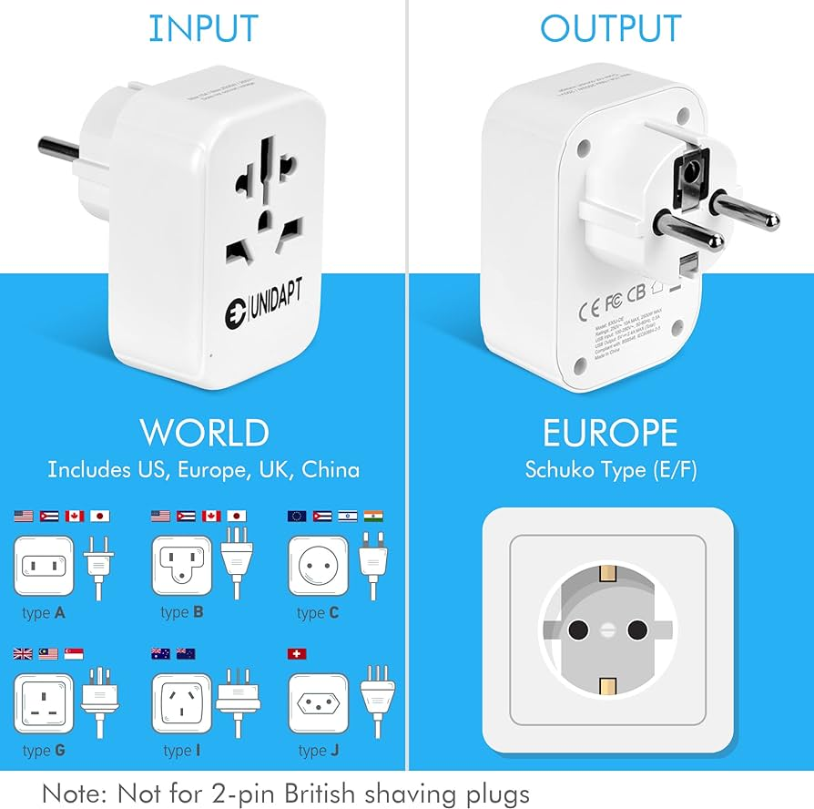

# Adapter Pattern
[100min]

## Erklärung:

Das Adapter Pattern ermöglicht es, die Schnittstelle einer Klasse in eine andere Schnittstelle umzuwandeln, die ein Client erwartet. Es ermöglicht die Zusammenarbeit von Klassen, deren Schnittstellen ansonsten nicht kompatibel wären.

Hier ein Beispiel aus der echten Welt, welches wir auch programmatorisch (vereinfacht) umsetzen können.



Beispiel:

```python
class EuropeanSocket:
    def voltage(self):
        return 230

class USASocket:
    def voltage(self):
        return 120

class EuropeanToUSAdapter:
    def __init__(self, european_socket):
        self.european_socket = european_socket

    def voltage(self):
        return self.european_socket.voltage() / 2

# Verwendung des Adapter Patterns
european_socket = EuropeanSocket()
adapter = EuropeanToUSAdapter(european_socket)

print(f"European Socket Voltage: {european_socket.voltage()}V")
print(f"Adapter Voltage: {adapter.voltage()}V (adapted)")
```

# Aufgaben:
[150min]

{{ task(file="tasks/python_grundlagen/14_x3_adapter/01_fahrzeugservice.yaml") }}
{{ task(file="tasks/python_grundlagen/14_x3_adapter/02_adapter_fur_temperaturkonvertierung.yaml") }}
