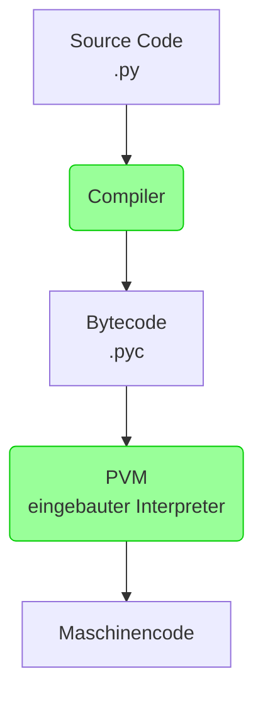

# Kompilierte und interpretierter Code

Programmcode kann auf verschiedene Art in tatsächlich ausführbaren Maschinencode übersetzt werden.
Maschinencode ist die niedrigste Ebene der Code-Darstellung, die direkt von der CPU eines Computers verstanden und
ausgeführt werden kann.

{{ task(file="tasks/python_grundlagen/bytecode/bytecode/01_compiler_und_interpreter.yaml") }}
# Von .py zu ausführbaren Maschinencode

{{ youtube_video("https://www.youtube.com/embed/DoVfMGwo3cs?si=gofPR6owXxHn5EHb") }}

Wir haben gelernt, dass der Compiler und der Interpreter Programme sind, die Quellcode in ausführbaren Maschinencode
übersetzen. Wie ist es nun bei Python?

Bei Python gibt es verschiedene Varianten, wie aus Quellcode tatsächlich ausführbarer Maschinencode wird.
Wir betrachten zunächst den Standardfall, dass das Übersetzungstool **CPython** verwendet wird:

Hier wird der vom Mensch geschriebene Code zunächst von einem Compiler in Bytecode übersetzt. Aus der .py Datei
wird eine .pyc Datei. Diese ist aber noch nicht für die Hardware verständlich, sondern ähnelt mehr der Programmiersprache
Assembler.

In einem zweiten Schritt wird diese .pyc Datei dann von einem Interpreter in der **Python Virtual Machine (PVM)** 
zu tatsächlich ausführbaren Maschinencode übersetzt. Die PVM ist ein Programm, die auf jedem Betriebssystem installiert
werden kann und passenden Maschinencode produziert. Das ist immer noch eine sehr grobe Übersicht, aber für den Start
erstmal gut 😉


Da der Bytecode von der PVM und nicht direkt von der Hardware ausgeführt wird, ist
Python plattformunabhängig. Der gleiche Python-Code kann auf verschiedenen Betriebssystemen laufen, solange eine
passende PVM vorhanden ist.

## Beispiel für Bytecode

Angenommen, wir haben ein einfaches Python-Skript:

```python
def add_numbers(a, b):
    return a + b
```

Wenn dieses Skript ausgeführt wird, kompiliert der Python-Interpreter den Quellcode zuerst in Bytecode. Dieser Bytecode
ist eine niedrigstufigere, abstraktere Darstellung des Quellcodes. In Python können Sie den Bytecode eines Programms mit
dem `dis`-Modul anzeigen. Zum Beispiel:

```python
import dis

def smaller(a, b):
    if a < b:
        return "a ist kleiner"
    return "b ist kleiner"

dis.dis(smaller)
```

Dies würde etwas in der Art ausgeben:

```
  4           0 RESUME                   0

  5           2 LOAD_FAST                0 (a)
              4 LOAD_FAST                1 (b)
              6 COMPARE_OP               2 (<)
             10 POP_JUMP_IF_FALSE        1 (to 14)

  6          12 RETURN_CONST             1 ('a ist kleiner')

  7     >>   14 RETURN_CONST             2 ('b ist kleiner')
```

Der Output besteht tatsächlich aus 7 Spalten:

1. Die Zeilennummer von der ersten Anweisung der jeweiligen Zahlen 
2. Aktuelle Anweisung (mit `-->` angezeigt) (Wertvoll z.B. bei Fehler)
3. Gekennzeichnete Anweisung, zu der z.B. gesprungen werden kann (mit `>>` angezeigt)
4. Adresse der Anweisung
5. Name der Anweisung
6. Parameter er Anweisung
7. Interpretation der Parameter in Klammern

Wir sehen hier, wie Variablen mit dem Befehl `LOAD_FAST` geladen werden, wie sie mit `COMPARE_OP` verglichen
und im Code mit dem `POP_JUMP_IF_FALSE` im Code gesprungen wird.

Es ist an dieser Stelle nicht wichtig, diesen Bytecode im kleinsten Detail zu verstehen. 
Wichtig ist, dass du weißt, dass es diese Zwischenstruktur gibt.

{{ task(file="tasks/python_grundlagen/bytecode/bytecode/02_fehlerstelle.yaml") }}
{{ task(file="tasks/python_grundlagen/bytecode/bytecode/03_verschiedene_interpreter.yaml") }}
{{ task(file="tasks/python_grundlagen/bytecode/bytecode/04_aktuellen_interpreter_herausfinden.yaml") }}
