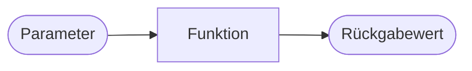

# Einführung in Python-Funktionen

{{ youtube_video("https://www.youtube.com/embed/yr4-QpURqAY?si=2s_y3alGvtPNVJiu") }}

In Python ist eine Funktion eine selbstständige, wiederverwendbare Codeeinheit, die dazu dient,
eine bestimmte Aufgabe zu erledigen. Funktionen können Parameter akzeptieren,
Operationen durchführen und einen können Rückgabewert liefern.



Bereits in unseren bisherigen Python-Lektionen haben wir verschiedene eingebaute Funktionen verwendet, die
verdeutlichen, wie nützlich und vielseitig Funktionen in Python sind. Auch in der Startphase haben wir bereits
unsere eigenen Funktionen geschrieben.

Ein klassisches Beispiel ist die `print()`-Funktion, die wir häufig verwendet haben, um Werte auf dem Bildschirm
auszugeben.

Eine weitere bisher häufig genutzte Funktion ist `input()`, die es uns ermöglicht, Benutzereingaben zu erfassen. Diese
Eingaben können dann für eine Vielzahl von Zwecken innerhalb des Programms verwendet werden.

Schließlich haben wir auch die `random`-Bibliothek und ihre Funktionen wie `random.randint()` verwendet, um 
Zufallszahlen zu generieren.

Diese Funktionen sind Beispiele dafür, wie eingebaute und modul-spezifische Funktionen in Python die Entwicklung von
Programmen vereinfachen und bereichern können, indem sie
komplexe Aufgaben hinter einfach zu verstehenden und zu verwendenden Schnittstellen verbergen.

## Definition von Funktionen

[//]: # ([45min])

{{ youtube_video("https://www.youtube.com/embed/M7iRN8RikMw?si=XigB3CSjsCXPRCTo") }}

Um eine Funktion zu definieren, starten wir eine Zeile mit dem Schlüsselwort `def`.
Darauf folgt der Name der Funktion. Darauf eine `(` und eine Liste von `,`-seperierten Parameternamen und ein
abschließendes `):`. All das war der **Funktionskopf**. Nun wir die nächste Zeile eingerückt.
Alle folgenden, eingerückten Zeilen sind der **Funktionsrumpf**. Sie werden ausgeführt, wenn die Funktion aufgerufen wird,
sonst nicht.

Schauen wir dazu direkt ein Beispiel an einer Funktion **ohne** Parameter (d.h. einfach nur `()` nach dem Funktionsnamen
im Funktionskopf):

[💻 Link zum Online Compiler](https://pythontutor.com/render.html#code=def%20hoch%28%29%3A%0A%20%20%20%20print%28%22Er%20lebe...%22%29%0A%20%20%20%20print%28%22HOCH!%22%29%0A%0Ahoch%28%29%0Ahoch%28%29%0Ahoch%28%29&cumulative=true&curInstr=0&heapPrimitives=nevernest&mode=display&origin=opt-frontend.js&py=3&rawInputLstJSON=%5B%5D&textReferences=false)

```python
def hoch():
    print("Er lebe...")
    print("HOCH!")

hoch()
hoch()
hoch()
```

In den Zeilen 5, 6 und 7 führen wir die Funktion `hoch()` aus, die in Zeile 1 bis 3 definiert ist.
Die Ausführung erfolgt, indem wir den Funktionsnamen aufschreiben und dahinter `()` schreiben.

Wir sehen dann, wie der Zeiger, von Zeile 5 zu Zeile 1 springt, dann die Zeilen 2 und 3 ausführt und dann
bei Zeile 6 weitermacht, wo es zuletzt aufgehört hatte.

Im Funktionskörper können alle Dinge, die wir aus Python kennen ganz normal verwendet werden. Der Code im Funktionsblock
unterscheidet sich nicht von anderem Python-Code.

## Funktionen mit Parametern

{{ youtube_video("https://www.youtube.com/embed/_v9cpU5LdYc?si=Z_LhctE-a8y4WMuD") }}

Über Parameter können wir dafür sorgen, dass Funktionen nicht immer exakt das Gleiche tun, sondern, eben abhängig von 
den übergebenen Parametern, in ihren Ergebnissen variieren, obwohl die Rechenvorschriften gleich sind.

Im Bild gesprochen: Ein Rezept besteht einerseits aus einer Liste von Zubereitungsschritten (Funktionskörper)
aber auch aus einer Auflistung der Zutaten (Parameter). Nun kann man zwei verschiedene Kuchen mit demselben Rezept 
backen, indem man die Zutaten variiert. So macht es z.B. einen Unterschied welche konkrete Apfelsorte man in einem
Apfelkuchen verwendet.

Definieren wir Parameter in einer Funktion, so müssen wir diese beim Funktionsaufruf mit Klammern angeben:

[💻 Link zum Online Compiler](https://pythontutor.com/render.html#code=def%20print_greeting%28name,%20age%29%3A%0A%20%20%20%20if%20age%20%3E%2060%3A%0A%20%20%20%20%20%20%20%20print%28f%22Einen%20wundersch%C3%B6nen%20guten%20Tag,%20%7Bname%7D!%22%29%0A%20%20%20%20else%3A%0A%20%20%20%20%20%20%20%20print%28f%22Moin%20moin!%22%29%0A%0Aprint_greeting%28%22Kevin%22,%2020%29%0Aprint_greeting%28%22J%C3%B6rg%22,%2068%29&cumulative=false&curInstr=0&heapPrimitives=nevernest&mode=display&origin=opt-frontend.js&py=3&rawInputLstJSON=%5B%5D&textReferences=false)

```python
def print_greeting(name, age):
    if age > 60:
        print(f"Einen wunderschönen guten Tag, {name}!")
    else:
        print(f"Moin moin!")

print_greeting("Kevin", 20)
print_greeting("Jörg", 68)
```


## Rückgabewerte

{{ youtube_video("https://www.youtube.com/embed/wSWtdmL83dE?si=blGDMBohuLiKoimp") }}

Nun ist noch wichtig zu erwähnen, dass Funktionen nicht nur verarbeiten, sondern auch ein
Ergebnis am Ende ihrer Durchführung zurückgeben können. Der Wert der zurückgegeben werden soll steht in einer
Zeile mit einem vorangehenden `return`.

[💻 Online Compiler](https://pythontutor.com/render.html#code=def%20calculate_discounted_price%28price,%20weekday,%20age%29%3A%0A%20%20%20%20discount%20%3D%200%0A%0A%20%20%20%20if%20weekday%20%3D%3D%20%22Sunday%22%20or%20weekday%20%3D%3D%20%22Saturday%22%3A%0A%20%20%20%20%20%20%20%20discount%20%2B%3D%200.25%0A%0A%20%20%20%20if%20age%20%3E%2065%20or%20age%20%3C%206%3A%0A%20%20%20%20%20%20%20%20discount%20%2B%3D%200.5%0A%0A%20%20%20%20return%20price%20*%20%281%20-%20discount%29%0A%0A%0Abase_price%20%3D%2010%0Acurrent_weekday%20%3D%20%22Monday%22%0Apassager_age%20%3D%2070%0A%0Aactual_price%20%3D%20calculate_discounted_price%28base_price,%20current_weekday,%20passager_age%29%0Aprint%28actual_price%29&cumulative=true&curInstr=0&heapPrimitives=nevernest&mode=display&origin=opt-frontend.js&py=3&rawInputLstJSON=%5B%5D&textReferences=false)

```python
def calculate_discounted_price(price, weekday, age):
    discount = 0

    if weekday == "Sunday" or weekday == "Saturday":
        discount += 0.25

    if age > 65 or age < 6:
        discount += 0.5

    return price * (1 - discount)

base_price = 10
current_weekday = "Monday"
passager_age = 70

actual_price = calculate_discounted_price(base_price, current_weekday, passager_age)
print(actual_price)
```


⚠ Sobald eine `return` Zeile durchgeführt wird endet auch sofort die
Durchführung des Codes, egal, was sonst noch im Funktionsrumpf folgt.

[💻 Online Compiler](https://pythontutor.com/render.html#code=def%20begruessung%28name%29%3A%0A%20%20%20%20if%20%22q%22%20in%20name.lower%28%29%3A%0A%20%20%20%20%20%20%20%20return%20f%22%7Bname%7D%20ist%20aber%20ein%20seltener%20Name!%22%0A%20%20%20%20return%20f%22Hallo,%20%7Bname%7D!%22%0A%0Aprint%28begruessung%28%22Bojack%22%29%29%0Aprint%28begruessung%28%22Aquafina%22%29%29&cumulative=true&curInstr=0&heapPrimitives=nevernest&mode=display&origin=opt-frontend.js&py=3&rawInputLstJSON=%5B%5D&textReferences=false)

```python
def begruessung(name):
    if "q" in name.lower():
        return f"{name} ist aber ein seltener Name!"
    return f"Hallo, {name}!"

print(begruessung("Bojack"))
print(begruessung("Aquafina"))
```

### Mehrere Rückgabewerte

{{ youtube_video("https://www.youtube.com/embed/k3rzPwl3NtQ?si=tuSuoJiJLTjJfoJI") }}

In Python ist es auch möglich mehrere Objekte auf ein Mal zurück zu geben. 
Die Syntax dafür ist sehr einfach, man schreibt nach dem `return`
die Rückgaben mit einem `,` getrennt nacheinander auf. Hier ein Beispiel
einer Funktion, die das erste und letze Element einer Liste zurückgibt.

[💻 Online Compiler](https://pythontutor.com/render.html#code=def%20first_and_last%28my_list%29%3A%0A%20%20%20%20return%20my_list%5B0%5D,%20my_list%5B-1%5D%0A%20%20%20%20%0Af,%20s%20%3D%20first_and_last%28%5B1,2,3,4,5%5D%29%0Aprint%28f%22First%20element%3A%20%7Bf%7D%22%29%0Aprint%28f%22Second%20element%3A%20%7Bs%7D%22%29%0A%0Aboth%20%3D%20first_and_last%28%5B1,2,3,4,5%5D%29%0Aprint%28f%22%7Bboth%7D%20is%20of%20type%20%7Btype%28both%29%7D%22%29&cumulative=false&curInstr=0&heapPrimitives=nevernest&mode=display&origin=opt-frontend.js&py=3&rawInputLstJSON=%5B%5D&textReferences=false)

```python
def first_and_last(my_list):
    return my_list[0], my_list[-1]
    
f, s = first_and_last([1,2,3,4,5])
print(f"First element: {f}")
print(f"Second element: {s}")

both = first_and_last([1,2,3,4,5])
print(f"{both} is of type {type(both)}")
```

Eigentlich gibt die Funktion ein Tupel zurück, aber wir nutzen das automatische
Entpacken, um die Elemente direkt in Variablen zu speichern.

## Bedeutung und Zweck von Funktionen

[//]: # ([30min])
1. **Modularität**: Funktionen ermöglichen es, den Code in kleinere, wiederverwendbare Teile zu unterteilen. Das macht
   den Code übersichtlicher und wartbarer.

2. **Wiederverwendbarkeit**: Einmal definierte Funktionen können in verschiedenen Teilen eines Programms oder sogar in
   verschiedenen Programmen wiederverwendet werden.

3. **Abstraktion**: Durch Funktionen kann man komplexe Abläufe hinter einer einfachen Schnittstelle verbergen. Nutzer
   der Funktion müssen nicht wissen, wie die Funktion intern arbeitet.

4. **Testbarkeit**: Funktionen ermöglichen es, kleine Teile des Codes isoliert zu testen.

# Aufgaben

[//]: # ([90])
{{ task(file="tasks/python_grundlagen/functions/functions/01_einfache_begruungsfunktion.yaml") }}
{{ task(file="tasks/python_grundlagen/functions/functions/02_quadratzahlen.yaml") }}
{{ task(file="tasks/python_grundlagen/functions/functions/03_maximum_von_zwei_zahlen.yaml") }}
{{ task(file="tasks/python_grundlagen/functions/functions/04_summierung.yaml") }}
{{ task(file="tasks/python_grundlagen/functions/functions/05_string_wiederholung.yaml") }}
{{ task(file="tasks/python_grundlagen/functions/functions/06_fahrenheit_in_celsius.yaml") }}
{{ task(file="tasks/python_grundlagen/functions/functions/07_listenelemente_addieren.yaml") }}
{{ task(file="tasks/python_grundlagen/functions/functions/08_listenelemente_addieren_und_prufen.yaml") }}
{{ task(file="tasks/python_grundlagen/functions/functions/09_check_gerade_zahl.yaml") }}
{{ task(file="tasks/python_grundlagen/functions/functions/10_countdown.yaml") }}
{{ task(file="tasks/python_grundlagen/functions/functions/11_minimum_in_liste_finden.yaml") }}
{{ task(file="tasks/python_grundlagen/functions/functions/12_lange_eines_strings.yaml") }}
{{ task(file="tasks/python_grundlagen/functions/functions/13_multiplikationstabelle.yaml") }}
{{ task(file="tasks/python_grundlagen/functions/functions/14_palindrome_prufen.yaml") }}
{{ task(file="tasks/python_grundlagen/functions/functions/15_mehrere_ruckgabewerte.yaml") }}
## Argumente vs Parameter - Was ist der Unterschied?

[//]: # ([30min])
In der Programmierung ist es wortvoll, die Unterschiede zwischen Parametern und Argumenten zu
verstehen, da sie oft fälschlicherweise synonym verwendet werden, obwohl sie unterschiedliche Konzepte darstellen.

#### Parameter

- **Definition**: Parameter sind die Variablen, die in der Definition einer Funktion aufgeführt werden. Sie agieren wie
  Platzhalter für die Werte, die die Funktion beim Aufruf erhält.
- **Beispiel**: In der Funktionsdefinition `def addiere(a, b):`, sind `a` und `b` die Parameter. Sie definieren, welche
  Art von Werten die Funktion erwartet.

#### Argumente

- **Definition**: Argumente sind die tatsächlichen Werte, die beim Aufruf einer Funktion an diese übergeben werden. Sie
  ersetzen die Parameter, wenn die Funktion ausgeführt wird.
- **Beispiel**: Beim Aufruf `addiere(3, 5)`, sind `3` und `5` die Argumente. Sie sind die konkreten Werte, die für `a`
  und `b` eingesetzt werden.

**Analogie**: Man kann sich Parameter als die "Beschreibung" eines Produkts und Argumente als das "tatsächliche
  Produkt" vorstellen.

## Default Parametern

{{ youtube_video("https://www.youtube.com/embed/jO6WghRG54w?si=L7YCF_fprbgI9JYa") }}

In Python ist es möglich einen Parameter schon bei der Funktionsdefinition
zu belegen. Wenn dieser Parameter dann beim Aufruf nicht explizit gesetzt
wird, dann wird der vorher festgelegte default-Wert als Argument genutzt. Im folgenden
Beispiel sehen wird, dass der Parameter `formal` per default auf `False`
gesetzt ist.

```python
def begruessung(name, formal=False):
    if formal:
        return f"Sehr geehrte/r {name},"
    else:
        return f"Hallo, {name}!"

print(begruessung("Anna"))
print(begruessung("Prof. Dr. Müller", formal=True))
print(begruessung("Frau Hiltraut"))
print(begruessung(formal=True, name="Herr Hiltraut"))
```

Sobald ein Parameter eine Defaultbelegung hat, müssen auch die darauf
folgenden Parameter eine Defaultbelegung aufweisen. Der Funktionskopf
`def begruessung(formal=False, name)` würde also zu einem Fehler führen.

# Callstack

{{ youtube_video("https://www.youtube.com/embed/svoOgKS9n6w?si=tjvH1shIZwsX6MGp") }}

Es ist möglich Funktionen in Funktionen auszuführen. Dabei entsteht ein sog. **Stack**
von Funktionsaufrufen.

Im folgenden Code, siehst du, wie Funktionen in Funktionen ausgeführt werden.

[💻 Online Compiler](https://pythontutor.com/render.html#code=def%20calculate_price%28base_price,%20age_of_passenger%29%3A%0A%20%20%20%20discount%20%3D%200%0A%20%20%20%20%0A%20%20%20%20if%20age_of_passenger%20%3E%2065%3A%0A%20%20%20%20%20%20%20%20discount%20%2B%3D%20calculate_discount_for_elders%28age_of_passenger%29%0A%20%20%20%20%0A%20%20%20%20result%20%3D%20calculate_discount%28base_price,%20discount%29%0A%20%20%20%20return%20result%0A%20%20%20%20%0Adef%20calculate_discount_for_elders%28age_of_passenger%29%3A%0A%20%20%20%20if%20age_of_passenger%20%3E%20100%3A%0A%20%20%20%20%20%20%20%20return%201.0%0A%20%20%20%20return%200.5%0A%20%20%20%20%0Adef%20calculate_discount%28base_price,%20discount%29%3A%0A%20%20%20%20reduction%20%3D%201%20-%20discount%0A%20%20%20%20result%20%3D%20base_price%20*%20reduction%0A%20%20%20%20return%20result%0A%20%20%20%20%0Aprice%20%3D%2010%0Aage%20%3D%2090%0Aactual_price%20%3D%20calculate_price%28price,%20age%29%0Aprint%28actual_price%29&cumulative=true&curInstr=0&heapPrimitives=nevernest&mode=display&origin=opt-frontend.js&py=3&rawInputLstJSON=%5B%5D&textReferences=false)

```python
def calculate_price(base_price, age_of_passenger):
    discount = 0
    
    if age_of_passenger > 65:
        discount += calculate_discount_for_elders(age_of_passenger)
    
    result = calculate_discount(base_price, discount)
    return result
    
def calculate_discount_for_elders(age_of_passenger):
    if age_of_passenger > 100:
        return 1.0
    return 0.5
    
def calculate_discount(base_price, discount):
    reduction = 1 - discount
    result = base_price * reduction
    return result
    
price = 10
age = 90
actual_price = calculate_price(price, age)
print(actual_price)
```
{{ task(file="tasks/python_grundlagen/functions/functions/16_stack_in_exceptions.yaml") }}
# Primitive Types as Arguments
def change_number(number):
    number = 0 

my_number = 10
change_number(my_number)
print(my_number)

# Complex Types as Arguments
def change_value(sequence):
    sequence[0] = 0

my_list = [1,2,3]
change_value(my_list)
print(my_list)
```

Hast du richtig geraten? Die Variable `my_number` blieb unverändert, der erste Eintrag
aus `my_list` jedoch nicht. Woran liegt das?

In der Variablen `my_number` ist ein primitiver Datentyp (`int`). Der Wert in `my_number`
wird in den Parameter `number` **kopiert**. Wenn dieser nun manipuliert ist,
kriegt der Wert in `my_number` das gar nicht mit.

In der Variablen `my_list` dagegen ist ein kkomplexer Datentyp (`list`).
In der Variablen `my_list` ist, um genau zu sein, eine `Referenz` (die Adresse im Speicher) zu einer Liste gespeichert,
und nicht die ganze Liste. Beim Methodenaufruf `change_value` wird nun diese Referenz kopiert.
Sowohl die globale Variable `my_list` als auch der lokale Parameter `sequenz` beziehen sich nun
auf dasselbe komplexe Objekt. Und wenn einer von beiden dieses Objekt ändern, kriegen das also beide mit.

Und wie weiß ich, welches Objekt ich referenziere? Mit der Funktion `id` können wir uns
die ID eines Objektes herausgeben. Die selbe ID heißt, das selbe Objekt liegt vor.

[💻 Online Compiler](https://pythontutor.com/render.html#code=a%20%3D%20%5B1,2%5D%0Ab%20%3D%20a%0Ac%20%3D%20%5B1,2%5D%0A%0Aprint%28f%22a%3A%20%7Ba%7D%20hat%20id%20%7Bid%28a%29%7D%22%29%0Aprint%28f%22b%3A%20%7Bb%7D%20hat%20id%20%7Bid%28b%29%7D%22%29%0Aprint%28f%22c%3A%20%7Bc%7D%20hat%20id%20%7Bid%28c%29%7D%22%29&cumulative=false&curInstr=6&heapPrimitives=nevernest&mode=display&origin=opt-frontend.js&py=3&rawInputLstJSON=%5B%5D&textReferences=false)

```python
a = [1,2]
b = a
c = [1,2]

print(f"a: {a} hat id {id(a)}")
print(f"b: {b} hat id {id(b)}")
print(f"c: {c} hat id {id(c)}")
```

{{ task(file="tasks/python_grundlagen/functions/functions/17_dictionary_veraendern.yaml") }}

{{ task(file="tasks/python_grundlagen/functions/functions/18_kopie_ausgeben.yaml") }}
