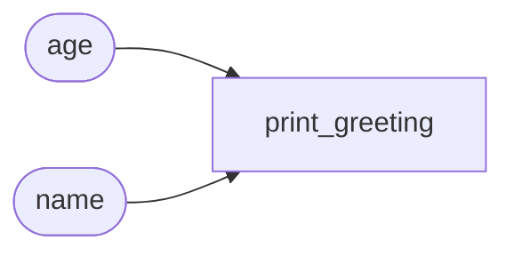
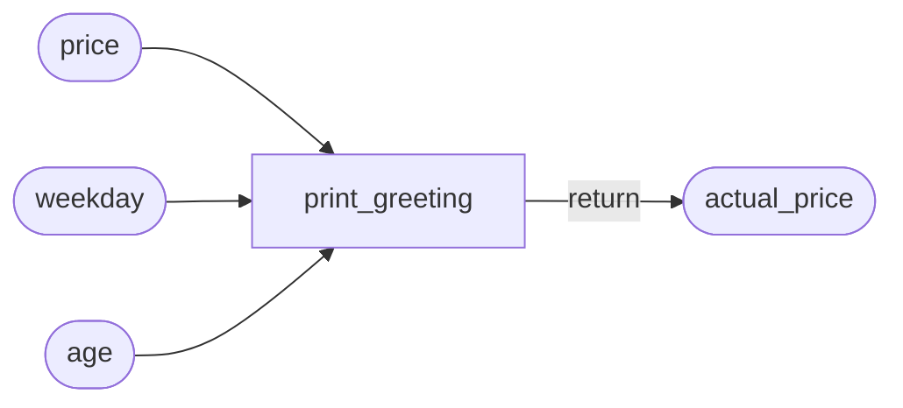
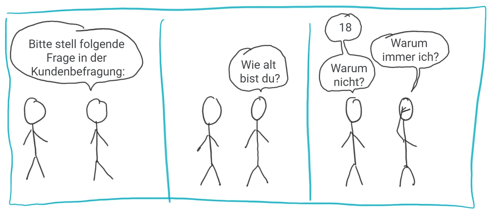

# Einführung in Python-Funktionen

<details>
<summary>
🎦 Video
</summary>
<iframe width="560" height="315" src="https://www.youtube.com/embed/yr4-QpURqAY?si=2s_y3alGvtPNVJiu" title="YouTube video player" frameborder="0" allow="accelerometer; autoplay; clipboard-write; encrypted-media; gyroscope; picture-in-picture; web-share" allowfullscreen></iframe>
</details>

In Python ist eine Funktion eine selbstständige, wiederverwendbare Codeeinheit, die dazu dient,
eine bestimmte Aufgabe zu erledigen. Funktionen können Parameter akzeptieren,
Operationen durchführen und einen können Rückgabewert liefern.


Bereits in unseren bisherigen Python-Lektionen haben wir verschiedene eingebaute Funktionen verwendet, die
verdeutlichen, wie nützlich und vielseitig Funktionen in Python sind. Auch in der Startphase haben wir bereits
unsere eigenen Funktionen geschrieben.

Ein klassisches Beispiel ist die `print()`-Funktion, die wir häufig verwendet haben, um Werte auf dem Bildschirm
auszugeben.

Eine weitere bisher häufig genutzte Funktion ist `input()`, die es uns ermöglicht, Benutzereingaben zu erfassen. Diese
Eingaben können dann für eine Vielzahl von Zwecken innerhalb des Programms verwendet werden.

Schließlich haben wir auch die `random`-Bibliothek und ihre Funktionen wie `random.randint()` verwendet, um 
Zufallszahlen zu generieren.

Diese Funktionen sind Beispiele dafür, wie eingebaute und modul-spezifische Funktionen in Python die Entwicklung von
Programmen vereinfachen und bereichern können, indem sie
komplexe Aufgaben hinter einfach zu verstehenden und zu verwendenden Schnittstellen verbergen.

## Definition von Funktionen

[//]: # ([45min])

<details>
<summary>
🎦 Video
</summary>
<iframe width="560" height="315" src="https://www.youtube.com/embed/M7iRN8RikMw?si=XigB3CSjsCXPRCTo" title="YouTube video player" frameborder="0" allow="accelerometer; autoplay; clipboard-write; encrypted-media; gyroscope; picture-in-picture; web-share" allowfullscreen></iframe>
</details>

Um eine Funktion zu definieren, starten wir eine Zeile mit dem Schlüsselwort `def`.
Darauf folgt der Name der Funktion. Darauf eine `(` und eine Liste von `,`-seperierten Parameternamen und ein
abschließendes `):`. All das war der **Funktionskopf**. Nun wir die nächste Zeile eingerückt.
Alle folgenden, eingerückten Zeilen sind der **Funktionsrumpf**. Sie werden ausgeführt, wenn die Funktion aufgerufen wird,
sonst nicht.

Schauen wir dazu direkt ein Beispiel an einer Funktion **ohne** Parameter (d.h. einfach nur `()` nach dem Funktionsnamen
im Funktionskopf):

[💻 Link zum Online Compiler](https://pythontutor.com/render.html#code=def%20hoch%28%29%3A%0A%20%20%20%20print%28%22Er%20lebe...%22%29%0A%20%20%20%20print%28%22HOCH!%22%29%0A%0Ahoch%28%29%0Ahoch%28%29%0Ahoch%28%29&cumulative=true&curInstr=0&heapPrimitives=nevernest&mode=display&origin=opt-frontend.js&py=3&rawInputLstJSON=%5B%5D&textReferences=false)


```python
def hoch():
    print("Er lebe...")
    print("HOCH!")

hoch()
hoch()
hoch()
```


In den Zeilen 5, 6 und 7 führen wir die Funktion `hoch()` aus, die in Zeile 1 bis 3 definiert ist.
Die Ausführung erfolgt, indem wir den Funktionsnamen aufschreiben und dahinter `()` schreiben.

Wir sehen dann, wie der Zeiger, von Zeile 5 zu Zeile 1 springt, dann die Zeilen 2 und 3 ausführt und dann
bei Zeile 6 weitermacht, wo es zuletzt aufgehört hatte.

Im Funktionskörper können alle Dinge, die wir aus Python kennen ganz normal verwendet werden. Der Code im Funktionsblock
unterscheidet sich nicht von anderem Python-Code.

## Funktionen mit Parametern

<details>
<summary>
🎦 Video
</summary>
<iframe width="560" height="315" src="https://www.youtube.com/embed/_v9cpU5LdYc?si=Z_LhctE-a8y4WMuD" title="YouTube video player" frameborder="0" allow="accelerometer; autoplay; clipboard-write; encrypted-media; gyroscope; picture-in-picture; web-share" allowfullscreen></iframe>
</details>

Über Parameter können wir dafür sorgen, dass Funktionen nicht immer exakt das Gleiche tun, sondern, eben abhängig von 
den übergebenen Parametern, in ihren Ergebnissen variieren, obwohl die Rechenvorschriften gleich sind.

Im Bild gesprochen: Ein Rezept besteht einerseits aus einer Liste von Zubereitungsschritten (Funktionskörper)
aber auch aus einer Auflistung der Zutaten (Parameter). Nun kann man zwei verschiedene Kuchen mit demselben Rezept 
backen, indem man die Zutaten variiert. So macht es z.B. einen Unterschied welche konkrete Apfelsorte man in einem
Apfelkuchen verwendet.

Definieren wir Parameter in einer Funktion, so müssen wir diese beim Funktionsaufruf mit Klammern angeben:

[💻 Link zum Online Compiler](https://pythontutor.com/render.html#code=def%20print_greeting%28name,%20age%29%3A%0A%20%20%20%20if%20age%20%3E%2060%3A%0A%20%20%20%20%20%20%20%20print%28f%22Einen%20wundersch%C3%B6nen%20guten%20Tag,%20%7Bname%7D!%22%29%0A%20%20%20%20else%3A%0A%20%20%20%20%20%20%20%20print%28f%22Moin%20moin!%22%29%0A%0Aprint_greeting%28%22Kevin%22,%2020%29%0Aprint_greeting%28%22J%C3%B6rg%22,%2068%29&cumulative=false&curInstr=0&heapPrimitives=nevernest&mode=display&origin=opt-frontend.js&py=3&rawInputLstJSON=%5B%5D&textReferences=false)


```python
def print_greeting(name, age):
    if age > 60:
        print(f"Einen wunderschönen guten Tag, {name}!")
    else:
        print(f"Moin moin!")

print_greeting("Kevin", 20)
print_greeting("Jörg", 68)
```




## Rückgabewerte

<details>
<summary>
🎦 Video
</summary>
<iframe width="560" height="315" src="https://www.youtube.com/embed/wSWtdmL83dE?si=blGDMBohuLiKoimp" title="YouTube video player" frameborder="0" allow="accelerometer; autoplay; clipboard-write; encrypted-media; gyroscope; picture-in-picture; web-share" allowfullscreen></iframe>
</details>


Nun ist noch wichtig zu erwähnen, dass Funktionen nicht nur verarbeiten, sondern auch ein
Ergebnis am Ende ihrer Durchführung zurückgeben können. Der Wert der zurückgegeben werden soll steht in einer
Zeile mit einem vorangehenden `return`.

[💻 Online Compiler](https://pythontutor.com/render.html#code=def%20calculate_discounted_price%28price,%20weekday,%20age%29%3A%0A%20%20%20%20discount%20%3D%200%0A%0A%20%20%20%20if%20weekday%20%3D%3D%20%22Sunday%22%20or%20weekday%20%3D%3D%20%22Saturday%22%3A%0A%20%20%20%20%20%20%20%20discount%20%2B%3D%200.25%0A%0A%20%20%20%20if%20age%20%3E%2065%20or%20age%20%3C%206%3A%0A%20%20%20%20%20%20%20%20discount%20%2B%3D%200.5%0A%0A%20%20%20%20return%20price%20*%20%281%20-%20discount%29%0A%0A%0Abase_price%20%3D%2010%0Acurrent_weekday%20%3D%20%22Monday%22%0Apassager_age%20%3D%2070%0A%0Aactual_price%20%3D%20calculate_discounted_price%28base_price,%20current_weekday,%20passager_age%29%0Aprint%28actual_price%29&cumulative=true&curInstr=0&heapPrimitives=nevernest&mode=display&origin=opt-frontend.js&py=3&rawInputLstJSON=%5B%5D&textReferences=false)


```python
def calculate_discounted_price(price, weekday, age):
    discount = 0

    if weekday == "Sunday" or weekday == "Saturday":
        discount += 0.25

    if age > 65 or age < 6:
        discount += 0.5

    return price * (1 - discount)


base_price = 10
current_weekday = "Monday"
passager_age = 70

actual_price = calculate_discounted_price(base_price, current_weekday, passager_age)
print(actual_price)
```




⚠ Sobald eine `return` Zeile durchgeführt wird endet auch sofort die
Durchführung des Codes, egal, was sonst noch im Funktionsrumpf folgt.

[💻 Online Compiler](https://pythontutor.com/render.html#code=def%20begruessung%28name%29%3A%0A%20%20%20%20if%20%22q%22%20in%20name.lower%28%29%3A%0A%20%20%20%20%20%20%20%20return%20f%22%7Bname%7D%20ist%20aber%20ein%20seltener%20Name!%22%0A%20%20%20%20return%20f%22Hallo,%20%7Bname%7D!%22%0A%0Aprint%28begruessung%28%22Bojack%22%29%29%0Aprint%28begruessung%28%22Aquafina%22%29%29&cumulative=true&curInstr=0&heapPrimitives=nevernest&mode=display&origin=opt-frontend.js&py=3&rawInputLstJSON=%5B%5D&textReferences=false)


```python
def begruessung(name):
    if "q" in name.lower():
        return f"{name} ist aber ein seltener Name!"
    return f"Hallo, {name}!"

print(begruessung("Bojack"))
print(begruessung("Aquafina"))
```


### Mehrere Rückgabewerte

<details>
<summary>
🎦 Video
</summary>
<iframe width="560" height="315" src="https://www.youtube.com/embed/k3rzPwl3NtQ?si=tuSuoJiJLTjJfoJI" title="YouTube video player" frameborder="0" allow="accelerometer; autoplay; clipboard-write; encrypted-media; gyroscope; picture-in-picture; web-share" allowfullscreen></iframe>
</details>


In Python ist es auch möglich mehrere Objekte auf ein Mal zurück zu geben. 
Die Syntax dafür ist sehr einfach, man schreibt nach dem `return`
die Rückgaben mit einem `,` getrennt nacheinander auf. Hier ein Beispiel
einer Funktion, die das erste und letze Element einer Liste zurückgibt.

[💻 Online Compiler](https://pythontutor.com/render.html#code=def%20first_and_last%28my_list%29%3A%0A%20%20%20%20return%20my_list%5B0%5D,%20my_list%5B-1%5D%0A%20%20%20%20%0Af,%20s%20%3D%20first_and_last%28%5B1,2,3,4,5%5D%29%0Aprint%28f%22First%20element%3A%20%7Bf%7D%22%29%0Aprint%28f%22Second%20element%3A%20%7Bs%7D%22%29%0A%0Aboth%20%3D%20first_and_last%28%5B1,2,3,4,5%5D%29%0Aprint%28f%22%7Bboth%7D%20is%20of%20type%20%7Btype%28both%29%7D%22%29&cumulative=false&curInstr=0&heapPrimitives=nevernest&mode=display&origin=opt-frontend.js&py=3&rawInputLstJSON=%5B%5D&textReferences=false)


```python
def first_and_last(my_list):
    return my_list[0], my_list[-1]
    
f, s = first_and_last([1,2,3,4,5])
print(f"First element: {f}")
print(f"Second element: {s}")

both = first_and_last([1,2,3,4,5])
print(f"{both} is of type {type(both)}")
```


Eigentlich gibt die Funktion ein Tupel zurück, aber wir nutzen das automatische
Entpacken, um die Elemente direkt in Variablen zu speichern.


## Bedeutung und Zweck von Funktionen

[//]: # ([30min])
1. **Modularität**: Funktionen ermöglichen es, den Code in kleinere, wiederverwendbare Teile zu unterteilen. Das macht
   den Code übersichtlicher und wartbarer.

2. **Wiederverwendbarkeit**: Einmal definierte Funktionen können in verschiedenen Teilen eines Programms oder sogar in
   verschiedenen Programmen wiederverwendet werden.

3. **Abstraktion**: Durch Funktionen kann man komplexe Abläufe hinter einer einfachen Schnittstelle verbergen. Nutzer
   der Funktion müssen nicht wissen, wie die Funktion intern arbeitet.

4. **Testbarkeit**: Funktionen ermöglichen es, kleine Teile des Codes isoliert zu testen.

# Aufgaben

[//]: # ([90])
### 1. **Einfache Begrüßungsfunktion**: 🌶️️
Schreibe eine Funktion `begruesse()`, die "Hallo Welt!" ausgibt.

### 2. **Quadratzahlen**: 🌶️️
Schreibe eine Funktion `quadrat()`, die das Quadrat einer übergebenen Zahl zurückgibt.

### 3. **Maximum von zwei Zahlen**: 🌶️️
Schreibe eine Funktion `max_zwei()`, die zwei Zahlen als Argumente nimmt und die größere
   Zahl zurückgibt.

### 4. **Summierung**: 🌶️️
Schreibe eine Funktion `summiere()`, die die Summe von drei übergebenen Zahlen berechnet und
   zurückgibt.

### 5. **String-Wiederholung**: 🌶️️
Schreibe eine Funktion `wiederhole_string(str, n)`, die einen String `str` und eine Zahl `n`
   nimmt und den String `n`-mal wiederholt.

### 6. **Fahrenheit in Celsius**: 🌶️️
Schreibe eine Funktion `fahrenheit_in_celsius()`, die eine Temperatur in Fahrenheit nimmt
   und in Celsius umrechnet. Die Formel dazu ist `c = (f - 32) * 5 / 9`.


### 7. **Listenelemente addieren**: 🌶️️🌶️️
Schreibe eine Funktion `addiere_positive_liste()`, die eine Liste von Zahlen 
nimmt und alle positiven Zahlen in der Liste addiert.

### 8. **Listenelemente addieren und prüfen**: 🌶️️🌶️🌶️️
Schreibe eine Funktion `addiere_negative_liste()`, die eine Liste von Zahlen 
nimmt und alle negativen Zahlen in der Liste addiert. Dabei soll zusätzlich 
geprüft werden, ob es sich bei dem Eintrag überhaupt um eine Zahl handelt.

### 9. **Check Gerade Zahl**: 🌶️️
Schreibe eine Funktion `ist_gerade()`, die prüft, ob eine übergebene Zahl gerade ist.

### 10. **Countdown**: 🌶️️
Schreibe eine Funktion `countdown()`, die eine Zahl nimmt und einen Countdown von dieser Zahl bis 0
    ausgibt.

### 11. **Minimum in Liste finden**: 🌶️️
Schreibe eine Funktion `finde_minimum()`, die eine Liste von Zahlen nimmt und das
kleinste Element zurückgibt. Nutze dabei keine bestehende Funktion in Python,
sondern implementiere dies über eine Schleife.

### 12. **Länge eines Strings**: 🌶️️
Schreibe eine Funktion `laenge_string()`, die die Länge eines übergebenen Strings
zurückgibt. Nutze dabei keine bestehende Funktion in Python,
sondern implementiere dies über eine Schleife.

### 13. **Multiplikationstabelle**: 🌶️️
Schreibe eine Funktion `multiplikationstabelle()`, die eine Zahl nimmt und ihre
    Multiplikationstabelle bis 10 ausgibt.

### 14. **Palindrome prüfen**: 🌶️️🌶️️
Schreibe eine Funktion `ist_palindrom()`, die einen String nimmt und prüft, ob es ein
    Palindrom ist.

### 15. **Mehrere Rückgabewerte**🌶🌶
Schreibe eine Funktion, die aus einem Text das längste und das kürzeste Wort
findet und diese zurückgibt. Wenn es mehrere Wörter gleicher länge gibt, soll
das Erste verwendet werden.

[Lösungen](solutions.md#funktionen-definieren)

## Argumente vs Parameter - Was ist der Unterschied?

[//]: # ([30min])
In der Programmierung ist es wortvoll, die Unterschiede zwischen Parametern und Argumenten zu
verstehen, da sie oft fälschlicherweise synonym verwendet werden, obwohl sie unterschiedliche Konzepte darstellen.

#### Parameter

- **Definition**: Parameter sind die Variablen, die in der Definition einer Funktion aufgeführt werden. Sie agieren wie
  Platzhalter für die Werte, die die Funktion beim Aufruf erhält.
- **Beispiel**: In der Funktionsdefinition `def addiere(a, b):`, sind `a` und `b` die Parameter. Sie definieren, welche
  Art von Werten die Funktion erwartet.

#### Argumente

- **Definition**: Argumente sind die tatsächlichen Werte, die beim Aufruf einer Funktion an diese übergeben werden. Sie
  ersetzen die Parameter, wenn die Funktion ausgeführt wird.
- **Beispiel**: Beim Aufruf `addiere(3, 5)`, sind `3` und `5` die Argumente. Sie sind die konkreten Werte, die für `a`
  und `b` eingesetzt werden.

**Analogie**: Man kann sich Parameter als die "Beschreibung" eines Produkts und Argumente als das "tatsächliche
  Produkt" vorstellen.

## Default Parametern

<details>
<summary>
🎦 Video
</summary>
<iframe width="560" height="315" src="https://www.youtube.com/embed/jO6WghRG54w?si=L7YCF_fprbgI9JYa" title="YouTube video player" frameborder="0" allow="accelerometer; autoplay; clipboard-write; encrypted-media; gyroscope; picture-in-picture; web-share" allowfullscreen></iframe>
</details>


In Python ist es möglich einen Parameter schon bei der Funktionsdefinition
zu belegen. Wenn dieser Parameter dann beim Aufruf nicht explizit gesetzt
wird, dann wird der vorher festgelegte default-Wert als Argument genutzt. Im folgenden
Beispiel sehen wird, dass der Parameter `formal` per default auf `False`
gesetzt ist.

```python
def begruessung(name, formal=False):
    if formal:
        return f"Sehr geehrte/r {name},"
    else:
        return f"Hallo, {name}!"

print(begruessung("Anna"))
print(begruessung("Prof. Dr. Müller", formal=True))
print(begruessung("Frau Hiltraut"))
print(begruessung(formal=True, name="Herr Hiltraut"))
```

Sobald ein Parameter eine Defaultbelegung hat, müssen auch die darauf
folgenden Parameter eine Defaultbelegung aufweisen. Der Funktionskopf
`def begruessung(formal=False, name)` würde also zu einem Fehler führen.

# Callstack

<details>
<summary>
🎦 Video
</summary>
<iframe width="560" height="315" src="https://www.youtube.com/embed/svoOgKS9n6w?si=tjvH1shIZwsX6MGp" title="YouTube video player" frameborder="0" allow="accelerometer; autoplay; clipboard-write; encrypted-media; gyroscope; picture-in-picture; web-share" allowfullscreen></iframe>
</details>

Es ist möglich Funktionen in Funktionen auszuführen. Dabei entsteht ein sog. **Stack**
von Funktionsaufrufen.

Im folgenden Code, siehst du, wie Funktionen in Funktionen ausgeführt werden.

[💻 Online Compiler](https://pythontutor.com/render.html#code=def%20calculate_price%28base_price,%20age_of_passenger%29%3A%0A%20%20%20%20discount%20%3D%200%0A%20%20%20%20%0A%20%20%20%20if%20age_of_passenger%20%3E%2065%3A%0A%20%20%20%20%20%20%20%20discount%20%2B%3D%20calculate_discount_for_elders%28age_of_passenger%29%0A%20%20%20%20%0A%20%20%20%20result%20%3D%20calculate_discount%28base_price,%20discount%29%0A%20%20%20%20return%20result%0A%20%20%20%20%0Adef%20calculate_discount_for_elders%28age_of_passenger%29%3A%0A%20%20%20%20if%20age_of_passenger%20%3E%20100%3A%0A%20%20%20%20%20%20%20%20return%201.0%0A%20%20%20%20return%200.5%0A%20%20%20%20%0Adef%20calculate_discount%28base_price,%20discount%29%3A%0A%20%20%20%20reduction%20%3D%201%20-%20discount%0A%20%20%20%20result%20%3D%20base_price%20*%20reduction%0A%20%20%20%20return%20result%0A%20%20%20%20%0Aprice%20%3D%2010%0Aage%20%3D%2090%0Aactual_price%20%3D%20calculate_price%28price,%20age%29%0Aprint%28actual_price%29&cumulative=true&curInstr=0&heapPrimitives=nevernest&mode=display&origin=opt-frontend.js&py=3&rawInputLstJSON=%5B%5D&textReferences=false)

```python
def calculate_price(base_price, age_of_passenger):
    discount = 0
    
    if age_of_passenger > 65:
        discount += calculate_discount_for_elders(age_of_passenger)
    
    result = calculate_discount(base_price, discount)
    return result
    
def calculate_discount_for_elders(age_of_passenger):
    if age_of_passenger > 100:
        return 1.0
    return 0.5
    
def calculate_discount(base_price, discount):
    reduction = 1 - discount
    result = base_price * reduction
    return result
    
price = 10
age = 90
actual_price = calculate_price(price, age)
print(actual_price)
```
### Aufgabe: Stack in Exceptions🌶🌶
Nico hat sich ein Pythonprogramm geschrieben, um seine monatlichen Kosten
für SMSs zu berechnen. Dieses führt jedoch zu einem Fehler, wenn man es ausführt.

```python
# Erstellt eine Liste mit den zu Zahlenden SMS's
def remove_free_sms(
    smss_per_month,
    free_sms_per_month):
    
    to_pay  = []
    for smss in smss_per_month:
        sms_to_pay = smss - free_sms_per_month
        if sms_to_pay > 0:
            to_pay.append(sms_to_pay)
    return to_pay
    
    
# Berechnet den Durchschnittspreis basierend auf dem
# Gesamtpreis und der Anzahl der Einträge auf denen
# sich dieser aufteilt.
def calc_average_price(price, number_of_entries):
    return price / number_of_entries


# Berechnet die Durchschnittlichen Kosten pro Monat
def calculate_average_cost_per_month(
    smss_per_month, 
    free_sms_per_month,
    cost_per_sms):
        
    to_pay = remove_free_sms(smss_per_month, free_sms_per_month)
    price = sum(to_pay) * cost_per_sms
    number_of_entries = len(to_pay)
    average_price = calc_average_price(price, number_of_entries)
    return average_price

smss = [23,9,11,23,10,12]

average_price_A = calculate_average_cost_per_month(smss, 10, 0.04)
average_price_B = calculate_average_cost_per_month(smss, 30, 0.06)
```

Auf der Konsole erscheint folgender Fehler:
```commandline
Traceback (most recent call last):
  File "C:\Users\Nico\myProject\sms_calculator.py", line 36, in <module>
    average_price_B = calculate_average_cost_per_month(smss, 30, 0.06)
                      ^^^^^^^^^^^^^^^^^^^^^^^^^^^^^^^^^^^^^^^^^^^^^^^^
  File "C:\Users\Nico\myProject\sms_calculator.py", line 29, in calculate_average_cost_per_month
    average_price = calc_average_price(price, number_of_entries)
                    ^^^^^^^^^^^^^^^^^^^^^^^^^^^^^^^^^^^^^^^^^^^^
  File "C:\Users\Nico\myProject\sms_calculator.py", line 18, in calc_average_price
    return price / number_of_entries
           ~~~~~~^~~~~~~~~~~~~~~~~~~
ZeroDivisionError: float division by zero
```

* Welcher Fehler ist passiert?
* In welcher Methode ist der Fehler passiert?
* In welcher Methode wurde diese Methode aufgerufen?
* Wo wurde diese zweite Methode wiederum aufgerufen?

### Aufgabe: Callstack im Debugger🌶
Kopiere den obigen Code in eine IDE deiner Wahl. Setze einen Breakpoint in Zeile 18.
Starte den Debugger.

Wo findest du den Callstack der Aufgerufenen Funktonen?
Was siehst du, wenn du durch diesen klickst?

### Aufgabe: SMS-Calculator reparieren🌶🌶

Repariere das obige Programm von Nico.

[Lösung](solutions.md#funktionsstack)


## Funktionen als First Class Citizens

<details>
<summary>
🎦 Video
</summary>
<iframe width="560" height="315" src="https://www.youtube.com/embed/WlEBj5i3Cpc?si=gDY8AS8z836GfM8V" title="YouTube video player" frameborder="0" allow="accelerometer; autoplay; clipboard-write; encrypted-media; gyroscope; picture-in-picture; web-share" allowfullscreen></iframe>
</details>


Funktionen sind in Python selbst auch Objekte. Das heißt sie können als Argumente übergeben werden.

Als beispiel sei im Folgenden eine Funktion definiert, die mit jeweils zwei Listenelementen eine Operation durchführt
und die Ergebnisse in einer neuen Liste speichert (wir gehen mal davon aus, dass die Liste immer eine gerade Anzahl
von Elementen enthält). Welche Operation das ist, wird auch über eine Parameter festgelegt.

[💻 Online Compiler](https://pythontutor.com/render.html#code=def%20combine2%28my_list,%20operation%29%3A%0A%20%20%20%20result%20%3D%20%5B%5D%0A%20%20%20%20for%20i%20in%20range%280,%20len%28my_list%29,2%29%3A%0A%20%20%20%20%20%20%20%20first%20%3D%20my_list%5Bi%5D%0A%20%20%20%20%20%20%20%20second%20%3D%20my_list%5Bi%2B1%5D%0A%20%20%20%20%20%20%20%20r%20%3D%20operation%28first,%20second%29%0A%20%20%20%20%20%20%20%20result.append%28r%29%0A%20%20%20%20return%20result%0A%20%20%20%20%0Adef%20add%28a,%20b%29%3A%0A%20%20%20%20return%20a%2Bb%0A%20%20%20%20%0Acombined_list%20%3D%20combine2%28%5B1,%202,%20True,%20False,%20%22hey%22,%20%22du%22%5D,%20add%29%0Aprint%28combined_list%29&cumulative=false&curInstr=0&heapPrimitives=nevernest&mode=display&origin=opt-frontend.js&py=3&rawInputLstJSON=%5B%5D&textReferences=false)


```python
def combine2(my_list, operation):
    result = []
    for i in range(0, len(my_list),2):
        first = my_list[i]
        second = my_list[i+1]
        r = operation(first, second)
        result.append(r)
    return result
    
def add(a, b):
    return a+b
    
combined_list = combine2([1, 2, True, False, "hey", "du"], add)
print(combined_list)
```


Beachte, dass hier in Zeile 13 nur der Funktionsname `add` als Argument übergeben wird, die runden Klammern fehlen
(nicht `add()`)! Denn wenn wir hinter einem Funktionsnamen Klammern schreiben, sagen wir damit, dass die Funktion
auch ausgeführt wird. Ohne Klammern meinen wir die Funktion als Objekt und können sie hier übergeben.

Man kann sich das so vorstellen: Eine **Frage** kann etwas sein, dass gestellt wird, um eine Antwort auf diese Frage
zu bekommen, oder ich kann die Frage auch jemanden mitgeben, dass er diese Frage zu einem späteren Zeitpunkt stellt.
In dem einen Fall, soll die Frage sofort beantwortet (ausgeführt) werden, im anderen Fall geben wir die Frage mit
und das Fragen stellen (die Ausführung) kommt später.



### Aufgabe: Multiplizieren statt addieren🌶
Füge beim obigen Code eine Funktion `multiply(a,b)` hinzu, die die beiden Parameter `a` und `b` miteinander
multipliziert. Die folgenden Outputs sollen dann erscheinen:

```python
combine2([3,6,"Hallo",2], multiply) # [18, "HalloHallo"]
```

### Aufgabe: Filtern🌶🌶🌶

Definiere eine Funktion `smaller_than_5(n)`, die prüft, ob der Parameter `n` kleiner als 5 ist. Wenn ja, soll
`True` zurückgegeben werden, andernfalls `False`.

Definiere eine Funktion namens `my_filter(my_list, predicate)`, die eine Liste `my_list` und eine Methode 
`predicate` erwartet. Der Methode `predicate` liefert Boolean zurück (also `True` oder `False`) und soll
ein Kriterium sein, nach dem Elemente aus der Liste _herausgefiltert_ werden. Beispiel für dei Ausgabe:

```python
my_filter([3, 10, -3, 5, 4, 22, 9, -5], smaller_than_5) # [3, -3, 4, -5]
my_filter([15, 29, 5], smaller_than_5) # []
```

[Lösung](solutions.md#funktionen-als-first-class-citizens)

## Parameterübergabe

<details>
<summary>
🎦 Video
</summary>
<iframe width="560" height="315" src="https://www.youtube.com/embed/9_PVRQknJ7M?si=r0qpc1aUbfuDuSmc" title="YouTube video player" frameborder="0" allow="accelerometer; autoplay; clipboard-write; encrypted-media; gyroscope; picture-in-picture; web-share" allowfullscreen></iframe>
</details>

Jetzt wird es noch einmal **wirklich wichtig**. Es geht darum, was eigentlich an die Funktionen
genau übergeben wird, wenn wir die Argumente festlegen.

Schau dir dazu den folgenden Code an und sage voraus, was der Output sein wird:

[💻 Online Compiler](https://pythontutor.com/render.html#code=%23%20Primitive%20Types%20as%20Arguments%0Adef%20change_number%28number%29%3A%0A%20%20%20%20number%20%3D%200%20%0A%0Amy_number%20%3D%2010%0Achange_number%28my_number%29%0Aprint%28my_number%29%0A%0A%0A%23%20Complex%20Types%20as%20Arguments%0Adef%20change_value%28sequence%29%3A%0A%20%20%20%20sequence%5B0%5D%20%3D%200%0A%0Amy_list%20%3D%20%5B1,2,3%5D%0Achange_value%28my_list%29%0Aprint%28my_list%29&cumulative=false&curInstr=0&heapPrimitives=nevernest&mode=display&origin=opt-frontend.js&py=3&rawInputLstJSON=%5B%5D&textReferences=false)


```python
# Primitive Types as Arguments
def change_number(number):
    number = 0 

my_number = 10
change_number(my_number)
print(my_number)


# Complex Types as Arguments
def change_value(sequence):
    sequence[0] = 0

my_list = [1,2,3]
change_value(my_list)
print(my_list)
```


Hast du richtig geraten? Die Variable `my_number` blieb unverändert, der erste Eintrag
aus `my_list` jedoch nicht. Woran liegt das?

In der Variablen `my_number` ist ein primitiver Datentyp (`int`). Der Wert in `my_number`
wird in den Parameter `number` **kopiert**. Wenn dieser nun manipuliert ist,
kriegt der Wert in `my_number` das gar nicht mit.

In der Variablen `my_list` dagegen ist ein kkomplexer Datentyp (`list`).
In der Variablen `my_list` ist, um genau zu sein, eine `Referenz` (die Adresse im Speicher) zu einer Liste gespeichert,
und nicht die ganze Liste. Beim Methodenaufruf `change_value` wird nun diese Referenz kopiert.
Sowohl die globale Variable `my_list` als auch der lokale Parameter `sequenz` beziehen sich nun
auf dasselbe komplexe Objekt. Und wenn einer von beiden dieses Objekt ändern, kriegen das also beide mit.

Und wie weiß ich, welches Objekt ich referenziere? Mit der Funktion `id` können wir uns
die ID eines Objektes herausgeben. Die selbe ID heißt, das selbe Objekt liegt vor.

[💻 Online Compiler](https://pythontutor.com/render.html#code=a%20%3D%20%5B1,2%5D%0Ab%20%3D%20a%0Ac%20%3D%20%5B1,2%5D%0A%0Aprint%28f%22a%3A%20%7Ba%7D%20hat%20id%20%7Bid%28a%29%7D%22%29%0Aprint%28f%22b%3A%20%7Bb%7D%20hat%20id%20%7Bid%28b%29%7D%22%29%0Aprint%28f%22c%3A%20%7Bc%7D%20hat%20id%20%7Bid%28c%29%7D%22%29&cumulative=false&curInstr=6&heapPrimitives=nevernest&mode=display&origin=opt-frontend.js&py=3&rawInputLstJSON=%5B%5D&textReferences=false)


```python
a = [1,2]
b = a
c = [1,2]

print(f"a: {a} hat id {id(a)}")
print(f"b: {b} hat id {id(b)}")
print(f"c: {c} hat id {id(c)}")
```


### Aufgabe: Dictionary verändern🌶🌶
Schreibe eine Funktion, die ein Dictionary als Parameter erwartet und diesem
ein neues Schlüssel Value Pärchen hinzufügt.

### Aufgabe: Kopie ausgeben🌶🌶🌶
Schreibe eine Funktion, die ein Dictionary als Parameter erwartet und
eine Kopie des Dictionaries zurückgibt, das einen neuen Schlüssel besitzt.
Das Argument soll also unverändert bleiben.

[Lösung](solutions.md#parameterübergabe)
