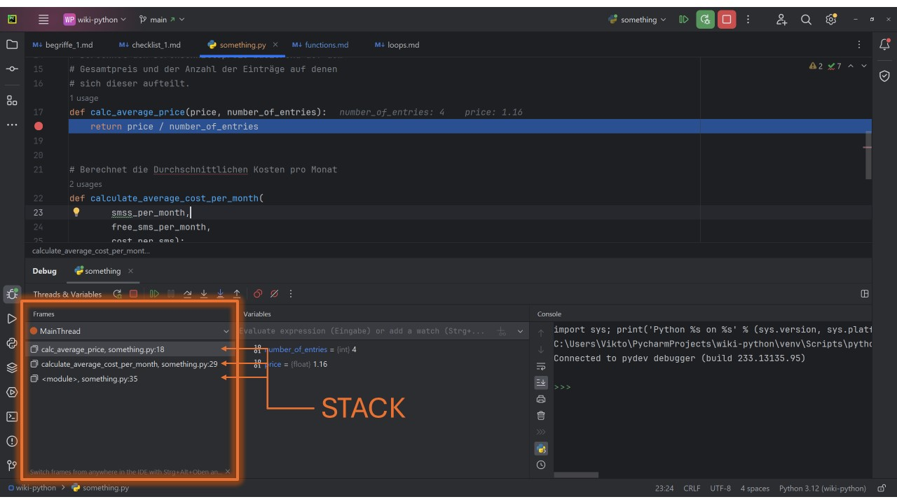
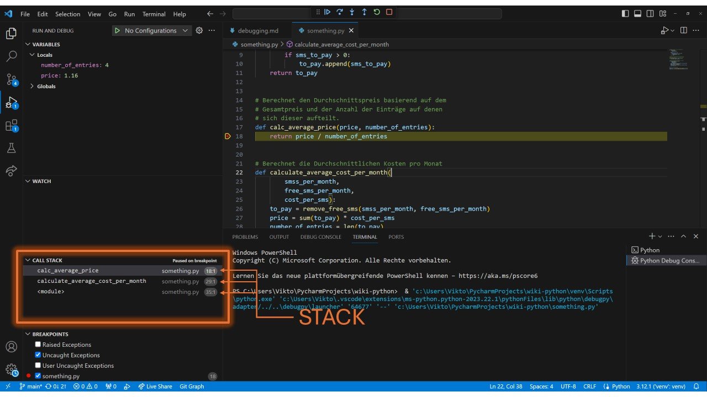

# Lösungen

## Funktionen definieren

### 1. **Einfache Begrüßungsfunktion**
```python
def begruesse():
   print("Hallo Welt!")
begruesse()
```

### 2. **Quadratzahlen**
```python
def quadrat(zahl):
    return zahl * zahl
print(quadrat(4))
```

###  3. **Maximum von zwei Zahlen**
```python
def max_zwei(a, b):
    if a > b:
        return a
    return b
print(max_zwei(3, 5))
```

### 4. **Summierung**
```python
def summiere(a, b, c):
  return a + b + c
print(summiere(1, 2, 3))
```

### 5. **String-Wiederholung**
```python
def wiederhole_string(str, n):
  return str * n
print(wiederhole_string("Hallo", 3))
```

### 6. **Fahrenheit in Celsius**
```python
def fahrenheit_in_celsius(f):
  return (f - 32) * 5/9
print(fahrenheit_in_celsius(100))
```

### 7. **Listenelemente addieren**

```python
def addiere_positive_liste(liste):
    summe = 0
    for i in liste:
        if i > 0:
            summe += i
            
    return summe

print(addiere_positive_liste([1, -2, 3, -4, 5])) # 9
```

### 8. **Listenelemente addieren und prüfen**

```python
def addiere_positive_liste(liste):
    summe = 0
    for i in liste:
        if isinstance(i, (int, float)) and i < 0:
            summe += i
            
    return summe

print(addiere_positive_liste([1, -2, 3, -4, -5.1, "keine Zahl"])) # -11.1
```

### 9. **Check Gerade Zahl**
```python
def ist_gerade(zahl):
  return zahl % 2 == 0
print(ist_gerade(4))
```

### 10. **Countdown**
```python
def countdown(zahl):
   for i in range(zahl, -1, -1):
       print(i)
countdown(5)
```

### 11. **Minimum in Liste finden**
```python
def finde_minimum(liste):
    minimum = liste[0]
    for element in liste[1:]:
        if element < minimum:
            minimum = element
    return minimum

print(finde_minimum([5, 3, 8, 2, 9])) # 2
```

### 12. **Länge eines Strings**
```python
def laenge_string(my_str):
    length = 0
    for _ in my_str:
        length += 1
    return length

print(laenge_string("Python"))
```

### 13. **Multiplikationstabelle**
```python
def multiplikationstabelle(zahl):
   for i in range(1, 11):
       print(f"{zahl} * {i} = {zahl * i}")
multiplikationstabelle(3)
```

### 14. **Palindrome prüfen**

```python
def ist_palindrom(my_str):
    return my_str == my_str[::-1]

print(ist_palindrom("radar"))
```

### 15. **Mehrere Rückgabewerte**
```python
def biggest_and_smallest_word(text):
    words = text.split()
    
    if len(words) == 0:
        return "", ""

    longest = words[0]
    shortest = words[0]
    for word in words:
        if len(word) < len(shortest):
            shortest = word
        if len(word) > len(shortest):
            longest = word

    return shortest, longest
```

# Funktionsstack

### Aufgabe: Stack in Exceptions
* Welcher Fehler ist passiert? `ZeroDivisionError`, weil durch `0` geteilt wurde.
* In welcher Methode ist der Fehler passiert? `calc_average_price`
* In welcher Methode wurde diese Methode aufgerufen? `calculate_average_cost_per_month`
* Wo wurde diese zweite Methode wiederum aufgerufen? Zeile 36

Man kann also den Stack von unten nach oben einfach lesen.

### Aufgabe: Callstack im Debugger
Pycharm:


VSCode:


Wenn man auf die Einträge im Stack klickst, sieht man die Stelle des jeweiligen
Funktionsaufrufes.

### Aufgabe: SMS-Calculator reparieren

Um den Code zu reparieren, müssen die Anzahl der ursprünglichen Einträge berechnet werden.
Mache aus 
```python
number_of_entries = len(to_pay)
```

die Zeile:
```python
number_of_entries = len(smss_per_month)
```

## Funktionen als First Class Citizens

### Aufgabe: Multiplizieren statt addieren🌶

```python
def multiply(a, b):
    return a * b
```

### Aufgabe: Filtern🌶🌶🌶

```python
def smaller_than_5(n):
    return n < 5

def my_filter(my_list, predicate):
    result = []
    for item in my_list:
        if predicate(item):
            result.append(item)
    return result
```

### Parameterübergabe

### Aufgabe: Dictionary verändern🌶🌶

```python
def bigger_dict(my_dict):
    my_dict["new"] = "entry"
    
dic = {'old': 'somethin'}
bigger_dict(dic)

print(dic) # {'old': 'somethin', 'new': 'entry'}
```

### Aufgabe: Kopie ausgeben🌶🌶🌶

```python
def new_bigger_dict(my_dict):
    new_dict = my_dict.copy()
    new_dict["new"] = "entry"
    return new_dict

dic = {'old': 'somethin'}

new_dic = new_bigger_dict(dic)

print(dic) # {'old': 'somethin'}
print(new_dic) # {'old': 'somethin', 'new': 'entry'}
```

