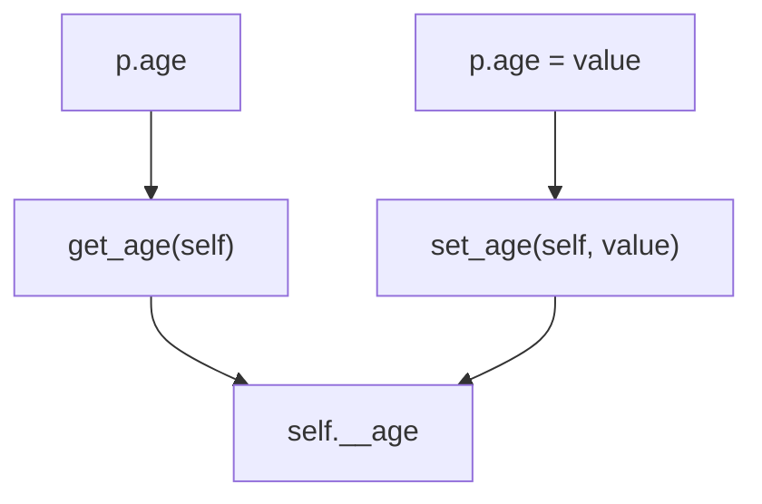

# Getter & Setter

<details>
<summary>
🎦 Video
</summary>
<iframe width="560" height="315" src="https://www.youtube.com/embed/lxU-wYrbb7w?si=vT4oOi07SOlCGGtD" title="YouTube video player" frameborder="0" allow="accelerometer; autoplay; clipboard-write; encrypted-media; gyroscope; picture-in-picture; web-share" allowfullscreen></iframe>
</details>

Wir können bisher auf alle Attribute unserer Klassen zugreifen.
Dies ist einfach, bietet aber auch wenig Schutz vor Quatschdaten.

Z.B. ist es im folgenden Beispiel möglich ein negatives Alter bei
einer Person zu setzen:

[Link zum Onlinecompiler💻](https://pythontutor.com/render.html#code=class%20Person%3A%0A%20%20%20%20def%20__init__%28self,%20age%29%3A%0A%20%20%20%20%20%20%20%20self.age%20%3D%20age%0A%0Ap%20%3D%20Person%28-1%29%0Aprint%28f%22Die%20Person%20ist%20%7Bp.age%7D%20Jahre%20alt.%22%29&cumulative=false&curInstr=0&heapPrimitives=nevernest&mode=display&origin=opt-frontend.js&py=3&rawInputLstJSON=%5B%5D&textReferences=false)


```python
class Person:
    def __init__(self, age):
        self.age = age

p = Person(-1)
print(f"Die Person ist {p.age} Jahre alt.")
```


Wie können wir verhindern, dass solche Eingaben möglich sind?

In anderen Programmiersprachen ist es Konvention sog. Getter- und
Setter Methoden zu definieren. Das könnte dann z.B. so aussehen:

[Link zum Onlinecompiler💻](https://pythontutor.com/render.html#code=class%20Person%3A%0A%20%20%20%20def%20__init__%28self,%20age%29%3A%0A%20%20%20%20%20%20%20%20self.set_age%28age%29%0A%0A%20%20%20%20def%20get_age%28self%29%3A%0A%20%20%20%20%20%20%20%20return%20self.age%0A%20%20%20%20%20%20%20%20%0A%20%20%20%20def%20set_age%28self,%20age%29%3A%0A%20%20%20%20%20%20%20%20self.age%20%3D%20max%280,%20age%29%0A%0A%0Ap%20%3D%20Person%28-1%29%0Aprint%28f%22Die%20Person%20ist%20%7Bp.get_age%28%29%7D%20Jahre%20alt.%22%29&cumulative=false&curInstr=0&heapPrimitives=nevernest&mode=display&origin=opt-frontend.js&py=3&rawInputLstJSON=%5B%5D&textReferences=false)


```python
class Person:
    def __init__(self, age):
        self.set_age(age)

    def get_age(self):
        return self.age
        
    def set_age(self, age):
        self.age = max(0, age)


p = Person(-1)
print(f"Die Person ist {p.get_age()} Jahre alt.")
```


Nun können wir mithilfe vom Setter `set_age` sicherstellen,
dass das Attribut `age` stets einen sinnvollen Wert hat.

Doch um ehrlich zu sein, sieht das nicht wirklich nach Pythoncode
aus. Es ist einerseits umständlich, dass wir das Attribut über
solche Getter und Setter erfragen sollen und andererseits, ist
es uns immer noch möglich das Attribut direkt zu manipulieren!

[Link zum Onlinecompiler💻](https://pythontutor.com/render.html#code=class%20Person%3A%0A%20%20%20%20def%20__init__%28self,%20age%29%3A%0A%20%20%20%20%20%20%20%20self.set_age%28age%29%0A%20%20%20%20%20%20%20%20%0A%20%20%20%20def%20get_age%28self%29%3A%0A%20%20%20%20%20%20%20%20return%20self.age%0A%20%20%20%20%0A%20%20%20%20def%20set_age%28self,%20age%29%3A%0A%20%20%20%20%20%20%20%20self.age%20%3D%20max%280,%20age%29%0A%0A%0Ap%20%3D%20Person%2830%29%0Ap.age%20%3D%20-20%0Aprint%28f%22Die%20Person%20ist%20%7Bp.get_age%28%29%7D%20Jahre%20alt.%22%29&cumulative=false&curInstr=0&heapPrimitives=nevernest&mode=display&origin=opt-frontend.js&py=3&rawInputLstJSON=%5B%5D&textReferences=false)


```python
class Person:
    def __init__(self, age):
        self.set_age(age)
        
    def get_age(self):
        return self.age
    
    def set_age(self, age):
        self.age = max(0, age)


p = Person(30)
p.age = -20
print(f"Die Person ist {p.get_age()} Jahre alt.")
```


Die Antwort: **Property**

Wir definieren ein Attribut `_age`, dass das Alter tatsächlich speichert.

Es gibt eine vorimplementierte Klasse `property`, mit der wir die Methoden
`get_age` und `set_age` nach außen als ein Attribut zur Verfügung stellen,
aber die Änderungen an `age` in Wirklichkeit an `_age` weitergeleitet werden.

[Link zum Onlinecompiler💻](https://pythontutor.com/render.html#code=class%20Person%3A%0A%20%20%20%20def%20__init__%28self,%20age%29%3A%0A%20%20%20%20%20%20%20%20self.age%20%3D%20age%0A%0A%20%20%20%20def%20get_age%28self%29%3A%0A%20%20%20%20%20%20%20%20return%20self.__age%0A%0A%20%20%20%20def%20set_age%28self,%20age%29%3A%0A%20%20%20%20%20%20%20%20self.__age%20%3D%20max%28age,%200%29%0A%0A%20%20%20%20age%20%3D%20property%28get_age,%20set_age%29%0A%0A%0Ap%20%3D%20Person%28-30%29%0Aprint%28f%22Die%20Person%20ist%20%7Bp.age%7D%20Jahre%20alt.%22%29&cumulative=false&curInstr=0&heapPrimitives=nevernest&mode=display&origin=opt-frontend.js&py=3&rawInputLstJSON=%5B%5D&textReferences=false)


```python
class Person:
    def __init__(self, age):
        self.age = age

    def get_age(self):
        return self.__age

    def set_age(self, age):
        self.__age = max(age, 0)

    age = property(get_age, set_age)


p = Person(-30)
print(f"Die Person ist {p.age} Jahre alt.")
```




### Aufgabe: Notendurchschnitt🌶
Erstelle eine Klasse `Student`, mit drei Attributen `mathe`, `python`, `englisch`.

Erstelle eine Methode `get_durchschnitt`, die den Durchschnitt der drei Attribute berechnet.

Erstelle eine Property `durchschnitt`, die nur einen Getter hat und zwar `get_durchschnitt`.

<details><summary>Lösung</summary>
<iframe width="560" height="315" src="https://www.youtube.com/embed/JY6vrxQnGAo?si=N5xboL9qcmP8cNHk" title="YouTube video player" frameborder="0" allow="accelerometer; autoplay; clipboard-write; encrypted-media; gyroscope; picture-in-picture; web-share" allowfullscreen></iframe>
<pre><code>class Student:
    def __init__(self, mathe, python, englisch):
        self.mathe = mathe
        self.python = python
        self.englisch = englisch

    def get_durchschnitt(self):
        return (self.mathe + self.python + self.englisch) / 3

    durchschnitt = property(get_durchschnitt)

print(Student(1,2,1).durchschnitt) # 1.333333333
</code></pre></details>

### Aufgabe: Radius oder Durchmesser🌶🌶🌶

* Erstelle eine Klasse `Kreis` mit zwei Properties: `radius` und `diameter`.
Erstelle die Properties so, dass immer `diameter = 2 * radius` gilt.

* Die Properties sollen auf `0` gesetzt werden, wenn einer der Properties negativ wird.

* Wenn versucht wird die Properties mit einem Wert zu füllen, der nicht `int` oder `float` ist,
soll eine passende Exception geworfen werden.

* Implementiere weiterhin die Möglichkeit den Radius eines Kreises zu vergrößern und zu skalieren,
indem man ihn mit Zahlen multipliziert. Z.B.:

```python
k = Kreis(5)
print(f"Radius: {k.radius}, Durchmesser: {k.diameter}") # Radius: 5, Durchmesser: 10

k2 = k * 2
print(f"Radius: {k2.radius}, Durchmesser: {k2.diameter}") # Radius: 10, Durchmesser: 20
```

* Schreibe mindestens 7 Unittest, die die Anforderungen prüfen.


<details><summary>🍀Tipp Tests</summary>
<pre><code>import unittest


class KreisTest(unittest.TestCase):
    def test_no_negativ_radius(self):
        ...

    def test_no_negativ_radius_from_setting(self):
        ...

    def test_diameter_is_ready_automatically(self):
        ...

    def test_radius_connected_to_diameter(self):
        ...

    def test_diameter_is_connected_to_radius(self):
        ...

    def test_multiply_kreis_with_positiv_number(self):
        ...

    def test_multiply_kreis_with_negativ_number(self):
        ...

</code></pre></details>

<details><summary>Lösung Tests</summary>
<iframe width="560" height="315" src="https://www.youtube.com/embed/3mH44DRp4Eo?si=S0jMli8t9yiXE5_c" title="YouTube video player" frameborder="0" allow="accelerometer; autoplay; clipboard-write; encrypted-media; gyroscope; picture-in-picture; web-share" allowfullscreen></iframe>
<pre><code>import unittest


class KreisTest(unittest.TestCase):
    def test_no_negativ_radius(self):
        kreis = Kreis(-5)
        self.assertEqual(kreis.diameter, 0)
        self.assertEqual(kreis.radius, 0)

    def test_no_negativ_radius_from_setting(self):
        kreis = Kreis(5)
        kreis.diameter = -3
        self.assertEqual(kreis.diameter, 0)
        self.assertEqual(kreis.radius, 0)

    def test_diameter_is_ready_automatically(self):
        kreis = Kreis(5)
        self.assertEqual(kreis.diameter, 10)

    def test_radius_connected_to_diameter(self):
        kreis = Kreis(5)
        kreis.radius = 7
        self.assertEqual(kreis.diameter, 14)

    def test_diameter_is_connected_to_radius(self):
        kreis = Kreis(5)
        kreis.diameter = 3
        self.assertAlmostEqual(1.5, kreis.radius)

    def test_multiply_kreis_with_positiv_number(self):
        kreis = Kreis(5) * 3
        self.assertEqual(kreis.diameter, 30)

    def test_multiply_kreis_with_negativ_number(self):
        kreis = Kreis(5) * -3
        self.assertEqual(kreis.diameter, 0)

    # Es können noch Tests hinzugefügt werden, die prüfen,
    # dass die richtigen Exceptions geworfen werden.
</code></pre>
</code></pre></details>

<details><summary>🍀Tipp Implementierung der Klasse</summary>
Überlege dir, wie viele Attribute es tatsächlich brauch, um
Radius und Durchmesser zu speichern. 
Für das Multiplizieren nutze <code>__mul__</code>.</details>

<details><summary>Lösung Implementierung der Klasse</summary>
<iframe width="560" height="315" src="https://www.youtube.com/embed/LzCGoGBIoks?si=4zW3Wcw2XzMb0Hif" title="YouTube video player" frameborder="0" allow="accelerometer; autoplay; clipboard-write; encrypted-media; gyroscope; picture-in-picture; web-share" allowfullscreen></iframe>
<pre><code>class Kreis:
    def __init__(self, radius):
        self.radius = radius

    def get_radius(self):
        return self.__radius

    def set_radius(self, radius):
        if isinstance(radius, int | float):
            self.__radius = max(0, radius)
        else:
            raise TypeError()

    def get_diameter(self):
        return self.radius * 2

    def set_diameter(self, diameter):
        self.radius = diameter / 2

    def __mul__(self, other):
        if isinstance(other, int | float):
            return Kreis(self.radius * other)
        else:
            raise TypeError()

    diameter = property(get_diameter, set_diameter)
    radius = property(get_radius, set_radius)
</code></pre>
</details>

## Schönheit mit Dekoratoren

<details>
<summary>
🎦 Video
</summary>
<iframe width="560" height="315" src="https://www.youtube.com/embed/DX2cTLtPw60?si=o2DDk_i2fKIg35X5" title="YouTube video player" frameborder="0" allow="accelerometer; autoplay; clipboard-write; encrypted-media; gyroscope; picture-in-picture; web-share" allowfullscreen></iframe>
</details>

In Python, ist es möglich über Funktionen **Dekoratoren** zu setzen.
Diese können das Verhalten von Funktionen auf vielfältige Art und Weise
manipulieren. Zur Definition von Properties, wird oft der `@property`
Dekorator verwendet. Das kann dann so aussehen:

[Link zum Onlinecompiler💻](https://pythontutor.com/render.html#code=class%20Person%3A%0A%20%20%20%20def%20__init__%28self,%20age%29%3A%0A%20%20%20%20%20%20%20%20self.age%20%3D%20age%0A%0A%20%20%20%20%40property%0A%20%20%20%20def%20age%28self%29%3A%0A%20%20%20%20%20%20%20%20return%20self.__age%0A%0A%20%20%20%20%40age.setter%0A%20%20%20%20def%20age%28self,%20age%29%3A%0A%20%20%20%20%20%20%20%20self.__age%20%3D%20max%28age,%200%29%0A%0A%0Ap%20%3D%20Person%28-30%29%0Aprint%28f%22Die%20Person%20ist%20%7Bp.age%7D%20Jahre%20alt.%22%29&cumulative=false&curInstr=0&heapPrimitives=nevernest&mode=display&origin=opt-frontend.js&py=3&rawInputLstJSON=%5B%5D&textReferences=false)


```python
class Person:
    def __init__(self, age):
        self.age = age

    @property
    def age(self):
        return self.__age

    @age.setter
    def age(self, age):
        self.__age = max(age, 0)


p = Person(-30)
print(f"Die Person ist {p.age} Jahre alt.")
```


Wir stellen fest:

* Getter und Setter werden direkt wie das Property benannt, `get_` bzw. `set_` als Präfix ist also nicht mehr nötig.
* An den Getter schreiben wir `@property`.
* An den Setter schreiben wir `@x.setter`, wobei `x` der Name der Funktion ist, bei der wir `@property` gesetzt haben.

### Aufgabe: Noch mal in Dekoratoren🌶

Passe dein Beispiel aus [Aufgabe: Notendurchschnitt](#aufgabe-notendurchschnitt)
und aus [Aufgabe: Radius und Durchmesser](#aufgabe-radius-oder-durchmesser)
so an, dass es mit Dekoratoren funktioniert.

<details><summary>Lösung Notendurchschnitt</summary>
<iframe width="560" height="315" src="https://www.youtube.com/embed/1Wgn0rTlBQg?si=cljmPH2I-82IqmxN" title="YouTube video player" frameborder="0" allow="accelerometer; autoplay; clipboard-write; encrypted-media; gyroscope; picture-in-picture; web-share" allowfullscreen></iframe>
<pre><code>class Student:
    def __init__(self, mathe, python, englisch):
        self.mathe = mathe
        self.python = python
        self.englisch = englisch

    @property
    def durchschnitt(self):
        return (self.mathe + self.python + self.englisch) / 3


print(Student(1,2,1).durchschnitt) # 1.333333333
</code></pre></details>

<details><summary>Lösung Radius und Durchmesser</summary>
<iframe width="560" height="315" src="https://www.youtube.com/embed/9IdzD5pMjXs?si=GXyytGuuTXuAImO-" title="YouTube video player" frameborder="0" allow="accelerometer; autoplay; clipboard-write; encrypted-media; gyroscope; picture-in-picture; web-share" allowfullscreen></iframe>
<pre><code>class Kreis:
    def __init__(self, radius):
        self.radius = radius

    @property
    def radius(self):
        return self.__radius

    @radius.setter
    def radius(self, radius):
        if isinstance(radius, int | float):
            self.__radius = max(0, radius)
        else:
            raise TypeError()

    @property
    def diameter(self):
        return self.radius * 2

    @diameter.setter
    def diameter(self, diameter):
        self.radius = diameter / 2

    def __mul__(self, other):
        if isinstance(other, int | float):
            return Kreis(self.radius * other)
        else:
            raise TypeError()
</code></pre></details>
