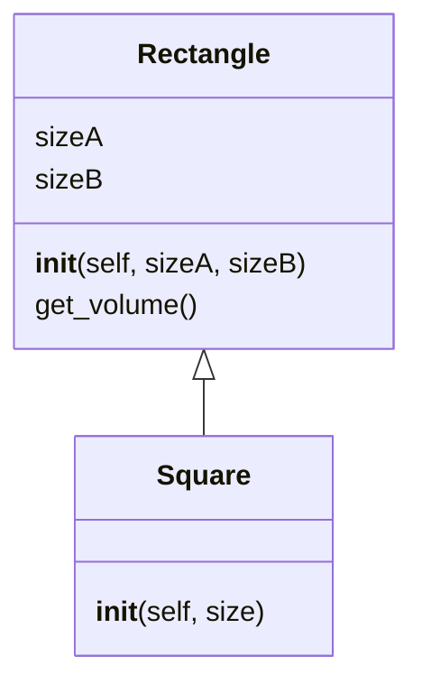
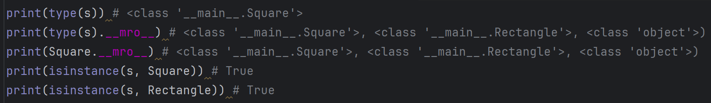
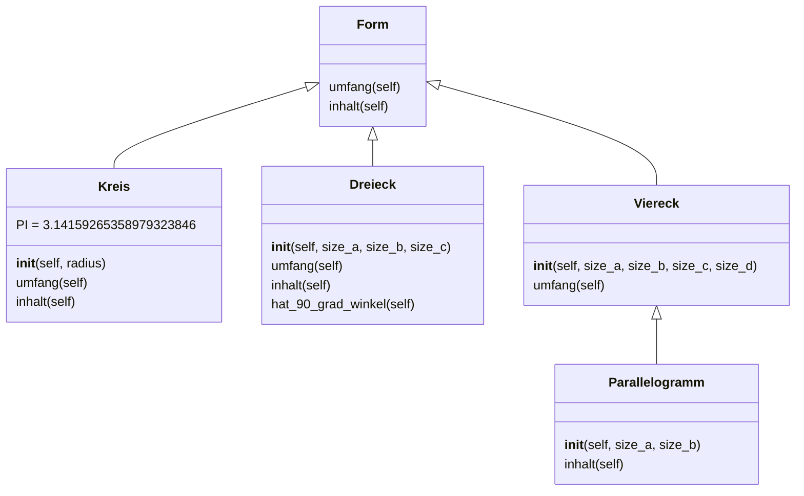
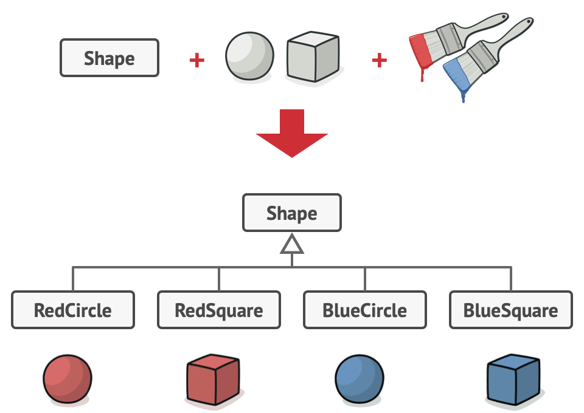
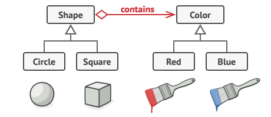

# Vererbung

Die Vererbung ist ein fundamentales Konzept in der objektorientierten Programmierung (OOP),
das die Wiederverwendbarkeit von Code ermöglicht. In Python wird Vererbung durch die Schaffung
von Klassen als Unterklasse einer anderen Klasse realisiert.

## Beispiel 1

<details>
<summary>
🎦 Video
</summary>
<iframe width="560" height="315" src="https://www.youtube.com/embed/R6udelJEECs?si=w9TCHBiZ6ffc70c5" title="YouTube video player" frameborder="0" allow="accelerometer; autoplay; clipboard-write; encrypted-media; gyroscope; picture-in-picture; web-share" allowfullscreen></iframe>
</details>


Wir erzeugen als erstes Beispiel dafür eine Klasse `Rectangle`:

[Link zum Onlinecompiler💻](https://pythontutor.com/render.html#code=class%20Rectangle%3A%0A%20%20%20%20def%20__init__%28self,%20sizeA,%20sizeB%29%3A%0A%20%20%20%20%20%20%20%20self.sizeA%20%3D%20sizeA%0A%20%20%20%20%20%20%20%20self.sizeB%20%3D%20sizeB%0A%20%20%20%20%20%20%20%20%0A%20%20%20%20def%20get_volume%28self%29%3A%0A%20%20%20%20%20%20%20%20return%20self.sizeA%20*%20self.sizeB%0A%0Ar%20%3D%20Rectangle%283,%204%29%0Aprint%28r.get_volume%28%29%29&cumulative=false&curInstr=0&heapPrimitives=nevernest&mode=display&origin=opt-frontend.js&py=3&rawInputLstJSON=%5B%5D&textReferences=false)


```python
class Rectangle:
    def __init__(self, sizeA, sizeB):
        self.sizeA = sizeA
        self.sizeB = sizeB
        
    def get_volume(self):
        return self.sizeA * self.sizeB

r = Rectangle(3, 4)
print(r.get_volume())
```


Nun gibt es aber auch spezielle Rechtecke, wie z.B. Quadrate. Wenn wir diese definieren,
dann wollen wir gerne die Implementierung von `Rectangle` nutzen.
Wir erreichen dies, indem wir eine Klasse `Square` definieren, die von `Rectangle` erbt.
Dies zeigen wir an, indem wir beim Klassenkopf nach dem Klassennamen in runden Klammern notieren,
was die Oberklasse sein soll. Die abgeleitete Klasse `Square` hat zugriff auf alle Attribute und
Funktionen, die in `Rectangle` definiert sind:

[Link zum Onlinecompiler💻](https://pythontutor.com/render.html#code=class%20Rectangle%3A%0A%20%20%20%20def%20__init__%28self,%20sizeA,%20sizeB%29%3A%0A%20%20%20%20%20%20%20%20self.sizeA%20%3D%20sizeA%0A%20%20%20%20%20%20%20%20self.sizeB%20%3D%20sizeB%0A%0A%20%20%20%20def%20get_volume%28self%29%3A%0A%20%20%20%20%20%20%20%20return%20self.sizeA%20*%20self.sizeB%0A%0A%0Aclass%20Square%28Rectangle%29%3A%0A%20%20%20%20def%20__init__%28self,%20size%29%3A%0A%20%20%20%20%20%20%20%20self.sizeA%20%3D%20size%0A%20%20%20%20%20%20%20%20self.sizeB%20%3D%20size%0A%0A%0As%20%3D%20Square%284%29%0Aprint%28s.get_volume%28%29%29&cumulative=false&curInstr=0&heapPrimitives=nevernest&mode=display&origin=opt-frontend.js&py=3&rawInputLstJSON=%5B%5D&textReferences=false)


```python
class Rectangle:
    def __init__(self, sizeA, sizeB):
        self.sizeA = sizeA
        self.sizeB = sizeB

    def get_volume(self):
        return self.sizeA * self.sizeB


class Square(Rectangle):
    def __init__(self, size):
        self.sizeA = size
        self.sizeB = size


s = Square(4)
print(s.get_volume())
```


Wir sehen hier, dass die `Square`-instanz `s` auf die Funktion `get_volume` aus `Rectangle` zugreifen kann.



Unser Code erlaubt noch eine Verbesserung. Wir legen im `__init__` von `Square` die Felder `sizeA`
und `sizeB` selbst fest, statt die `__init__` Methode von `Rectangle` auszunutzen. Hier gibt es zwei Varianten,
wie wir vorgehen könnten. Wir könnten `Rectange.__init__(self, size, size)` aufrufen, oder wir nutzen
die `super()` Methode wie folgt:

[Link zum Onlinecompiler💻](https://pythontutor.com/render.html#code=class%20Rectangle%3A%0A%20%20%20%20def%20__init__%28self,%20sizeA,%20sizeB%29%3A%0A%20%20%20%20%20%20%20%20self.sizeA%20%3D%20sizeA%0A%20%20%20%20%20%20%20%20self.sizeB%20%3D%20sizeB%0A%0A%20%20%20%20def%20get_volume%28self%29%3A%0A%20%20%20%20%20%20%20%20return%20self.sizeA%20*%20self.sizeB%0A%0A%0Aclass%20Square%28Rectangle%29%3A%0A%20%20%20%20def%20__init__%28self,%20size%29%3A%0A%20%20%20%20%20%20%20%20super%28%29.__init__%28size,%20size%29%0A%0A%0As%20%3D%20Square%284%29%0Aprint%28s.get_volume%28%29%29&cumulative=false&curInstr=0&heapPrimitives=nevernest&mode=display&origin=opt-frontend.js&py=3&rawInputLstJSON=%5B%5D&textReferences=false)


```python
class Rectangle:
    def __init__(self, sizeA, sizeB):
        self.sizeA = sizeA
        self.sizeB = sizeB

    def get_volume(self):
        return self.sizeA * self.sizeB


class Square(Rectangle):
    def __init__(self, size):
        super().__init__(size, size)


s = Square(4)
print(s.get_volume())
```


### Aufgabe: Typen erkennen🌶
Erstelle eine Instanz `s` von `Square`. Was ist `type(s)`? Was ist `type(s).__mro__` bzw. von `Square.__mro__`?
Was ist das Ergebnis von `isinstance(s, Square)` und von `isinstance(s, Rectangle)`

<details>
<summary>Lösung</summary>
Es werden bei <code>__mro__</code> also alle Obertypen aufgelistet.

</details>

## Beispiel 2

<details>
<summary>
🎦 Video
</summary>
<iframe width="560" height="315" src="https://www.youtube.com/embed/OlJ2vE6Ri0Y?si=7L7oiKYkfj3QWEEq" title="YouTube video player" frameborder="0" allow="accelerometer; autoplay; clipboard-write; encrypted-media; gyroscope; picture-in-picture; web-share" allowfullscreen></iframe>
</details>

Im folgenden Beispiel sehen wir, wie `super()` sowohl dafür verwendet wird, 
wie die `__init__` Methode aufzurufen, als auch die Methdoe `starten`, die in
der Klasse `Elektroauto` überschrieben wird.

[Link zum Onlinecompiler💻](https://pythontutor.com/render.html#code=class%20Auto%3A%0A%20%20%20%20def%20__init__%28self,%20marke,%20modell%29%3A%0A%20%20%20%20%20%20%20%20self.marke%20%3D%20marke%0A%20%20%20%20%20%20%20%20self.modell%20%3D%20modell%0A%0A%20%20%20%20def%20starten%28self%29%3A%0A%20%20%20%20%20%20%20%20return%20f%22%7Bself.marke%7D%20%7Bself.modell%7D%20wird%20gestartet.%22%0A%0Aclass%20Elektroauto%28Auto%29%3A%0A%20%20%20%20def%20__init__%28self,%20marke,%20modell,%20reichweite%29%3A%0A%20%20%20%20%20%20%20%20super%28%29.__init__%28marke,%20modell%29%0A%20%20%20%20%20%20%20%20self.reichweite%20%3D%20reichweite%0A%0A%20%20%20%20def%20starten%28self%29%3A%0A%20%20%20%20%20%20%20%20return%20f%22%7Bsuper%28%29.starten%28%29%7D%20Elektromotor%20wird%20aktiviert.%22%0A%0A%20%20%20%20def%20aufladen%28self%29%3A%0A%20%20%20%20%20%20%20%20return%20f%22%7Bself.marke%7D%20%7Bself.modell%7D%20wird%20aufgeladen.%22%0A%0A%23%20Instanzen%20erstellen%0Amein_auto%20%3D%20Auto%28%22Volkswagen%22,%20%22Golf%22%29%0Amein_elektroauto%20%3D%20Elektroauto%28%22Tesla%22,%20%22Model%20S%22,%20500%29%0A%0A%23%20Methoden%20aufrufen%0Aprint%28mein_auto.starten%28%29%29%20%20%20%20%20%20%20%20%20%20%23%20Ausgabe%3A%20%22Volkswagen%20Golf%20wird%20gestartet.%22%0Aprint%28mein_elektroauto.starten%28%29%29%20%20%20%23%20Ausgabe%3A%20%22Tesla%20Model%20S%20wird%20gestartet.%20Elektromotor%20wird%20aktiviert.%22%0Aprint%28mein_elektroauto.aufladen%28%29%29%20%20%23%20Ausgabe%3A%20%22Tesla%20Model%20S%20wird%20aufgeladen.%22&cumulative=false&curInstr=0&heapPrimitives=nevernest&mode=display&origin=opt-frontend.js&py=3&rawInputLstJSON=%5B%5D&textReferences=false)


```python
class Auto:
    def __init__(self, marke, modell):
        self.marke = marke
        self.modell = modell

    def starten(self):
        return f"{self.marke} {self.modell} wird gestartet."

class Elektroauto(Auto):
    def __init__(self, marke, modell, reichweite):
        super().__init__(marke, modell)
        self.reichweite = reichweite

    def starten(self):
        return f"{super().starten()} Elektromotor wird aktiviert."

    def aufladen(self):
        return f"{self.marke} {self.modell} wird aufgeladen."

# Instanzen erstellen
mein_auto = Auto("Volkswagen", "Golf")
mein_elektroauto = Elektroauto("Tesla", "Model S", 500)

# Methoden aufrufen
print(mein_auto.starten())          # Ausgabe: "Volkswagen Golf wird gestartet."
print(mein_elektroauto.starten())   # Ausgabe: "Tesla Model S wird gestartet. Elektromotor wird aktiviert."
print(mein_elektroauto.aufladen())  # Ausgabe: "Tesla Model S wird aufgeladen."
```


### Aufgabe: Verschiedene Tiere🌶

Erstellen Sie eine Python-Anwendung, die folgende Klassen für verschiedene Arten von Tieren implementiert:

Die Basisklasse `Tier` mit den Eigenschaft `name` und die Methode`bewegen()`.
Die Methode `bewegen()` soll den Namen des Tiers gefolgt von 
einem Satz wie "bewegt sich" ausgeben.

Die abgeleitete Klasse `Hund`, die von `Tier` erbt und zusätzlich die Methode `bellen()` hat.
Die Methode `bellen()` soll den Namen des Hundes gefolgt von "bellt" ausgeben.

Die abgeleitete Klasse Katze, die von Tier erbt und zusätzlich die Methode `miauen()` hat.
Die Methode `miauen()` soll den Namen der Katze gefolgt von "miaut" ausgeben. Der folgende Code
soll durchführbar sein:

```python 
tier1 = Tier("Tier1")
tier1.bewegen()

hund1 = Hund("Bello")
hund1.bewegen()
hund1.bellen()

katze1 = Katze("Minka")
katze1.bewegen()
katze1.miauen()
```

<details>
<summary>Lösung</summary>
<iframe width="560" height="315" src="https://www.youtube.com/embed/e2a_RHTPJRc?si=GLBwSrJoj-WmsZGr" title="YouTube video player" frameborder="0" allow="accelerometer; autoplay; clipboard-write; encrypted-media; gyroscope; picture-in-picture; web-share" allowfullscreen></iframe>
<pre><code>class Tier:
    def __init__(self, name):
        self.name = name

    def bewegen(self):
        print(f"{self.name} bewegt sich.")


class Hund(Tier):
    def bellen(self):
        print(f"{self.name} bellt.")


class Katze(Tier):
    def miauen(self):
        print(f"{self.name} miaut.")
</code></pre>
</details>

### Aufgabe: Geometry🌶🌶🌶
Erstelle die folgenden Klassen:

* `Form` hat zwei Methoden `inhalt` und `umfang`, die beide einen `NotImplementedError` werfen, wenn sie aufgeruft werden.
* `Kreis` erbt von `Form` und hat ein Klassenatrribut `PI = 3.14159265358979323846` und ein Attribut `radius`. `inhalt` und `umfang` sind implementiert.
* `Dreieck` erbt von `Form` und hat drei Seiten `sizeA`, `sizeB` und `sizeC`. Weiterhin gibt es eine Methode `hat_90_grad_winkel`, die mit dem Satz des Pythagoras prüft, ob es einen 90°-Winkel im Dreieck gibt. `inhalt` und `umfang` sind implementiert.
* `Viereck` erbt von `Form` und hat vier Seiten `sizeA`, `sizeB`, `sizeC` und `sizeD`. Diese implementiert die Methode `umfang`.
* `Parallelogram` erbt von `Viereck` ist über zwei Seiten festgelegt. Diese implementiert die Methode `inhalt`.
* Entwickle selbst mindestens zwei Methoden, die prüfen, ob die Formen bestimmte Eigenschaften erfüllen und implementiere eigene Tests dazu (jeweils mindestens 4). 

Das folgende Diagramm zeigt, dir die Struktur der Klassen:



Nutze dazu die folgenden Klassenköpfe:

```python
# Nutze isclose, um zu prüfen, ob zwei Floats gleich sind
from math import isclose


class Form:
    ...


class Dreieck():
    ...


class Kreis():
    ...


class Viereck():
    ...


class Parallelogramm():
    ...

```

Implementiere alle Methoden so, sodass die folgenden Tests erfolgreich sind:

```python
from unittest import TestCase


class FormsTest(TestCase):

    def test_dreieck_type(self):
        d = Dreieck(0.3, 0.2, 0.1)
        self.assertIsInstance(d, Form)

    def test_dreieck_umfang_0(self):
        d = Dreieck(0.3, 0.2, 0.1)
        self.assertAlmostEqual(d.umfang(), 0.6)

    def test_dreieck_umfang_1(self):
        d = Dreieck(1, 12, 23)
        self.assertAlmostEqual(d.umfang(), 36)

    def test_dreieck_umfang_2(self):
        d = Dreieck(3, 3.0, 3)
        self.assertAlmostEqual(d.umfang(), 9.0)

    def test_dreieck_inhalt_0(self):
        d = Dreieck(1, 1, 1)
        self.assertAlmostEqual(d.inhalt(), 0.4330127018922193)

    def test_dreieck_inhalt_1(self):
        d = Dreieck(1, 1, 2 ** 0.5)
        self.assertAlmostEqual(d.inhalt(), 0.5)

    def test_dreieck_inhalt_2(self):
        d = Dreieck(3, 4, 5)
        self.assertAlmostEqual(d.inhalt(), 6)

    def test_dreieck_hat_90_grad_winkel_0(self):
        d = Dreieck(4, 3, 5)
        self.assertTrue(d.hat_90_grad_winkel())

    def test_dreieck_hat_90_grad_winkel_1(self):
        d = Dreieck(4, 3, 6)
        self.assertFalse(d.hat_90_grad_winkel())

    def test_dreieck_hat_90_grad_winkel_2(self):
        d = Dreieck(1, 1, 2 ** 0.5)
        self.assertTrue(d.hat_90_grad_winkel())

    def test_dreieck_hat_90_grad_winkel_3(self):
        d = Dreieck(1, 2 ** 0.5, 1)
        self.assertTrue(d.hat_90_grad_winkel())

    def test_kreis_type(self):
        k = Kreis(1)
        self.assertIsInstance(k, Form)

    def test_kreis_pi_0(self):
        self.assertTrue(hasattr(Kreis, 'PI'))

    def test_kreis_umfang_0(self):
        k = Kreis(1)
        self.assertAlmostEqual(k.umfang(), 6.2831853)

    def test_kreis_umfang_1(self):
        k = Kreis(0.5)
        self.assertAlmostEqual(k.umfang(), 3.14159265)

    def test_kreis_umfang_2(self):
        k = Kreis(15)
        self.assertAlmostEqual(k.umfang(), 94.2477796)

    def test_kreis_inhalt_0(self):
        k = Kreis(1)
        self.assertAlmostEqual(k.inhalt(), 3.14159265)

    def test_kreis_inhalt_1(self):
        k = Kreis(0.5)
        self.assertAlmostEqual(k.inhalt(), 0.785398163)

    def test_kreis_inhalt_2(self):
        k = Kreis(15)
        self.assertAlmostEqual(k.inhalt(), 706.85834705)

    def test_viereck_type(self):
        v = Viereck(1, 2, 3, 4)
        self.assertIsInstance(v, Form)

    def test_viereck_inhalt_fail_0(self):
        with self.assertRaises(NotImplementedError):
            v = Viereck(1, 2, 3, 4)
            v.inhalt()

    def test_viereck_umfang_0(self):
        v = Viereck(1, 2, 3, 4)
        self.assertAlmostEqual(v.umfang(), 10)

    def test_viereck_umfang_1(self):
        v = Viereck(1, 1, 1, 1)
        self.assertAlmostEqual(v.umfang(), 4)

    def test_parallelogramm_type(self):
        p = Parallelogramm(1, 2)
        self.assertIsInstance(p, Viereck)

    def test_parallelogramm_umfang_0(self):
        p = Parallelogramm(1, 2)
        self.assertAlmostEqual(p.umfang(), 6)

    def test_parallelogramm_inhalt_0(self):
        p = Parallelogramm(1, 2)
        self.assertAlmostEqual(p.inhalt(), 2)

    def test_parallelogramm_inhalt_1(self):
        p = Parallelogramm(1, 1)
        self.assertAlmostEqual(p.inhalt(), 1)

    def test_parallelogramm_inhalt_2(self):
        p = Parallelogramm(0.5, 0.5)
        self.assertAlmostEqual(p.inhalt(), .25)

    def test_form_inhalt_fail_0(self):
        with self.assertRaises(NotImplementedError):
            f = Form()
            f.inhalt()

    def test_form_umfang_fail_0(self):
        with self.assertRaises(NotImplementedError):
            f = Form()
            f.umfang()

```

<details>
<summary>Lösung</summary>
<pre><code>from math import isclose


class Form:
    def umfang(self):
        raise NotImplementedError("Kann nicht für diese Allgemeine Form bestimmt werden")

    def inhalt(self):
        raise NotImplementedError("Kann nicht für diese Allgemeine Form bestimmt werden")


class Dreieck(Form):
    def __init__(self, size_a, size_b, size_c):
        self.size_a = size_a
        self.size_b = size_b
        self.size_c = size_c

    def umfang(self):
        return self.size_a + self.size_b + self.size_c

    def inhalt(self):
        s = self.umfang() / 2
        result = (s * (s - self.size_a) * (s - self.size_b) * (s - self.size_c)) ** 0.5
        return result

    def hat_90_grad_winkel(self):
        squared_sizes = [s ** 2 for s in (self.size_a, self.size_b, self.size_c)]
        squared_sizes.sort()
        return isclose(squared_sizes[0] + squared_sizes[1], squared_sizes[2])


class Kreis(Form):
    PI = 3.14159265358979323846

    def __init__(self, radius):
        self.radius = radius

    def umfang(self):
        return 2 * self.PI * self.radius

    def inhalt(self):
        return self.PI * self.radius ** 2


class Viereck(Form):
    def __init__(self, size_a, size_b, size_c, size_d):
        self.size_a = size_a
        self.size_b = size_b
        self.size_c = size_c
        self.size_d = size_d

    def umfang(self):
        return self.size_a + self.size_b + self.size_c + self.size_d


class Parallelogramm(Viereck):
    def __init__(self, size_a, size_b):
        super().__init__(size_a, size_b, size_a, size_b)

    def inhalt(self):
        return self.size_a * self.size_b
</code></pre>
</details>

### Aufgabe: Composition over Inheritance🌶🌶

Betrachte das folgende Beispiel vom gefärbten Formen:

```python
class Shape:
    pass

class RedCircle(Shape):
    pass

class RedSquare(Shape):
    pass

class BlueCircle(Shape):
    pass

class BlueSquare(Shape):
    pass
```



Angenommen eine neue Farbe wird hinzugefügt, welche neuen Klassen würde das erzeugen?
Angenommen es wird dann noch eine neue Farbe hinzugefügt, wie viele neue Klassen müssen dann erzeugt werden?

Betrachte nun diesen Code:

```python
class Shape:
    def __init__(self, color):
        self.color = color
        
class Circle(Shape):
    pass

class Square(Shape):
    pass
    
class Color:
    pass

class Red(Color):
    pass

class Blue(Color):
    pass
```



Wir stellen nun dieselben Fragen erneut:
Angenommen eine neue Farbe wird hinzugefügt, welche neuen Klassen würde das erzeugen?
Angenommen es wird dann noch eine neue Farbe hinzugefügt, wie viele neue Klassen müssen dann erzeugt werden?

<details>
<summary>Lösung</summary>
Im ersten Fall müssen bei einer neuen Farbe zwei neue Klassen erstellt werden.
z.B. <code>GreenCircle</code> und <code>GreenSquare</code>. Danach muss man, um eine neue
Shape hinzuzufügen schon drei Klassen hinzufügen, z.B. <code>RedTriangle</code>, <code>BlueTriangle</code>
und <code>GreenTriangle</code>.

Wir erkennen, dass die Anzahl an neuen Klassen immer größer und größer wird.
Insbesondere erzeugen wir auch viele Klassen, von denen wir gar nicht wissen, ob wir sie je wirklich brauchen.

Besser ist es den Code, wie im zweiten Beispiel zu strukturieren. Hier wird bei einem
neuen Shape bzw. neuen Farbe jeweils nur eine Klasse erzeugt, z.B. einfach <code>Triangle</code> und
<code>Green</code>.

Welche Farbe ein Shape hat, wird dann einfach über das Attribut `self.color` gesteuert.

Man sollte also immer überlegen, ob Vererbung tatsächlich notwendig ist.
</details>

Untersuche den folgenden Code. Teile die Klassen analog zum letzten Beispiel auf:

```python
class Sportler:
    pass

class DeutscherHandballer(Sportler):
    pass

class DeutscherFussballer(Sportler):
    pass

class EnglischerHandballer(Sportler):
    pass

class EnglischerHandballer(Sportler):
    pass
```

<details>
<summary>Lösung</summary>
<pre><code>class Sportler:
    def __init__(self, nation):
        self.nation = nation

class Handballer(Sportler):
    pass

class Fussballer(Sportler):
    pass

class Nation:
    pass

class Deutsch(Nation):
    pass

class Englisch(Nation):
    pass
</code></pre></details>
