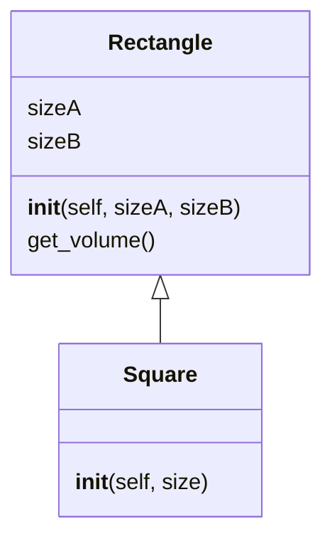

# Vererbung

Die Vererbung ist ein fundamentales Konzept in der objektorientierten Programmierung (OOP),
das die Wiederverwendbarkeit von Code ermöglicht. In Python wird Vererbung durch die Schaffung
von Klassen als Unterklasse einer anderen Klasse realisiert.

## Beispiel 1

{{ youtube_video("https://www.youtube.com/embed/R6udelJEECs?si=w9TCHBiZ6ffc70c5") }}

Wir erzeugen als erstes Beispiel dafür eine Klasse `Rectangle`:

[Link zum Onlinecompiler💻](https://pythontutor.com/render.html#code=class%20Rectangle%3A%0A%20%20%20%20def%20__init__%28self,%20sizeA,%20sizeB%29%3A%0A%20%20%20%20%20%20%20%20self.sizeA%20%3D%20sizeA%0A%20%20%20%20%20%20%20%20self.sizeB%20%3D%20sizeB%0A%20%20%20%20%20%20%20%20%0A%20%20%20%20def%20get_volume%28self%29%3A%0A%20%20%20%20%20%20%20%20return%20self.sizeA%20*%20self.sizeB%0A%0Ar%20%3D%20Rectangle%283,%204%29%0Aprint%28r.get_volume%28%29%29&cumulative=false&curInstr=0&heapPrimitives=nevernest&mode=display&origin=opt-frontend.js&py=3&rawInputLstJSON=%5B%5D&textReferences=false)

```python
class Rectangle:
    def __init__(self, sizeA, sizeB):
        self.sizeA = sizeA
        self.sizeB = sizeB
        
    def get_volume(self):
        return self.sizeA * self.sizeB

r = Rectangle(3, 4)
print(r.get_volume())
```

Nun gibt es aber auch spezielle Rechtecke, wie z.B. Quadrate. Wenn wir diese definieren,
dann wollen wir gerne die Implementierung von `Rectangle` nutzen.
Wir erreichen dies, indem wir eine Klasse `Square` definieren, die von `Rectangle` erbt.
Dies zeigen wir an, indem wir beim Klassenkopf nach dem Klassennamen in runden Klammern notieren,
was die Oberklasse sein soll. Die abgeleitete Klasse `Square` hat zugriff auf alle Attribute und
Funktionen, die in `Rectangle` definiert sind:

[Link zum Onlinecompiler💻](https://pythontutor.com/render.html#code=class%20Rectangle%3A%0A%20%20%20%20def%20__init__%28self,%20sizeA,%20sizeB%29%3A%0A%20%20%20%20%20%20%20%20self.sizeA%20%3D%20sizeA%0A%20%20%20%20%20%20%20%20self.sizeB%20%3D%20sizeB%0A%0A%20%20%20%20def%20get_volume%28self%29%3A%0A%20%20%20%20%20%20%20%20return%20self.sizeA%20*%20self.sizeB%0A%0A%0Aclass%20Square%28Rectangle%29%3A%0A%20%20%20%20def%20__init__%28self,%20size%29%3A%0A%20%20%20%20%20%20%20%20self.sizeA%20%3D%20size%0A%20%20%20%20%20%20%20%20self.sizeB%20%3D%20size%0A%0A%0As%20%3D%20Square%284%29%0Aprint%28s.get_volume%28%29%29&cumulative=false&curInstr=0&heapPrimitives=nevernest&mode=display&origin=opt-frontend.js&py=3&rawInputLstJSON=%5B%5D&textReferences=false)

```python
class Rectangle:
    def __init__(self, sizeA, sizeB):
        self.sizeA = sizeA
        self.sizeB = sizeB

    def get_volume(self):
        return self.sizeA * self.sizeB

class Square(Rectangle):
    def __init__(self, size):
        self.sizeA = size
        self.sizeB = size

s = Square(4)
print(s.get_volume())
```

Wir sehen hier, dass die `Square`-instanz `s` auf die Funktion `get_volume` aus `Rectangle` zugreifen kann.



Unser Code erlaubt noch eine Verbesserung. Wir legen im `__init__` von `Square` die Felder `sizeA`
und `sizeB` selbst fest, statt die `__init__` Methode von `Rectangle` auszunutzen. Hier gibt es zwei Varianten,
wie wir vorgehen könnten. Wir könnten `Rectange.__init__(self, size, size)` aufrufen, oder wir nutzen
die `super()` Methode wie folgt:

[Link zum Onlinecompiler💻](https://pythontutor.com/render.html#code=class%20Rectangle%3A%0A%20%20%20%20def%20__init__%28self,%20sizeA,%20sizeB%29%3A%0A%20%20%20%20%20%20%20%20self.sizeA%20%3D%20sizeA%0A%20%20%20%20%20%20%20%20self.sizeB%20%3D%20sizeB%0A%0A%20%20%20%20def%20get_volume%28self%29%3A%0A%20%20%20%20%20%20%20%20return%20self.sizeA%20*%20self.sizeB%0A%0A%0Aclass%20Square%28Rectangle%29%3A%0A%20%20%20%20def%20__init__%28self,%20size%29%3A%0A%20%20%20%20%20%20%20%20super%28%29.__init__%28size,%20size%29%0A%0A%0As%20%3D%20Square%284%29%0Aprint%28s.get_volume%28%29%29&cumulative=false&curInstr=0&heapPrimitives=nevernest&mode=display&origin=opt-frontend.js&py=3&rawInputLstJSON=%5B%5D&textReferences=false)

```python
class Rectangle:
    def __init__(self, sizeA, sizeB):
        self.sizeA = sizeA
        self.sizeB = sizeB

    def get_volume(self):
        return self.sizeA * self.sizeB

class Square(Rectangle):
    def __init__(self, size):
        super().__init__(size, size)

s = Square(4)
print(s.get_volume())
```

{{ task(file="tasks/python_grundlagen/oop/vererbung/vererbung/01_typen_erkennen.yaml") }}
{{ task(file="tasks/python_grundlagen/oop/vererbung/vererbung/02_verschiedene_tiere.yaml") }}
{{ task(file="tasks/python_grundlagen/oop/vererbung/vererbung/03_geometry.yaml") }}
{{ task(file="tasks/python_grundlagen/oop/vererbung/vererbung/04_composition_over_inheritance.yaml") }}
