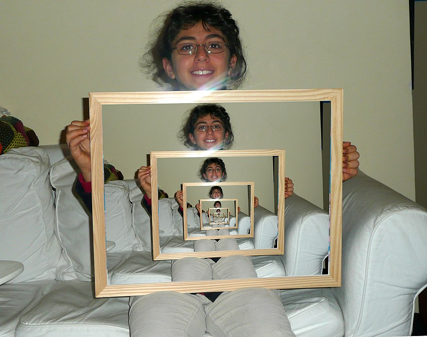
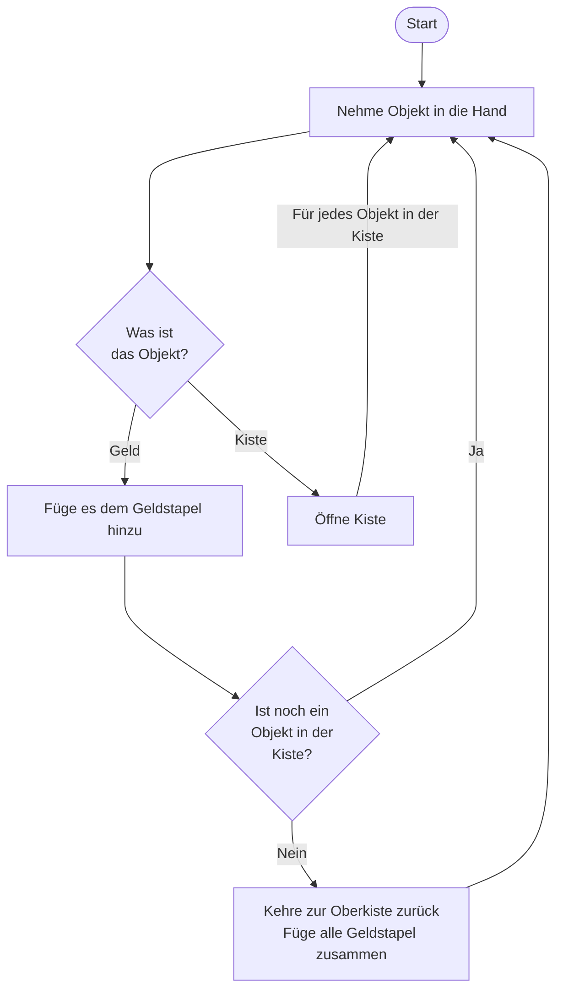

# Exkurs: Rekursive Funktionen



{{ youtube_video("https://www.youtube.com/embed/w_FmtAXTRdc?si=sVXyr44ODVGmXkY3") }}

Es ist möglich eine Funktion in ihrem eigenen Funktionsrumpf aufzurufen. Das wirkt vllt etwas komisch,
da man sich denken könnte, wie kann ich etwas benutzen, wenn es noch gar nicht zu definiert ist. Aber das ist kein
Problem. Manchmal erfordert eine Prozedur, dass man sie erneut auf einem Teilproblem anwendet.

**Beispiel:** Angenommen, du hast eine Kiste mit kleineren Kisten und Geldstücken. In jeder Kiste können 
weiter Kisten und/oder Geldstücke sein. Was musst du jetzt tun, um alle Geldstücke zu finden?

Der folgende Ablaufplan kann erklären, wie der Prozess abläuft:



Der folgende Code beschreibt, wie man dieses Problem in Python umsetzen könnte.

[💻 Online Compiler](https://pythontutor.com/render.html#code=def%20sum_up%28box_or_value%29%3A%0A%20%20%20%20%0A%20%20%20%20if%20isinstance%28box_or_value,%20list%29%3A%0A%20%20%20%20%20%20%20%20summe%20%3D%200%0A%20%20%20%20%20%20%20%20%0A%20%20%20%20%20%20%20%20for%20obj%20in%20box_or_value%3A%0A%20%20%20%20%20%20%20%20%20%20%20%20summe%20%2B%3D%20sum_up%28obj%29%0A%20%20%20%20%20%20%20%20%20%20%20%20%0A%20%20%20%20else%3A%0A%20%20%20%20%20%20%20%20summe%20%3D%20box_or_value%0A%20%20%20%20%0A%20%20%20%20return%20summe%0A%20%20%20%20%0Aall_summed_up%20%3D%20sum_up%28%5B%5B1,2,3%5D,%20%5B4,5,%5B6,7,8%5D%5D%5D%29%0Aprint%28all_summed_up%29&cumulative=true&curInstr=0&heapPrimitives=nevernest&mode=display&origin=opt-frontend.js&py=3&rawInputLstJSON=%5B%5D&textReferences=false)

```python
def sum_up(box_or_value):
    
    if isinstance(box_or_value, list):
        summe = 0
        
        for obj in box_or_value:
            summe += sum_up(obj)
            
    else:
        summe = box_or_value
    
    return summe
    
all_summed_up = sum_up([[1,2,3], [4,5,[6,7,8]]])
print(all_summed_up)
```

In der Funktion `sum_up` wird zunächst geprüft, ob der übergebene Parameter eine Liste ist oder nicht.
Wenn nicht, so wird das Objekt selbst zurückgegben. Wenn doch, so wird die Funktion `sum_up` für jedes Objekt
in der Liste wieder aufgerufen. Das Ergebnis von `sum_up` ist am Ende ja eine Zahl und das können wir der
`summe` hinzufügen.

{{ task(file="tasks/python_grundlagen/recursion/recursion/01_multiplizieren.yaml") }}
{{ task(file="tasks/python_grundlagen/recursion/recursion/02_umstandlich.yaml") }}
{{ task(file="tasks/python_grundlagen/recursion/recursion/03_fakultat_berechnen.yaml") }}
{{ task(file="tasks/python_grundlagen/recursion/recursion/04_binare_suche.yaml") }}
