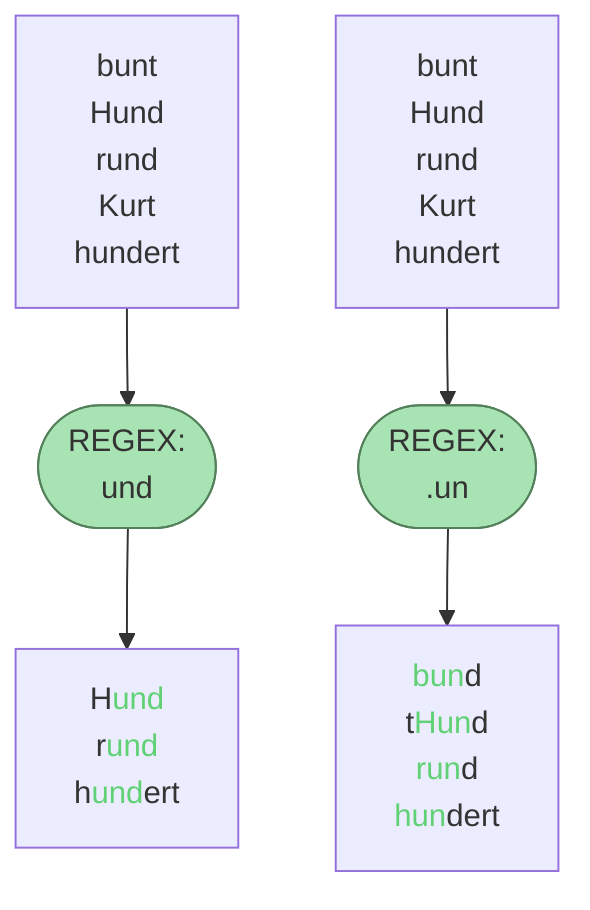

# Exkurs: Reguläre Ausdrücke

Reguläre Ausdrücke, auch **regex** genannt (vom engl. "**reg**ular **ex**presssion") ist eine Zeichenkette,
die eine bestimmte Menge von Zeichenketten beschreibt. Man kann es sich vorstellen wie ein Sieb, durch das nur
ganz bestimmte Strings durchfallen und andere abgefangen werden.


Um Regex zu lernen, eignet sich am besten das [Onlinetutorial von regexone](https://regexone.com/lesson/introduction_abcs).

## Cheat Sheet von datacamp
[🖼Link zur pdf](https://www.datacamp.com/cheat-sheet/regular-expresso)


## Reguläre Ausdrücke in Python

Um reguläre Ausdrücke in Python zu verwendet, müssen wir das Modul `re` importieren. Wir können dann mit verschiedenen
Methoden aus `re` prüfen, ob ein String den regulären Ausdruck erfüllt oder nicht. Hier ist eine Auswahl von
Funktionen aus dem `re` Modul. [Hier ist die Liste aller Funktionen](https://docs.python.org/3/library/re.html#functions).

**Suchen mit `re.search()`:** Sucht nach einem Muster in einem String und gibt ein Match-Objekt zurück, wenn das Muster gefunden wird, sonst `None`.

```python
import re
if re.search('pattern', 'string'):
    print('Muster gefunden')
```

**Finden aller Übereinstimmungen mit `re.findall()`:** Gibt eine Liste aller Vorkommen des Musters im String zurück.

```python
matches = re.findall('pattern', 'string')
```

**Ersetzen von Text mit `re.sub()`:** Ermöglicht das Ersetzen aller Vorkommen eines Musters in einem String.

```python
neuer_string = re.sub('pattern', 'replacement', 'string')
```

**Kompilieren von Mustern mit `re.compile()`:** Für die wiederholte Verwendung eines Musters kann es effizient sein, es zuerst zu kompilieren.

```python
compiled_pattern = re.compile('pattern')
if compiled_pattern.search('string'):
    print('Muster gefunden')
```

Reguläre Ausdrücke sind extrem mächtig, können aber auch komplex und schwer lesbar sein. 
Eine **gute Praxis ist, die Ausdrücke gut zu kommentieren** und, wo möglich, auf Klarheit zu achten.

Außerdem kann man in Python spezielle **Regex-String** definieren, indem vor dem String ein `r` gesetzt wird. So müssen 
bestimmte Zeichen, wie das `\` nicht extra escaped werden. Statt dem Pattern `"\\w+"` kann dann einfach `"\w+"`
verwendet werden.

## Weiteres Hilfreiches

* Die Webseite [regex101.com](https://regex101.com/) unterstützt dabei herauszufinden, welche Teilstrings
von einem Regex erkannt werden.
* Hier noch ein Hilfreiches Tutorial von Corey Schaffer:

<iframe width="560" height="315" src="https://www.youtube.com/embed/sa-TUpSx1JA?si=gqXzbEcOWooXP5sZ" title="YouTube video player" frameborder="0" allow="accelerometer; autoplay; clipboard-write; encrypted-media; gyroscope; picture-in-picture; web-share" allowfullscreen></iframe>

### Aufgabe: Hashtags extrahieren🌶

Extrahiere alle Hashtags im folgenden Beispiel:

```python
text = "Ein Text mit #Python und #Programmierung. #Regex Übungen sind auch dabei."
```

### Aufgabe: CSV-Zeile parsen🌶

Schreibe einen regulären Ausdruck, um Daten aus einer CSV-Zeile zu extrahieren. Die `,`-separierten Einträge
sollen dann in einer Liste erscheinen.

```python
csv_line = "Alice,25,Female,Engineer"
```

### Aufgabe: Regex im Alltag nutzen🌶
Finde heraus, wie du mit deiner favorisierten IDE mithilfe von regulären Ausdrücken suchen kannst.

### Aufgabe: Datum filtern🌶🌶

Finde alle Datums im folgenden Text:

```python
text = "Ein Beispieltext mit dem Datum 27.01.2024 und einem weiteren Datum 01.12.2023."
```

### Aufgabe: URLs unkenntlich machen🌶🌶

Ersetze im folgenden Text alle URLs durch `***hidden URL***`:

```python
text = "Ein Text mit einer URL: https://www.example.com und eine weitere: http://test.org."
```

### Aufgabe: Farbcodes🌶🌶

Filtere alle Hexadezimalen Farbcodes mit 6 Ziffern heraus:

```python
text = "Farbcodes: #FF0000, #00FF00, #0000FF."
```

### Aufgabe: HTML-Tags entfernen🌶🌶🌶

Entferne aus dem folgenden Text die HTML-Tags:

```python
html_text = "<p>Dies ist ein <strong>Beispiel</strong> HTML-Text.</p>"
```

[Lösung](solution.md)
