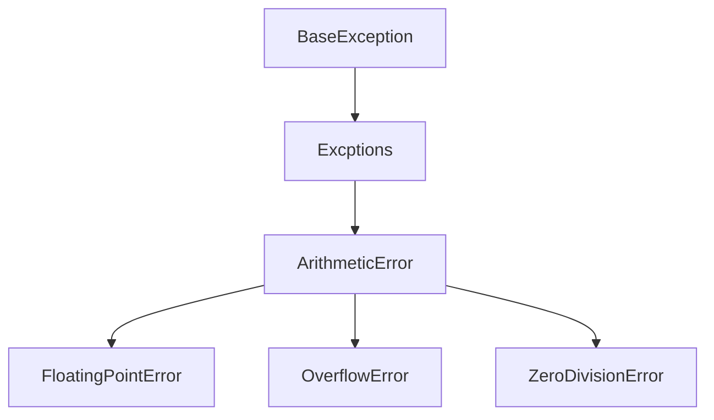

# Exception Handling in Python

<details>
<summary>
🎦 Video
</summary>
<iframe width="560" height="315" src="https://www.youtube.com/embed/3FJFdrYjaX0?si=FbeKuSUYsv0D1F8K" title="YouTube video player" frameborder="0" allow="accelerometer; autoplay; clipboard-write; encrypted-media; gyroscope; picture-in-picture; web-share" allowfullscreen></iframe>
</details>

Beim Programmieren in Python ist es wichtig, Ausnahmen ordnungsgemäß zu behandeln, 
um robusten und fehlerresistenten Code zu schreiben. Ausnahmen sind Ereignisse, 
die während der Ausführung eines Programms auftreten und den normalen Ablauf unterbrechen. 

Du kannst durch korrektes Handling von Ausnahmen Fehler auf elegante Weise bewältigen
und so die Gesamtzuverlässigkeit deines Codes verbessern.

## Grundlagen des Exception Handlings

### Try-Except-Block

<details>
<summary>
🎦 Video
</summary>
<iframe width="560" height="315" src="https://www.youtube.com/embed/DS7sJ3dmfsM?si=r6kgIEED4k3INaeN" title="YouTube video player" frameborder="0" allow="accelerometer; autoplay; clipboard-write; encrypted-media; gyroscope; picture-in-picture; web-share" allowfullscreen></iframe>
</details>

Die Blöcke `try` und `except` werden verwendet, um Ausnahmen in Python zu behandeln. 
Der `try`-Block enthält den Code, der eine Ausnahme auslösen könnte, 
und der `except`-Block gibt an, wie die Ausnahme behandelt werden soll.

[💻 Online Compiler](https://pythontutor.com/render.html#code=try%3A%0A%20%20%20%20%23%20Code,%20der%20eine%20Ausnahme%20ausl%C3%B6sen%20k%C3%B6nnte%0A%20%20%20%20ergebnis%20%3D%2010%20/%200%0Aexcept%20ZeroDivisionError%20as%20e%3A%0A%20%20%20%20%23%20Behandlung%20der%20spezifischen%20Ausnahme%0A%20%20%20%20print%28f%22Fehler%3A%20%7Be%7D%22%29%0A%0Aprint%28%22Ich%20lebe%20noch%20und%20kann%20weiter%20machen%22%29&cumulative=false&curInstr=0&heapPrimitives=nevernest&mode=display&origin=opt-frontend.js&py=3&rawInputLstJSON=%5B%5D&textReferences=false)


```python
try:
    # Code, der eine Ausnahme auslösen könnte
    ergebnis = 10 / 0
except ZeroDivisionError as e:
    # Behandlung der spezifischen Ausnahme
    print(f"Fehler: {e}")

print("Ich lebe noch und kann weiter machen")
```


Der gleiche Code ohne Exceptionhandling bricht die Durchführung
des Programms ab:

[💻 Online Compiler](https://pythontutor.com/render.html#code=ergebnis%20%3D%2010%20/%200%0A%0Aprint%28%22Das%20wirst%20du%20niemals%20sehen%22%29&cumulative=false&curInstr=1&heapPrimitives=nevernest&mode=display&origin=opt-frontend.js&py=3&rawInputLstJSON=%5B%5D&textReferences=false)


```python
ergebnis = 10 / 0

print("Das wirst du niemals sehen")
```


### Mehrere Except-Blöcke

<details>
<summary>
🎦 Video
</summary>
<iframe width="560" height="315" src="https://www.youtube.com/embed/6W3pegK1eBo?si=UhK6rQEE6HZsTulH" title="YouTube video player" frameborder="0" allow="accelerometer; autoplay; clipboard-write; encrypted-media; gyroscope; picture-in-picture; web-share" allowfullscreen></iframe>
</details>

Du kannst mehrere `except`-Blöcke verwenden, um verschiedene Arten von Ausnahmen zu behandeln.

[💻 Online Compiler](https://pythontutor.com/render.html#code=try%3A%0A%20%20%20%20wert%20%3D%20int%28input%28%22Gib%20eine%20Zahl%20ein%3A%20%22%29%29%0A%20%20%20%20ergebnis%20%3D%2010%20/%20wert%0Aexcept%20ValueError%3A%0A%20%20%20%20print%28%22Ung%C3%BCltige%20Eingabe.%20Bitte%20gib%20eine%20g%C3%BCltige%20Zahl%20ein.%22%29%0Aexcept%20ZeroDivisionError%20as%20e%3A%0A%20%20%20%20print%28f%22Fehler%3A%20%7Be%7D%22%29&cumulative=false&curInstr=0&heapPrimitives=nevernest&mode=display&origin=opt-frontend.js&py=3&rawInputLstJSON=%5B%5D&textReferences=false)


```python
try:
    wert = int(input("Gib eine Zahl ein: "))
    ergebnis = 10 / wert
except ValueError:
    print("Ungültige Eingabe. Bitte gib eine gültige Zahl ein.")
except ZeroDivisionError as e:
    print(f"Fehler: {e}")
```


### Finally-Block

<details>
<summary>
🎦 Video
</summary>
<iframe width="560" height="315" src="https://www.youtube.com/embed/W20lKG86D2A?si=-xSPKt83HYSEDywy" title="YouTube video player" frameborder="0" allow="accelerometer; autoplay; clipboard-write; encrypted-media; gyroscope; picture-in-picture; web-share" allowfullscreen></iframe>
</details>

Der `finally`-Block wird unabhängig davon ausgeführt, ob eine Ausnahme auftritt oder nicht. 
Er wird oft für Aufräumarbeiten verwendet.

[💻 Online Compiler](https://pythontutor.com/render.html#code=try%3A%0A%20%20%20%20ergebnis%20%3D%2010%20/%200%0Aexcept%20ZeroDivisionError%20as%20e%3A%0A%20%20%20%20print%28%22Verbotene%20Operation.%22%29%0Afinally%3A%0A%20%20%20%20print%28%22%22%22Jetzt%20k%C3%B6nnen%20aufr%C3%A4umarbeiten%20durchgef%C3%BChrt%20werden,%0A%20%20%20%20%20wie%20das%20Schlie%C3%9Fen%20von%20Dateien%22%22%22%29&cumulative=false&curInstr=0&heapPrimitives=nevernest&mode=display&origin=opt-frontend.js&py=3&rawInputLstJSON=%5B%5D&textReferences=false)


```python
try:
    ergebnis = 10 / 0
except ZeroDivisionError as e:
    print("Verbotene Operation.")
finally:
    print("""Jetzt können aufräumarbeiten durchgeführt werden,
     wie das Schließen von Dateien""")
```


### Eigene Ausnahmen

<details>
<summary>
🎦 Video
</summary>
<iframe width="560" height="315" src="https://www.youtube.com/embed/h2yWcrSQ0KE?si=rBtDm0MDtc9iRiBG" title="YouTube video player" frameborder="0" allow="accelerometer; autoplay; clipboard-write; encrypted-media; gyroscope; picture-in-picture; web-share" allowfullscreen></iframe>
</details>

Du kannst benutzerdefinierte Ausnahmen erstellen, indem du eine neue Klasse definierst,
die von der Klasse `Exception` erbt. Was genau Klassen sind, werden wir noch besprechen, jetzt nehmen
wir das erstmal hin. Eine solche Exception kann mit dem Keyword `raise` geworfen werden.
Wenn das innerhalb einer Methode passiert, ist dass so, als ob eine Exceptions als Rückgabe der Methode

[💻 Online Compiler](https://pythontutor.com/render.html#code=class%20PhoneNumberNotFoundError%28Exception%29%3A%0A%20%20%20%20pass%0A%0A%0Aphone_numbers%20%3D%20%7B'J%C3%BCrgen'%3A%20'01234-5678',%20'Monika'%3A%20'%2B49-156-89345'%7D%0A%0A%0Adef%20call_by_phone_number%28name%29%3A%0A%20%20%20%20if%20name%20not%20in%20phone_numbers%3A%0A%20%20%20%20%20%20%20%20raise%20PhoneNumberNotFoundError%28f%22There%20is%20no%20Phonenumber%20for%20%7Bname%7D%22%29%0A%20%20%20%20%0A%20%20%20%20print%28f'Call%20%7Bname%7D%20by%20%7Bphone_numbers.get%28name%29%7D'%29%0A%20%20%20%20%0A%0Atry%3A%0A%20%20%20%20n%20%3D%20input%28'Wen%20willst%20du%20anrufen%3F'%29%0A%20%20%20%20call_by_phone_number%28n%29%0Aexcept%20PhoneNumberNotFoundError%20as%20e%3A%0A%20%20%20%20print%28f%22Etwas%20ist%20schief%20gegangen%3A%20%7Be%7D%22%29&cumulative=false&curInstr=0&heapPrimitives=nevernest&mode=display&origin=opt-frontend.js&py=3&rawInputLstJSON=%5B%5D&textReferences=false)


```python
class PhoneNumberNotFoundError(Exception):
    pass


phone_numbers = {'Jürgen': '01234-5678', 'Monika': '+49-156-89345'}


def call_by_phone_number(name):
    if name not in phone_numbers:
        raise PhoneNumberNotFoundError(f"There is no Phonenumber for {name}")
    
    print(f'Call {name} by {phone_numbers.get(name)}')
    

try:
    n = input('Wen willst du anrufen?')
    call_by_phone_number(n)
except PhoneNumberNotFoundError as e:
    print(f"Etwas ist schief gegangen: {e}")
```


### Else-Block

<details>
<summary>
🎦 Video
</summary>
<iframe width="560" height="315" src="https://www.youtube.com/embed/6NkV7dlwk08?si=6aReTT0-LLqt--jv" title="YouTube video player" frameborder="0" allow="accelerometer; autoplay; clipboard-write; encrypted-media; gyroscope; picture-in-picture; web-share" allowfullscreen></iframe>
</details>

Der `else`-Block wird ausgeführt, wenn keine Ausnahmen im `try`-Block ausgelöst werden.

[💻 Online Compiler](https://pythontutor.com/render.html#code=try%3A%0A%20%20%20%20wert%20%3D%20int%28input%28%22Gib%20eine%20Zahl%20ein%3A%20%22%29%29%0A%20%20%20%20ergebnis%20%3D%2010%20/%20wert%0Aexcept%20ValueError%3A%0A%20%20%20%20print%28%22Ung%C3%BCltige%20Eingabe.%20Bitte%20gib%20eine%20g%C3%BCltige%20Zahl%20ein.%22%29%0Aexcept%20ZeroDivisionError%20as%20e%3A%0A%20%20%20%20print%28f%22Fehler%3A%20%7Be%7D%22%29%0Aelse%3A%0A%20%20%20%20print%28f%22Ergebnis%3A%20%7Bergebnis%7D%22%29&cumulative=false&curInstr=0&heapPrimitives=nevernest&mode=display&origin=opt-frontend.js&py=3&rawInputLstJSON=%5B%5D&textReferences=false)


```python
try:
    wert = int(input("Gib eine Zahl ein: "))
    ergebnis = 10 / wert
except ValueError:
    print("Ungültige Eingabe. Bitte gib eine gültige Zahl ein.")
except ZeroDivisionError as e:
    print(f"Fehler: {e}")
else:
    print(f"Ergebnis: {ergebnis}")
```


## ⚠ Achtung: Exception Handling und Ablaufsteuerung

<details>
<summary>
🎦 Video
</summary>
<iframe width="560" height="315" src="https://www.youtube.com/embed/5vKmhnx0JK4?si=ER7lCBtf2uSV5hI6" title="YouTube video player" frameborder="0" allow="accelerometer; autoplay; clipboard-write; encrypted-media; gyroscope; picture-in-picture; web-share" allowfullscreen></iframe>
</details>

Es ist wichtig zu betonen, dass Exception Handling nicht als Mechanismus zur Ablaufsteuerung 
genutzt werden sollte. Ausnahmen sollten nicht für die Kontrolle des normalen 
Programmflusses verwendet werden, sondern ausschließlich für 
die Behandlung von unerwarteten Ereignissen und Fehlerzuständen.

## Hierarchien von Exceptions

<details>
<summary>
🎦 Video
</summary>
<iframe width="560" height="315" src="https://www.youtube.com/embed/NZcTFJmfiNw?si=j3V6e8TYkz80jqSk" title="YouTube video player" frameborder="0" allow="accelerometer; autoplay; clipboard-write; encrypted-media; gyroscope; picture-in-picture; web-share" allowfullscreen></iframe>
</details>

Es muss nicht immer genau der Typ aufgefangen werden, der geworfen wird. Es kanna auch eine Oberklasse
genutzt werden. Im folgenden beiden Beispiele fungieren also identisch:

[💻 Online Compiler](https://pythontutor.com/render.html#code=try%3A%0A%20%20%20%20ergebnis%20%3D%2010%20/%200%0Aexcept%20ZeroDivisionError%20as%20e%3A%0A%20%20%20%20print%28f%22Fehler%3A%20%7Be%7D%22%29&cumulative=false&curInstr=0&heapPrimitives=nevernest&mode=display&origin=opt-frontend.js&py=3&rawInputLstJSON=%5B%5D&textReferences=false)


```python
try:
    ergebnis = 10 / 0
except ZeroDivisionError as e:
    print(f"Fehler: {e}")
```


[💻 Online Compiler](https://pythontutor.com/render.html#code=try%3A%0A%20%20%20%20ergebnis%20%3D%2010%20/%200%0Aexcept%20ArithmeticError%20as%20e%3A%0A%20%20%20%20print%28f%22Fehler%3A%20%7Be%7D%22%29&cumulative=false&curInstr=0&heapPrimitives=nevernest&mode=display&origin=opt-frontend.js&py=3&rawInputLstJSON=%5B%5D&textReferences=false)


```python
try:
    ergebnis = 10 / 0
except ArithmeticError as e:
    print(f"Fehler: {e}")
```




[Hier ist die komplete Hierarchie der Exceptions](https://docs.python.org/3/library/exceptions.html#exception-hierarchy).

# Aufgaben

### Aufgabe: Benutzereingabe und Integer-Konvertierung 🌶️️
Passe das folgende Programm an, sodass es bei einer fehlerhaften Eingabe nicht mehr zum Absturz kommt, sondern
erneut nach einer Eingabe gefragt wird:

```python
a = int(input("Erste Zahl: "))
b = int(input("Zweite Zahl: "))

print(f"Der Durchschnitt ist: {(a + b) / 2}")
```

### Aufgabe: Benutzerdefinierte Ausnahme 🌶️️🌶️️
Erstelle eine benutzerdefinierte Ausnahme mit dem Namen `NegativeZahlFehler`.
Schreibe eine Funktion, die eine Liste von Zahlen durchläuft und wenn eine Zahl negativ ist,
einen `NegativeZahlFehler` wirft.


### Aufgabe: Welche Fehler kann man so machen? 🌶️️🌶️️
Baue für die folgenden Fehler ein Beispiel, in dem sie geworfen werden.
Hier ist die [Liste aller in Python vorimplementierten Exceptions](https://docs.python.org/3/library/exceptions.html).

* IndexError
* OverflowError
* StopIteration
* ValueError
* ZeroDivisionsError
* KeyboardInterrupt

### Aufgabe: Sichere Benutzereingabe 🌶️️🌶️️🌶️️
Implementiere einen interaktiven Taschenrechner. 
Lass den Benutzer nacheinander zwei Zahlen und einen Operator (+, -, *, /) eingeben.
Verwende `try`- und `except`-Blöcke, um mögliche `ValueError`-Ausnahmen und unbekannte Operationen zu behandeln. 
Gib das Ergebnis aus.

### Aufgabe: Übertriebene Rekursion 🌶️️🌶️️🌶️️
Zu welchem Fehler führt der folgende Code und warum?

```python
def fak(n):
    return 1 if n <= 1 else n * fak(n-1)

print(fak(1000))
```

[Lösung](solutions.md)
