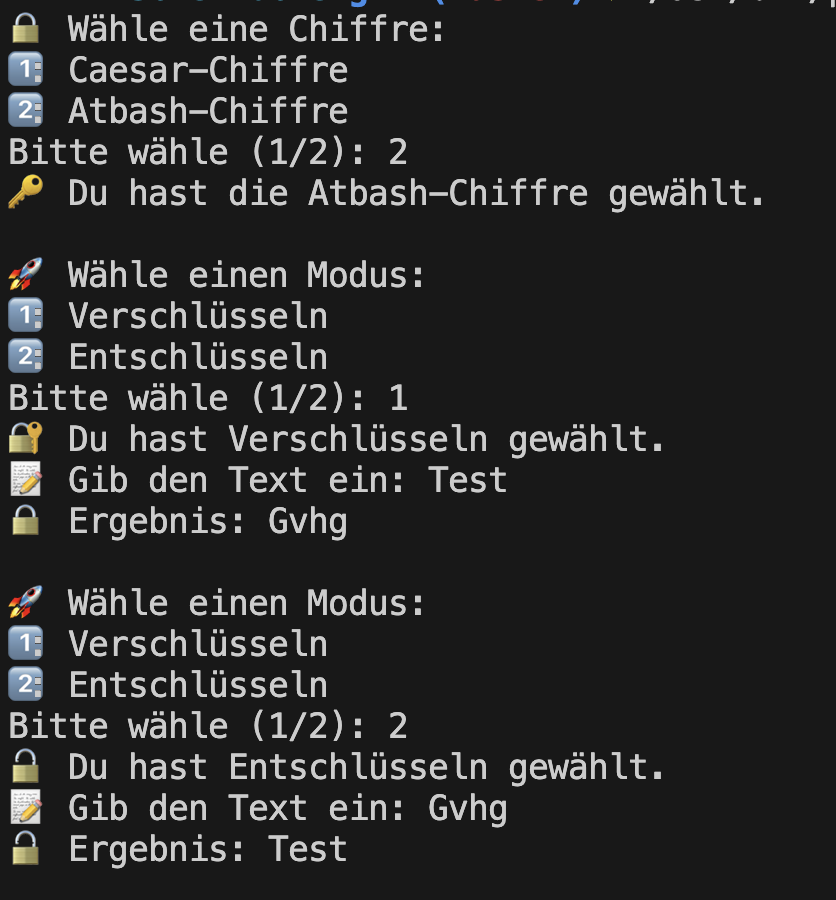

# Freitag

Ziel des Tages ist es, ein Chiffren Encoder-Decoder zu implementieren. Hierbei sollen pro Projektschritt folgende Schritte durchgeführt werden:

1. Implementierung mit Python
2. Dokumentation mit Docstrings
3. Testing mit Unittests
4. Arbeiten mit Git im eigenen Git-Repo

Am Ende der Woche soll jeder ein Repository mit Lösungen zu allen Aufgaben haben.

## Tagesprojekt - Chiffren Encoder-Decoder


### Konzepte des Zweiten Tages
- [Klassen](../../oop_grundlagen/define_classes/define_classes.md)
- [Vererbung](../../vererbung_polymorphismus/vererbung/vererbung.md)
- [Git](https://python-wiki.de/lehrplan/git/git.html)
- [Docstring](../../funktionen_vertiefung/docstring/docstring.md)
- [Unittests](../../oop_grundlagen/unittests/unittests.md)

## Simple Ceasar Chiffre 🌶️🌶️
Schreibe ein Programm für einfache Verschlüsslungen.

### Anforderungen
- Nutze eine Klasse um die Caesar-Chiffre zu implementieren
- Das Programm akzeptiert eine Verschiebung der Buchstaben.
- Der Ausgebebene verschlüsselte Text kann wieder entschlüsselt werden wenn man die Verschiebung kennt.

??? success "Lösung"

    ```python
    class CaesarChiffre:
        def __init__(self, verschiebung: int):
            self.verschiebung = verschiebung

        def verschluesseln(self, text: str, reverse=False) -> str:
            ergebnis = ""
            for zeichen in text:
                if zeichen.isalpha():
                    verschiebung = ord('A') if zeichen.isupper() else ord('a')
                    verschoben = (ord(zeichen) - verschiebung + (self.verschiebung if not reverse else -self.verschiebung)) % 26
                    ergebnis += chr(verschoben + verschiebung)
                else:
                    ergebnis += zeichen
            return ergebnis

        def entschluesseln(self, text: str) -> str:
            # Decryption is just encryption in reverse
            return self.verschluesseln(text, reverse=True)

    chiffre = CaesarChiffre(5)
    encoded = chiffre.verschluesseln("Hallo Welt!")
    print(f"Verschlüsselt: {encoded}")
    decoded = chiffre.entschluesseln("Mfqqt Bjqy!")
    print(f"Entschlüsselt: {decoded}")
    ```


## Die Affen sind los 🌶️🌶️🌶️
Schreibe ein Programm, das ein einfaches Tierpark-Management-System simuliert. Das System soll verschiedene Tierarten durch Vererbung modellieren und die Möglichkeit bieten, Tiere hinzuzufügen, zu entfernen und Informationen über sie abzurufen.

### Anforderungen
- **Basisklasse Tier**: Erstelle eine allgemeine Klasse für Tiere im Tierpark. Diese Klasse soll grundlegende Attribute wie Name und Alter enthalten, sowie eine Methode, die einen Laut des Tieres zurückgibt.
- **Spezialisierte Tierklassen**: Leite mindestens drei spezifische Tierklassen von der Basisklasse ab (z.B. Löwe, Pinguin, Elefant). Erweitere jede Klasse um spezifische Eigenschaften oder Verhaltensweisen, die nur für diese Tierart gelten.
- **Tierpark-Klasse**: Erstelle eine Klasse, die eine Liste von Tieren verwaltet. Diese Klasse sollte Funktionen zum Hinzufügen, Entfernen, Suchen und Anzeigen aller Tiere bieten. Achte hierbei auf die Nutzung von Polymorphie, sodass jegliche Tiere hinzugefügt werden können.

??? success "Lösung"

    ```python
    class Tier:
        def __init__(self, name, alter):
            self.name = name
            self.alter = alter

        def lautgeben(self):
            return "Dieses Tier macht einen Laut."

    class Loewe(Tier):
        def lautgeben(self):
            return f"{self.name}, der Löwe, brüllt."

    class Pinguin(Tier):
        def lautgeben(self):
            return f"{self.name}, der Pinguin, quietscht."

    class Elefant(Tier):
        def lautgeben(self):
            return f"{self.name}, der Elefant, trompetet."


    class Tierpark:
        def __init__(self):
            self.tiere = []

        def tier_hinzufuegen(self, tier):
            self.tiere.append(tier)

        def tier_entfernen(self, name):
            self.tiere = [tier for tier in self.tiere if tier.name != name]

        def tier_suchen(self, name):
            for tier in self.tiere:
                if tier.name == name:
                    return tier
            return None

        def alle_tiere_anzeigen(self):
            if not self.tiere:
                print("Keine Tiere im Tierpark.")
            for tier in self.tiere:
                print(f"{tier.name}, {tier.alter} Jahre alt")


    def main():
        tierpark = Tierpark()

        tierpark.tier_hinzufuegen(Loewe("Simba", 5))
        tierpark.tier_hinzufuegen(Pinguin("Pingu", 2))
        tierpark.tier_hinzufuegen(Elefant("Dumbo", 10))

        print("Alle Tiere im Tierpark:")
        tierpark.alle_tiere_anzeigen()

        print("\nEin Tier gibt einen Laut von sich:")
        tier = tierpark.tier_suchen("Dumbo")
        if tier:
            print(tier.lautgeben())

        print("\nEntfernen eines Tiers aus dem Tierpark:")
        tierpark.tier_entfernen("Pingu")
        tierpark.alle_tiere_anzeigen()

    main()
    ```


## You better hide your secrets... 🌶️🌶️🌶️🌶️

Entwickle ein terminal-basiertes Programm, das dem Nutzer ermöglicht, Texte basierend auf verschiedenen Chiffren zu verschlüsseln und entschlüsseln.

### Anforderungen
- **Klassenbasiert mit Vererbung**: Es soll eine Elternklasse "Chiffre" geben, die an jede Chiffre, z.B. "Ceasar" vererbt.
- **Chiffre-Auswahl**: Der Benutzer kann zwischen mindestens zwei Chiffre-Methoden wählen: z.B. Caesar-Chiffre und Atbash-Chiffre. Die ausführende Klasse soll jede Chiffre annehmen können.
- **Textverschlüsselung**: Gib einen Text ein, und das Programm verschlüsselt ihn basierend auf der ausgewählten Chiffre-Methode.
- **Textentschlüsselung**: Gib einen verschlüsselten Text ein, und das Programm entschlüsselt ihn, um den ursprünglichen Text zurückzuerhalten.
- **Benutzerfreundliche Schnittstelle**: Das Programm bietet klare Anweisungen und Feedback während des gesamten Prozesses, angereichert mit visuell ansprechenden Emojis, um die Interaktion zu verbessern.

### Erweiterungen
- **Mehrere Chiffre-Methoden**: Füge weitere Chiffre-Methoden hinzu, z.B. Vigenère, ROT13, oder Enigma.
- **Anpassbare Schlüssel**: Lasse den Benutzer den Schlüssel für die Verschlüsselung und Entschlüsselung anpassen, besonders für die Caesar-Chiffre.
- **Dateioperationen**: Implementiere die Möglichkeit, Texte aus Dateien zu verschlüsseln oder zu entschlüsseln, um die Handhabung großer Textmengen zu vereinfachen.

### Grundgerüst
```python
class Chiffre:
    def verschluesseln(self, text: str) -> str:
        raise NotImplementedError("Diese Methode muss in einer Unterklasse überschrieben werden.")

    def entschluesseln(self, text: str) -> str:
        raise NotImplementedError("Diese Methode muss in einer Unterklasse überschrieben werden.")
```

```python
class CaesarChiffre(Chiffre):
    def __init__(self, verschiebung: int):
        pass

    def verschluesseln(self, text: str, reverse=False) -> str:
        pass

    def entschluesseln(self, text: str) -> str:
        pass
```

??? success "Lösung"

    ```python
    class Chiffre:
        def verschluesseln(self, text: str) -> str:
            raise NotImplementedError("Diese Methode muss in einer Unterklasse überschrieben werden.")

        def entschluesseln(self, text: str) -> str:
            raise NotImplementedError("Diese Methode muss in einer Unterklasse überschrieben werden.")

    class CaesarChiffre(Chiffre):
        def __init__(self, verschiebung: int):
            self.verschiebung = verschiebung

        def verschluesseln(self, text: str, reverse=False) -> str:
            ergebnis = ""
            for zeichen in text:
                if zeichen.isalpha():
                    verschiebung = ord('A') if zeichen.isupper() else ord('a')
                    verschoben = (ord(zeichen) - verschiebung + (self.verschiebung if not reverse else -self.verschiebung)) % 26
                    ergebnis += chr(verschoben + verschiebung)
                else:
                    ergebnis += zeichen
            return ergebnis

        def entschluesseln(self, text: str) -> str:
            # Decryption is just encryption in reverse
            return self.verschluesseln(text, reverse=True)


    class AtbashChiffre(Chiffre):
        def verschluesseln(self, text: str) -> str:
            ergebnis = ""
            for zeichen in text:
                if zeichen.isalpha():
                    # Berechne die Umkehrung für Groß- und Kleinbuchstaben separat
                    if zeichen.isupper():
                        ergebnis += chr(90 - (ord(zeichen) - 65))
                    else:
                        ergebnis += chr(122 - (ord(zeichen) - 97))
                else:
                    ergebnis += zeichen
            return ergebnis

        def entschluesseln(self, text: str) -> str:
            # Bei Atbash sind Verschlüsselung und Entschlüsselung identisch
            return self.verschluesseln(text)


    class Verschluessler:
        def __init__(self, chiffre: Chiffre) -> None:
            self.chiffre = chiffre

        def verschluesseln(self, text: str) -> str:
            return self.chiffre.verschluesseln(text)

        def entschluesseln(self, text: str) -> str:
            return self.chiffre.entschluesseln(text)

    def waehle_chiffre():
        print("🔒 Wähle eine Chiffre:")
        print("1️⃣: Caesar-Chiffre")
        print("2️⃣: Atbash-Chiffre")
        auswahl = input("Bitte wähle (1/2): ")
        if auswahl == "1":
            print("🔑 Du hast die Caesar-Chiffre gewählt.")
            return CaesarChiffre(3)
        elif auswahl == "2":
            print("🔑 Du hast die Atbash-Chiffre gewählt.")
            return AtbashChiffre()
        else:
            print("❌ Ungültige Auswahl. Bitte wähle 1 oder 2.")
            return None

    def modus_waehlen():
        print("\n🚀 Wähle einen Modus:")
        print("1️⃣: Verschlüsseln")
        print("2️⃣: Entschlüsseln")
        modus = input("Bitte wähle (1/2): ")
        if modus == "1":
            print("🔐 Du hast Verschlüsseln gewählt.")
            return "verschlüsseln"
        elif modus == "2":
            print("🔓 Du hast Entschlüsseln gewählt.")
            return "entschlüsseln" 
        else:
            print("❌ Ungültige Auswahl. Bitte wähle 1 oder 2.")
            return None

    def main():
        chiffre = waehle_chiffre()
        if chiffre is None:
            return

        verschluessler = Verschluessler(chiffre)
        
        while True:
            modus = modus_waehlen()
            if modus is None:
                return

            text = input("📝 Gib den Text ein: ")
            if modus == "verschlüsseln":
                ergebnis = verschluessler.verschluesseln(text)
                print(f"🔒 Ergebnis: {ergebnis}")
            else:
                ergebnis = verschluessler.entschluesseln(text)
                print(f"🔓 Ergebnis: {ergebnis}")

    main()
    ```
