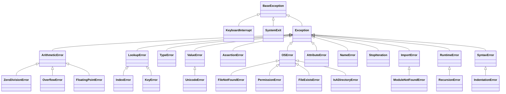

# Exceptions – Zusammenfassung

🔄 *Wiederholung / Zusammenfassung – Details siehe [Try-Except Einführung](../python_grundlagen/try_except/try_except.md) und [Exceptions Vertiefung](../exceptions/index.md)*

## Mehrere except-Blöcke

Verschiedene Fehlertypen können mit separaten `except`-Blöcken gezielt behandelt werden:

```python
try:
    wert = int(eingabe)
    ergebnis = 10 / wert
except ValueError:
    print("Keine gültige Zahl!")
except ZeroDivisionError:
    print("Division durch Null!")
except Exception as e:
    print(f"Unerwarteter Fehler: {e}")
```

**Wichtig:** Immer von **spezifisch → allgemein** ordnen, da Python den ersten passenden Block ausführt.

## Exception-Hierarchie

Die wichtigsten eingebauten Exceptions:

| Exception | Tritt auf bei … |
|-----------|-----------------|
| `ValueError` | Falscher Wert, z. B. `int("abc")` |
| `TypeError` | Falscher Typ, z. B. `"a" + 1` |
| `KeyError` | Fehlender Schlüssel in einem Dict |
| `IndexError` | Index außerhalb der Liste |
| `FileNotFoundError` | Datei existiert nicht |
| `ZeroDivisionError` | Division durch Null |
| `AttributeError` | Attribut/Methode existiert nicht |

Alle erben von `Exception` → ein `except Exception`-Block fängt sie alle.

## Eigene Exceptions

```python
class MeineException(Exception):
    pass

raise MeineException("Etwas ist schiefgelaufen")
```

Eigene Exceptions erben von `Exception` und machen Fehler im eigenen Code **aussagekräftig**.

## raise – Fehler aktiv auslösen

Mit `raise` kann man Fehler zur **Eingabevalidierung** nutzen:

```python
def setze_alter(alter):
    if alter < 0:
        raise ValueError("Alter darf nicht negativ sein")
    return alter
```

## Übungsaufgaben

{{ task(file="tasks/python_grundlagen/try_except/try_except/06_mehrere_except_bloecke.yaml") }}
{{ task(file="tasks/python_grundlagen/try_except/try_except/07_exception_hierarchie.yaml") }}
{{ task(file="tasks/python_grundlagen/try_except/try_except/08_eigene_exception.yaml") }}
{{ task(file="tasks/python_grundlagen/try_except/try_except/09_raise_validierung.yaml") }}
{{ task(file="tasks/python_grundlagen/try_except/try_except/10_exceptions_kombination.yaml") }}

---

## Fehlerklassen-Referenz

### 🔵 PCEP – Pflicht-Exceptions

| Exception | Elternklasse | Tritt auf bei … |
|-----------|-------------|-----------------|
| `BaseException` | – | Wurzel aller Exceptions (nicht direkt fangen!) |
| `KeyboardInterrupt` | `BaseException` | Benutzer drückt ++ctrl+c++ |
| `SystemExit` | `BaseException` | `sys.exit()` wird aufgerufen |
| `Exception` | `BaseException` | Basisklasse aller „normalen" Fehler |
| `ArithmeticError` | `Exception` | Basisklasse für Rechenfehler (abstrakt) |
| `ZeroDivisionError` | `ArithmeticError` | `10 / 0` |
| `OverflowError` | `ArithmeticError` | `math.exp(1000)` |
| `FloatingPointError` | `ArithmeticError` | Selten – nur mit spezieller Konfiguration |
| `LookupError` | `Exception` | Basisklasse für Zugriffsfehler (abstrakt) |
| `IndexError` | `LookupError` | `lst[99]` bei einer 3-Element-Liste |
| `KeyError` | `LookupError` | `d["fehlt"]` bei einem Dict |
| `TypeError` | `Exception` | `"a" + 1` – falscher Typ |
| `ValueError` | `Exception` | `int("abc")` – falscher Wert |
| `AssertionError` | `Exception` | `assert False` schlägt fehl |

!!! warning "Prüfungsfalle"
    `KeyboardInterrupt` und `SystemExit` erben von `BaseException`, **nicht** von `Exception`.
    Ein `except Exception`-Block fängt sie **nicht** ab!

### 🟠 PCAP – zusätzliche Exceptions

| Exception | Elternklasse | Tritt auf bei … |
|-----------|-------------|-----------------|
| `OSError` | `Exception` | Basisklasse für Betriebssystem-Fehler |
| `FileNotFoundError` | `OSError` | `open("gibts_nicht.txt")` |
| `PermissionError` | `OSError` | Keine Berechtigung für Dateizugriff |
| `FileExistsError` | `OSError` | `os.mkdir()` auf existierendes Verzeichnis |
| `IsADirectoryError` | `OSError` | Datei-Operation auf einem Verzeichnis |
| `AttributeError` | `Exception` | `obj.gibts_nicht` – Attribut existiert nicht |
| `NameError` | `Exception` | Variable wurde nie definiert |
| `StopIteration` | `Exception` | `next()` auf erschöpftem Iterator |
| `ImportError` | `Exception` | `import` schlägt fehl |
| `ModuleNotFoundError` | `ImportError` | Modul existiert nicht |
| `RuntimeError` | `Exception` | Allgemeiner Laufzeitfehler |
| `RecursionError` | `RuntimeError` | Maximale Rekursionstiefe überschritten |
| `SyntaxError` | `Exception` | Ungültige Python-Syntax (z. B. in `eval()`) |
| `IndentationError` | `SyntaxError` | Falsche Einrückung |
| `UnicodeError` | `ValueError` | Fehler bei Unicode-Kodierung |

### Hierarchie-Diagramm



!!! tip "Hierarchie lesen"
    `except ArithmeticError` fängt auch `ZeroDivisionError` und `OverflowError`.
    `except LookupError` fängt auch `IndexError` und `KeyError`.
    Regel: **Spezifische Exceptions immer vor allgemeinen** auflisten!
