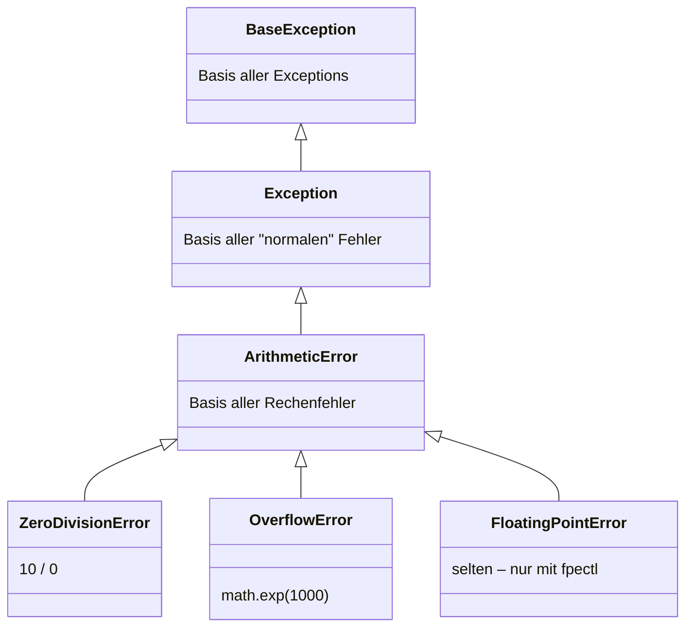

# Exceptions – Zusammenfassung

🔄 *Wiederholung / Zusammenfassung – Details siehe [Try-Except Einführung](../python_grundlagen/try_except/try_except.md) und [Exceptions Vertiefung](../exceptions/index.md)*

## Mehrere except-Blöcke

Verschiedene Fehlertypen können mit separaten `except`-Blöcken gezielt behandelt werden:

```python
try:
    wert = int(eingabe)
    ergebnis = 10 / wert
except ValueError:
    print("Keine gültige Zahl!")
except ZeroDivisionError:
    print("Division durch Null!")
except Exception as e:
    print(f"Unerwarteter Fehler: {e}")
```

**Wichtig:** Immer von **spezifisch → allgemein** ordnen, da Python den ersten passenden Block ausführt.

## Exception-Hierarchie

Die wichtigsten eingebauten Exceptions:

| Exception | Tritt auf bei … |
|-----------|-----------------|
| `ValueError` | Falscher Wert, z. B. `int("abc")` |
| `TypeError` | Falscher Typ, z. B. `"a" + 1` |
| `KeyError` | Fehlender Schlüssel in einem Dict |
| `IndexError` | Index außerhalb der Liste |
| `FileNotFoundError` | Datei existiert nicht |
| `ZeroDivisionError` | Division durch Null |
| `AttributeError` | Attribut/Methode existiert nicht |

Alle erben von `Exception` → ein `except Exception`-Block fängt sie alle.

### Beispiel: Arithmetische Exceptions



`except ArithmeticError` fängt `ZeroDivisionError` **und** `OverflowError` – weil beide davon erben.

## Eigene Exceptions

```python
class MeineException(Exception):
    pass

raise MeineException("Etwas ist schiefgelaufen")
```

Eigene Exceptions erben von `Exception` und machen Fehler im eigenen Code **aussagekräftig**.

## raise – Fehler aktiv auslösen

Mit `raise` kann man Fehler zur **Eingabevalidierung** nutzen:

```python
def setze_alter(alter):
    if alter < 0:
        raise ValueError("Alter darf nicht negativ sein")
    return alter
```

## Übungsaufgaben

{{ task(file="tasks/python_grundlagen/try_except/try_except/06_mehrere_except_bloecke.yaml") }}
{{ task(file="tasks/python_grundlagen/try_except/try_except/07_exception_hierarchie.yaml") }}
{{ task(file="tasks/python_grundlagen/try_except/try_except/08_eigene_exception.yaml") }}
{{ task(file="tasks/python_grundlagen/try_except/try_except/09_raise_validierung.yaml") }}
{{ task(file="tasks/python_grundlagen/try_except/try_except/10_exceptions_kombination.yaml") }}
