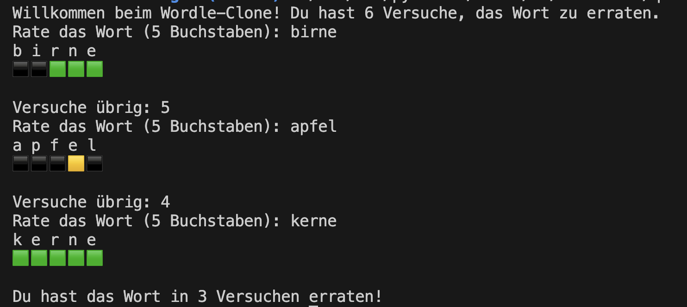

# Montag

Ziel des Tages ist es, einen Klon von Wordle zu implementieren. Hierbei sollen pro Projektschritt folgende Schritte durchgeführt werden:

1. Implementierung mit Python
2. Dokumentation mit Docstrings
3. Testing mit Unittests
4. Arbeiten mit Git im eigenen Git-Repo

Am Ende der Woche soll jeder ein Repository mit Lösungen zu allen Aufgaben haben.

## Tagesprojekt - Viraler Wordle Klon
[Wordle Spiel](https://www.nytimes.com/games/wordle/index.html)

### Konzepte des Ersten Tages
- [Input und Output](https://python-wiki.de/lehrplan/python_grundlagen/input_output/input_output.html)
- [Verzweigungen](https://python-wiki.de/lehrplan/python_grundlagen/if_elif_else/if_elif_else.html)
- [Strings](https://python-wiki.de/lehrplan/python_grundlagen/strings/strings.html)
- [Schleifen](https://python-wiki.de/lehrplan/python_grundlagen/loops/loops.html)
- [Debugger](https://python-wiki.de/lehrplan/python_grundlagen/debugging/debugging.html)
- [Einführung in Git](https://python-wiki.de/lehrplan/git/git.html)
- [Docstring](https://python-wiki.de/lehrplan/python_grundlagen/docstring/docstring.html)

## Palindrome prüfen mit Indices 🌶️🌶️
Schreibe ein Python-Programm, das überprüft, ob ein gegebenes Wort ein Palindrom ist oder nicht.

Ein Palindrom ist ein Wort, 
das rückwärts gelesen genauso wie vorwärts gelesen wird 
(z.B. "anna", "otto", "madam"). 

### Anforderung
- Nutze for-Loops und Indizes
- Verwende dabei keine vorgefertigten Funktionen wie reversed() oder Slicing (`[::-1]`)

Lösung

<pre><code>
def is_palindrome(word):
    length = len(word)
    for i in range(length // 2):
        if word[i] != word[length - 1 - i]:
            return False
    return True

user_input = input("Gib ein Wort ein, um zu überprüfen, ob es ein Palindrom ist: ").lower()

if is_palindrome(user_input):
    print(f"{user_input} ist ein Palindrom.")
else:
    print(f"{user_input} ist kein Palindrom.")
</code></pre>

## Password Checker 🌶️🌶️🌶️
Entwickle eine Funktion zur Überprüfung der Stärke eines Passworts. Nutze dabei  `.isalpha()`, `.isdigit()`, und die Überprüfung auf Sonderzeichen.

### Anforderungen
- mindestens 8 Zeichen lang
- mindestens einen Buchstaben
- mindestens eine Zahl
- mindestens ein Sonderzeichen aus einer vordefinierten Liste von Sonderzeichen (!@#$%^&*()-_=+[]{};:'",.<>/?\|)

Lösung

<pre><code>
def validate_password(password):
    # Überprüfung der Mindestlänge
    if len(password) < 8:
        return False

    has_alpha = False
    has_digit = False
    has_special = False
    special_characters = "!@#$%^&*()-_=+[]{};:'\",.<>/?\\|"

    for char in password:
        if char.isalpha():
            has_alpha = True
        elif char.isdigit():
            has_digit = True
        elif char in special_characters:
            has_special = True
        
        # Early Return, falls alle Bedingungen erfüllt
        if has_alpha and has_digit and has_special:
            return True

    # Check, ob alle Bedingungen erfüllt
    return has_alpha and has_digit and has_special

user_password = input("Gib dein Passwort zur Überprüfung ein: ")
if validate_password(user_password):
    print("Das Passwort ist stark.")
else:
    print("Das Passwort erfüllt nicht die Anforderungen für Stärke.")
</code></pre>

## Password Generator 🌶️🌶️🌶️
Entwickle ein Python-Programm, das zufällige Passwörter einer gegebenen Länge generiert. 

Das Passwort soll eine Kombination aus Großbuchstaben, Kleinbuchstaben, Zahlen und Sonderzeichen sein. 

### Anforderungen
- Länge des Passworts muss eine positive ganze Zahl sein
- Generiere ein zufälliges Passwort, das Großbuchstaben, Kleinbuchstaben, Zahlen und Sonderzeichen enthält

  
Lösung

<pre><code>
import random
import string

def generate_password(length):
    if length < 4:
        print("Für ein sicheres Passwort sollte die Länge mindestens 4 Zeichen betragen.")
        return ""

    # Zeichenkategorien
    lowercase_letters = string.ascii_lowercase
    uppercase_letters = string.ascii_uppercase
    digits = string.digits
    special_characters = "!@#$%^&*()"

    # Sicherstellen, dass das Passwort mindestens je ein Zeichen aus jeder Kategorie enthält
    password = [
        random.choice(lowercase_letters),
        random.choice(uppercase_letters),
        random.choice(digits),
        random.choice(special_characters)
    ]
    
    # Füllen des Rests des Passworts mit zufälligen Zeichen aus allen Kategorien
    all_characters = lowercase_letters + uppercase_letters + digits + special_characters
    password += [random.choice(all_characters) for _ in range(length - 4)]

    # Mischen der Passwortzeichen für zusätzliche Sicherheit
    random.shuffle(password)
    
    # Konvertieren der Passwortliste in einen String
    return ''.join(password)

def main():
    try:
        length = int(input("Gib die gewünschte Passwortlänge ein: "))
        if length <= 0:
            print("Bitte gib eine positive ganze Zahl ein.")
        else:
            password = generate_password(length)
            if password:
                print(f"Dein neues Passwort: {password}")
    except ValueError:
        print("Bitte gib eine gültige Zahl ein.")

if __name__ == "__main__":
    main()
</code></pre>

## Viraler Wordle Klon 🌶️🌶️🌶️🌶️

Entwickle ein Konsolenbasiertes Spiel das dem populären Spiel Wordle nachempfunden ist. Bei diesem Spiel soll der Spieler ein geheimes fünfbuchstabiges Wort erraten, indem er wiederholt Wörter derselben Länge rät. Nach jedem Rateversuch erhält der Spieler Feedback in Form von farbigen Hinweisen, die anzeigen, welche Buchstaben korrekt sind und ob sie sich an der richtigen Position befinden.

### Anforderungen
- Das Spiel wählt zufällig ein Wort aus einer Liste gültiger fünfbuchstabiger Wörter.
- Der Spieler darf bis zu sechs Mal raten. Jeder Rateversuch muss ein gültiges fünfbuchstabiges Wort sein.
- Nach jedem Rateversuch gibt das Spiel Feedback für jeden Buchstaben des geratenen Wortes:
    - Ein grüner Hinweis (🟩) bedeutet, dass der Buchstabe im geheimen Wort enthalten ist und an der richtigen Stelle steht.
    - Ein gelber Hinweis (🟨) zeigt an, dass der Buchstabe im geheimen Wort enthalten ist, aber an einer anderen Stelle steht.
    - Ein grauer Hinweis (⬛) bedeutet, dass der Buchstabe nicht im geheimen Wort vorkommt.

### Erweiterungen
- Pon de Replay, ermögliche dem Spieler ein neues Wort zu ziehen, ohne das Programm neu starten zu müsssen. Speichere die bereits gespielten Wörter in einer der uns bekannten Datenstrukturen (Liste, Dict, etc.) und zeige sie nach beenden einer Runde an.
- Füge ein Hinweis-system hinzu, mit dem z.B. ein einzelner Buchstabe oder die Anzahl der Vokale im Wort gezeigt wird.
- Erlaube den Spielern, die Länge des zu erratenden Wortes vor Spielbeginn zu wählen (leicht - 5, mittel - 6, schwer - 7).

  
Lösung

<pre><code>
import random

def get_guess():
    guess = input("Rate das Wort (5 Buchstaben): ").lower()
    while len(guess) != 5 or not guess.isalpha():
        print("Ungültige Eingabe. Bitte gib ein Wort mit 5 Buchstaben ein.")
        guess = input("Rate das Wort (5 Buchstaben): ").lower()
    return guess

def generate_feedback(secret_word, guess):
    feedback = []
    for i in range(5):
        # Buchstabe korrekt und an der richtigen Position
        if guess[i] == secret_word[i]:
            feedback.append('🟩')  
        elif guess[i] in secret_word:
            feedback.append('🟨')  # Buchstabe korrekt, aber an der falschen Position
        else:
            feedback.append('⬛')  # Buchstabe nicht im Wort enthalten
    return ''.join(feedback)

def wordle():
    word_list = ['apfel', 'birne', 'kerne', 'block', 'traum', 'schaf']
    secret_word = random.choice(word_list)
    attempts = 6

    print("Willkommen beim Wordle-Clone! Du hast 6 Versuche, das Wort zu erraten.")

    while attempts > 0:
        guess = get_guess()
        feedback = generate_feedback(secret_word, guess)
        attempts -= 1
        
        print(' '.join(list(guess)))
        print(feedback)
        print()
        
        if guess == secret_word:
            print(f"Du hast das Wort in {6 - attempts} Versuchen erraten!")
            break

        if attempts == 0:
            print(f"Leider verloren. Das Wort war: {secret_word}")
        else:
            print(f"Versuche übrig: {attempts}")

wordle()
</code></pre>

