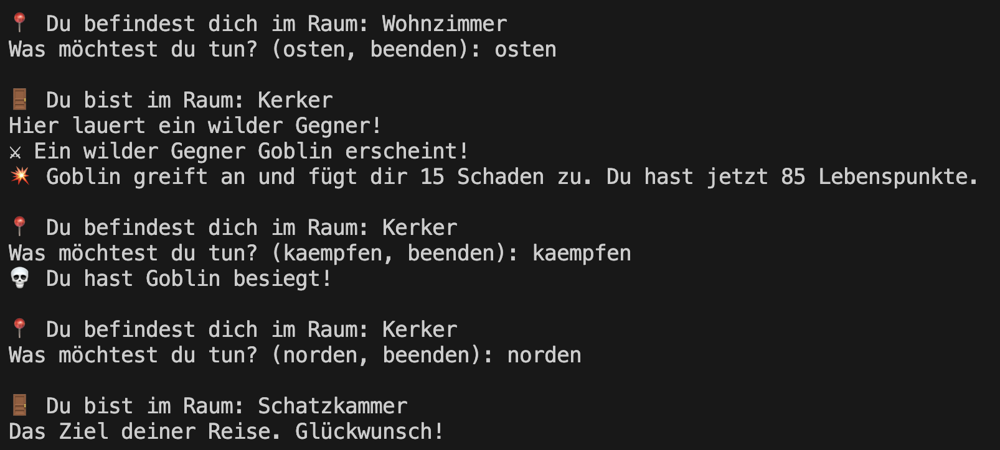
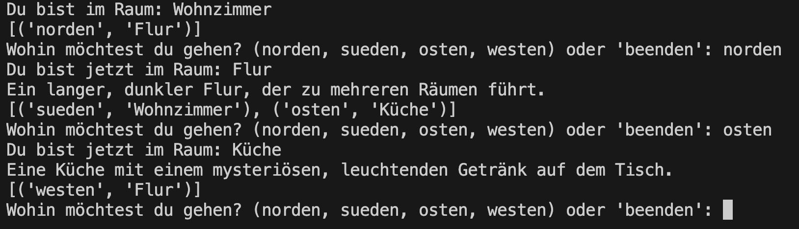

# Mittwoch

Ziel des Tages ist es, ein Klassen-basiertes Termin Adventure zu implementieren. Hierbei sollen pro Projektschritt folgende Schritte durchgeführt werden:

1. Implementierung mit Python
2. Dokumentation mit Docstrings
3. Testing mit Unittests
4. Arbeiten mit Git im eigenen Git-Repo

Am Ende der Woche soll jeder ein Repository mit Lösungen zu allen Aufgaben haben.

## Advanced Git - Rudi
Bevor wir mit dem heutigen Projek starten, schauen wir uns erweiterte Konzepte in Git mit Rudi an.

## Tagesprojekt - Klassen-basiertes Termin Adventure

### Konzepte des Dritten Tages
- [Klassen](https://python-wiki.de/lehrplan/python_grundlagen/oop/define_classes/define_classes.html)
- [Dictionaries](https://python-wiki.de/lehrplan/python_grundlagen/dictionaries/dictionaries.html)
- [Exkurs: Type Hints](https://python-wiki.de/lehrplan/python_grundlagen/type_hints/type_hints.html)
- [Einführung in Git](https://python-wiki.de/lehrplan/git/git.html)
- [Docstring](https://python-wiki.de/lehrplan/python_grundlagen/docstring/docstring.html)
- - [Unittests](https://python-wiki.de/lehrplan/python_grundlagen/oop/unittests/unittests.html)

## Auf in den Kampf!🌶🌶🌶
Erstelle eine Klasse Gladiator nach der folgenden Vorlage und sorge dafür, dass die richtigen Konsolentexte erscheinen. ⚔️
Verwende Type Hints für bessere Lesbarkeit.

<pre><code>
class Gladiator:
    def __init__(self,name, hitpoints, attackpower):
        ...

    def attack(self, enemy):
        ...

    def is_alive(self):
        ...

    def health_check(self):
        ... # Nutze hier is_alive

attacker = Gladiator(name="Glassy", hitpoints=10, attackpower=20)
defender = Gladiator(name="Tanky", hitpoints=30, attackpower=5)

print(defender.health_check()) # Tanky hat noch 30 HP
attacker.attack(defender)
print(defender.health_check()) # Tanky hat noch 10 HP
attacker.attack(defender)
print(defender.health_check()) # Tanky liegt am Boden
</code></pre>

Lösung

<pre><code>
class Gladiator:
    def __init__(self,name, hitpoints, attackpower):
        self.name = name
        self.hitpoints = hitpoints
        self.attackpower = attackpower

    def attack(self, enemy):
        enemy.hitpoints -= self.attackpower

    def is_alive(self):
        return self.hitpoints > 0

    def health_check(self):
        if self.is_alive():
            return f"{self.name} hat noch {self.hitpoints} HP."
        else:
            return f"{self.name} liegt am Boden." 

attacker = Gladiator(name="Glassy", hitpoints=10, attackpower=20)
defender = Gladiator(name="Tanky", hitpoints=30, attackpower=5)

print(defender.health_check()) # Tanky hat noch 30 HP
attacker.attack(defender)
print(defender.health_check()) # Tanky hat noch 10 HP
attacker.attack(defender)
print(defender.health_check()) # Tanky liegt am Boden
</code></pre>

## Ab in die Arena!🌶🌶🌶
Erstelle eine Klasse Arena, bei der als Attribute zwei Gladiatoren festgelegt werden. Die beiden Gladiatoren sollen sich hier gegenseitig angreifen, bis nurnoch einer steht.

Um den Kampf zu starten, soll eine Methode `fight` implementiert werden. Du kannst gerne Print-Messages hinzufügen, die den Kampf spannend und nachvollziehbar gestalten. Der folgende Code soll durchführbar sein.

Verwende Type Hints für bessere Lesbarkeit.

<pre><code>
a = Gladiator(name="Glassy", hitpoints=10, attackpower=20)
d = Gladiator(name="Tanky", hitpoints=30, attackpower=5)

arena = Arena(a, d)
arena.fight()
</code></pre>

Lösung

<pre><code>
class Arena:
    def __init__(self, attacker: Gladiator, defender: Gladiator):
        self.attacker = attacker
        self.defender = defender

    def fight(self):
        while self.attacker.is_alive() and self.defender.is_alive():
            self.attacker, self.defender = self.defender, self.attacker
            self.attacker.attack(self.defender)

        winner = self.attacker if self.attacker.is_alive() else self.defender

        print(f"The winner is {winner.name}!🎉🎉🎉")
</code></pre>

## Where am I? 🌶️🌶️🌶️

Entwickle ein einfaches, terminal-basiertes Programm, das den Spieler durch eine Welt aus verbundenen Räumen führt. Der Spieler soll in der Lage sein, sich zwischen den Räumen zu bewegen, indem er Richtungsbefehle eingibt.

### Anforderungen
- Der Spieler erhält eine Beschreibung des aktuellen Raums bei jedem Betreten.
- Der Spieler kann sich durch Eingabe von Richtungsbefehlen (norden, sueden, osten, westen) zwischen den Räumen bewegen.
- Wenn der Spieler versucht, in eine Richtung zu gehen, in der kein Raum existiert, soll eine entsprechende Nachricht angezeigt werden.
- Das Spiel enthält ein Hauptmenü, das dem Spieler erlaubt, Befehle einzugeben.
- Vor der Eingabeaufforderung soll die Beschreibung des aktuellen Raums ausgegeben werden, um den Spieler über seinen Standort zu informieren.

### Klassenbasierte Architektur:
**Raum**: Eine Klasse, die einen Raum im Spiel darstellt. Jeder Raum soll einen Namen und eine Beschreibung haben sowie Verbindungen zu anderen Räumen (Nachbarräume), die über Richtungsbefehle erreichbar sind.

**Spieler**: Eine Klasse, die den Spieler repräsentiert. Der Spieler hat eine aktuelle Position, die den Raum angibt, in dem er sich befindet.

Lösung

<pre><code>
from typing import Dict, Optional

class Raum:
    def __init__(self, name: str, beschreibung: str, nachbarraeume: Optional[Dict[str, 'Raum']] = None):
        self.name = name
        self.beschreibung = beschreibung
        self.nachbarraeume = nachbarraeume if nachbarraeume else {}

class Spieler:
    def __init__(self, start_raum: Raum):
        self.aktueller_raum = start_raum

    def bewegen(self, richtung: str):
        """Bewegt den Spieler in eine Richtung, wenn möglich."""
        if richtung in self.aktueller_raum.nachbarraeume:
            self.aktueller_raum = self.aktueller_raum.nachbarraeume[richtung]
            print(f"Du bist jetzt im Raum: {self.aktueller_raum.name}")
            print(f"{self.aktueller_raum.beschreibung}")
            print(f"{[(richtung, raum.name) for richtung, raum in self.aktueller_raum.nachbarraeume.items()]}")
        else:
            print("In dieser Richtung gibt es keinen Raum.")

# Räume mit Nachbarräumen erstellen
flur = Raum("Flur", "Ein langer, dunkler Flur, der zu mehreren Räumen führt.")
kueche = Raum("Küche", "Eine Küche mit einem mysteriösen, leuchtenden Getränk auf dem Tisch.", {"westen": flur})
wohnzimmer = Raum("Wohnzimmer", "Ein gemütliches Wohnzimmer mit einem Kamin.", {"norden": flur})
flur.nachbarraeume = {"sueden": wohnzimmer, "osten": kueche}  # Nachbarräume für 'flur' nachträglich definieren

# Spieler erstellen und im Wohnzimmer starten
spieler = Spieler(wohnzimmer)

def hauptmenue():
    print(f"Du bist im Raum: {spieler.aktueller_raum.name}")
    print(f"{[(richtung, raum.name) for richtung, raum in spieler.aktueller_raum.nachbarraeume.items()]}")
    while True:
        richtung = input("Wohin möchtest du gehen? (norden, sueden, osten, westen) oder 'beenden': ").lower()
        if richtung == 'beenden':
            print("Spiel beendet. Bis zum nächsten Mal!")
            break
        spieler.bewegen(richtung)

if __name__ == "__main__":
    hauptmenue()
</code></pre>

## Arrow to the knee? 🌶️🌶️🌶️🌶️

Schreibe ein textbasiertes Abenteuerspiel, das den Spieler durch eine Reihe von Räumen führt, in denen er auf Gegner trifft, die er bekämpfen oder umgehen kann.

### Anforderung
#### Räume erkunden
- Das Spiel besteht aus mehreren Räumen, die jeweils eine einzigartige Beschreibung und optional einen Gegner haben können.
- Der Spieler kann sich zwischen den Räumen bewegen, indem er Richtungsanweisungen gibt (norden, sueden, osten, westen).

#### Kämpfe mit Gegnern
- In einigen Räumen trifft der Spieler auf Gegner. Wenn ein Spieler einen Raum betritt, der einen Gegner enthält, wird der Spieler automatisch angegriffen.
- Der Spieler hat dann nur die Möglichkeit, den Gegner zu bekämpfen (kaempfen).
- Jeder Gegner und der Spieler haben eine bestimmte Anzahl von Lebenspunkten. Ein Kampf erfolgt durch den Austausch von Angriffen, wobei jeder Angriff Schaden verursacht.

#### Spieleraktionen
- Die Aktion kaempfen wird nur verfügbar, wenn ein Gegner im aktuellen Raum ist. Ansonsten kann der Spieler die Richtungen wählen, in die er sich bewegen möchte.
- Das Spiel endet, wenn der Spieler besiegt wird (Lebenspunkte <= 0) oder eine bestimmte Bedingung erfüllt ist (z.B. das Erreichen eines speziellen Raums).

### Erweiterungen
- Erlaube dem Spieler bei Sicht eines Gegners zu fliehen anstatt zu kämpfen
- Füge mehrere Räume und Gegner hinzu
- Spielerinventar und Items, die z.B. die Gesundheit oder Angriffskraft erhöhen
- Erhöhe den Schwierigkeitsgrad durch weitere Items wie z.B. Schlüssel die benötigt werden um Türen zu öffnen.

Lösung

<pre><code>
from typing import Dict, Optional

class Gegner:
    def __init__(self, name: str, lebenspunkte: int, angriffskraft: int):
        self.name = name
        self.lebenspunkte = lebenspunkte
        self.angriffskraft = angriffskraft

    def angriff(self, spieler: 'Spieler'):
        spieler.lebenspunkte -= self.angriffskraft
        print(f"💥 {self.name} greift an und fügt dir {self.angriffskraft} Schaden zu. Du hast jetzt {spieler.lebenspunkte} Lebenspunkte.")

class Raum:
    def __init__(self, name: str, beschreibung: str, gegner: Optional[Gegner] = None):
        self.name = name
        self.beschreibung = beschreibung
        self.gegner = gegner
        self.nachbarraeume: Dict[str, 'Raum'] = {}

    def verbinde_raum(self, anderer_raum: 'Raum', richtung: str):
        self.nachbarraeume[richtung] = anderer_raum

class Spieler:
    def __init__(self, start_raum: Raum):
        self.aktueller_raum = start_raum
        self.lebenspunkte = 100
        self.angriffskraft = 50

    def bewegen(self, richtung: str):
        if richtung in self.aktueller_raum.nachbarraeume:
            self.aktueller_raum = self.aktueller_raum.nachbarraeume[richtung]
            self.raum_betreten()
        else:
            print("🚫 In dieser Richtung gibt es keinen Raum.")

    def raum_betreten(self):
        print(f"\n🚪 Du bist im Raum: {self.aktueller_raum.name}")
        print(f"{self.aktueller_raum.beschreibung}")
        if self.aktueller_raum.gegner and self.aktueller_raum.gegner.lebenspunkte > 0:
            print(f"⚔️ Ein wilder Gegner {self.aktueller_raum.gegner.name} erscheint!")
            self.aktueller_raum.gegner.angriff(self)

    def angriff(self, gegner: Gegner):
        if gegner and gegner.lebenspunkte > 0:
            gegner.lebenspunkte -= self.angriffskraft
            if gegner.lebenspunkte <= 0:
                print(f"💀 Du hast {gegner.name} besiegt!")
                self.aktueller_raum.gegner = None
            else:
                print(f"🗡️ {gegner.name} hat jetzt {gegner.lebenspunkte} Lebenspunkte.")
                self.aktueller_raum.gegner.angriff(self)
        else:
            print("🤷 Es gibt hier keinen Gegner.")

def hauptmenue(spieler: Spieler):
    while spieler.lebenspunkte > 0:
        print(f"\n📍 Du befindest dich im Raum: {spieler.aktueller_raum.name}")
        
        optionen = 'kaempfen' if spieler.aktueller_raum.gegner else ','.join([richtung for richtung in spieler.aktueller_raum.nachbarraeume.keys()])
        aktion = input(f"Was möchtest du tun? ({optionen}, beenden): ").lower()
        
        if aktion in ["norden", "sueden", "osten", "westen"]:
            spieler.bewegen(aktion)
        elif aktion == "kaempfen":
            spieler.angriff(spieler.aktueller_raum.gegner)
        elif aktion == "beenden":
            print("👋 Spiel beendet. Bis zum nächsten Mal!")
            break
        else:
            print("🚫 Ungültige Aktion.")

        if spieler.lebenspunkte <= 0:
            print("💀 Du wurdest besiegt. Spiel vorbei.")

# Spielinitialisierung
start_raum = Raum("Wohnzimmer", "Du stehst am Anfang deines Abenteuers.")
gegner_raum = Raum("Kerker", "Hier lauert ein wilder Gegner!", Gegner("Goblin", 50, 15))
end_raum = Raum("Schatzkammer", "Das Ziel deiner Reise. Glückwunsch!")

start_raum.verbinde_raum(gegner_raum, "osten")
gegner_raum.verbinde_raum(end_raum, "norden")

spieler = Spieler(start_raum)
hauptmenue(spieler)
</code></pre>

