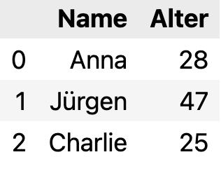

# Pandas Einführung

<details>
<summary>
🎦 Video
</summary>
<iframe width="560" height="315" src="https://www.youtube.com/embed/kX57CzbVNT4?si=s0iruimi_YRs0dv_" title="YouTube video player" frameborder="0" allow="accelerometer; autoplay; clipboard-write; encrypted-media; gyroscope; picture-in-picture; web-share" allowfullscreen></iframe>
</details>


## Einleitung [5 min]

Pandas ist eine leistungsstarke, flexible und einfach zu verwendende Open-Source-Bibliothek, die in Python für Datenmanipulation und -analyse entwickelt wurde. In dieser Einführung konzentrieren wir uns auf drei Hauptkomponenten von Pandas: DataFrames, Series und Index.

### DataFrame
Ein DataFrame ist eine zweidimensionale, größenveränderliche, potenziell heterogene tabellarische Datenstruktur mit beschrifteten Achsen (Zeilen und Spalten). Man kann es sich wie eine Tabelle in einer relationalen Datenbank oder ein Excel-Datenblatt vorstellen.

### Series
Eine Series ist eine eindimensionale Array-ähnliche Struktur, die eine Sequenz von Werten (ähnlich wie ein NumPy-Array) und einen zugehörigen Array von Datenbezeichnungen, den sogenannten Index, umfasst.

### Index
Der Index (oder die 'Achsenbezeichnungen') in Pandas hilft bei der Identifizierung der Daten. Ein Index kann alphanumerisch sein und dient dazu, Zeilen oder Spalten in einem DataFrame oder einer Series zu kennzeichnen.

Ein paar Codebeispiele sollen diese Datenstrukturen veranschaulichen:

## Codebeispiele [15 min]

### Erstellen eines einfachen DataFrame


```python
import pandas as pd
data = {'Name': ['Anna', 'Jürgen', 'Charlie'],
        'Alter': [28, 47, 25]}
df = pd.DataFrame(data)
print(df)
```

          Name  Alter
    0     Anna     28
    1   Jürgen     47
    2  Charlie     25


```python
type(df)
```


    pandas.core.frame.DataFrame

**Tipp:** In *Jupyter Notebooks* kann man sich mit `display(df)`den Dataframe in schönem Format ausgeben lassen.

```python
display(df)
```



### Index

Der Index (Zeilenbezeichnung) wurde hier automatisch erstellt. Wir können ihn aber auch selbst übergeben bei der Erstellung mit dem `index`-Parameter:


```python

# DataFrame mit eigenem Index erstellen
df_column_wise = pd.DataFrame(
    {"a": [4, 5, 6],
     "b": [7, 8, 9],
     "c": [10, 11, 12]},
    index=[1, 2, 3]
)

print(df_column_wise)
```

```
   a  b   c
1  4  7  10
2  5  8  11
3  6  9  12
```

### Columns
Auch die Spaltenbezeichnung können wir über den Parameter `columns` übergeben.
```python
# DataFrame mit Zeilenangaben erstellen
df_row_wise = pd.DataFrame(
    [[4, 7, 10],
     [5, 8, 11],
     [6, 9, 12]],
    index=[1, 2, 3],
    columns=['a', 'b', 'c']
)

print(df_row_wise)
```

```
   a  b   c
1  4  7  10
2  5  8  11
3  6  9  12
```

### Erstellen einer einfachen Series


```python
ser = pd.Series([1, 3, 5, 7, 9])
print(ser)
```

    0    1
    1    3
    2    5
    3    7
    4    9
    dtype: int64


```python
type(ser)
```


    pandas.core.series.Series


### Zugriff auf die erste Zeile des DataFrame


```python
erste_zeile = df.iloc[0]
print(erste_zeile)
```

    Name     Anna
    Alter      28
    Name: 0, dtype: object


## Aufgaben [90 min]

### A1: Erstellen eines DataFrames 🌶️
Erstellen Sie einen DataFrame mit Ihren eigenen Daten. Der DataFrame sollte mindestens 3 Spalten und 4 Zeilen haben.

### A2: Erstellen einer Series 🌶️
Erstellen Sie eine Series mit mindestens 5 numerischen Werten.

### A3: Auswahl von Daten 🌶️
Wählen Sie ein Element aus Ihrem DataFrame anhand seiner Position aus.

### A4: Zugriff mit loc 🌶️🌶️
Verwenden Sie `loc`, um auf eine Zeile in Ihrem DataFrame zuzugreifen.

### A5: Zugriff mit iloc 🌶️🌶️
Verwenden Sie `iloc`, um auf eine Spalte in Ihrem DataFrame zuzugreifen.

### A6: Erstellen eines indexierten DataFrames 🌶️🌶️
Erstellen Sie einen DataFrame mit einem benutzerdefinierten Index.

### A7: Ändern von Spaltennamen 🌶️🌶️
Ändern Sie die Namen der Spalten in Ihrem DataFrame.

### A8: Hinzufügen einer neuen Zeile 🌶️🌶️
Fügen Sie einem DataFrame eine neue Zeile hinzu.

### A9: Hinzufügen einer neuen Spalte 🌶️🌶️
Fügen Sie Ihrem DataFrame eine neue Spalte hinzu, die auf den Werten einer anderen Spalte basiert.

### A10: Löschen einer Spalte 🌶️
Entfernen Sie eine Spalte aus Ihrem DataFrame.

[Lösungen](pandas_einfuehrung_loesungen.md)


```python

```
