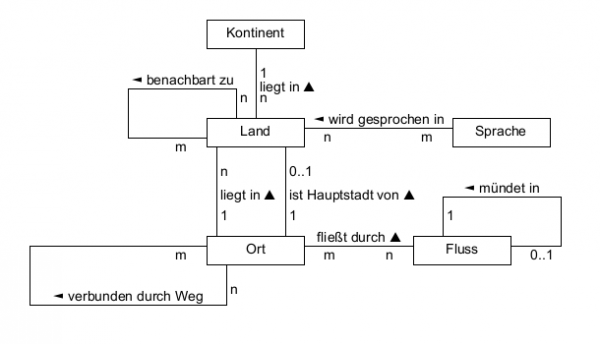

# Übung: Terra-Datenbank

Ziel dieser Einheit ist das Üben der Erstellung von SQL-Querries und der Umgang mit sqlalchemy.

[🌎Terra-datenbank herunterladen🔽](terra.sqlite)



Machen sie sich mit der Datenbank vertraut.

## Beispielaufgabe für SQL-Querries:

Im Folgenden ist bereits die Funktion `execute_sql` definiert, die eine durchführung von 
Querries mit der Datenbank erlaubt. Diese wird in allen folgenden Aufgaben benötigt.

Ihre Aufgabe ist jeweils das Erstellen der passenden Querry, sodass die Tests korrekt sind.

```python
import sqlite3
from unittest import main, TestCase

DATABASE_URL = "terra.sqlite"


def execute_sql(query, params, database_url=DATABASE_URL):
    """Führe eine SQL-Query aus mit den übergebenen Parametern aus."""
    cursor = sqlite3.connect(database_url).cursor()
    cursor.execute(query, params)
    return cursor.fetchall()

def find_countries_starting_with() -> str:
    """⭐⭐Gibt den SQL-Ausdruck zurück, um eine Liste (Land, Kontinent)
    von Ländern und dem zugehörigen Kontinent zu erhalten."""
    return "..."


class TestFindCountriesStartingWith(TestCase):
    def test_find_countries_starting_with_B(self):
        countries = execute_sql(find_countries_starting_with(), ['B%'])
        self.assertCountEqual(countries,
            [('Belgien', 'Europa'), ('Bahrein', 'Asien'), ('Barbados', 'Nordamerika'),
             ('Bangladesch', 'Asien'), ('Bahamas', 'Afrika'), ('Bulgarien', 'Europa'),
             ('Belize', 'Nordamerika'), ('Bhutan', 'Asien'), ('Bosnien-Herzegowina', 'Europa'),
             ('Bolivien', 'Südamerika'), ('Brasilien', 'Südamerika'), ('Brunei', 'Asien'),
             ('Burundi', 'Afrika'), ('Birma', 'Asien'), ('Bophuthatswana', 'Afrika'),
             ('Botswana', 'Afrika'), ('Benin', 'Afrika'), ('Burkina Faso', 'Afrika')])
        
    def test_find_countries_starting_with_C(self):
        countries = execute_sql(find_countries_starting_with(), ['C%'])
        self.assertCountEqual(countries,
            [('Costa Rica', 'Nordamerika'), ('Chile', 'Südamerika'), ('China', 'Asien')])
        
if __name__ == '__main__':
    main()
```

<details>
<summary>
Lösung (SQL eingesetzt)
</summary>
Beachte hier das <code>?</code> im Statement.
<pre><code>def find_countries_starting_with() -> str:
    return """
    SELECT land.name, kontinent.name
    FROM land
    JOIN kontinent ON land.knr = kontinent.knr
    WHERE land.name LIKE ?
    """
</code></pre>
</details>

## Aufgabe 1: SQL- Querries

[Datei mit Aufgaben.🔽](terra_sql_questions.py)

[Datei mit Lösungen.🔽](terra_sql_solution.py)

__Weitere Hinweise:__

Die obigen Aufgaben decken nicht alle Inhalte ab,
die wir gelernt haben (z.B. ist `AVG` hier nicht aufgetaucht).
Diese werden dennoch in der LZK abgefragt werden.

Auch wird die Komplexität des Datensatzes
und der Fragen teilweise etwas höher ausfallen.

Spielt also mit diesem Datensatz auch außerhalb
der hier vorgestellten Fragestellungen ordentlich herum.

### Aufgabe 2: Schema finden
Finde das Schema von der Datenbank.

<details>
<summary>
Tipp🍀
</summary>
<pre><code>Öffne die Datenbank in sqlite3, lade sie und führe einen Befehl aus, um
das Schema zu finden. Nutze <code>.help</code>, um den Befehl zu finden.
</code></pre>
</details>

<details>
<summary>
Lösung
</summary>
Nutze den Befehl <code>.schema</code> in sqlite3, um das folgende Schema anzuzeigen.
<pre><code>CREATE TABLE fluss (
            FNR varchar(3) NOT NULL primary key,
            Name varchar(30) NOT NULL check(length(Name) <= 30), -- Test comment
            ZielFNR varchar(3) DEFAULT NULL references fluss(FNR),
            Meer varchar(25) DEFAULT NULL,
            Laenge double(53,0) DEFAULT NULL
          );
CREATE TABLE kontinent (
      KNR varchar(2)  NOT NULL primary key,
      Name varchar(15)  DEFAULT NULL,
      Flaeche double(8,0) DEFAULT NULL,
      Einwohner double(8,0) NOT NULL,
      AnteilErdoberflaeche decimal(4,2) NOT NULL
    );
CREATE TABLE land (
      LNR varchar(4)  NOT NULL primary key,
      Name varchar(50)  DEFAULT NULL,
      KNR varchar(3)  DEFAULT NULL references kontinent(KNR),
      Einwohner double(20,2) DEFAULT NULL,
      Flaeche double(53,0) DEFAULT NULL,
      HauptONR varchar(6)  DEFAULT NULL
    );
CREATE TABLE sprache (
      SNR varchar(3)  NOT NULL primary key,
      Name varchar(50)  NOT NULL
    );
CREATE TABLE gesprochen (
      SNR varchar(3)  NOT NULL,
      LNR varchar(4)  NOT NULL references land(LNR),
      Anteil tinyint(4) DEFAULT NULL,
      primary key (SNR, LNR)
    );
CREATE TABLE nachbarland (
      LNR1 varchar(4)  NOT NULL DEFAULT '' references land(LNR),
      LNR2 varchar(4)  NOT NULL DEFAULT '' references land(LNR),
      primary key (LNR1, LNR2)
    );
CREATE TABLE ort (
      ONR varchar(6)  NOT NULL primary key,
      Name varchar(30)  DEFAULT NULL,
      LNR varchar(4)  DEFAULT NULL references land(lnr),
      Landesteil varchar(30)  DEFAULT NULL,
      Einwohner int(11) DEFAULT NULL,
      Breite double(10,4) DEFAULT NULL,
      Laenge double(10,4) DEFAULT NULL,
      Done varchar(3)  NOT NULL
    );
CREATE TABLE stadtfluss (
      ONR varchar(6)  NOT NULL references ort(onr),
      FNR varchar(3)  NOT NULL references fluss(fnr),
      Done varchar(5)  NOT NULL,
      primary key (ONR, FNR)
    );
CREATE TABLE weg (
      ONR1 varchar(6)  NOT NULL references ort(ONR),
      ONR2 varchar(6)  NOT NULL references ort(ONR),
      Strecke decimal(5,2) NOT NULL,
      Dauer int(11) NOT NULL ,
      Sperrung int(11) NOT NULL DEFAULT 0,
      primary key (ONR1, ONR2)
    );
</code></pre>
</details>

### Aufgabe 3: ERM erstellen
Erstelle mit sqlalchemy das ERM für die Datenbank. (Lösungen sehe in der nächsten Datei mit Aufgaben)

### Aufgabe 4: Funktionen mit sqlalchemy erstellen
Die Funktionen aus Aufgabe 1 sollen nun auch mithilfe von sqlalchemy umgesetzt werden.

[Datei mit Aufgaben.🔽](terra_sqlalchemy_questions.py)

[Datei mit Lösungen.🔽](terra_sqlalchemy_solution.py)

Viel Erfolg beim Bearbeiten der Aufgaben.💪

# Lösung

[Lösung](terra_sql_solution.py) mit sqlite3.

[Lösung](terra_sqlalchemy_solution.py) mit sqlalchemy.