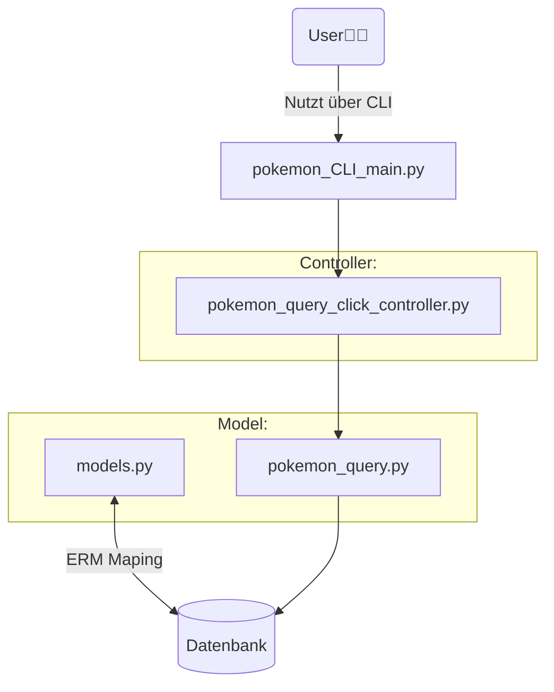
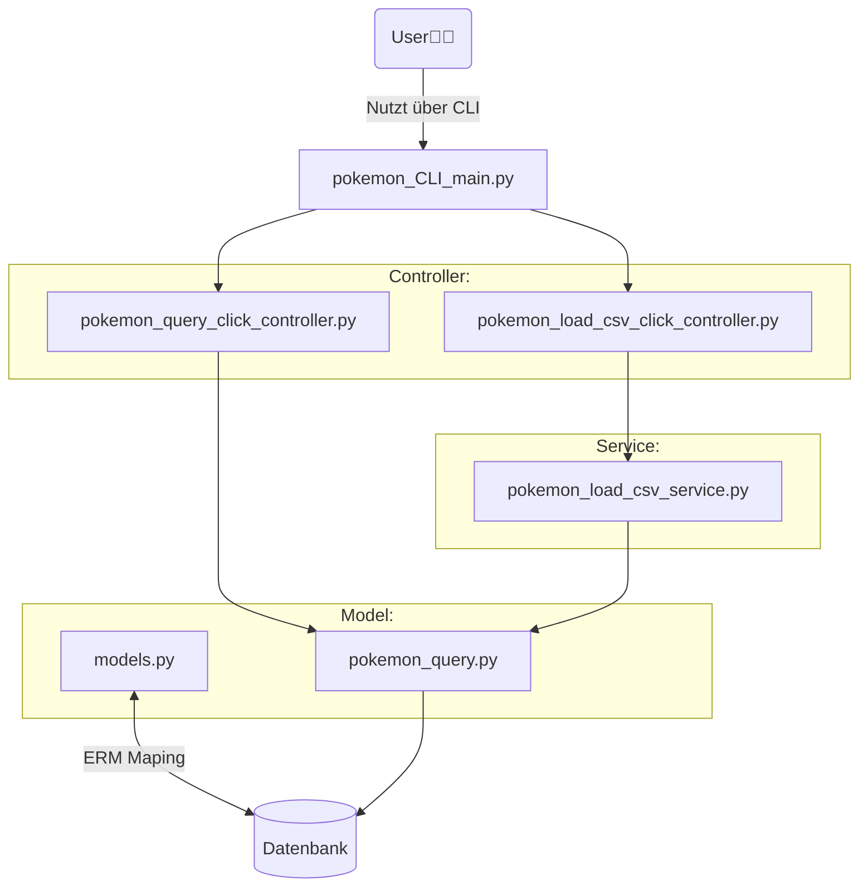
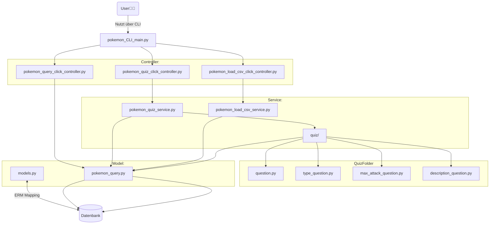

# Pokequiz
Wir werden in diesem begleiteten Projekt über mehrere Tage lernen:

* Wie man ein Projekt aus mehreren Bestandteilen aufsetzen und konzipieren kann,
* wie man eine bestehende Codebasis liest und erweitert,
* wie man mit Datenbanken umgeht,
* alten Stoff wiederholen.

# Projektübersicht

Ziel des Projektes ist es ein CLI-Tool zu entwickeln, dass Informationen über Pokemon bereitstellt.

Gegeben ist ein Programm, bei dem bereits einfache Informationen über eine kleine Anzahl Pokemon
ausgegeben werden können. Im mehreren Arbeitsschritten soll die Funktionalität des Programmes 
erweitert werden:

1. Erweiterung der gespeicherten Eigenschaften von Pokemon und hinzufügen weiterer Funktionalitäten, wie das Speichern neuer Pokemon.
2. Funktionalität hinzufügen, dass neue Pokemon über eine CSV-Datei in die Datenbank persistiert werden.
3. Quiz Funktion hinzufügen, die Quizfragen erstellt, basierend auf den Pokemon, die in der Datenbank hinterlegt sind.


# Part 1: Start mit Codebasis

Bei der Codebasis liegen vor:

| Datei                             | Funktion                                                               |
|-----------------------------------|------------------------------------------------------------------------|
| models.py                         | Enthält Model für Pokemon und für Typ                                  |
| pokemon_query_service.py          | Setzt die DML und DQL gegen die Datenbank ab.                          |
| pokemon_query_click_controller.py | Ermöglicht CLI Anfragen mit Click.                                     |
| pokemon_CLI_main.py               | Macht das Projekt ausführbar (add_commands von Click zusammengeführt). |



**Aufgaben:**

* Führe das Programm mit dem Befehl `python pokemon_CLI_main.py` aus.
* Lese die bestehende Codebasis und versuche diese zu verstehen.
    * Wie werden die Commandozeile gelesen und Inhalte auf dieser ausgegeben?
    * Wie wird aus der Datenbank gelesen?
    * Wie wird die Datenbank modeliert?
    * Woher kommen die initialen Daten?
* Erweitere die Codebasis, sodass die erweiterten Daten aus `data/ger_pokemon_gen1.csv` korrekt modeliert werden
* Erweitere die Codebasis, sodass neue Pokemon korrekt ausgelesen, gespeichert, gelöscht und geändert werden können.


# Part 2: CSV einlesen

| Datei                                |                                                                                              |
|--------------------------------------|----------------------------------------------------------------------------------------------|
| pokemon_load_csv_service.py          | Lädt Dateien aus einer CSV und schreibt sie in die DB. Nutzt dazu den pokemon_query_service. |
| pokemon_load_csv_click_controller.py | Ermöglicht das laden von CSV Daten in der CLI mit Click.                                     |



**Aufgaben:**

* Implementiere eine Möglichkeit die Datenbank über die CLI zu leeren.
* Erstelle die oben genannten Dateien.
* Implementiere die Logik zum Auslesen von CSV-Dateien in `pokemon_load_csv_service.py`. Achte dabei auch auf Fehlerhandling. Dabei soll nicht direkt auf die Datenbank zugegriffen werden, sondern nur über die Funktionen, die in `pokemon_query.py` definiert wurden.
* Implementiere die Nutzerschnittstelle in `pokemon_load_csv_click_controller.py`.

# Part 3: PokeQuiz

| Datei                                |                                                                                              |
|--------------------------------------|----------------------------------------------------------------------------------------------|
| pokemon_quiz_service.py              | Lädt Inhalte aus der Datenbank, um Fragen zu stellen. Nutzt dazu den pokemon_query_service.  |
| pokemon_quiz_click_controller.py     | Ermöglicht Stellen und beantworten von Quizfragen in CLI mit Click.                          |
| quiz                                       | Ordner, der alle spezifischen Frageklassen und die zugehörigen Hilfsdienste enthält.          |

### Frageklassen im `quiz/` Ordner

| Datei                     | Beschreibung                                                                                                  |
|---------------------------|---------------------------------------------------------------------------------------------------------------|
| question.py             | Definiert eine abstrakte Basisklasse `Question`, die von allen spezifischen Frageklassen erbt.                |
| type_question.py        | Implementiert eine spezifische Frageklasse, die Fragen zu den Typen eines Pokémon stellt.                     |
| max_attack_question.py  | Implementiert eine spezifische Frageklasse, die ermittelt, welches Pokémon den höchsten Angriffswert hat.     |
| description_question.py | Implementiert eine spezifische Frageklasse, die Fragen zu den Beschreibungen von Pokémon stellt.              |



**Aufgaben:**

Mit dem Befehl `--quiz` wird dem Nutzer eine Frage gestellt. Diese Frage wird aus der Datenbank gewonnen.
Der Nutzer soll diese Frage dann beantworten können und diese Antwort wird bewertet.

Folgende Fragen sind denkbar:

* Welchen Typ hat das folgende Pokemon? (Single Choice)
* Welches dieser Pokemon hat den höchsten Atk. Wert? (Single Choice)
* Wie heißt das Pokemon, auf das folgende Beschreibung zutrifft? (Texteingabe)
* Wie viel HP hat dieses Pokemon (+-10 HP)? (Texteingabe)
* Welches der folgenden Pokemon ist nicht vom Typ ... ? (Single Choice)
* Welches der folgenden Pokemon hat zwei Typen? (Single Choice)
* Nenne ein Pokemon vom Typ ... und ...? (Texteingabe)
* Nenne ein Legänderes Pokemon, dass mit dem Buchstaben ... beginnt! (Texteingabe)

Weitere Features:

* Ausführliche Antworten: Nach einer Frage wir eine ausführliche Antwort ausgegeben, die z.B. für jedes angebotene Pokemon den Typ sagt, wenn dieser erfragt wurde.
* Tracking des Users: Man kann sich mit `--quiz [<name>]` anmelden. So werden dann die Anzahl der richtig und falsch beantworteten Fragen für den Usernamen in der Datenbank gespeichert.

## Ordner-Struktur

```bash
pokemon_project/
│
├── database/
│   ├── __init__.py          # Macht das Verzeichnis zu einem Python-Paket
│   ├── models.py            # Definiert die SQLAlchemy-Modelle für Pokemon, Type usw.
│   └── init_db.py           # Startet und konfiguriert die Datenbank
│
├── services/
│   ├── __init__.py          # Macht das Verzeichnis zu einem Python-Paket
│   ├── pokemon_query.py   # Logik für Abfragen und Updates von Pokémon-Daten
│   ├── pokemon_load_csv_service.py # Service zum Laden von Daten aus einer CSV-Datei
│   ├── quiz/
│   │   ├── __init__.py            # Macht das Verzeichnis zu einem Python-Paket
│   │   ├── question.py            # Basisfrageklasse
│   │   ├── type_question.py       # Spezifische Frageklasse für Pokémon-Typen
│   │   └── max_attack_question.py # Spezifische Frageklasse für maximalen Angriff│
│   │   └── description_question.py # Spezifische Frageklasse für das Raten per Beschreibung
├── controllers/
│   ├── __init__.py          # Macht das Verzeichnis zu einem Python-Paket
│   ├── pokemon_query_click_controller.py # CLI-Controller für Pokémon-Abfragen
│   ├── pokemon_load_csv_click_controller.py # CLI-Controller für das Laden von CSV-Daten
│   └── pokemon_quiz_click_controller.py  # CLI-Controller für das Pokémon-Quiz
│
├── tests/
│   ├── __init__.py          # Macht das Verzeichnis zu einem Python-Paket
│   ├── test_models.py       # Tests für die Datenbankmodelle
│   ├── test_services.py     # Tests für die Service-Logik
│   ├── test_questions.py     # Tests für die Service-Logik
│   └── test_controllers.py  # Tests für die Controller-Funktionen
│
├── __init__.py          # Macht das Verzeichnis zu einem Python-Paket
└── pokemon_CLI_main.py      # Haupt-Eintrittspunkt für das CLI-Tool
```

# Lösung

[Download](pokedex_quiz.zip) einer Lösung.
