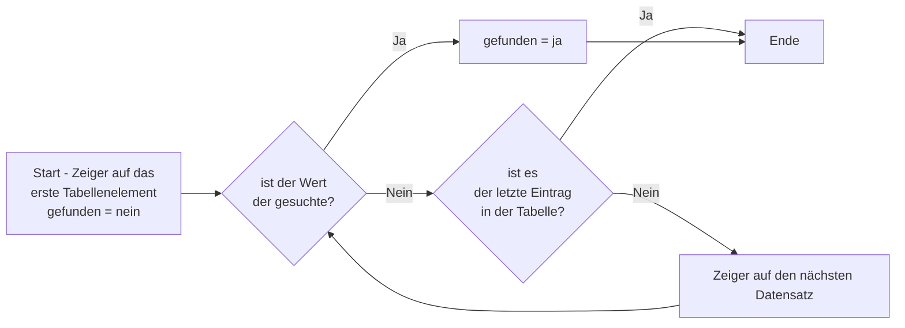
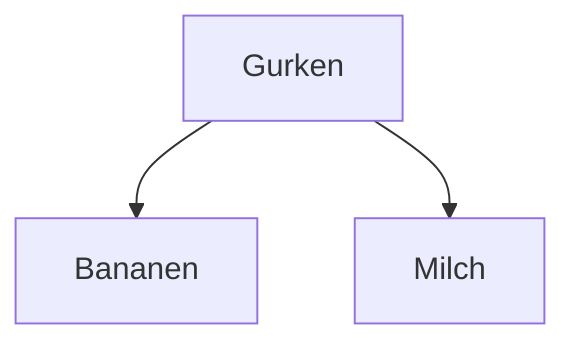
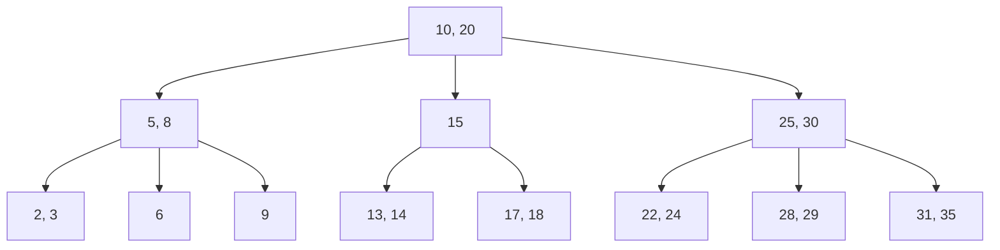
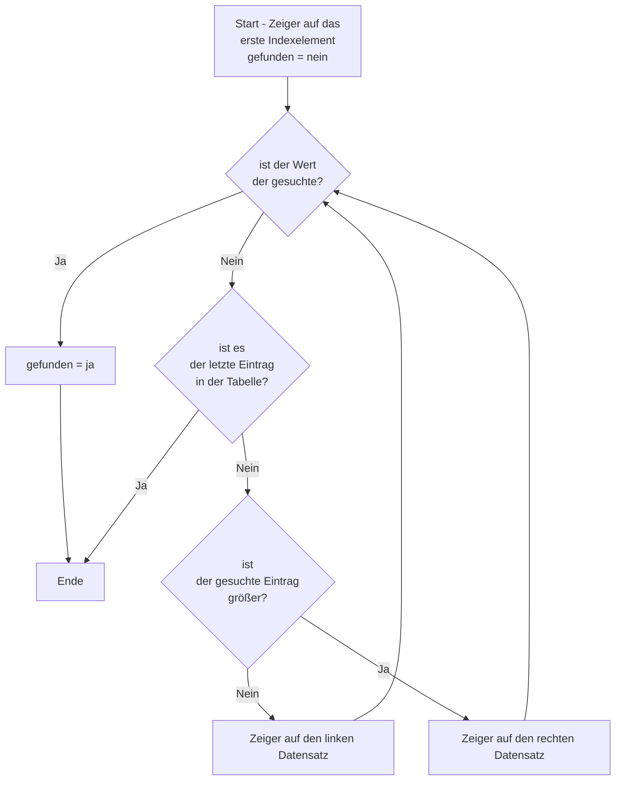
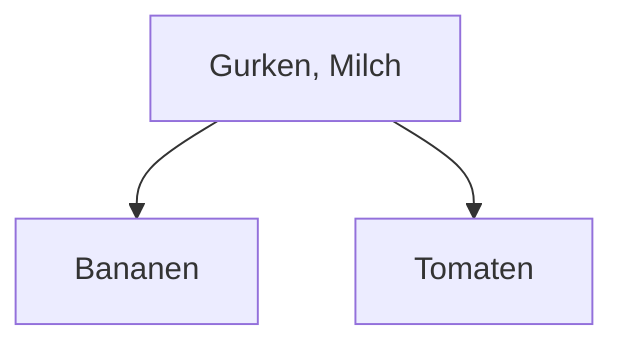
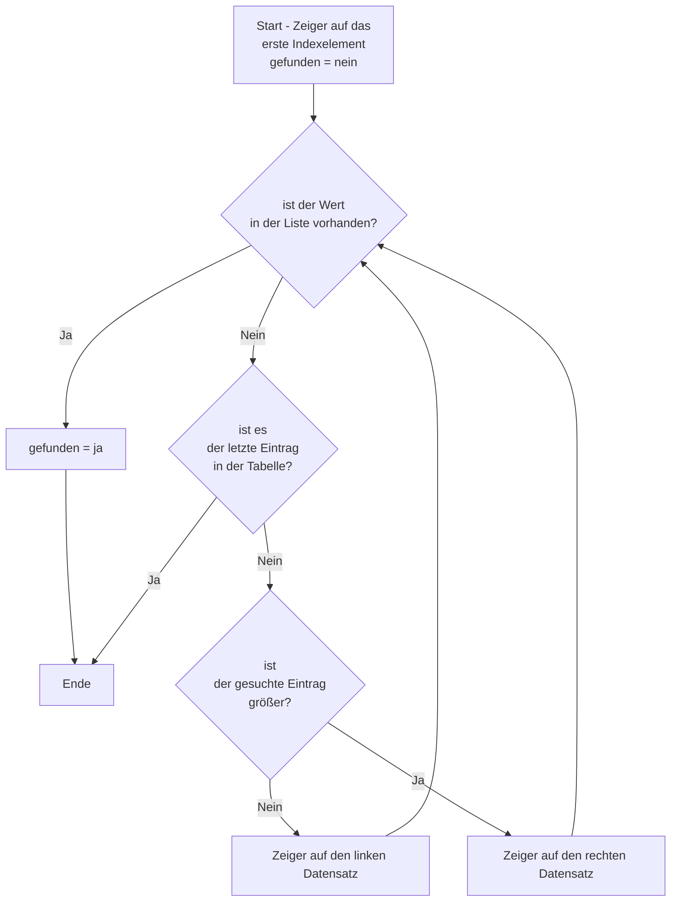

# Index, Indizes (eng. index, indexes)

## Problemstellung

Nehmen wir eine einfache Tabelle:

| Ware    |
|---------|
| Bananen |
| Gurken  |
| Milch   |

Ein Wert aus dieser Tabelle soll gelesen werden. Sagen wir der Zweite.
Also zählen wir von oben ab eins, zwei und finden den Wert "Gurken".
Dies ist eine gängige Methode, um einen Wert aus einer Tabelle zu finden.



Diese Verfahren nennt man **table scan** oder **full table scan**. Wir kennen das vielleicht schon aus anderen
Programmiersprachen. Dort würde dafür z.B. eine `for...to...` Schleife eingesetzt werden.

In SQL wäre ds Äquivalent das `SELECT`-Kommando. Bezogen auf unsere Aufgabe oben ergibt sich:

```sql
SELECT ware
FROM waren
WHERE ware = 'Gurken';
```

Nehmen wir einen `UPDATE`-Vorgang:

```sql
UPDATE waren
SET ware = 'Gurke'
WHERE ware = 'Gurken'
```

Auch hier ist der Vorgang der gleiche: Zunächst die Gurken suchen und dann die Bezeichnung ändern.

Es geht hier um die wichtigste Funktion einer Datenbank: **Daten suchen**!

Das Problem entsteht schon durch einfaches Einfügen von Datensätzen.
Das `INSERT`-Kommando fügt Datensätze nur an, nicht ein. Die Folge davon ist ein heilloses Durcheinander von
Datensätzen.

Nun nehmen wir die gleiche Tabelle, aber wir haben 1000 Lebensmittel darin. Wie man sich vorstellen kann, wird das ca.
300-mal länger dauern. 

Es sollte also ein Verfahren geben, dass die Suche beschleunigt. Eine Sortierung würde vielleicht helfen, da man ab einer bestimmten Stelle mit 'nicht gefunden' (Im Gurken-Beispiel bei "H") abbrechen kann.
Das wäre eine Verbesserung, aber bei Millionen von Datensätzen immer noch viel zu langsam.

**Genau dafür wurden Indizes entwickelt.**

## Indizes

Indizes sind Kopien der Daten, die in Suchbäumen organisiert sind. Bei Datenbanken haben sich [B-Bäume](https://de.wikipedia.org/wiki/B-Baum) etabliert.
Indizes können auf einem oder mehreren Feldern einer Tabelle erstellt werden.
Natürlich können mehrere Indizes pro Tabelle erstellt werden.
Sie können automatisch vom Datenbankprogramm erstellt werden oder manuell vom Datenbankprogrammierer.

#### Beispieldaten
```sql
CREATE TABLE Kunden (
    KundenID INTEGER,
    Kundenname TEXT,
    Email TEXT
);

INSERT INTO Kunden (Kundenname, Email) VALUES ('Max Mustermann', 'max@example.com');
INSERT INTO Kunden (Kundenname, Email) VALUES ('Maria Musterfrau', 'maria@example.com');
INSERT INTO Kunden (Kundenname, Email) VALUES ('Johannes Johannson', 'johannes@example.com');
INSERT INTO Kunden (Kundenname, Email) VALUES ('Anna Andersson', 'anna@example.com');
INSERT INTO Kunden (Kundenname, Email) VALUES ('Lena Lensen', 'lena@example.com');
INSERT INTO Kunden (Kundenname, Email) VALUES ('Karl Karlsen', 'karl@example.com');
INSERT INTO Kunden (Kundenname, Email) VALUES ('Sofia Svensson', 'sofia@example.com');
INSERT INTO Kunden (Kundenname, Email) VALUES ('Erik Erikson', 'erik@example.com');
INSERT INTO Kunden (Kundenname, Email) VALUES ('Nina Nilsen', 'nina@example.com');
INSERT INTO Kunden (Kundenname, Email) VALUES ('Lars Larsson', 'lars@example.com');
```

### Aufgabe: Erstellen eines einfachen Index 🌶️

Wir haben eine Tabelle `Kunden` mit vielen Einträgen. Das Durchsuchen der Tabelle nach dem Kundennamen ist langsam.

Erstelle einen Index auf der Spalte `Kundenname` der Tabelle `Kunden`, um die Suche zu beschleunigen.

<details>
<summary>Lösung</summary>

<pre><code>
CREATE INDEX idx_Kundenname ON Kunden(Kundenname);
</code></pre>

</details>

### Aufgabe: Löschen eines Index 🌶️

Der zuvor erstellte Index `idx_Kundenname` auf der Tabelle `Kunden` ist nicht mehr notwendig.

Löschen den Index `idx_Kundenname` wieder.

<details>
<summary>Lösung</summary>

<pre><code>
DROP INDEX idx_Kundenname;
</code></pre>

</details>


### Aufgabe: Erstellen eines zusammengesetzten Index 🌶️🌶️

Nachdem wir einen Index für den Kundennamen erstellt haben, bemerken wir, dass Abfragen, die sowohl den `Kundenname` als auch die `Email` betreffen, immer noch langsam sind.

Erstelle einen zusammengesetzten Index auf den Spalten `Kundenname` und `Email` der Tabelle `Kunden`, um die Suche für Abfragen, die beide Felder verwenden, zu beschleunigen.

<details>
<summary>Lösung</summary>

<pre><code>
CREATE INDEX idx_Kundenname_Email ON Kunden(Kundenname, Email);
</code></pre>

</details>


## Exkurs: B-Baum Index

Wenn wir als Datenbankprogrammierer die Spalte "Ware" als indiziert erklären, dann wird vom Datenbankprogramm ein Index
(B-Baum) angelegt.

Ein B-Baum funktioniert so, dass die zu durchsuchende Liste sortiert wird. Damit kann man entscheiden, ob ein Wert
größer oder kleiner ist als ein anderer Wert. Nun nehmen wir den Wert in der Mitte der sortierten Liste als Startpunkt  (Knoten, Wurzelknoten oder root).

Da die Sortierung gegeben ist (Bananen < Gurken < Milch. Bananen sind kleiner als Gurken sind kleiner als Milch.), ist 'Gurken' die Wurzel.
Die anderen Elemente werden gemäß der Sortierung links oder rechts an die Wurzel angehängt.

Der zu bauende B-Baum sieht dann so aus:



Ein Beispiel etwas komplexerer Art und auf Zahlen aufgebaut könnte so aussehen:



Doch zurück zu unserem kleinen Beispiel.
Die Methode zum Durchsuchen sieht so aus:



Demnach wäre die Suche nach "Gurken" beim ersten Zugriff erfolgreich beendet, da es sich um das erste Indexelement
handelt.
Natürlich gibt es den Fall, dass nichts gefunden wurde. Aber der Weg dorthin ist mit zwei Zugriffen erledigt. Selbst bei
einer Tabelle mit nur drei Einträgen ergibt sich also noch ein Vorteil.

Eine Erweiterung ergibt sich, wenn es sich um vier Zeilen in der Datenbank handeln würde. Das erste Indexelement enthält
dann zwei Einträge und die Suchmethode untersucht ob einer davon passt, bevor es nach links oder rechts verzweigt.

| Ware    |
|---------|
| Bananen |
| Gurken  |
| Milch   |
| Tomaten |





Die Suche innerhalb des Knotens kann eine einfache Schleife sein, da es sich oft nur um wenige Werte handelt.
Die Verteilung der Werte in den einzelnen Knoten und Blättern des B-Baumes wird vom Datenbankprogramm automatisch
vorgenommen.

Ein letzter Punkt in der Index-Erstellung ist der Index auf Basis mehrerer Spalten. Bedenken wir folgende Tabelle:

| Ware    | Land        |
|---------|-------------|
| Bananen | Kongo       |
| Gurken  | Holland     |
| Milch   | Polen       |
| Tomaten | Deutschland |
| Bananen | Burundi     |
| Gurken  | Deutschland |
| Milch   | Deutschland |
| Tomaten | Holland     |

Ein zusammen gesetzter Index aus den Feldern Ware und Land wird dann aus beiden Spalten gebildet und sortiert.

Bei sehr großen Datenbeständen kann es je nach dem Datenbestand dazu kommen, dass die Suche schneller oder langsamer
läuft je nachdem, ob der Index als (Ware, Land) oder (Land, Ware) aufgebaut ist. 

Wenn man bei Millionen von Datensätzen
einen zusammengesetzten Index aufbaut, ist es sicher, dass die Knoten des B-Baumes eine Liste mit den Werten der ersten
angegebenen Spalte enthält und für jeden dieser Einträge eine Liste aus den passenden Einträgen der zweiten Spalte.

### Aufgabe: Beschreiben Sie den Suchvorgang für die Zahl 22 im komplexen Beispiel. 🌶️🌶️

<details>
<summary>
Lösung:
</summary>

Beginnend im Wurzelknoten wird entschieden, nach rechts zu gehen, da der gesuchte Wert nicht im Wurzelknoten vorhanden ist. 

Im folgenden Knoten wird aufgrund des gleichen Entscheidungsprozesses der linke Knoten gewählt. Dort wird man fündig und der Suchvorgang bricht mit einer 'gefunden' Meldung ab.

Wäre hier keine Übereinstimmung gefunden worden, würde der Suchvorgang mit einer 'nicht gefunden' Meldung abbrechen, da
keine weiteren Knoten existieren.
</details>


### Nice To Know

Moderne Datenbankprogramme können diese Effekte jedoch umgehen oder optimieren. Sie beinhalten Analyseverfahren und Optimierer.
Bei einigen gibt es den Befehl `EXPLAIN`. Dieser Befehl listet auf, wie die Datenbank ein SQL Kommando verarbeitet und wie viel Zeit sie in den einzelnen Schritten verbraucht. Für Sqlite existieren sogar zwei Befehle: `EXPLAIN` und `EXPLAIN QUERY PLAN`.

Die Interpretation der Ausgabe ist jedoch nicht trivial und sprengt den Rahmen dieses Kurses.

### Aufgabe: Verwendung von `EXPLAIN QUERY PLAN` 🌶️🌶️🌶️

Du möchtest die Effektivität der von dir erstellten Indizes überprüfen. Insbesondere interessiert dich, wie die Datenbank eine Suche durchführt, wenn du nach Kunden suchst, die sowohl bestimmte Namen als auch E-Mail-Adressen haben.

Verwende `EXPLAIN QUERY PLAN` mit einer `SELECT`-Abfrage, die `Kundenname` und `Email` als Suchkriterien verwendet, um zu verstehen, wie die Datenbank deine Anfrage verarbeitet und ob sie die von dir erstellten Indizes nutzt.

<details>
<summary>Lösung</summary>

<pre><code>
EXPLAIN QUERY PLAN SELECT * FROM Kunden WHERE Kundenname = 'Max Mustermann' AND Email = 'max@example.com';
</code></pre>

</details>

## Zusammenfassung

Ohne den Einsatz von hocheffizienten Indizes kann keine Datenbank sinnvoll arbeiten. B-Bäume und ihre Varianten haben sich als höchst leistungsfähig bewiesen.

Moderne Datenbankprogramme sind sehr leistungsfähig und können sehr große Datenbestände verwalten,
durchsuchen und verarbeiten.

Bei Sqlite ist die Verarbeitung eingeschränkt, da eine eigene Datenbankprogrammierung nur bedingt möglich ist. Daher wird hier die Geschäftslogik in der übergeordneten Programmiersprache implementiert.
