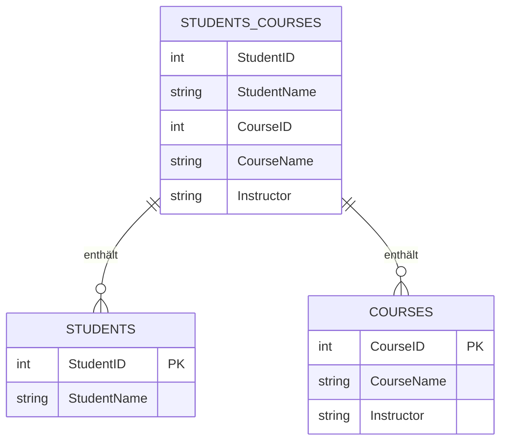
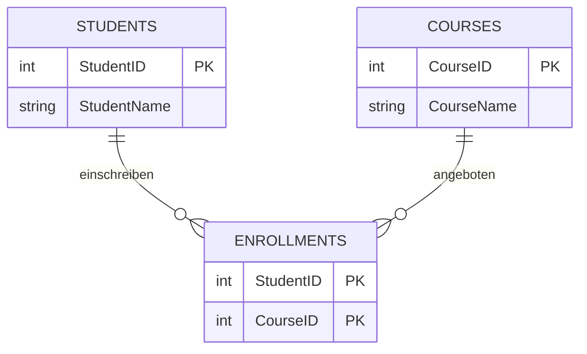
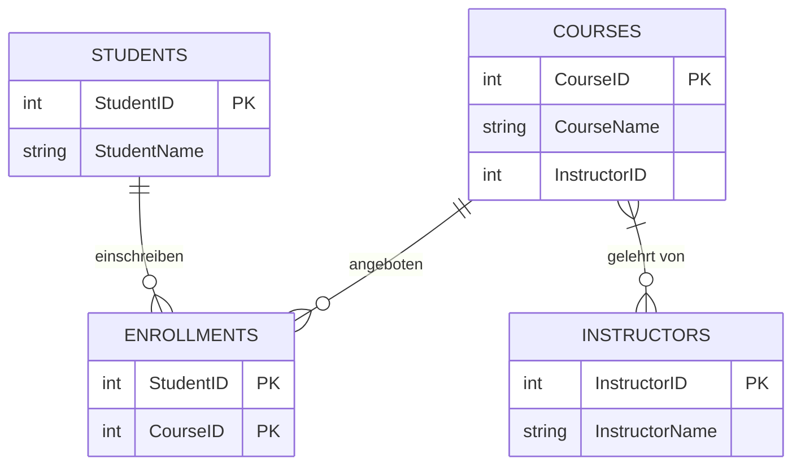
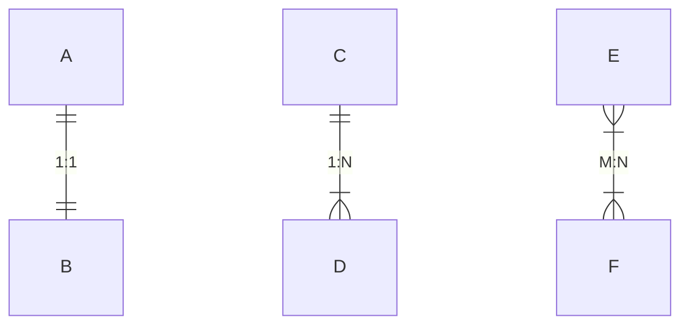

# Exkurs: Datenbank Normalisierung

[45min]

Ein vertiefender Exkurs.

## Was ist Normalisierung?

Die Normalisierung in SQL bezieht sich auf den Prozess des Organisierens von Daten in Tabellen. Das Hauptziel ist es,
Wiederholungen von Daten auszuschließen und trotzdem die Zusammenhänge zwischen den Daten sicherzustellen.
Dadurch werden größere Tabellen in kleinere Tabellen aufgeteilt und durch Beziehungen verbunden.

Der Prozess wird durch eine Serie von Regeln bestimmt, bekannt als Normalformen, an die sich die Datenbank halten muss.

### Warum soll man normalisieren?

- **Entfernung von redundanten Daten:** Sind redundante Daten vorhanden, führt das zu einer Vielzahl von Problemen,
  einschließlich des unnötigen Verbrauches von Speicherplatz und der Gefahr von Inkonsistenzen.
- **Datenintegrität:** Die Datenintegrität stellt sicher, dass es bei der Verteilung von Daten auf mehrere Tabellen
  nicht zu Inkonsistenzen kommt.
- **Suchanfragen:** Die Normalisierung macht Datenbankabfragen einfacher und schneller.

## Einführung in die Normalformen

Es gibt mehrere Normalformen, aber wir werden uns nur kurz mit den ersten dreien davon beschäftigen, da sie die am
meisten verbreiteten sind.

### Erste Normalform (1NF)

Eine Tabelle ist in der ersten Normalform, wenn:

- Sie ausschließlich atomare (unteilbare) Werte enthält und es keine sich wiederholenden Gruppen oder Datenfelder gibt.
- Jede Spalte enthält nur Daten eines einzigen Datentyps.
- Jede Spalte hat eine eindeutige Bezeichnung innerhalb der Tabelle.



In diesem Beispiel wird die Tabelle `STUDENTS_COURSES` in die Tabellen `STUDENTS` und `COURSES` aufgelöst. Diese
beiden Tabellen befinden sich in der 1NF.

### Zweite Normalform (2NF)

Eine Tabelle ist in der zweiten Normalform, wenn:

- Sie in der ersten Normalform ist.
- Alle Spalten, die keine Schlüsselspalten sind, funktional abhängig vom Primärschlüssel der Tabelle sind.



In diesem Beispiel sind die Tabellen `STUDENTS` und `COURSES` in der 2NF, da der Studentenname und der Kursname in
einem direkten und nicht weiter teilbaren Verhältnis zur ID der Tabelle steht.

### Dritte Normalform (3NF)

Eine Tabelle ist in der dritten Normalform, wenn:

- Sie in der zweiten Normalform ist.
- Alle Attribute in der Tabelle funktional abhängig vom Primärschlüssel sind.



Hier hat die `COURSES` Tabelle ein weiteres Attribut (Spalte) bekommen. Die `InstructorID` ist direkt abhängig von der
Kurs_ID, da ein Kurs nur einen Lehrer haben kann. Für einen zweiten Lehrer müsste eine zweite Spalte erstellt werden.

## Übrigens....

Ist ihnen in den Diagrammen etwas aufgefallen?



Der doppelte Strich zu doppeltem Strich bedeutet, dass jedem Datensatz der einen Tabelle `A` genau ein Datensatz in
der Tabelle `B` entspricht (1:1).

Im Gegensatz dazu bedeutet der Krähenfuß (Gabel/Dreizack) `viele` (N oder M).

In der Verbindung der Tabellen C und D kann man sagen, dass ein Datensatz aus `C` vielen Datensätzen aus `D` entsprechen
darf (1:N).

In der Verbindung `E` zu `F` bedeutet das viele Datensätze aus `E` vielen Datensätzen aus `F` entsprechen und
umgekehrt (N:M).

### Beispiele

In einer bestehenden Datenbank soll Personen das neue Merkmal `Sprache` zugeordnet werden.
Die Tabelle `Personen` darf unter keinen Umständen geändert werden. Es würde die bestehende Programmlogik stören.
Sie erstellen also eine Tabelle `PersonenSprache`:

```sql
   create table PersonenSprache
   (
       id primary key,
       personId integer unique,
       sprache  string,

       foreign key (personId) references Personen (ID)
   )
```

Hiermit hätten wir eine 1: 1 Beziehung dadurch erstellt, dass der Schlüssel `personId` eindeutig sein muss.
Es kann also keinen zweiten Schlüssel mit der gleichen Zahl geben.

### Aufgabe: NF bestimmen 🌶️🌶️

Welche NF hat die Tabelle `PersonenSprache`?

<details><summary>
Lösung:</summary>
Die Tabelle ist in der ersten Normalform weil, 
<ul>
<li>sie ausschließlich unteilbare Werte enthält.</li>
<li>da jede Spalte nur Daten eines einzigen Datentyps enthält.</li>
<li>da jede Spalte hat eine eindeutige Bezeichnung innerhalb der Tabelle hat.</li>
</ul>

Die Tabelle ist auch in der 2NF,
<ul>
<li>weil sie in der 1NF ist und</li>
<li>alle Spalten vollständig vom Primärschlüssel abhängig sind.</li>
</ul>

Die Tabelle ist weiterhin in der 3NF,
<ul>
<li>weil sie in der 2NF ist und</li>
<li>es keine Abhängigkeiten zwischen den Spalten gibt</li>
</ul>
</details>

### Aufgabe: Weiter Normalisieren 🌶️🌶️

Wie könnte man den Entwurf weiter normalisieren?

<details>
<summary>Lösung:</summary>
Die Spalte "Sprache" enthält Text. Es ist immer eine gute Gelegenheit, darüber nachzudenken, welcher Art dieser Text ist. 
In diesem Fall wird sich der Text wohl öfter wiederholen und es muss mit Schreibfehlern gerechnet werden.
Somit sollte dies normalisiert werden:
<pre><code>
create table PersonenSprache (
   id primary key,
   personenId integer unique,
   spracheId integer,
   foreign key (personenId) references Personen (ID),
   foreign Key (spracheId) references Sprachen (id)
);
create table Sprachen (
   id primary key,
   sprache text
);
</code></pre>
</details>

### Aufgabe: Vorteil erkennen 🌶️🌶️

Welche Vorteile ergeben sich aus dieser Normalisierung?

<details><summary>Lösung:</summary>
Außer den bereits angesprochenen Vorteilen (Wartung, Dopplung) ermöglicht es diese Struktur wie folgt zu erweitern, 
ohne das Codeanpassungen notwendig wären:
<pre><code>
create table Sprachen (
   id primary key,
   sprache text,
   sprache_de text,
   sprache_fr text,
   sprache_es text
);
</code></pre>
Es ist nun möglich, einem anderssprachigen Publikum die personen bezogene Sprache in der eigenen Sprache zu präsentieren.
</details>

## Zusammenfassung

Die eindeutige Abhängigkeit vom Primärschlüssel in einer Datenbanktabelle ist ein zentrales Konzept der Normalisierung,
insbesondere in Bezug auf die zweite Normalform (2NF) und die dritte Normalform (3NF). Diese Abhängigkeit bedeutet, dass
jedes Nicht-Schlüsselattribut (d.h. jede Spalte, die nicht Teil des Primärschlüssels ist) direkt und vollständig vom
Primärschlüssel abhängen muss.

1. **Primärschlüssel:** Der Primärschlüssel einer Tabelle ist ein Attribut (Spalte) oder eine Kombination von Attributen, die
   jeden Datensatz in der Tabelle eindeutig identifizieren. Keine zwei Datensätze können denselben Primärschlüsselwert
   haben.

2. **Funktionale Abhängigkeit:** Ein Attribut B ist funktional abhängig von einem Attribut A, wenn zu jedem Wert von A
   genau ein Wert von B gehört. In einer Datenbanktabelle bedeutet dies, dass der Wert eines Attributs (z.B. `Adresse`)
   durch den Wert eines anderen Attributs (z.B. `KundenID` als Primärschlüssel) bestimmt wird.

3. **Vollständige Abhängigkeit:** In der zweiten Normalform geht es darum, dass jedes Nicht-Schlüsselattribut
   vollständig vom gesamten Primärschlüssel abhängen muss, insbesondere wenn der Primärschlüssel aus mehreren Spalten
   besteht. Das bedeutet, dass kein Nicht-Schlüsselattribut nur von einem Teil des Primärschlüssels abhängen darf.

4. **Transitive Abhängigkeit in 3NF:** Die dritte Normalform erweitert das Konzept der funktionalen Abhängigkeit, indem
   sie fordert, dass Nicht-Schlüsselattribute nicht transitiv (über ein anderes Nicht-Schlüsselattribut) vom
   Primärschlüssel abhängen dürfen.

   Hier ein Beispiel für eine transitive Abhängigkeit:

   | AngestellterID | Name       | AbteilungID | AbteilungName |
   |----------------|------------|-------------|---------------|
   | 1              | John Doe   | A1          | Marketing     |
   | 2              | Jane Smith | A2          | Finance       |
   | 3              | Mike Brown | A1          | Marketing     |

   In dieser Tabelle stehen die Spalten `AbteilungID` und `AbteilungName` in einem direkten und nicht trennbaren (
   atomaren) Zusammenhang. Dies sollte in einer eigenen Tabelle ausgelagert werden.

5. **Beispiel für 3NF:** In einer Tabelle `Mitarbeiter` mit dem Primärschlüssel `MitarbeiterID` und den
   Attributen `AbteilungsID` und `Abteilungsleiter` wäre `Abteilungsleiter` transitiv abhängig von `MitarbeiterID`
   über `AbteilungsID`. Um die 3NF zu erreichen, sollte `Abteilungsleiter` in eine separate Tabelle ausgelagert werden.

Die eindeutige Abhängigkeit vom Primärschlüssel garantiert, dass jede Information in einer Tabelle
direkt und eindeutig durch den Primärschlüssel bestimmt wird. Damit verschwinden Dopplungen und die Wartung wird leichter.