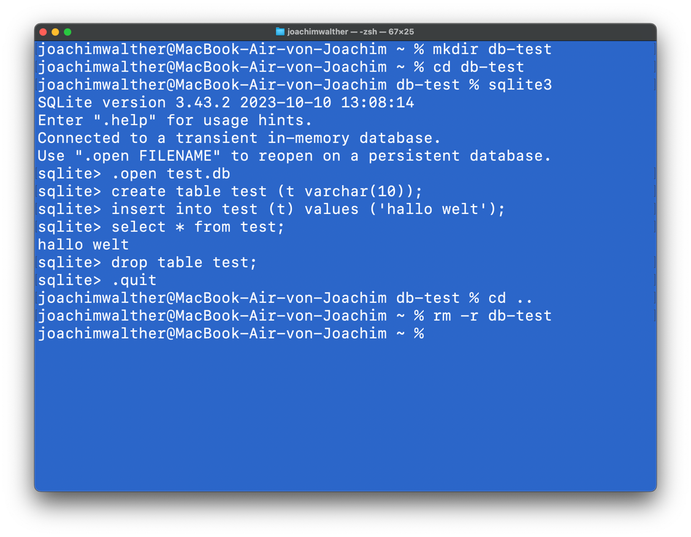
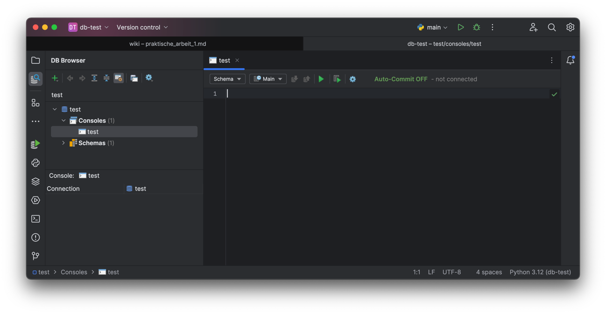
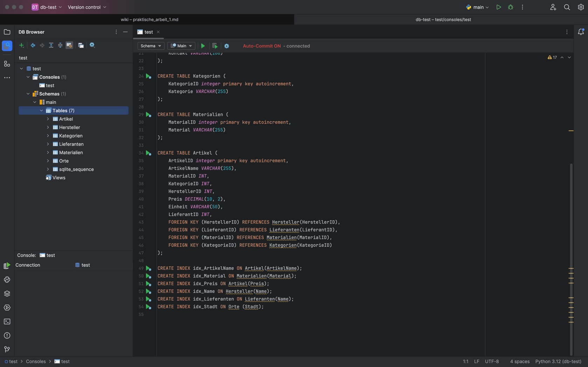

# Praktische Arbeiten

Nachdem wir in der Einführung schon sehr viel über Tabellen, Schlüssel und Indizes gehört haben, wollen wir diese
theoretischen Inhalte jetzt in die Tat umsetzen. Dazu haben wir die Arbeitsumgebung aufgesetzt und können jetzt
loslegen.

## Kommandozeile

Zunächst ein paar Fingerübungen für die Kommandozeile.

Verständnisübung:

- öffnen Sie ein Terminal/Kommandozeile
- Wechseln Sie in ihr Benutzerverzeichnis
- Legen Sie dort ein neues Unterverzeichnis "db-test" an
- starten Sie sqlite3


Wir wollen eine Tabelle erstellen, einen Wert in die Tabelle eingeben, die Tabelle auslesen und sqlite3 verlassen.

Dazu geben sie folgende Kommandos ein:

- .open test.db
- create table test (t varchar(10));
- insert into test (t) values ('hallo welt');
- select * from test;
- drop table test;
- .quit



Den Erfolg unserer Bemühungen sehen wir in der drittletzten Zeile: "hallo welt"

Warum das Ganze?

- Es zeigt, wie einfach die Verwendung des Datenbankprogrammes Sqlite3 ist. Sobald Python auf dem Rechner installiert
  ist, funktioniert das Programm überall.
- Wir haben damit gleich die Syntax für einige wesentliche SQL Befehle angewendet:
    - create table [table name] (field list, constraint list); kennen wir schon aus der Einführung
    - insert into [table name] ([column name, column name, ...]) values (value1, value2, ...); ist das Kommando zum
      Einfügen von Daten in die Tabelle.
    - select * from [table name]; ist das wohl wichtigste SQL Kommando. Es liest die Daten aus der Datenbank.
    - drop table [table name]; ist das Kommando, um eine Tabelle zu löschen.

Löschen Sie das Verzeichnis db-test wieder mit

```zsh
  # wechsel in das übergeordnete Vereichnis
  cd ..
  # löschen des Verzeichnises mit allen Inhalten
  rm -r db-test
```

### Aufgabe: Wiederholen Sie die Arbeitsschritte ohne die Tabelle 'test' zu erstellen. 🌶️🌶️

### Aufgabe: Anlegen der Tabellen 🌶️🌶️

Öffnen Sie erneut die Datenbank test.db und erstellen sie alle folgenden Tabellen:

```SQL
CREATE TABLE Orte
(
    OrtId integer primary key autoincrement,
    Stadt TEXT
);

CREATE TABLE Hersteller
(
    HerstellerID integer primary key autoincrement,
    Name         TEXT,
    Strasse      TEXT,
    OrtId        INT,
    Kontakt      VARCHAR(100),
    FOREIGN KEY (OrtId) REFERENCES Orte (OrtId)
);

CREATE TABLE Lieferanten
(
    LieferantID integer primary key autoincrement,
    Name        TEXT,
    Kontakt     VARCHAR(100)
);

CREATE TABLE Kategorien
(
    KategorieID integer primary key autoincrement,
    Kategorie   TEXT
);

CREATE TABLE Materialien
(
    MaterialID integer primary key autoincrement,
    Material   TEXT
);

CREATE TABLE Artikel
(
    ArtikelID    integer primary key autoincrement,
    ArtikelName  TEXT,
    MaterialID   INT,
    KategorieID  INT,
    HerstellerID INT,
    Preis        DECIMAL(10, 2),
    Einheit      TEXT,
    LieferantID  INT,
    FOREIGN KEY (HerstellerID) REFERENCES Hersteller (HerstellerID),
    FOREIGN KEY (LieferantID) REFERENCES Lieferanten (LieferantID),
    FOREIGN KEY (MaterialID) REFERENCES Materialien (MaterialID),
    FOREIGN KEY (KategorieID) REFERENCES Kategorien (KategorieID)
);

CREATE INDEX idx_ArtikelName ON Artikel (ArtikelName);
CREATE INDEX idx_Material ON Materialien (Material);
CREATE INDEX idx_Preis ON Artikel (Preis);
CREATE INDEX idx_Name ON Hersteller (Name);
CREATE INDEX idx_Lieferanten ON Lieferanten (Name);
CREATE INDEX idx_Stadt ON Orte (Stadt);
```

Prüfen sie den Erfolg ihrer Arbeit mit den Befehlen

- .tables → zeigt die Liste der Tabellen an.
- PRAGMA table_info([table name]); hiermit erhalten Sie Informationen über die einzelne Tabelle.

### Aufgabe: Suchen Sie im Internet nach weiteren Befehlen zur Anzeige von Informationen 🌶️🌶️

- lassen Sie sich die Schlüssel anzeigen
- lassen sie sich die Indizes anzeigen

<details>
<summary>
Lösung:
</summary>
<ul>
<li>PRAGMA foreign_key_list('table_name');</li> 
<li>PRAGMA index_list('table_name');</li>
</ul>
</details>

Eine überprüfung mit dem Datenbank-Navigator sollte so aussehen:


## Datenbank-Navigator

Wir wollen nun mit dem Datenbank-Navigator die gleiche Arbeit noch einmal tun. Dazu löschen Sie die Verbindung zur
Datenbank über die Settings Einstellung und das rote Minus-Zeichen.

### Aufgabe:Löschen Sie die Datenbank vollständig, indem Sie die Datei test.db löschen. 🌶️🌶️

### Aufgabe: Erstellen Sie nun eine neue Verbindung mit dem Namen "test" im DB Browser über das grüne Plus-Zeichen. 🌶️🌶️

- Achten Sie auf die genaue Pfadangabe für ihre neue test.db Datei.
- Prüfen Sie die Verbindung.
- Bestätigen Sie den Dialog und klicken Sie doppelt auf die Console "test".



Als Grundeinstellung sehen Sie "Autocommit OFF" im Terminal rechts.
Das bedeutet, dass das Datenbankprogramm erst dann etwas in die Datenbank scheibt, wenn es durch das Kommando commit
bestätigt wurde.

Diese Einstellung läßt sich hier ändern:


### Aufgabe: Kopieren und Ausführen der SQL Anweisungen 🌶️🌶️

- Code von oben kopieren
- in die Konsole einfügen
- mit dem grünen Dreieck ausführen



Sie sollten nun im rechten Verzeichnisbaum die neu erstellten Tabellen sehen. Es sollte das gleiche Ergebnis sein wie
vorher. Prüfen Sie dies und sprechen Sie sich mit ihren Kollegen ab, wenn Fehler entstanden sind.

### Aufgabe: Wiederholen Sie die Schritte, bis alle Tabellen in der gewünschten Form erstellt sind. 🌶️🌶️

- Klappen Sie dazu auch den Verzeichnisbaum links auf und prüfen Sie, ob alle Spalten, Schlüssel und Indizes angezeigt
  werden.

### Fazit:

Die Arbeit mit dem Navigator, genauer mit der Console im sogenannten 'Batch'-Modus macht die Verarbeitung von Kommandos
deutlich einfacher. Es eröffnet die Möglichkeit, die gesamte Datenstruktur einer Datenbank in Dateien zu entwickeln und diese dann per
Öffnen und Ausführen in die Datenbank zu übertragen. Der Nachteil dabei ist, das jedes Mal die Datenbank neu erstellt
wird und mögliche Eingaben wieder verloren gehen.

Diese Methode ist also für die Entwicklung der Datenbank in Ordnung. Für die Arbeit an Produktivsystemen müssen wir
andere Vorgehensweisen lernen.

Damit beenden wir den ersten Teil der praktischen Arbeit.


