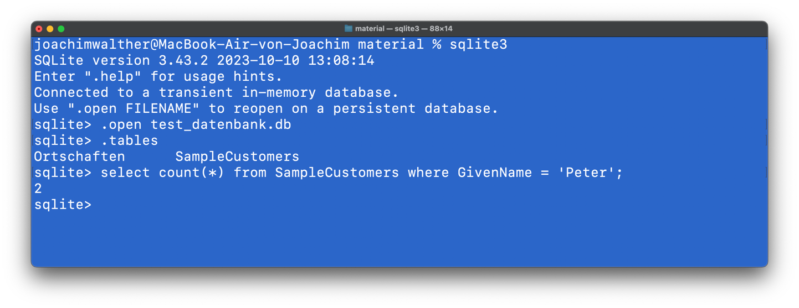

# Hands-On SQL mit der Tabelle SampleCustomers

Lade die Beispieldatenbank [test_datenbank.db](../../material/test_datenbank.db) herunter 🔽.

Wir werden zunächst ausschließlich mit der Tabelle `SampleCustomers` arbeiten. Da die Tabelle bereits besteht und mit Daten gefüllt ist, konzentrieren wir uns auf das Abfragen von Informationen ([DQL](../tabellen2/tabellen2.md#data-query-language-dql)).

Uns muss an dieser Stelle bewusst sein, dass manche Informationen nicht offen ersichtlich sind. Sie sind zwar da, aber vielleicht schwierig zu sehen.

**Ein einfaches Beispiel**: Wie viele Personen mit dem Vornamen `Peter` gibt es in unserer Tabelle?

Diese Information ist da, aber sie steht nirgends und muss durch eine Berechnung erfasst werden.
Das theoretisch mögliche Ergebnis liegt zwischen `gar keiner` und `alle`.
Die Lösungsfunktion muss die Tabelle durchlaufen und zählen.
Diese Funktion heißt in SQL `COUNT`.
Um sie auszuführen wird das `SELECT`-Kommando verwendet.

```sql
SELECT COUNT(GivenName)
FROM SampleCustomers
WHERE GivenName = 'Peter';
```

Das Ergebnis ist `2`.✨



## Aufgaben

Nutze die [SQLite Tutorial](https://www.sqlitetutorial.net/) Seite als Referenz mit vielen Beispielen um die folgenden Aufgaben zu lösen.

### Aufgabe: SELECT 🌶️

Die SELECT Anweisung dient zum Lesen von Daten aus Tabellen. Führe die folgenden Select Statements aus:

```sql
SELECT GivenName
FROM SampleCustomers;
```

```sql
SELECT City, GivenName
FROM SampleCustomers;
```

```sql
SELECT *
FROM SampleCustomers;
```

Welche Bedeutung hat das `*`?

<details><summary>Lösung</summary>
Das '*' bedeutet, dass alle Spalten der Tabelle angezeigt werden sollen. 
Soll nur eine Auswahl angezeigt werden, so müssen die Spalten
einzeln angegeben werden.
</details>

### Aufgabe: Interpretation 🌶️🌶️

Könntest du mit dieser Darstellung bereits sicher die Frage beantworten, wie viele `Peter` es gibt?

<details><summary>Lösung</summary>
Ja, aber es würde sehr lange dauern und man müsste das Ergebnis mehrfach kontrollieren, um sicher zu sein.<br>

Das gezeigte Ergebnis ist daher wenig nützlich, da es alle Datensätze der Datenbank zeigt. Das sind möglicherweise sehr viele, unter Umständen können es Millionen sein. Damit kann man so als Mensch nichts anfangen.
Es ist davon kein verwertbarer Informationsgehalt zu erwarten.

Natürlich kann es sein, dass wir aus bestimmten Gründen alle Personen ansprechen wollen.
Zum Beispiel wollen wir unter unseren Kunden ganz unspezifisch ein Werbe-E-Mail verschicken.
</details>

### Aufgabe: Meier-Filter 🌶️🌶️

Schränke das Ergebnis der Abfrage durch den Einsatz eines Filters ein,
sodass alle Kunden mit Familienname `Meier` angezeigt werden.

<details><summary>🍀 Tipps</summary>Nutze WHERE</details>

<details><summary>Lösung</summary>
<pre><code>SELECT *
FROM SampleCustomers
WHERE FamilyName = 'Meier';
</code></pre>
</details>

### Aufgabe: Aristokratie-Filter 🌶️🌶️

Stelle dir vor, es soll eine rein aristokratische Party geben, zu der nur Barone eingeladen werden sollen.
Formuliere die Query dazu.

<details><summary>🍀 Tipps</summary>Nutze "Titel" und "Baron".</details>

<details><summary>Lösung</summary>
<pre><code>SELECT *
FROM SampleCustomers
WHERE Title = 'Baron';
</code></pre>
</details>

### Aufgabe: Baron-Filter 🌶️🌶️

Wie viele Barone werden angeschrieben?

<details><summary>🍀 Tipps</summary>Nutze zusätzlich "count".</details>

<details><summary>Lösung</summary>
<pre><code>SELECT count(*)
FROM SampleCustomers
WHERE Title = 'Baron';
</code></pre>

Ergebnis = 211
</details>

### Aufgabe: Kalkulation 🌶️🌶️🌶️

Du hast von deinem Auftraggeber ein Budget bekommen, dass pro Baron für die Party ausgegeben werden darf.
In diesem Fall sind es 267,50 €.
Wie teuer wird die Party?

<details><summary>🍀 Tipps</summary>Nutze "count" mit einer Berechnung. Vorsicht bei Fließkommazahlen: Punkt oder Komma?</details>

<details><summary>Lösung</summary>
<pre><code>SELECT count(*) * 267.50
FROM SampleCustomers
WHERE Title = 'Baron';
</code></pre>

Ein Schnäppchen: 56442.50 €

</details>

### Aufgabe: Postversand 🌶️🌶️

Alle Mitglieder des Bundestages (`MdB`) sollen eine schriftliche
Ladung zu einer Sitzung erhalten.
Wähle alle notwendigen Daten aus der Datenbank, die man braucht, um eine Adresse auf einen Briefkopf zu setzen.

<details><summary>🍀 Tipps</summary>
Finde zunächst mit dem `PRAGMA` Befehl oder mit einem `SELECT * ...` die notwendigen Felder
</details>

<details><summary>Lösung</summary>
<pre><code>SELECT Salutation, Degree, GivenName, FamilyName, Street, PostCode, City
FROM SampleCustomers
WHERE Title LIKE 'MdB';
</code></pre>
</details>

### Aufgabe: Rücksendezeile 🌶️🌶️🌶️

In deiner Auswertung soll ein Feld sein, dass die Rücksendeadresse enthält.
Die Rücksendeadresse ist 'Sekreteriat des Bundestages, Am Brandenburger Tor 162, 10234 Berlin'

In dieser Spalte soll also immer diese Adresse auftauchen.

<details><summary>Lösung</summary>
<pre><code>SELECT Salutation, Degree, GivenName, FamilyName, Street, PostCode, City, 'Sekreteriat des Bundestages, Am Brandenburger Tor 162, 10234 Berlin'
FROM SampleCustomers
WHERE Title LIKE 'MdB';
</code></pre>
</details>

### Aufgabe: Alias 🌶️🌶️🌶️

Wie kannst du dafür sorgen, dass die Spaltenüberschrift der Rücksendeadresse
nicht die Adresse ist, sondern `Backaddress`?

<details><summary>Lösung</summary>
<pre><code>SELECT Salutation, Degree, GivenName, FamilyName, Street, PostCode, City, 'Sekreteriat des Bundestages, Am Brandenburger Tor 162, 10234 Berlin' as Backaddress
FROM SampleCustomers
WHERE Title LIKE 'MdB';
</code></pre>
</details>

### Aufgabe: Porto 🌶️

Die Buchhaltung möchte von dir wissen,
was der Postversand bei 0,70 € pro Brief gekostet hat?

<details><summary>Lösung</summary>
<pre><code>SELECT count(*) * 0.7
FROM SampleCustomers
WHERE Title LIKE 'MdB';
</code></pre>

Ein Schnäppchen: 171.50 €
</details>

### Aufgabe: Syntax 🌶️

Dein SQL-Kommando wird unleserlich. Formatiere es sauberer und klarer, indem du Zeilenumbrüche nutzt.

<details><summary>Lösung</summary>
<pre><code>SELECT Salutation, 
       Degree, 
       GivenName, 
       FamilyName, 
       Street, 
       PostCode, 
       City, 
       'Sekreteriat des Bundestages, Am Brandenburger Tor 162, 10234 Berlin' as Backaddress
FROM SampleCustomers
WHERE Title LIKE 'MdB';
</code></pre>
</details>

### Aufgabe: Kommasetzung🌶

Betrachte die folgenden beiden identischen SQL-Ausdrücke. Sie unterscheiden
sich nur in der Position der Kommas. Welche ist die günstigere Syntax?

```sql
SELECT Salutation,
       GivenName,
       FamilyName,
       Street
FROM SampleCustomers
WHERE Title LIKE 'MdB';
```

```sql
SELECT Salutation
     , GivenName
     , FamilyName
     , Street
FROM SampleCustomers
WHERE Title LIKE 'MdB';
```

Prüfe, ob der folgende Ausdruck mit einem sog. "trailing Komma"
in SQLite möglich ist:

```sql
SELECT Salutation,
       GivenName,
       FamilyName,
       Street,
FROM SampleCustomers
WHERE Title LIKE 'MdB';
```

<details><summary>Lösung</summary>

Die Versionen unterscheiden sich nur in der Kommasetzung. In der ersten Version sitzen die Kommas hinter dem Feldnamen. So war man das gewöhnt. 

Aber es galt und gilt noch manchmal als Fehler, beim letzten Feldnamen ein Komma hinten anzustellen. Daher hat man sich angewöhnt, das Komma nach vorn zu setzen. 

In der Zwischenzeit sind viele Datenbankprogramme in der Lage, das Komma nach dem letzten Feldbezeichner zu
akzeptieren.

In Sqlite3 funktioniert das "trailing comma" nicht. Es führt zu einem Fehler.
</details>

### Aufgabe: Eindeutigkeit 🌶️🌶️🌶️

Du benötigst für eine Darstellung deiner Einzuggebietes eine Liste der Ortschaften.
Es ist klar, dass diese Liste **eindeutig** sein muss. Eindeutig bedeutet hier, dass jeder Ort nur genau ein einziges Mal vorkommen darf.

Es wohnen aber oft mehrere Menschen in einem Ort. **Ein Filter hilft also hier nicht weiter.**

Die Orte sollen traditionell im Vorraum des Amtsgebäudes auf einer Landkarte markiert werden.
Vervollständigen Sie ihren Auftrag, indem sie feststellen wie viele Fähnchen sie kaufen müssen, um jeden
Ort damit zu markieren.

<details><summary>🍀 Tipps</summary>
Informiere dich über den Befehl `DISTINCT`.
</details>

<details><summary>Lösung</summary>

<pre><code>
SELECT DISTINCT City FROM SampleCustomers;
SELECT count(DISTINCT City) FROM SampleCustomers;
</code></pre>
</details>

### Aufgabe: Ordnung schaffen 🌶️🌶️

Die Ortschaften sind ja völlig durcheinander. Sortiere die Orte nach dem Alphabet. Ihr seid zu zweit abgestellt,
um die Landkarte mit Fähnchen zu bestücken. Also erstellst du zwei Auswertungen:

1. Die Liste ist so sortiert, dass sie bei 'A' beginnt,
2. Die Liste beginnt mit 'Z'.

<details><summary>🍀 Tipps</summary>
Informiere dich über den Befehl `Order By` in Verbindung mit `desc` und `asc`.
</details>

<details><summary>Lösung</summary>
<pre><code>
SELECT DISTINCT City FROM SampleCustomers ORDER BY City ASC;

SELECT DISCTINCT City FROM SampleCustomers ORDER BY City DESC;
</code></pre>
</details>

### Aufgabe: Nicht so viel auf einmal 🌶️🌶️

Beim Fähnchen stecken kann man keinen Computer nutzen. Da hilft nur Papier und Stift.
Als Beamter bist du gehalten sparsam zu sein und sollst den Ausdruck der Listen kurz halten.
Ihr benötigt ja gar nicht zwei vollständige Listen, sondern es braucht nur die
Hälfte aller Orte auf dem jeweiligen Ausdruck zu sein. Wie begrenzt du die Anzahl der
anzuzeigenden Daten?

<details><summary>🍀 Tipps</summary>
Informiere dich über den Befehl `LIMIT`.
</details>

<details><summary>Lösung</summary>
<pre><code>

SELECT DISTINCT City FROM SampleCustomers ORDER BY City ASC LIMIT 196;

SELECT DISTINCT City FROM SampleCustomers ORDER BY City DESC LIMIT 196;
</code></pre>
</details>

### Aufgabe: Du kannst schlecht rechnen 🌶️🌶️

So eine Datenbank ändert sich ja dauernd. Du kannst schlecht rechnen. Berechne also die Hälfte der Datensätze automatisch.

<details><summary>🍀 Tipps</summary>
Benutze daas Wissen über Berechnungen und Aliase, um zu einem ansprechenden Ergebnis zu kommen.
</details>

<details><summary>Lösung</summary>
<pre><code>

SELECT count(DISCTINCT City) / 2 AS Arbeitsaufwand FROM SampleCustomers;
</code></pre>
</details>

## Auswertungen zusammen bauen

### Du bist auch noch faul

Zwar haben wir jetzt die Anzahl der Zeilen, die jeder Ausdruck beinhalten soll, nur müssen wir
dieses Ergebnis in ein weiteres Kommando einsetzen.

```sql
SELECT count(DISTINCT City) / 2 AS Arbeitsaufwand
FROM SampleCustomers;

-- 196 muss übertragen werden in das nächste Kommando.

SELECT DISTINCT City
FROM SampleCustomers
ORDER BY City ASC
LIMIT 196;
```

Wie bequem wäre es, wenn wir beide Zeilen in ein Kommando stecken könnten?

```sql
SELECT DISTINCT City
FROM SampleCustomers
ORDER BY City ASC
LIMIT (SELECT count(DISTINCT City) / 2 AS Arbeitsaufwand FROM SampleCustomers);
```

## Combined Select

Klasse, so kann man arbeiten. Aber es gibt immer noch was zu verbessern:
Wir brauchen ja auch das kombinierte Kommando noch einmal, um die zweite
Liste zu erstellen (ASC / DESC).

Sorry! Sqlite verfügt nicht über die Möglichkeiten, diesen Prozess noch
weiter zu vereinfachen. Wir enden bei folgendem Ergebnis:

```sql
SELECT DISTINCT City
FROM SampleCustomers
ORDER BY City ASC
LIMIT (SELECT count(DISTINCT City) / 2 AS Arbeitsaufwand FROM SampleCustomers);

SELECT DISTINCT City
FROM SampleCustomers
ORDER BY City DESC
LIMIT (SELECT count(DISTINCT City) / 2 AS Arbeitsaufwand FROM SampleCustomers);
```

Aber es gibt noch einen Ausweg, **[Scripte](../exkurs_sql_scripte/exkurs_sql_scripte.md)**.

Das Hauptziel ist es, die Effizienz bei wiederkehrenden Datenbankabfragen durch die Automatisierung von SQL-Kommandos zu steigern. Genau das schauen wir uns im folgenden Kapitel an.
