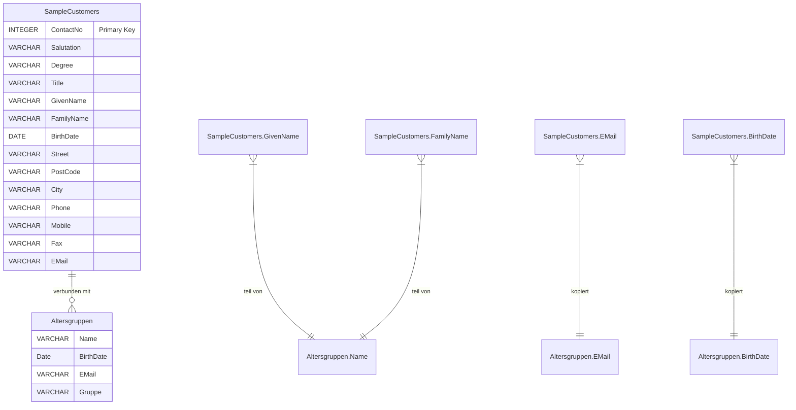
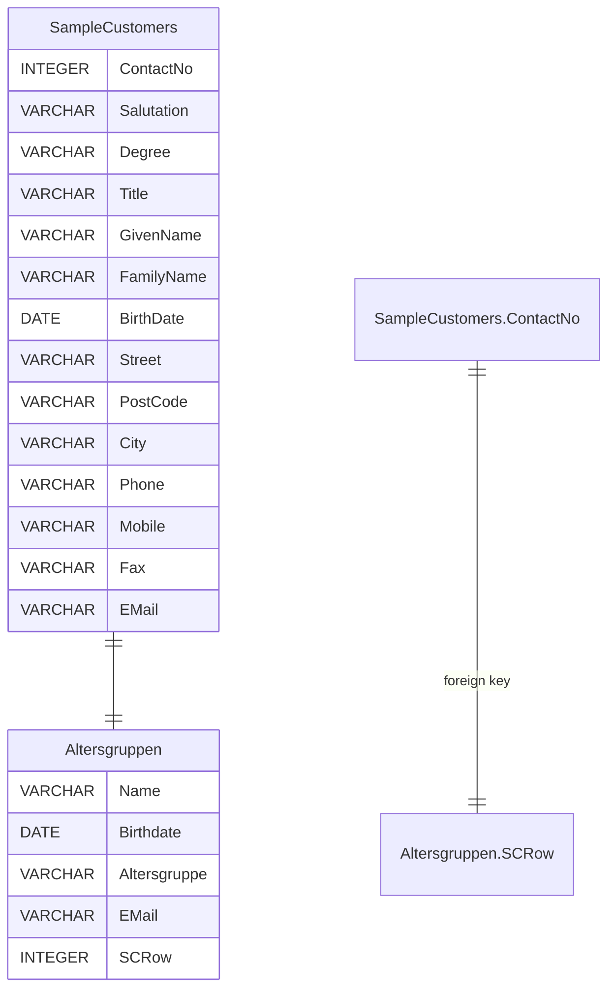

# Tabellen verknüpfen

Bis jetzt haben wir Abfragen auf eine einzige Tabelle erstellt.
Dann haben wir festgestellt, dass es sinnvoll sein kann, zusätzliche Tabellen zu erstellen, um Zwischenergebnisse festzuhalten. Dadurch ist es zu Datenvermehrung gekommen.

## Verbindungen zwischen Tabellen

Um einer Lösung dieser Problemstellung näherzukommen, müssen wir noch einmal klarer formulieren, was das Problem
eigentlich ist:

In Datenbanken geht es nach der Dateneingabe immer um die Verarbeitung und das Auslesen von eingegebenen
oder verarbeiteten Daten. Wie wir gesehen haben, kann die Verarbeitung auch gleichzeitig zum Auslesen erfolgen.

```sql
SELECT count(*)
FROM SampleCustomers;
```

Hierbei ist `SELECT` das Auslesen und `count` die Verarbeitung.

Im Falle der Altersgruppen haben wir nun zwei Tabellen, die inhaltlich zusammengehören, weil Daten in ihnen
doppelt vorkommen.



### Aufgabe: Verknüpfte Daten finden 🌶️🌶️

Finde die Altersverteilung in Bad Kreuznach und Mannheim.

<details>
<summary>Lösung</summary>

<pre><code>

WITH someCustomers AS 
(SELECT * FROM SampleCustomers 
WHERE City = 'Kreuznach' 
OR City = 'Mannheim')

SELECT *
FROM Altersgruppen
WHERE Name = (SELECT GivenName || ' ' || FamilyName FROM someCustomers);

-- oder

WITH someCustomers AS 
(SELECT GivenName || ' ' || FamilyName AS name
FROM SampleCustomers
WHERE City = 'Bad Kreuznach'
OR City = 'Mannheim')

SELECT *
FROM Altersgruppen
WHERE Name = (SELECT name FROM someCustomers);

-- oder

WITH someCustomers AS 
(SELECT EMail 
FROM SampleCustomers
WHERE City = 'Bad Kreuznach'
OR City = 'Mannheim')

SELECT *
FROM Altersgruppen
WHERE Email = (SELECT EMail FROM someCustomers);

</code></pre>

</details>

### Aufgabe: Logische Bedingung im Filter 🌶️🌶️🌶️

Erkläre, warum nach dem where ein `OR` verwendet wird und kein `AND`. Es soll doch Bad Kreuznach `AND` Mannheim sein.

<details>
<summary>Lösung</summary>

Eine Zelle in einer Spalte kann nur einen Wert haben. Daher müssen wir für beide Fälle eine Filterbedingung 
festlegen. Da das Feld das eine "oder" das andere Merkmal sein soll, ist das Resultat am Ende des Suchens
eine Liste mit den Treffern aus beiden Bedingungen, also ein "und".

</details>
<br />

Die Lösungen zeigen, wie Tabellen durch identische Daten miteinander verknüpft sein können.

Diese Verbindungen nennt man im Datenbankumfeld `Schlüssel`.

## Schlüssel (eng. Key)

Primär- und Fremdschlüssel sind die Grundpfeiler relationaler Datenbanken, die Ordnung und Struktur in die Speicherung und Abfrage von Daten bringen.

Ein **Primärschlüssel (Primary Key)** garantiert die Einzigartigkeit jeder Zeile in einer Tabelle, was die schnelle Identifikation von Daten ermöglicht.

**Fremdschlüssel (Foreign Key)** hingegen verknüpfen Tabellen miteinander und erleichtern das Verständnis von Beziehungen zwischen verschiedenen Datensätzen.

Indem wir diese "Schlüssel"-konzepte beherrschen, können wir effizienter mit Datenbanken arbeiten.

### Definition

**Primärschlüssel**: Ein Primärschlüssel ist ein Feld oder eine Gruppe von Feldern, die einen Datensatz in einer Tabelle einzigartig identifizieren. Jede Tabelle sollte einen Primärschlüssel haben und jeder Wert im Primärschlüsselfeld muss **einzigartig** sein.

**Fremdschlüssel**:
Ein Fremdschlüssel ist ein Feld oder eine Gruppe von Feldern in einer Tabelle, die auf den Primärschlüssel einer anderen Tabelle verweisen, um relationale Beziehungen zu definieren.

#### ⚠️ Wichtig
Standardmäßig verwendet SQLite keine foreign keys. Dies muss durch den folgenden Befehl erst eingestellt werden.

```sql
PRAGMA foreign_keys = on;
```

Das liegt daran, dass man Sqlite oft in Verbindung mit anderen Programmiersprachen verwendet und **eher selten Geschäftslogik in die Datenbank einbaut**. Es bleibt dem Programmierer überlassen, welchem Konzept er folgt.
Zum allgemeinen Verständnis ist es aber wichtig, diese Konzepte zu verstehen, da sie später, wenn auch in anderer Form, angewendet werden.

### Umsetzung in SQLite

Hier nun die DDL unserer bekannten Tabellen mit Index, Schlüssel und Verweisen in SQL:

```sql
CREATE TABLE Berufe
(
    BerufeIndex INTEGER PRIMARY KEY AUTOINCREMENT,
    Beruf TEXT
);

CREATE INDEX idx_Berufe ON Berufe (Beruf);
```

Hier definieren wir eine Tabelle `Berufe` mit dem primären Index auf die Spalte "Index". Dabei wird automatisch ein Index
erstellt. In diesem Fall basiert der Index auf ganzen Zahlen.
Diese Zahlen werden automatisch generiert (Identity) beginnend bei 0 und einem Inkrement von 1.

```sql
CREATE TABLE Orte
  (
      OrteIndex INTEGER PRIMARY KEY AUTOINCREMENT,
      Stadt TEXT
  );

CREATE INDEX idx_Stadt ON Orte (Stadt);
```

Das Ganze im gleichen Stil für `Orte`.

Nun die Sicht aus der Zieltabelle `Personen`:

```sql
CREATE TABLE Personen (
      PersonenIndex integer PRIMARY KEY AUTOINCREMENT,
      Name TEXT,
      Strasse TEXT,
      Ort INT,
      Email TEXT,
      Beruf INT,
      CONSTRAINT fk_Orte FOREIGN KEY (Ort) REFERENCES Orte (OrteIndex),
      CONSTRAINT fk_Berufe FOREIGN KEY (Beruf) REFERENCES Berufe (BerufeIndex)
  );

CREATE INDEX idx_Ort ON Personen (Ort);
CREATE INDEX idx_Name ON Personen (Name);
CREATE INDEX idx_Beruf ON Personen (Beruf);
```

Es fällt auf, das hier kein Primärer Index erstellt wurde

#### Insert Statement
```sqlite
INSERT INTO Berufe (Beruf) VALUES ("VWler");
INSERt INTO Orte (Stadt) VALUES ("Wolfsburg");

PRAGMA foreign_keys=1;
INSERT INTO Personen (Name, Strasse, Ort, Email, Beruf) VALUES ('Tim', 'VW Straße', 1, '...', 1);
```

#### Aufgabe: Erläutere Vor- und Nachteile dieser Tatsache 🌶️🌶️

<details>
<summary>
Lösung:
</summary>
<p>Es gibt eigentlich nur einen Vorteil:</p> 
<ul>
<li>die Tabelle braucht weniger Speicher, weil sie eine Spalte weniger hat.</li>
</ul>
<br>
<p>Ansonsten gibt es nur Nachteile:</p>
<ul>
<li>man kann nur schwer auf diese Tabelle verweisen und sich auf einen eindeutigen Datensatz beziehen. Man würde dafür einen zusammengesetzten Index benötigen, der aber ebenfalls nicht definiert ist.</li>
<li>Die erstellten Indizes vereinfachen die Suche auf den einzelnen Spalten, aber einen eindeutigen Datensatz findet man so nicht.</li>
<li>Suchen sind daher zwar möglich, aber sehr aufwendig und daher langsam.</li>
</ul>

<strong><u>Allgemein gilt:</u></strong> Jede Tabelle bekommt einen primären automatischen Index.
</details>

### Constraints - Bedingungen

"Constraint" ist die SQL Bezeichnung für Bedingung.
Hier werden zwei Bedingungen definiert:

- `fk_Orte`: Die Spalte "Ort" aus der eigenen Tabelle referenziert die Spalte "Index" aus der Tabelle "Orte".
- `fk_Berufe`: Die Spalte "Beruf" aus der eigenen Tabelle referenziert die Spalte "Index" aus der Tabelle "Berufe".

Anm:
- `fk` steht dabei für **foreign key** ( Fremdschlüssel)
- `idx` steht dabei für **Index**


#### Aufgabe: Mit Daten füllen 🌶️

Befülle die oben angelegten Tabellen mit jeweils 3 Beispieleinträgen. Was musst du dabei beachten?

<details>
<summary>Lösung</summary>

<pre><code>

-- Beispieldaten für die Tabelle `Berufe`
INSERT INTO Berufe (Beruf) VALUES ('Softwareentwickler');
INSERT INTO Berufe (Beruf) VALUES ('Projektmanager');
INSERT INTO Berufe (Beruf) VALUES ('Grafikdesigner');

-- Beispieldaten für die Tabelle `Orte`
INSERT INTO Orte (Stadt) VALUES ('Berlin');
INSERT INTO Orte (Stadt) VALUES ('München');
INSERT INTO Orte (Stadt) VALUES ('Hamburg');

-- Beispieldaten für die Tabelle `Personen`
INSERT INTO Personen (Name, Strasse, Ort, Email, Beruf) VALUES ('Max Mustermann', 'Musterstraße 1', 1, 'max@example.com', 1);
INSERT INTO Personen (Name, Strasse, Ort, Email, Beruf) VALUES ('Maria Musterfrau', 'Musterweg 2', 2, 'maria@example.com', 2);
INSERT INTO Personen (Name, Strasse, Ort, Email, Beruf) VALUES ('John Doe', 'Example Lane 3', 3, 'john@example.com', 3);

</code></pre>

- Beachte, dass die Fremdschlüssel `Ort` und `Beruf` müssen auf existierende Einträge in den Tabellen `Orte` und `Berufe` verweisen.

- Da `AUTOINCREMENT` verwendet wird, beginnen die IDs bei 1.

</details>

### Aufgabe: Tabelle mit Schlüssel definieren 🌶️🌶️

Erstelle ein SQL-Skript für eine neue Tabelle `Altersgruppen` mit den Feldern `Name`, `BirthDate`, `Altersgruppe` und `Email` mit einem Fremdschlüssel auf `SampleCustomers.EMail`.

<details>
<summary>Lösung:</summary>
<pre><code>
create table Altersgruppen
(
    Name,
    BirthDate,
    Altersgruppe,
    Email,
    foreign key (Email) references SampleCustomers(EMail)
);
</code></pre></details>

Durch die Verwendung von Schlüsseln sind wir also in der Lage, Verbindungen zwischen Tabellen herzustellen. Neudeutsch verwendet man den Begriff `Referenz`.

## Referenz und referentielle Integrität

Eine Referenz ist also eine Beziehung zwischen Tabellen, die über Schlüssel aufgebaut wird und zwingend eingehalten werden muss. Die Datenbank hilft bei der Überwachung dieser Relationen und garantiert somit die Datenkonsistenz.

Ein stehender Begriff für die Datenkonsistenz ist `Integrität`. Die Daten müssen integer, also stimmig sein. Nimmt man die Begriffe zusammen und übersetzt ins Englische, so erhält man: `referential integrity`.

Das ist **DER** Fachbegriff, der relationale Datenbanken ausmacht.

**Daher noch einmal:**
`referential integrity` ist der Zusammenhalt zwischen sinnhaft zusammengehörenden Daten durch
Schlüsselfelder in Tabellen.

Wie hilft uns dieses Konzept bei den offenen Fragen, die wir noch haben:

- ändern und löschen von Daten
- Kopien von Daten

Um das zu verstehen, müssen wir zuerst ein paar Dinge erklären. Eines davon ist, wie man sich von den konkreten Daten löst.

## Schlüssel universell gestalten

In unserem Beispiel über Schlüssel haben wir uns auf das Feld `EMail` in zwei Tabellen bezogen.
Wenn wir etwas universeller gestalten wollten, fällt uns vielleicht der Vergleich zur Mathematik
ein, wo echte Zahlen durch Buchstaben ersetzt werden und dadurch werden die Formeln universell einsetzbar.

```
Beispiel

speziell: 4 * 5 = 20

universell: x * y = z
```

### Aufgabe: Schlüssel ersetzen 🌶️🌶️

Wie müssten die beiden Tabellen `SampleCustomers` und `Altersgruppen` definiert werden, damit ein universeller
Schlüssel zur Verbindung zwischen den Tabellen erstellt werden kann?

Wir können natürlich nicht mit x und y arbeiten, insofern hinkt das Beispiel etwas. Aber wir könnten
Zahlen als Ersatz benutzen.

```sql
CREATE TABLE SampleCustomers
(
    rowId INTEGER, ....
)
```

`rowId` steht hier für die Identifikation einer Zeile in der Tabelle. Diese Nummer muss verschiedenen Bedingungen genügen, damit sie als Schlüssel einsetzbar ist. `EMail` konnten wir ja nur deswegen benutzen, weil sie eindeutig unter allen Menschen sein muss.

Also bedeutet das für unsere `rowID`, dass sie `UNIQUE`, eindeutig sein muss. Das ist aber nur die halbe Miete.
`rowID` darf auch nichts anderes sein als eine ganze Zahl. Damit stehen die Bedingungen `INTEGER` als Feldtyp und
`NOT NULL` als 'nicht leer' fest.

```sql
CREATE TABLE SampleCustomers
(
    rowId INTEGER NOT NULL UNIQUE, ....
)
```

Formuliere die Tabellendefinition für `Altersgruppen` erneut um, damit der `foreign key` für die Verwendung
von `rowId` passt.

<details>
<summary>Lösung:</summary>
<pre><code>
CREATE TABLE Altersgruppen
(
    Name,
    BirthDate,
    Altersgruppe,
    Email,
    SCRow INTEGER,
    FOREIGN KEY (SCRow) REFERENCES SampleCustomers(rowId)
);
</code></pre></details>

Damit haben wir die Verbindung zwischen den Tabellen durch Einsatz eines universellen Schlüssels hergestellt.

Das Diagramm vom Anfang des Kapitels kann nun wie folgt dargestellt werden:



## Doppelte Daten wegnehmen

Gehen wir mal davon aus, dass es möglich ist, irgendwie zwei Tabellen gleichzeitig abzufragen.
Dann könnten wir doch `SampleCustomers` und `Altersgruppen` in einem `SELECT` verwenden und uns die gewünschten Daten mithilfe des Schlüssels zusammenbauen und ausgeben.
Die Spalten `Name`, `BirthDate` und `EMail` wären in der Tabelle `Altersgruppen` dann vielleicht nicht notwendig.

```sql
CREATE TABLE Altersgruppen
(
    Altersgruppe,
    SCRow INTEGER,
    FOREIGN KEY (SCRow) REFERENCES SampleCustomers (rowId)
);
```

Damit hätten wir viele Daten gespart. Gleichzeitig würden wir es bei Änderungen schon mal viel leichter haben, da wir zum Beispiel den Vornamen ja nur in der `SampleCustomer` Tabelle ändern müssten. Cool.

Für diesen Arbeitsablauf gibt es einen Namen: **Normalisierung**.

## Normalisierung

Der Begriff bezeichnet das Auflösen von Daten in Tabellen, sodass möglichst keine Daten doppelt vorhanden sind.
Die Verbindungen (Dopplungen) werden durch die Verwendung von Schlüsseln erhalten. Schlüssel sind aber unspezifisch (dimensionslos) und
daher allgemein verwendbar. Zudem verbrauchen sie meist weniger Speicher. Sie brauchen auch niemals geändert werden.

Das Hauptziel ist es, Wiederholungen von Daten auszuschließen und trotzdem die Zusammenhänge zwischen den Daten sicherzustellen.
Dadurch werden größere Tabellen in kleinere Tabellen aufgeteilt und durch Beziehungen verbunden.

Der Prozess wird durch eine Serie von Regeln bestimmt, bekannt als Normalformen, an die sich die Datenbank halten muss.

**Eine Detallierte Beschreibung zum Thema Normalisierung gibt es im [Exkurs: Normalisierung Deep Dive](../normalisieren/normalization.md).**

Wenn die Daten einmal auseinander genommen(normalisiert) sind, müssen wir sie irgendwie auch wieder zusammen bauen. Tatsächlich gibt es genau dafür ein Sprachelement: [`JOIN`](../table_joins/table_joins.md)