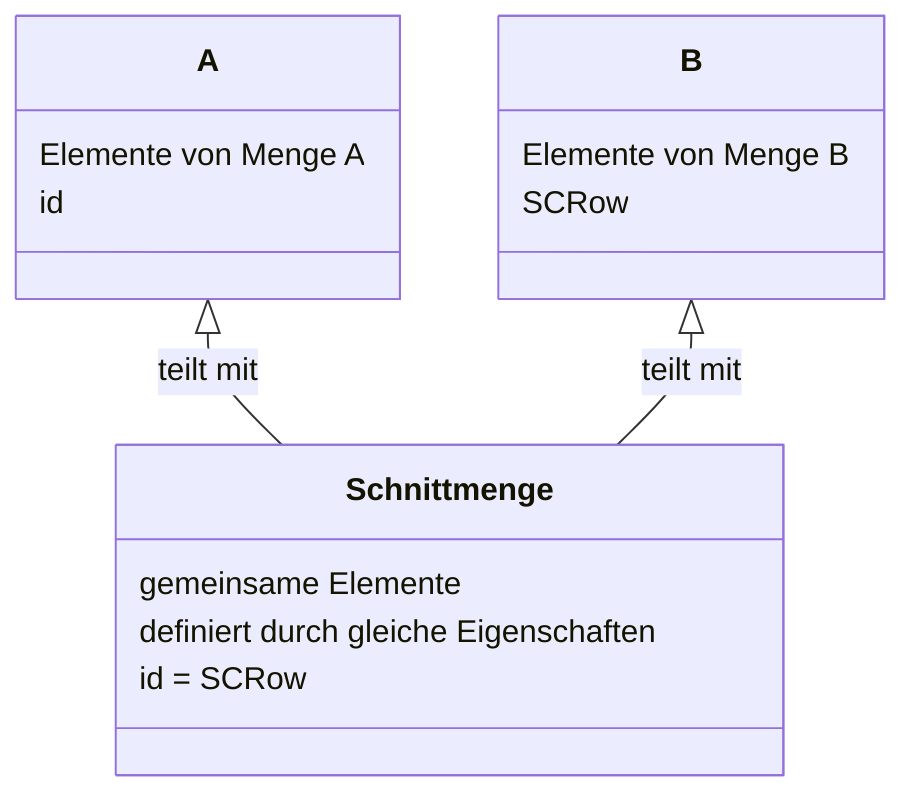

# Daten zusammen führen mit `JOIN`

Ein `JOIN` erlaubt es, eine Tabelle mit einer anderen Tabelle zu verbinden. Entscheidend dafür ist die Gestaltung des Schlüssels.

## Joins

SQLite unterstützt verschiedene Arten von `JOIN`-Operationen, die es erlauben, Daten aus zwei oder mehr Tabellen basierend auf einer relationalen Bedingung zwischen ihnen zu kombinieren. Hier ist eine Übersicht der
unterstützten `JOIN`-Typen in SQLite, dargestellt in einer Markdown-Tabelle:

| JOIN Typ            | Beschreibung                                                                                                                                                          |
|---------------------|-----------------------------------------------------------------------------------------------------------------------------------------------------------------------|
| `INNER JOIN`        | Gibt die Schnittmenge der Tabellen zurück. Nur die Datensätze, die die Join-Bedingung erfüllen, werden zurückgegeben.                                                 |
| `LEFT (OUTER) JOIN` | Gibt alle Datensätze aus der linken Tabelle zurück, sowie die übereinstimmenden Datensätze aus der rechten Tabelle. Nicht übereinstimmende werden als `NULL` gefüllt. |
| `CROSS JOIN`        | Erstellt ein kartesisches Produkt der beteiligten Tabellen. Das heißt, jedes Element der ersten Tabelle wird mit jedem Element der zweiten Tabelle kombiniert.        |
| `NATURAL JOIN`      | Führt einen Join basierend auf allen Spalten durch, die in beiden Tabellen den gleichen Namen haben.                                                                  |

Obwohl SQLite keinen expliziten `RIGHT JOIN` oder `FULL OUTER JOIN` unterstützt, können diese Verhaltensweisen durch
Kombination von `LEFT JOIN` und `UNION` bzw. durch kreative Anfragen, die `LEFT JOIN` und Bedingungen wie `IS NULL`
nutzen, simuliert werden.

### JOIN, INNER JOIN

Der bisher verwendete Typ von `JOIN` ist genau genommen ein `INNER JOIN`. Das bedeutet, das
nur die Datensätze angezeigt werden, auf die die Bedingung in der `ON` Klausel zutrifft.
**Mathematisch ausgedrückt bilden wir hier die Schnittmenge zweier Tabellen.**



### LEFT OUTER JOIN

Im Gegensatz zum `INNER JOIN` steht der `OUTER JOIN`. Bei SQLite gibt es nur den `LEFT OUTER JOIN`.
Da dies eindeutig ist, lässt man im Allgemeinen das `OUTER` weg und schreibt nur `LEFT JOIN`.

Nehmen wir ein einfaches Beispiel, um die Wirkung von `LEFT JOIN` zu verdeutlichen:

Tabelle A zeigt eine Liste von Personen

| ID | Name    |
|----|---------|
| 1  | Alice   |
| 2  | Bob     |
| 3  | Charlie |

Tabelle B eine Liste von Städten

| P_ID | City        |
|------|-------------|
| 2    | New York    |
| 3    | Los Angeles |
| 4    | Chicago     |

P_ID bezeichnet hier die ID der Person, ist also ein `FOREIGN KEY`. Aber kein richtiger!
Es ist zwar so gemeint, aber die Beziehung ist nicht vollständig.

In einer Tabellendefinition würde daher auch kein `FOREIGN KEY` definiert werden.
Das ist auch nicht immer wünschenswert.

Nehmen wir daher ein anders Beispiel, dass die Situation besser darstellt:

Die Wunschliste des Kunden

| Name     | Beschreibung                         | Stück |
|----------|--------------------------------------|-------|
| Mutter   | M8, Edelstahl                        | 1000  |
| Bohrer   | 9 mm, HSS                            | 10    |
| Schraube | 120 x 4,5 mm, Flachkopf, Teilgewinde | 500   |
| Niet     | 15 x 4 mm, Alu                       | 5000  |

Der Lagerbestand

| Name   | Beschreibung     | Stück |
|--------|------------------|-------|
| Mutter | M8, verzinkt     | 5000  |
| Niet   | 15 x 4 mm, Stahl | 10000 |
| Niet   | 15 x 4 mm, Alu   | 20000 |

Folgende Abfrage geht an die Datenbank:

```sql
    SELECT *
    FROM wunschliste w
             LEFT JOIN lagerbestand l ON l.name = w.name
```

Das wäre das Ergebnis:

| Name     | Beschreibung                         | Stück | Name   | Beschreibung     | Stück |
|----------|--------------------------------------|-------|--------|------------------|-------|
| Mutter   | M8, Edelstahl                        | 1000  | Mutter | M8, verzinkt     | 5000  |
| Bohrer   | 9 mm, HSS                            | 10    | null   | null             | null  |
| Schraube | 120 x 4,5 mm, Flachkopf, Teilgewinde | 500   | null   | null             | null  |
| Niet     | 15 x 4 mm, Alu                       | 5000  | Niet   | 15 x 4 mm, Stahl | 20000 |
| Niet     | 15 x 4 mm, Alu                       | 5000  | Niet   | 15 x 4 mm, Alu   | 20000 |

Wie kommt das zustande?

- Dadurch, dass wir das Sternchen im `SELECT` verwendet haben, werden alle Felder aller Tabellen angezeigt.
- Der `JOIN` wird über den Schlüssel `NAME` angelegt.
- Für Bohrer und Schraube gibt es keinen Eintrag im Lagerbestand. Da der `JOIN` ein `LEFT (OUTER) JOIN` ist, werden aber
  alle Einträge aus der Wunschliste angezeigt und wenn keine Entsprechungen im Lagerbestand vorhanden sind,
  werden `NULL`-Werte ausgegeben.
- Für die Verbindung `Niet`<=>`Niet` finden sich im Lager zwei Artikel. Daher macht es durchaus Sinn, den Artikel der
  Wunschliste zu wiederholen.

Wir können, nach kurzem Studium der Antwort aus der Datenbank, dem Kunden stolz das Vorhandensein von 5000 Nieten aus
Alu in der passenden Größe mitteilen.

Das Problem daran ist das kurze Studium. Die Abfrage muss deutlich verbessert werden, damit man nicht selbst die
Beschreibung lesen oder die Stückzahlen vergleichen muss.

### NATURAL JOIN

Würde hier ein `NATURAL JOIN` helfen?
Wie in der Definition oben steht, verwendet er die Spaltennamen beider Tabellen zur Verknüpfung.

### Die Wunschliste des Kunden

| Name     | Beschreibung                         | Stück |
|----------|--------------------------------------|-------|
| Mutter   | M8, Edelstahl                        | 1000  |
| Bohrer   | 9 mm, HSS                            | 10    |
| Schraube | 120 x 4,5 mm, Flachkopf, Teilgewinde | 500   |
| Niet     | 15 x 4 mm, Alu                       | 5000  |

### Der Lagerbestand

| Name   | Beschreibung     | Stück |
|--------|------------------|-------|
| Mutter | M8, verzinkt     | 5000  |
| Niet   | 15 x 4 mm, Stahl | 10000 |
| Niet   | 15 x 4 mm, Alu   | 20000 |

Ein Natural Join zwischen diesen Tabellen würde versuchen, Zeilen zu verbinden, die in den
Spalten `Name`, `Beschreibung` und `Stück` übereinstimmen, da diese Spalten in beiden Tabellen vorhanden sind.

Das Ergebnis ist leer, weil es
keine Zeilen gibt, bei denen die Werte in allen drei Spalten (`Name`, `Beschreibung`, `Stück`) zwischen den Tabellen
übereinstimmen. Während es einige Übereinstimmungen in der Spalte `Name` gibt (z.B. "Mutter" und "Niet"), unterscheiden
sich die Werte in den Spalten `Beschreibung` und `Stück` zwischen den entsprechenden Zeilen der beiden Tabellen:

- Die `Beschreibung` der "Mutter" in der Wunschliste ist "M8, Edelstahl", während sie im Lagerbestand "M8, verzinkt"
  ist.
- Die `Stück`-Zahlen stimmen ebenfalls nicht überein, selbst wenn die Spalten `Name` und `Beschreibung` übereinstimmen
  würden.

Ein Natural Join braucht eine exakte Übereinstimmung in allen gemeinsamen Spalten. Daher ein leeres Ergebnis.

### Aufgabe: Natural Join 🌶️🌶️

Löschen und Erstellen sie die beiden Tabellen neu. Verwenden sie für die zweite Tabelle die Spaltenüberschrift `Bestand`
anstelle von `Stück`. Führen sie den `natural join` erneut aus.

<details><summary>Lösung:</summary>
Das Ergebnis sollte so aussehen:
<table>
<tr>
<td>Niet</td>
<td>15 x 4 mm, Alu</td>
<td>5000</td>
<td>20000</td>
</tr></table>
Da sich die beiden Mengenspalten im Namen unterscheiden, werden die Zeilen angezeigt, in denen 
Name und Bezeichnung gleich sind. Die unterschiedlichen Spalten werden dann angehängt.

So kann man den Kunden viel besser (weil schneller) informieren.
</details>

### CROSS JOIN

Zu guter letzt bietet Sqlite den `CROSS JOIN` an. Wie in der Tabelle oben beschrieben, bildet der `CROSS JOIN` das
kartesische Produkt aller Datensätze aus beiden Tabellen. Was bedeutet das?

Ein einfaches Beispiel verdeutlicht die Funktionsweise.

```sql
CREATE TABLE plants
(
    plant TEXT
);

CREATE TABLE tools
(
    tool TEXT
);

INSERT INTO plants (plant)
VALUES ('tree'),
       ('flower'),
       ('herb');

INSERT INTO tools (tool)
VALUES ('knife'),
       ('hammer');

SELECT *
FROM plants
         CROSS JOIN tools; 
```

Dies wäre das Ergebnis:

| plant  | tool   |
|--------|--------|
| tree   | knife  |
| tree   | hammer |
| flower | knife  |
| flower | hammer |
| herb   | knife  |
| herb   | hammer |

Jedes Element der einen Tabelle wird mit jedem Element der anderen Tabelle kombiniert.
Man sollte diese Funktion sorgfältig planen.
