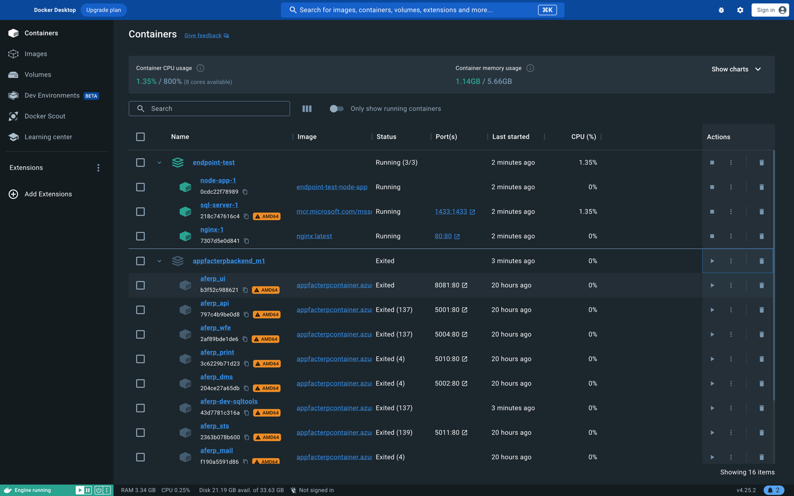

# Einführung in Docker: Grundlagen der Containervirtualisierung

[15min]

Willkommen zum Einstieg in die Welt von Docker, einer revolutionären Technologie, die die Art und Weise, wie wir
Software entwickeln, bereitstellen und ausführen, grundlegend verändert hat. In dieser Einführung konzentrieren wir uns
auf das grundlegende Verständnis von Docker, insbesondere im Kontext der Containervirtualisierung. Dies bildet den
ersten Schritt unserer Lernziele in diesem Seminar.

## Was ist Docker?

Docker ist eine Open-Source-Plattform, die die Entwicklung, den Versand und die Ausführung von Anwendungen vereinfacht.
**Docker ermöglicht, Anwendungen in sogenannten Containern zu verpacken**. Diese Container sind leichtgewichtig, tragbar
und bieten eine konsistente Umgebung, unabhängig davon, wo die Anwendung ausgeführt wird.

## Warum Docker? 

Wir stellen uns folgendes Szenarion vor: Vor kurzem haben wir eine eigene Flask App inklusive Datenbank entwickelt. Diese möchten wir nun auf einem anderen Rechner (oder auch Server) ausführen und der Welt zur Verfügung stellen. Da es sich um ein Hobby Projekt habelt, möchten wir eigentlich nicht die Kosten einer Azure instanz tragen.

Daher mieten wir eine günstige Maschine, welche wir selbst konfigurieren können. Wir müssten nun folgendes tun:

1. Ports und Server konfigurieren (Betriebssystem, Benutzerzugriffe, Updatesicherheit, ...)
2. Python und Flask installieren
3. Datenbank installieren und konfigurieren
4. Flask App installieren und konfigurieren
5. Firewall konfigurieren
6. Webserver konfigurieren (beispielsweise nginx oder apache)

Das ist einiges an Arbeit und dauert damit seine Zeit obwohl es sich eigentlich nur um eine kleine App handelt. Außerdem werden wir für unsere kleine App die gnaze Maschine zur Verfügung stellen, obwohl wir eigentlich nur einen kleinen Teil davon benötigen. Wenn wir mehrere dieser Apps und Datenbanken auf dem Server ablegen, können wir diese nur schwer von einander trennen. Über die App kann im schlimmsten Fall der Zugriff auf den gannzen Server erlangt werden.

Docker löst dieses Problem, indem es die Anwendung in einem Container verpackt. Ein Container ist eine isolierte Umgebung, die alle Abhängigkeiten und Konfigurationen enthält, die für die Ausführung der Anwendung erforderlich sind. Über eine App kann also nur auf den Container, nicht aber auf den gesamten Server zugegriffen werden.

Außerdem kann der Container sich automatisch aktualisieren. Und das beste: Der Container wird einmalig konfiguriert und nimmt uns dann die Schritte 1-6 ab. Wir können den Container auf jedem Rechner ausführen, der Docker installiert hat. Das ist ein großer Vorteil, da wir uns nicht mehr um die Konfiguration des Betriebssystems kümmern müssen.

## Docker vs Virtuelle Maschinen

)

Docker-Container sind isoliert, aber teilen sich den Kernel des Host-Betriebssystems. Das bedeutet, dass sie weniger Ressourcen verbrauchen und schneller starten als virtuelle Maschinen. Docker-Container sind auch portabler und können auf jedem System ausgeführt werden, das Docker unterstützt. Virtuelle Maschinen hingegen sind isoliert und haben ihren eigenen Kernel. Das bedeutet, dass sie mehr Ressourcen verbrauchen und langsamer starten als Docker-Container. Virtuelle Maschinen sind auch weniger portabel und können nicht auf jedem System ausgeführt werden, das Docker unterstützt.

## Beispiel einer Docker Desktop Anzeige

Wir sehen hier zwei Applikationen

| Applikation          | Container                                     | Status  |
|----------------------|-----------------------------------------------|---------|
| endpoint-test        | node-app-1 sql-server-1 nginx-1       | Running |
| appfacterpbackend_m1 | aferp-ui aferp-api ...(viele weitere) | Exited  |

In der Tabelle erkennen wir einige Informationen zu den einzelnen Containern, z.B. Name (mit ID), Name des images und
verschieden Status Werte.

Hier wird der Unterschied zur Verwendung von virtuellen Maschinen sehr deutlich. Man müsste für jeden Container
eigentlich eine eigene virtuelle Maschine aufsetzen. Natürlich geht das, aber der Verwaltungsaufwand und der
Ressourcenverbrauch ist enorm. Die Container teilen sich die Ressourcen des Betriebssystems und sind in einer Anwendung
gruppiert. So kann man viel leichter und übersichtlicher auf die einzelnen Teile des Ganzen eingehen.

## Docker in 100 Sekunden

<iframe width="700" height="400" src="https://www.youtube.com/embed/Gjnup-PuquQ" title="Docker in 100 Seconds" frameborder="0" allow="accelerometer; autoplay; clipboard-write; encrypted-media; gyroscope; picture-in-picture; web-share" referrerpolicy="strict-origin-when-cross-origin" allowfullscreen></iframe>