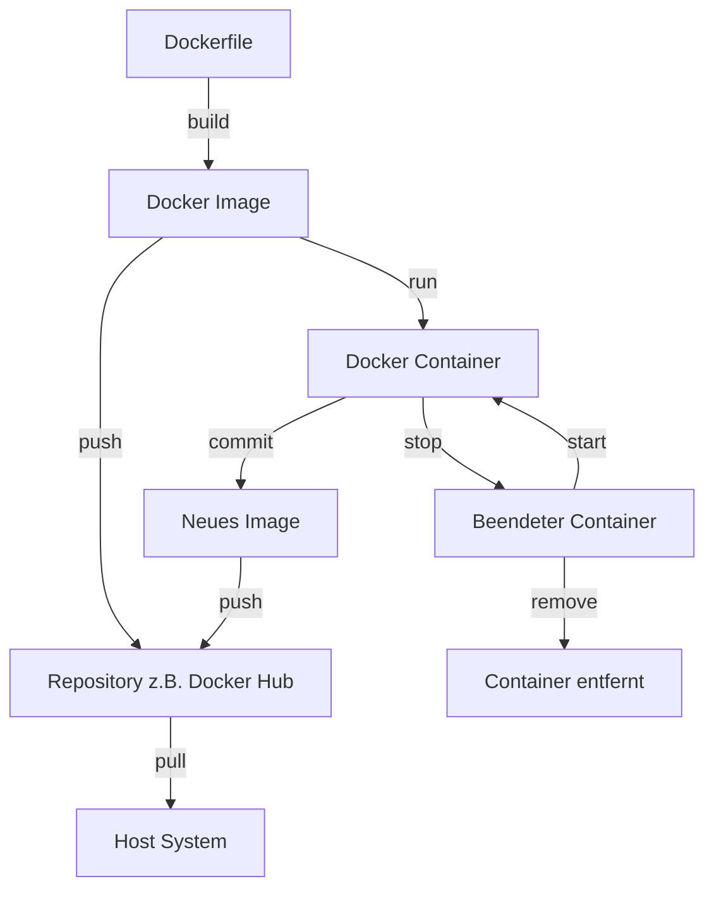
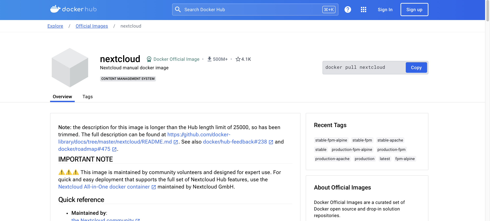

# Images verstehen

Docker-Images sind die Grundbausteine in der Docker-Technologie. Kurz gesagt sind sie schreibgeschützte Vorlagen,
die die Anweisungen zur Erstellung eines Docker-Containers enthalten. Ein Docker-Image beinhaltet alles, was für das
Ausführen einer Anwendung benötigt wird – den Code, eine Laufzeitumgebung, Bibliotheken, Umgebungsvariablen und
Konfigurationsdateien.

Ein Docker-Image ist vergleichbar mit einer Blaupause für einen Container oder, um es mehr computertechnisch
auszudrücken, eine Klasse.

Es ist eine leichte, eigenständige, ausführbare Software, die eine spezifische Umgebung für eine Anwendung bereitstellt.
Wenn ein Container gestartet wird, wird das Docker-Image als Basis verwendet, um eine laufende Instanz – den Container –
zu erstellen. Das ist in etwa so zu verstehen, als würde eine Instanz aus einer Klasse erstellt werden.

Einmal erstellt, wird ein Image **nicht mehr verändert**. Änderungen erfolgen durch Erstellen
eines neuen Images, das auf dem bestehenden Image basiert.

Im `Dockerfile` (meistens ohne Endung) wird festgehalten,
was in einem Image eingebunden ist und auf welchem Image dieses basiert.

**Docker-Images können auf jedem System ausgeführt werden, das Docker unterstützt, unabhängig von der
zugrunde liegenden Infrastruktur. Dies gewährleistet Konsistenz über verschiedene Umgebungen hinweg.**



## Ein Ruf aus der Praxis

Bevor wir uns die Theorie hinter Docker-Images genauer ansehen, werfen wir einen Blick auf ein praktisches Beispiel und wie wir mit fertigen Images arbeiten können.

Im [Docker Hub](https://hub.docker.com) finden wir eine vielzahl fertiger Images. Diese können wir quasi als Baupläne für unsere Container verwenden. Mithilfe dieser Images können wir also gesamte Anwednugnen in einem Docker Container erstellen lassen und diese dann auf jedem System ausführen, das Docker unterstützt.

### Beispiel: Installation von Nextcloud

Wir möchten unsere eigene Daten Clud hosten und haben die Plattform Nextcloud gefunden. Diese können wir auf unserem eigenen Server installieren. Dafür suchen wir im Dockerhub einfach nach dem Nextcloud Image.




In der Installationsanleitung finden wir den Befehl, um das Image zu starten:

```bash
 docker run -d -p 8080:80 nextcloud
 ```

 Wenn das Image lokal nicht vorhanden ist, wird es für uns vorher heruntergeladen. Hinweis: Der Docker Desktop muss laufen. 

 Nach dem Installieren können wie die Anwendung unter `localhost:8080` erreichen und unsere Cloud einrichten.


Bei der Sucha nach Images können wir auf die Content Filter achten. Diese geben uns eine erste Einschätzung, wie vertrauenswürdig das Image ist. Von Docker unterstützte Images und solche mit sehr vielen Downloads sind in der Regel unbedenklich.


### **Aufgabe: Definition 🌶️️**

Was ist der Unterschied zwischen Image und Container?


### **Aufgabe: Docker Hub 🌶️️**

Installiere ein Image aus dem Docker Hub und starte es auf deinem System. Stelle es deinen Kollegen kurz vor.