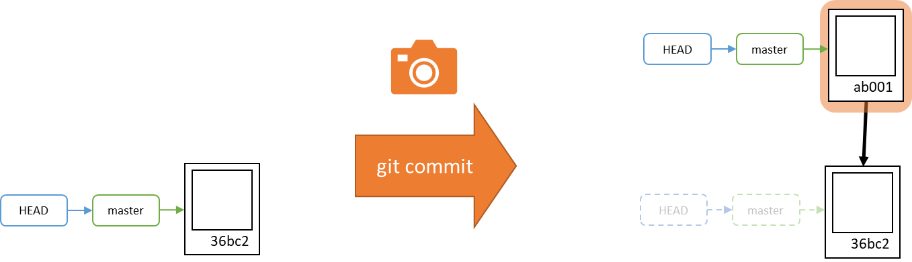
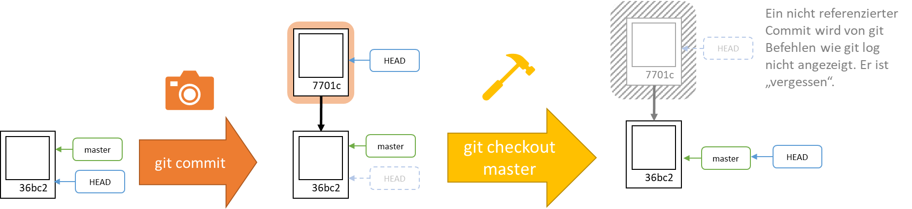
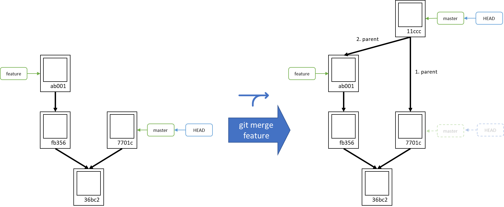
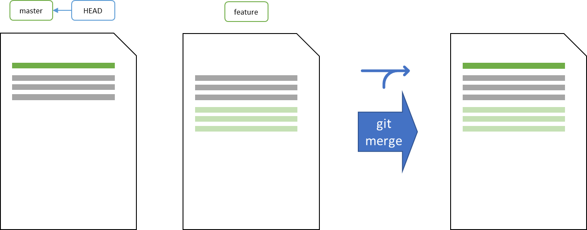
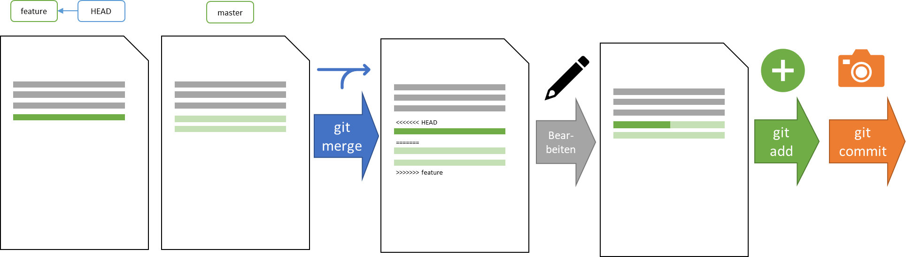

# Einführung in Git

Git ist ein Versionsverwaltungssystem, um im Team gemeinsam einfach und sicher an Projekten arbeiten.

[Präsentation herunterladen🔽](Git.pptx)

[Lernziele](../../checklists/checklist_git.md)

[Begriffssammlung](../../begriffe/begriffe_git.md)

## Neues Repository anlegen:

<iframe width="560" height="315" src="https://www.youtube.com/embed/YgFkQwyXxJE?si=WMIIWd9ERmlfMI5v" title="YouTube video player" frameborder="0" allow="accelerometer; autoplay; clipboard-write; encrypted-media; gyroscope; picture-in-picture; web-share" allowfullscreen></iframe>

* Erstelle einen leeren Ordner `Bewerbungsmappe`.
* Erstelle eine Datei `Anschreiben.txt` in `Bewerbungsmappe` und fülle sie mit etwas Text.
* Öffne ein Terminal (egal wo, hauptsache du bist beim Ordner `Bewerbungsmappe`).
* Führe den Befehl `git init` aus, um ein neues Repository anzulegen.

## Neue Datei dem Index hinzufügen:

<iframe width="560" height="315" src="https://www.youtube.com/embed/IbHtmj8N-TY?si=J7eyxdSnSGp70JVD" title="YouTube video player" frameborder="0" allow="accelerometer; autoplay; clipboard-write; encrypted-media; gyroscope; picture-in-picture; web-share" allowfullscreen></iframe>

* Prüfe mit `git status`, dass die Datei `Anschreiben.txt` noch "untracked" ist.
* Füge die Datei dem Index / der Staging Area mit dem Befehl `git add Anschreiben.txt` hinzu.
* Prüfe erneut mit `git status`, dass die Datei nun als "changes to be commited" läuft.

## Ersten Commit erstellen:

<iframe width="560" height="315" src="https://www.youtube.com/embed/uvQvHUxnPRc?si=VXu4aW9lx5QHoud0" title="YouTube video player" frameborder="0" allow="accelerometer; autoplay; clipboard-write; encrypted-media; gyroscope; picture-in-picture; web-share" allowfullscreen></iframe>

* Um einen Commit zu erstellen, tippe `git commit` ein. Wenn du enter drückst, landest du im VIM Editor.
* Drücke hier zunächst die Taste `i`, damit du in den Insert-Modus kommst.Du kannst jetzt dien Commitmessage schreiben. Du erkennst, dass du im richtigen Modus bist, wenn du unten `-- INSERT --` steht.
* Schreibe eine Commitmessage, die Beschreibt, was passiert ist (z.B. "Anschreiben.txt hinugefügt")
* Um den Insert-Modus zu verlassen drücke `Esc`. Das `-- INSERT --` unten verschwindet.
* Um den Commit zu speichern, gebe `:x` ein und `enter`.
* Nun solltest du wieder in der Konsole sein und der Commit wurde angelegt.
* Du kannst den Commit mit `git log` sehen.
* Wenn du eine Fehlermeldung erhält, dass der Benutzername nicht richtig gesetzt wurde, dann gebe in der Konsole ein:
    * `git config --local user.name <Nutzername>` und 
    * `git config --local user.email <Email>` 

## Zweiten Commit anlegen

<iframe width="560" height="315" src="https://www.youtube.com/embed/Kkwp0lgRvYw?si=Wy8OEp1D-JKXle2I" title="YouTube video player" frameborder="0" allow="accelerometer; autoplay; clipboard-write; encrypted-media; gyroscope; picture-in-picture; web-share" allowfullscreen></iframe>

* Erstelle eine neue Datei `Zeugnis.txt` und fülle sie mit Inhalt.
* Füge die Datei dem Index hinzu mit dem Befehl `git add Zeugnis.txt`.
* Erstelle einen neuen Commit mit `git commit`. Folge der Navigation durch den VIM-Editor wie oben.
* Untersuche, dass ein neuer Commit erzeugt worden ist mit `git log`.
* Um das Log etwas zu kürzen nutze `git log --oneline`, sodass jeder Commit nur noch eine Zeile beansprucht.

## Zwischen Commits wechseln

<iframe width="560" height="315" src="https://www.youtube.com/embed/3PJvkXJAZuI?si=85Awc5mxrntf8iLZ" title="YouTube video player" frameborder="0" allow="accelerometer; autoplay; clipboard-write; encrypted-media; gyroscope; picture-in-picture; web-share" allowfullscreen></iframe>

* Finde mit `git log` die ersten Ziffern Hash vom ältesten Commit heraus (hier im Video: `0936`)
* Bei dem Commit, an dem wir bisher sind, steht `(HEAD -> master)`. Das `HEAD` zeigt uns an, dass wir diesen Commit zuletzt ausgecheckt haben, das heißt auf der Grundlage von diesem arbeiten.
* Wechsle zum ersten Commit mit dem Befehl `git checkout 0936` (gebe entsprechend deine Nummer ein).
* Mit `git log --all` siehst du nun, dass du beim ersten Commit bist, da `HEAD` nun beim ersten Commit steht.
* Auch an der Ordnerstruktur siehst du, dass du in der ersten Projektversion bist und die Datei `Zeugnis.txt` fehlt.

## Zu Commit mit Branch wechseln

<iframe width="560" height="315" src="https://www.youtube.com/embed/5_VSL6-fKqk?si=RT2jLd8zkwzNwkKf" title="YouTube video player" frameborder="0" allow="accelerometer; autoplay; clipboard-write; encrypted-media; gyroscope; picture-in-picture; web-share" allowfullscreen></iframe>

* Stelle mit `git log --all` sicher, dass beim neuen Commit der Branch `master` notiert ist.
* Ein Branch ist ein Zeiger auf einen Commit. Man kann Branches unter `.git/refs/heads` finden.
* Wechlse zum neueren Commit mit dem Befehl `git checkout master`.

## Branch wandert bei Commits mit

<iframe width="560" height="315" src="https://www.youtube.com/embed/prtjR6PlnPo?si=XZhRcOBa6jdYkF9v" title="YouTube video player" frameborder="0" allow="accelerometer; autoplay; clipboard-write; encrypted-media; gyroscope; picture-in-picture; web-share" allowfullscreen></iframe>

* Ändere die Datei `Anschreiben.txt`.
* Mit `git status` sehen wir, dass die Datei modifiziert wurde.
* Die Änderung soll versioniert werden, daher wird die Datei erneut geadded. Nämlich mit `git add Anschreiben.txt`.
* Mit `git status` sehen wir, dass die Änderungen in den Index aufgenommen wurden.
* Merke dir mit `git log` die Position von `master`.
* Erstelle einen Commit.
* Der Branch `master` liegt nun am neuen, dritten Commit.
* Wenn du in `git log` feststeckst, dann kannst du mit den Pfeiltasten nach oben und nach unten navigieren und mit `q` wieder in die Eingabe des Terminals zurückkehren.



## Detached HEAD state

<iframe width="560" height="315" src="https://www.youtube.com/embed/gfM4IQFupgM?si=BGc8xEWWwbZyMD3W" title="YouTube video player" frameborder="0" allow="accelerometer; autoplay; clipboard-write; encrypted-media; gyroscope; picture-in-picture; web-share" allowfullscreen></iframe>

* Wir wollen git nun in den "detached HEAD state". Dieser sollte in der normalen Arbeit mit git vermieden werden und wir zeigen nun warum.
* Stelle sicher, dass beim Aufruf von `git log` beim aktuell ausgechecktedn Commit `(HEAD -> master)` steht. Das heißt, dass wir **nicht** im detached Head state sind.
* Wir checken nun den aktuellen Commit (nicht Branch!) aus mit `git checkout 1453` (gebe deine entsprechende Nummer ein).
* Alles sieht so aus wie bisher (klar, denn wir sind ja auf derselben Projektversion wie eben).
* Wir erhalten jedoch eine Warnung, dass wir und in "detached HEAD state" befinden.
* Öffen wir `git log`, sehen wir auch, dass `(HEAD, master)` beim neusten Commit vermerkt ist.
* Wir erstellen nun einen neuen Commit, indem wir die Datei `Zeugnis.txt` manipulieren.
* Der neue Commit taucht nun zwar in `git log --oneline` auf, aber der Branch `master` ist nicht mitgewandert.

## Commit vergessen nach wechsel aus dem Detached HEAD state

<iframe width="560" height="315" src="https://www.youtube.com/embed/PDWJWtSIXwM?si=dyX6zP8tg29v4HDE" title="YouTube video player" frameborder="0" allow="accelerometer; autoplay; clipboard-write; encrypted-media; gyroscope; picture-in-picture; web-share" allowfullscreen></iframe>

* Merke dir den Hash des neuesten Commits, denn wir zuletzt erstellt haben (hier: `6b26`).
* Wechsle zum `master`-Branch mit `git checkout master`.
* Mit `git log --oneline --all` stellst du fest, dass der neueste Commit verschwunden ist.
* Dieser ist nicht sichtbar, da es keinen Commit oder Branch mehr gibt, der diesen Commit direkt oder indirekt referenzerit.
* Wir können jedoch noch zu diesem Commit zurückkehren, da er nicht gelöscht wurde mti `git checkout 6b26`.



## Branch umsetzen

<iframe width="560" height="315" src="https://www.youtube.com/embed/nxRVJ4SgiKc?si=zgbUMqzIISdFmXDF" title="YouTube video player" frameborder="0" allow="accelerometer; autoplay; clipboard-write; encrypted-media; gyroscope; picture-in-picture; web-share" allowfullscreen></iframe>

* Notiere dir den Hash von dem Commit, zu dem der Branch `master` verschoben werden soll (hier: `6b26`).
* Wir wechseln auf den Branch `master` mit dem Befehl `git checkout master`.
* Setze den Branch mit dem Befehl `git reset --hard 6b26` um.

## Neuen Branch erstellen

<iframe width="560" height="315" src="https://www.youtube.com/embed/oFAJFkRZ6ZY?si=wPjLgDhsOODy_dOK" title="YouTube video player" frameborder="0" allow="accelerometer; autoplay; clipboard-write; encrypted-media; gyroscope; picture-in-picture; web-share" allowfullscreen></iframe>

* Wechsle zum ersten Commit mit dem Befehl `git checkout -b feature 0936`. Das `-b feature` in diesem Befehl sorgt dafür, dass wir an dieser Stelle direkt einen neuen Branch erstellen und auschecken.
* Mit `git log --all --oneline` sehen wir im ersten Commit neben der Nummer nun `(HEAD -> feature)`.
* Auch über `git status` wird uns gesagt, dass wir `On branch feature` sind.

## Commit auf neuen Branch erstellen.

<iframe width="560" height="315" src="https://www.youtube.com/embed/cH7Qis02U9o?si=cNQ5c_XlLvlnMUl_" title="YouTube video player" frameborder="0" allow="accelerometer; autoplay; clipboard-write; encrypted-media; gyroscope; picture-in-picture; web-share" allowfullscreen></iframe>

* Erstelle eine Datei `Foto.txt` und fülle diese.
* Füge die Datei dem Index hinzu mit `git add Foto.txt`.
* Erstelle einen Commit, ohne in VIM zu landen, indem du nicht Nachricht direkt mitgibtst: `git commit -m "Foto hinzugefügt"`
* Nutze `git log --all --graph --oneline`, um die Commits zu sehen und wie sie Zusammenhängen

## Commits zusammenlegen

<iframe width="560" height="315" src="https://www.youtube.com/embed/VIyjNuMaUog?si=lKhiNpa1nQ2Aex1q" title="YouTube video player" frameborder="0" allow="accelerometer; autoplay; clipboard-write; encrypted-media; gyroscope; picture-in-picture; web-share" allowfullscreen></iframe>

* Notiere dir mit `git log --all --oneline --graph` den aktuellen Commit von `feature` (hier: `dd88`). Wir werden dies später brauchen, um den Merge rückgängig zu machen.
* Um die Änderungen von `master` in `feature` einzubinden, führe `git merge master` aus.
* Ggf. öffnet sich VIM. Du kannst die angebotene Commit-Message bestätigen, indem du `:x` und `enter` eingibst.
* Mit `git log --all --oneline --graph` kannst du nun sehen, dass ein neuer Mergecommit erstellt wurde, der zwei Eltern hat.
* Die aktuelle Projektversion endhält die Änderungen aus allen bisherigen Commits. 





## Merge rückgängig machen

<iframe width="560" height="315" src="https://www.youtube.com/embed/mN0tnlfjRA8?si=_PPFu0t1B8iRs84h" title="YouTube video player" frameborder="0" allow="accelerometer; autoplay; clipboard-write; encrypted-media; gyroscope; picture-in-picture; web-share" allowfullscreen></iframe>

* Stelle sicher, dass du dich auch dem `feature` Branch befindest mit `git checkout feature`.
* Setze den Branch mit `git reset dd88` auf die Position zurück, die du dir vorher notiert hast.
* Der Mergecommit ist nun verschwunden, was mit `git log --all --oneline --graph` sichtbar wird.
* Der Mergecommit ist nicht gelöscht, aber da niemand mehr diesen referenziert, wird er nicht im Log angezeigt.

## Konflikt erstellen

<iframe width="560" height="315" src="https://www.youtube.com/embed/GoxzzIsaUnM?si=ryPYaJxGMyyW46YU" title="YouTube video player" frameborder="0" allow="accelerometer; autoplay; clipboard-write; encrypted-media; gyroscope; picture-in-picture; web-share" allowfullscreen></iframe>

* Mache eine Änderungen in der ersten Zeile der Datei `Anschreiben.txt` und committe diese auf dem `feature`-Branch.
* Wechsle zum Branch `master`.
* Mache eine Änderungen in der ersten Zeile der Datei `Anschreiben.txt` und committe diese auf dem `master`-Branch.
* Wechsle zum Branch `feature`.
* Merke dir mit `git log --all --oneline --graph` die aktuelle Position vom Branch `feature` (hier: ). Dies brauchen wir später, um den Commit rückgängig zu machen.
* Führe den Befehl `git merge master` aus.
* Es kommt zu einem Konflikt.
* `git status` teilt uns mit, dass wir einen Konflikt haben, wo dieser liegt und das wir uns im `MERGING` befinden.
* Um das Merging abzubrechen, gebe `git merge --abort` ein. Die Dateien sind nun wieder im Originalzustand.

## Konflikt untersuchen und lösen

<iframe width="560" height="315" src="https://www.youtube.com/embed/IPtBI0MMy8E?si=oOkMhgrVKHornMye" title="YouTube video player" frameborder="0" allow="accelerometer; autoplay; clipboard-write; encrypted-media; gyroscope; picture-in-picture; web-share" allowfullscreen></iframe>

* Rufe erneut `git merge master` auf.
* Beachte, dass die Datei `Anschreiben.txt` von git geändert wurde, sodass man beide Varianten sehen kann.
* Bringe die Datei in einen Zustand, der zukünftig gelten soll.
* Bestätige, dass du den Konflikt gelöst hast, indem du `git add Anschreiben.txt` ausführst.
* Um das Merging abzuschließen nutze `git commit`.
* Bestätige ggf. noch im VIM die Commitmessage mit `:x`.



## Merge rückgängig machen

<iframe width="560" height="315" src="https://www.youtube.com/embed/tMJYPPWp0-o?si=rm_gNKDKTB-2EO6y" title="YouTube video player" frameborder="0" allow="accelerometer; autoplay; clipboard-write; encrypted-media; gyroscope; picture-in-picture; web-share" allowfullscreen></iframe>

* Stelle sicher, dass du dich auch dem `feature` Branch befindest mit `git checkout feature`.
* Setze den Branch mit `git reset ...` auf die Position zurück, die du dir vorher notiert hast.
* Der Mergecommit ist nun verschwunden, was mit `git log --all --oneline --graph` sichtbar wird.
* Der Mergecommit ist nicht gelöscht, aber da niemand mehr diesen referenziert, wird er nicht im Log angezeigt.

## Konflikt mit IDE untersuchen und lösen

<iframe width="560" height="315" src="https://www.youtube.com/embed/1ziL9Zkc2hs?si=USrr8b05Is5vJj1D" title="YouTube video player" frameborder="0" allow="accelerometer; autoplay; clipboard-write; encrypted-media; gyroscope; picture-in-picture; web-share" allowfullscreen></iframe>

* Rufe erneut `git merge master` auf.
* In deiner IDE kannst du dir den Konflikt anzeigen lassen.
* Du siehst hier wie die Datei jeweils in den beiden Commit aussiehst und du siehst die Basisversion. Bei dieser musst du eintragen, welche Version in Zukunft gelten soll.
* Du kannst nun über die IDE den Commit bestätigen.

## remote Repository in Bitbucket erstellen

<iframe width="560" height="315" src="https://www.youtube.com/embed/VBc7HRlMXjI?si=Kp8Hn8QkXN4C7jwc" title="YouTube video player" frameborder="0" allow="accelerometer; autoplay; clipboard-write; encrypted-media; gyroscope; picture-in-picture; web-share" allowfullscreen></iframe>

* Melde dich im Bitbucket an.
* Erstelle ein Repository.
* Folge der Anweisung zunächst einen Namen und Email korrekt zu konfigurieren.

```commandline
git config --global user.name "..., ... (...)"
git config --global user.email "...@..."
```

## Leeres remote Repository auf den Rechner clonen und ersten Commit pushen

<iframe width="560" height="315" src="https://www.youtube.com/embed/58IqhAoT9HE?si=tw8DGoR-8NeTRVFi" title="YouTube video player" frameborder="0" allow="accelerometer; autoplay; clipboard-write; encrypted-media; gyroscope; picture-in-picture; web-share" allowfullscreen></iframe>

* Clone das Repository mit `git clone <url>`, wie auf Bitbucket gezeigt.
* Öffne das Remote Repository in deiner IDE.
* Erstelle einen neuen Commit auf dem lokalen Repository.
* Veröffentliche deinen Commit mit `git push`

## Commit auf Seiten von Bitbucket erstellen und fetchen/pullen

<iframe width="560" height="315" src="https://www.youtube.com/embed/x_eM7s7c9tU?si=qS252WEohaSGMWAW" title="YouTube video player" frameborder="0" allow="accelerometer; autoplay; clipboard-write; encrypted-media; gyroscope; picture-in-picture; web-share" allowfullscreen></iframe>

* Erstelle auf der Seite von Bitbucket eine Änderung in der Datei und speichere sie mit einem Commit im Browser.
* Lade die Änderungen mit `git fetch`.
* Spiele die Änderungen in deinen Branch mit `git pull`


