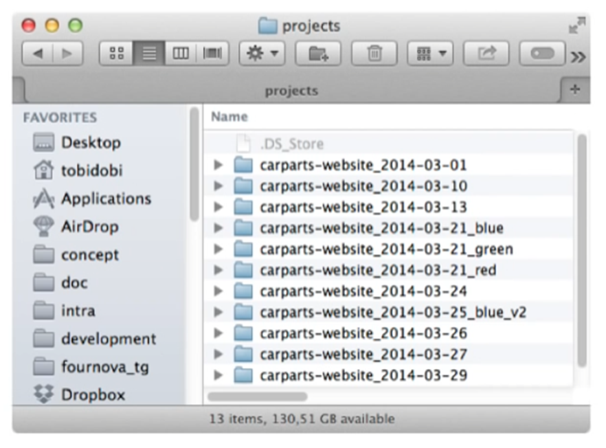
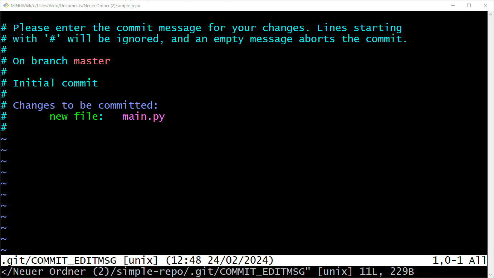
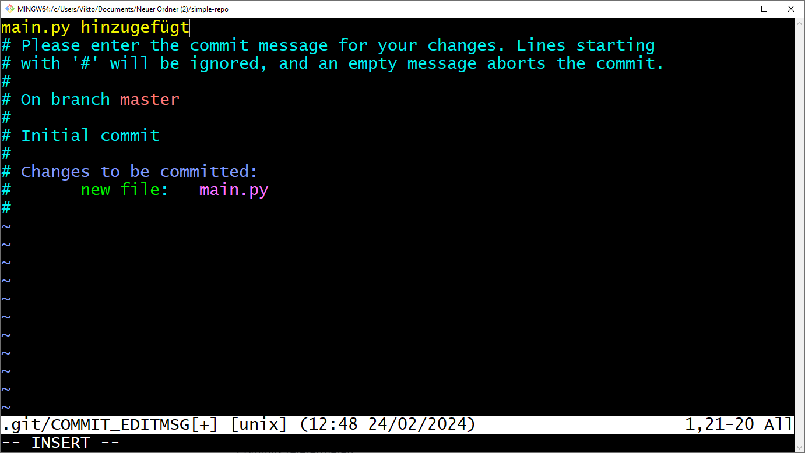
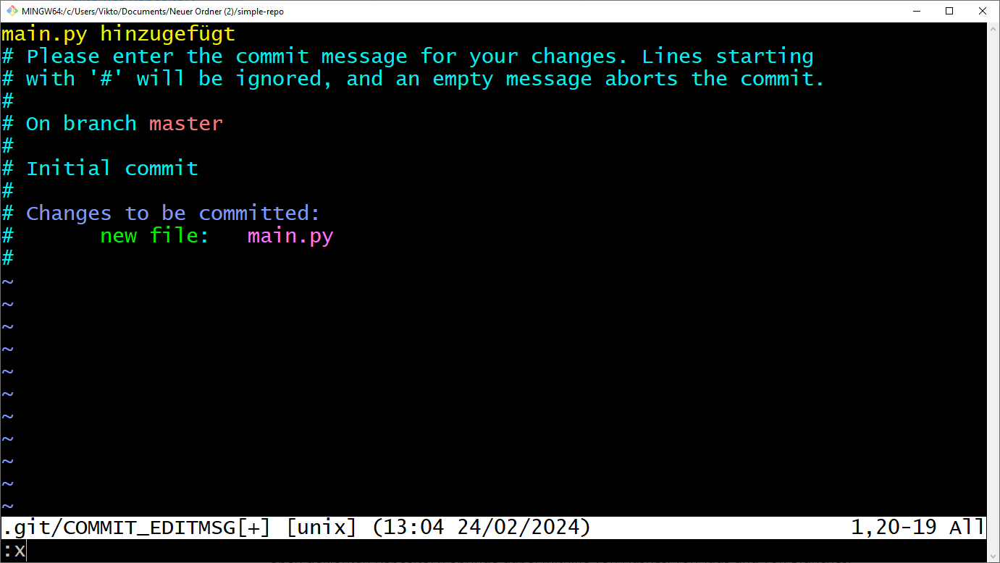
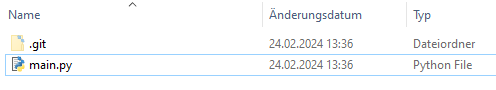
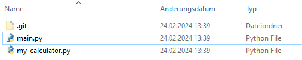

# Einführung in Git Teil 1: Lokales Arbeiten

## Problem

<details>
<summary>
🎦 Video
</summary>

</details>

Stell dir vor, du arbeitest, mit anderen an einem Projekt. Wie arbeitet ihr zusammen?

* Kommunikation über E-Mail (Dateien als Anhänge austauschen).
* Gemeinsames Laufwerk, auf das alle Projektbeteiligten Zugreifen können.
* Paralleles Arbeiten an einer Datei, die in der Cloud liegt, wie mit Google Docs oder Microsoft Word.



### Aufgabe: Welche Vorteile?🌶🌶

Diskutiere die vorgeschlagenen Ansätze, um gemeinsam an einem Projekt zu arbeiten.

Welche Vorteile haben diese? Für welche Projekte sind die jeweiligen Lösungen geeignet?

Wie lassen sich bei diesen Lösungen parallel existierende Projektversionen realisieren?

Fallen dir noch weitere Arbeitsweisen ein?

[Lösung](solutions.md#aufgabe-welche-vorteile)

## Lösung: Versionieren mit Git!

Git ist ein Versionsverwaltungssystem, um im Team gemeinsam einfach und sicher an Projekten zu arbeiten.

Git ermöglicht:

- Speicherung, Einsicht und Wiederherstellung von verschiedenen Projektversionen. 
- Eine beliebige Anzahl von Projektversionen.
- Übersicht über alle verschiedenen Projektversionen.
- Die Differenz zwischen zwei Projektversionen ansehen.
- Verschiedene Projektversionen zu einer zusammenführen.
- Neue Projektversionen basierend auf beliebigen alten Projektversionen zu erstellen.
- Nachverfolgbarkeit (Wer erstellte welche Änderung?) mit Begründung.
- Paralleles Arbeiten.
- Einzelnes Arbeiten (ungestört).
- Offline Arbeiten (Unabhängigkeit vom Internet).


### Aufgabe: Was ist mir wichtig?🌶
Welche der obigen Punkte sind für dich besonders wichtig bei der Arbeit an einem Projekt?
Gibt es noch weitere unerwähnte Punkte?

[Lösung](solutions.md#aufgabe-was-ist-mir-wichtig)

# Aufbau von Git:

Ein Projekt wird dabei in einem **Repository** gespeichert. In einem Repository liegen **alle** Versionen
des Projektes vor, die jemals von gespeichert wurden.

Eine einzelne Projektversion wird in einem **Commit** gespeichert. Man kann es sich wie ein Bild vorstellen,
dass man vom Projekt zu einem gewissen Zeitpunkt erstellt hat. Man kann dann immer wieder den Zustand vom Projekt
auf den im Commit festgehaltenen Zustand wieder herstellen. (Man stellt also den Zustand auf dem Bild wieder her.)

Der **Working Tree** ist die Version deines Projektes, die im Moment auf deinem Computer verfügbar ist und
betrachtet und bearbeitet werden kann.

Der **Index/Staging Area** ist eine Datei von git, in der hinterlegt ist, welche Inhalte beim Erstellen eines
neuen Commits tatsächlich gespeichert werden sollen. Bei git müssen nämlich alle Änderungen, die du in einem
Projekt vornimmt auch in einer neuen Projektversion (Commit) gespeichert werden. Es ist nämlich möglich auch nur
bestimmte Änderungen auszuwählen, indem man nur diese der Staging Area hinzufügt. Dann werden auch nur diese 
Änderungen im neuen Commit gespeichert.

Ein **Branch** ist ein Zeiger auf eine Projektversion. Dieser ist nützlich, um bei den vielen Projektversionen
die Übersicht zu behalten, was die aktuellsten Projektversionen sind. Mehr dazu später

### Aufgabe: Metaphorisch gesprochen🌶🌶
In dem Text unten tauchen die folgenden Objekte auf:

* Bücherregal
* Erster Tisch
* Zweiter Tisch mit Kamera
* Foto vom zweiten Tisch
* Zettel auf aktuellem Foto

Diese symbolisieren eines der folgenden Dinge aus dem git-Universium. Welches Objekt gehört zu welchem?

* Repository
* Index/Staging Area
* Branch
* Commit
* Working Tree


        Man stelle sich ein leeres Bücherregal vor.
        
        Auf dem Tisch arbeiten wir an einem Projekt (z.B. einer Motion Cutout Animation).
        Auf diesem Tisch befindet sich unsere aktuelle Projektversion.
        
        Es gibt einen zweiten Tisch. Über diesen Tisch schwebt eine Kamera.
        Auf diesem zweiten Tisch können wir eine alles, was auf dem ersten Tisch
        liegt, mit einem magischen Knopf herüber kopieren. Wir können aber auch sagen,
        dass nur bestimmte Dinge auf den zweiten Tisch mit der Kamera kopiert werden.
        Alles, was wir mit dem magischen Knopf auf den zweiten Tisch gepackt haben,
        erscheint übrigens auch im Bücherregal und ordnet sich da schön ein.
        
        Wir können jederzeit ein Foto vom zweiten Tisch machen. Dieses Foto können wir
        ins Regal legen. Das Projekt ist nun in einer neuen Version gesichert.
        Solange dieser Schrank existiert, ist sie für immer sicher.
        
        Wir können nun jederzeit unseren Tisch wieder auf den im Bild gespeicherten Zustand bringen.
        
        Auf dem aktuellsten Foto kleben wir einen Zettel, damit wir es später besser wiederfinden.


[Lösung](solutions.md#aufgabe-metaphorisch-gesprochen)

## Installation von GIT
Wir können Git auf den gängigsten Betriebssystemen wie Windows, Mac und Linux installieren.
Tatsächlich ist Git auf den meisten Mac- und Linux-Rechnern standardmäßig installiert.

Falls git bei dir nicht installiert ist, folge dieser [Anleitung](https://git-scm.com/book/en/v2/Getting-Started-Installing-Git).

Um zu sehen, ob Git bereits installiert ist, öffnen wir ein Terminal und führen Folgendes aus:

```console
$ git version
git version 2.24.3 (Apple Git-128)
```
Darüber hinaus verfügt Git über integrierte GUI-Tools zum Festschreiben (git-gui)
und Durchsuchen (gitk). Es gibt auch zahlreiche Tools oder IDE-Plugins von Drittanbietern,
die das Arbeiten vereinfachen. Wir lernen es in diesem Kurs aber von Grund auf mit der Konsole zu bedienen.

## Die Konfiguration von GIT
Sobald wir Git installiert haben, können wir es einfach mit dem Befehl `git config` konfigurieren.

```console
$ git config --global user.name "Qualidy User"
```
Mit diesem Befehl legen wir den Nutzernamen fest, der bei allen Commits, die wir Erstellen als Autor hinterlegt
werden soll. Die Option `--global` legt fest, dass diese Option für alle Repositories des aktuellen Nutzers
des Betriebssystems gilt.

Um die Liste der wirksamen Optionen auszugeben, tippen wir:

```console
$ git config -l
user.name=Qualidy User
```

### Aufgabe: Nutzer korrekt einstellen 🌶
Starte git und stelle sicher, dass der richtige Nutzername und E-Mail eingestellt ist.

[Lösung](solutions.md#aufgabe-nutzer-korrekt-einstellen)

## Lokales Repository erstellen

<details>
<summary>
🎦 Video
</summary>

</details>


Um ein neues Repository zu initialisieren, müssen wir den Befehl git init verwenden. 
Es verwandelt das aktuelle Verzeichnis in ein Git-Repository und git beginnt mit der Verfolgung seines Inhalts:

Neuen Ordner erstellen: 
```console
$ mkdir simple-repo
```

In den neuen Ordner wechseln (`cd` steht für "**c**hange **d**irectory"):
```console
$ cd simple-repo
```

Repository erstellen:
```console
$ git init
Initialized empty Git repository in /simple-repo/.git/
```

Git erstellt darin auch ein verstecktes Verzeichnis namens `.git`. In diesem Verzeichnis werden 
alle Objekte und Referenzen gespeichert, die Git im Rahmen unseres Projektverlaufs erstellt und verwendet. 

Im Moment ist dieses Repository noch leer.

## Dateien erstellen und zum speichern markieren

<details>
<summary>
🎦 Video
</summary>

</details>


Wir können nun Dateien im Ordner `simple-repo` erstellen. Erstellen wir z.B. die Datei `main.py`:

```python
# my first python program
print("Hallo Welt")

```

Wir können nun mit dem Befehl `git status` sehen, dass git registiert, dass eine neue Datei im Ordner ist,
diese Aber noch nicht versioniert wird:

```commandline
$ git status
On branch master

No commits yet

Untracked files:
  (use "git add <file>..." to include in what will be committed)
        main.py

nothing added to commit but untracked files present (use "git add" to track)
```

Wir können nun sagen, dass wir die Datei in die nächste Version mit aufnehmen wollen, indem wir 
es mit dem Befehl `git add main.py` dem Index hinzufügen. Wenn wir hier keine Rückmeldung erhalten
ist alles gut gelaufen.

Wenn wir dann erneut den Status erfragen, sehen wir nun, dass die Datei dem Index hinzugefügt wurde:

```commandline
$ git status
On branch master

No commits yet

Changes to be committed:
  (use "git rm --cached <file>..." to unstage)
        new file:   main.py
```

## Ersten Commit erstellen

<details>
<summary>
🎦 Video
</summary>

</details>


Wir können nun eine Versions unseres Projektes speichern, indem wir einen Commit erstellen mit dem Befehl
`git commit`. Wenn wir das tun, landen wir im VIM Editor. Keine Panik🧘‍♀️🧘‍♂️



VIM ist ein ausgefeilter Texteditor, der in der Konsole benutzt werden kann. Wir sind dazu aufgerufen
hier die **Commit-Message** zu notieren. Das ist eine Nachricht, die beschreiben soll, was in dieser Projektversion
neues passiert ist, im Vergleich zu der bisher genutzten Projektversion.

Für uns gibt es bei Vim nur drei wichtige Befehle:

* Drücke `i`, um in den Insert-Modus zu kommen. Das erkennst du daran, dass ganz unten `-- INSERT --` erscheint. Du kannst jetzt im Text schreiben und mit den Pfeiltasten navigieren. Schreibe nun in die erste Zeile deine Commit-Message



* Um den Insert-Modus zu verlassen dürcke `ESC`. Jetzt kannst du den Text nicht mehr bearbeiten.

* Gebe nun `:x` ein, um zu speichern und den Editor zu schließen. 



Wir haben nun den commit erfolgreich erstellt und können diesen mit dem Befehl `git log` untersuchen:
```commandline
$ git log
commit f8e4d3fc8111a78da61a0ed28ec420eb9fb5aeb4 (HEAD -> master)
Author: Viktor Reichert <viktor.reichert@qualidy.de>
Date:   Sat Feb 24 13:04:13 2024 +0100

    main.py hinzugefügt
```

Wir haben nun unsere erste Projektversion erstellt. Wir können diesen Zustand des Projektes zukünftig jederzeit
wiederherstellen.

## Weitere Commits erstellen.

<details>
<summary>
🎦 Video
</summary>

</details>


Wir können nun weitere Projektversionen erstellen. Dazu fügen wir neue Dateien hinzu oder ändern bestehende.
Immer wenn wir das tun, können wir mit `git status` sehen, welche Änderungen nur im Working-Tree vorliegen
und welche wir mit `git add` bereits dem Index hinzugefügt wurden und so in der nächsten Projektversion (dem nächsten
Commit) dauerhaft persistiert werden.

Wir können z.B. eine neue Datei `my_calculator.py` erstellen:

```python
def multiply_all(my_list):
    product = 1
    for faktor in my_list:
        product *= faktor
    return product

```

Wir können z.B. die Datei `main.py` erweitern:

```python
# my first python program
from my_calculator import multiply_all 

print("Hallo Welt")
print(multiply_all([2,4,5]))
```

Mit `git status` wird uns nun gesagt, dass die neue Datei noch nicht versioniert wird und die zweite Datei 
Modifizierungen aufweist, die noch nicht versioniert werden:

```commandline
$ git status
On branch master
Changes not staged for commit:
  (use "git add <file>..." to update what will be committed)
  (use "git restore <file>..." to discard changes in working directory)
        modified:   main.py

Untracked files:
  (use "git add <file>..." to include in what will be committed)
        my_calculator.py

no changes added to commit (use "git add" and/or "git commit -a")
```

Wir können nun die Änderungen einzeln dem Index hinzufügen, indem wir `git add main.py` und `git add my_calculator.py`
ausführen, oder wir lassen alles auf ein Mal mit dem Befehl `git add .` hinzufügen. Wir sehen dann mit `git status`,
dass die Datein dem Index hinzugefügt wurden:

```commandline
$ git add .
$ git status
On branch master
Changes to be committed:
  (use "git restore --staged <file>..." to unstage)
        modified:   main.py
        new file:   my_calculator.py
```

Wir können nun einen Commit erstellen. Um etwas schneller zu sein und nicht wieder in VIM zu landen, können wir
beim Befehlsaufruf direkt die Commit-Message mit angeben, indem wir das Flag `-m` mit einer Commit-Message
hinzufügen. Etwa so:

```commandline
$ git commit -m "added my_calculator with multiply_all method"
[master 58ea6a4] added my_calculator with multiply_all method
 2 files changed, 8 insertions(+)
 create mode 100644 my_calculator.py
```

Wir sehen nun, dass im `git log` zwei Commit auftauchen:
```commandline
$ git log
commit 58ea6a40de9de9370a47032e3637eaa77273448b (HEAD -> master)
Author: Viktor Reichert <viktor.reichert@qualidy.de>
Date:   Sat Feb 24 13:26:47 2024 +0100

    added my_calculator with multiply_all method

commit f8e4d3fc8111a78da61a0ed28ec420eb9fb5aeb4
Author: Viktor Reichert <viktor.reichert@qualidy.de>
Date:   Sat Feb 24 13:04:13 2024 +0100

    main.py hinzugefügt

```

Mit dem Befehl `git log --all --oneline --graph` kannst du alle Commits in Kurzform sehen, die in diesem Projekt
erstellt wurden. In dieser Ansicht kannst du mit den Pfeiltasten nach oben und unten navigieren und
sie mit der Taste `q` verlassen.

```commandline
$ git log --all --oneline --graph
* 58ea6a4 (HEAD -> master) added my_calculator with multiply_all method
* f8e4d3f main.py hinzugefügt
```

Der Zeiger `HEAD` zeigt uns übrigens an, welche Projektversion wir derzeit als Ausgangspunkt unserer Arbeit betrachten.

## Zwischen Projektversionen/Commits wechseln

<details>
<summary>
🎦 Video
</summary>

</details>


Um von einer Projektversion zur anderen zu wechseln, nutzen wir die Befehle `git switch` oder `git checkout`.

Man gibt dann den _Hash_ des Commits an oder einen _Tag_ oder _Branch_, der auf den Commit zeigt.

Der **Hash** eines Commits kann mit dem Befehl `git log` ermittelt werden
und ist die lange Hexadezimalzahl in der ersten Zeile. In unserem Beispiel 
wären das `58ea6a40d...` und `f8e4d3fc...`. Bei `git log --graph --oneline --all` sehen wir
nur den Anfang von diesem Hash. Die ersten vier Zeichen eines Hash genügen normalerweise.

Ein **Tag** ist eine dauerhafte Referenz auf einen Commit, der verwendet wird,
um z.B. Releaseversionen zu kennzeichnen. Hier verwenden wir diese noch nicht.

Ein **Branch** ist auch eine Referenz auf einen Tag, jedoch kann diese im Laufe der Zeit verschiedene
Commits referenzieren. Der einzige Branch, den wir hier bisher vorliegen haben ist `master`.

Wenn wir also auf den ersten Commit wecheln, können wir `git checkout f8e4` verwenden. Wir sehen dann,
dass wir eine Warnung erhalten, dass wir im "'detached HEAD' state" sind, aber das ist erstmal
nicht so schlimm. Wir sehen nämlich auch, dass wir den alten Projektzustand mit nur einer Datei
wiederhergestellt haben.



Wenn wir dann zum aktuellen Projektstand zurückwechseln wollen, dann können wir das 
über den Befehl `git checkout master`. Dann haben wir wieder beide Dateien.



### Aufgabe: Fremdes Repository untersuchen🌶
[Lade diesen Ordner herunter🔽](dateien/Bewerbung.zip).
Er enthält das Repository. Schau dir mit Hilfe von `git log --all [--oneline] --graph` an, welche
Änderungen in diesem Projekt vorgenommen wurden.

* Wie viele Commits gibt es?
* Wie viele Branches gibt es?
* Wie viele Tags gibt es?

### Aufgabe: Check Please!🌶🌶

Springe mit `git checkout` oder `git switch` zwischen zu verschiedenen Projektversionen in dem oben heruntergelanden
Repository. Springe dabei mithilfe von Hashes, von Tags und von Branches. 

Welche Unterschiede in den Projektversionen kannst du erkennen? In wie weit sind die Commitmessages hilfreich zu
erkennen, was in den jeweiligen Commits passiert ist?

[Lösung](solutions.md#aufgabe-check-please)

### Aufgabe: Hilfe zur Selbsthilfe🌶
Untersuche, was der Befehl `git help` tut.

Was passiert, wenn du die folgenden Befehle ausführst:
```console
$ git --help init
$ git help init
$ git init --help
$ git help -g
```

Erkläre, was die Bedeutung der verschiedenen Klammern bei Anzeigen von `git help` bedeuten.
Welche Bedeutung haben

* die spitzen Klammern `<...>`?
* die eckigen Klammern `[..]`?
* die eckigen Klammern mit Pipes `[..|..|..]`?
* die runden Klammern mit Pipes `(..|..)`?
* Warum wird der untersuchte Befehl mehrfach bei "usage" aufgeführt?

[Lösung](solutions.md#aufgabe-hilfe-zur-selbsthilfe)

## Was speichert GIT?
Wenn du ein Repository anlegst, wird ein versteckter Ordner `.git` angelegt. In diesem Ordner befindet sich
das Repository. Normalerweise fasst man diesen Ordner niemals an, aber um git zu erlernen, ist es schön zu sehen,
wo was gespeichert wird.

Alle Projektdateien und Ordner, die git speichert, findet man im Ordner `.git/objects`.
Es gibt vier Arten von Objekten in git:

- Blobs (Dateien mit Inhalt)
- Trees (Bildet Ordnerstrukturen ab. Hat Referenzen zu Blobs und Trees)
- Commits (Wird bei einem Commit erstellt, hat verschiedene Metainfos und Referenz zu einem Tree)
- Annotatet Tags (Referenziert eine dauerhaft einen Commit)

Die Dateien sind in gehashter Form gespeichert. 

### Aufgabe: cat-file 🐈🐈🐈
Mit dem Befehl `git cat-file -p <hash>` und `git show <hash>` können die Inhalte der Dateien im
Ordner `.git/objects` angezeigt werden. Untersuche das Repository von oben.
Erstelle ein Bild, das zeigt, wie die Dateien voneinander abhängen.

[Lösung](solutions.md#aufgabe-cat-file)
