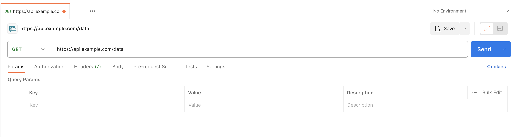

# Wie "spricht" man mit einer API?
[150 min]

Die Kommunikation mit APIs kann auf verschiedene Weisen erfolgen. Einige der gängigen Methoden sind CURL, die Python Requests Library und Postman. Natürlich gibt es aber in jeder Programmiersprache die Möglichkeit mit APIs zu kommunizierne.

Um ein besseres Verständnis mit dem Umgang mit API aufzubauen, nutzen wir zwei kostenlose APIs zur Abfrage des Wetters an einer Geokoordinate: https://open-meteo.com/ und https://brightsky.dev/.

## CURL

CURL (Client URL) ist ein Command Line Tool, das verwendet wird, um Daten zwischen einem Server und einem Client über verschiedene Protokolle wie HTTP, HTTPS und FTP zu übertragen. Es ist besonders nützlich für das **Testen** und Interagieren mit APIs direkt von der Kommandozeile aus.

### Vorteile

Ein großer Vorteil ist die Plattformunabhängig. CURL ist sowohl für Windows, Mac und Linux verfügbar. Zusätzlich ist es extrem vielseitig und unterstützt eine Vielzahl von Protokollen. und ist sowit ideal für schnelle Tests und Debugging.

### Nachteile

Die Orientierung in der Kommandozeile kann für Anfänger eine Herausforderung darstellen. Zusätzlich kann die Nutzung bei komplexeren Anfragen schnell unübersichtlich werden. Außerdem fehlt eine grafische Benutzeroberfläche, was die Bearbeitung von Anfragen erschwert.

### Beispiel

```js
curl https://api.example.com/data
```

### Aufgabe: Terminal CURL Wetter API abrufen 🌶️️

Nutze CURL im Terminal, um die Wetterdaten von https://open-meteo.com/ für einen bestimmten Ort abzufragen.

<details>
<summary>Lösung</summary>

<pre><code>
curl "https://api.open-meteo.com/v1/forecast?latitude=52.5200&longitude=13.4050&daily=temperature_2m_max,temperature_2m_min&timezone=Europe%2F
</code></pre>
</details>

## Python Requests

Die Python Requests Library wird für das Senden von HTTP-Anfragen verwendet. Sie ist bekannt für ihre Benutzerfreundlichkeit.

### Vorteile

Die requests Library hat eine besonders einfache und intuitive Syntax und ermöglicht so, mit wenigen Zeilen Code auch komplexe Anfragen durchzuführen.

### Nachteile

Der Benutzer muss natürlich mit Python vertraut sein und das Einrichten einer Python-Umgebung mit allen notwendigen Abhängigkeiten kann für einige Benutzer aufwendig sein.

### Beispiel

```python
import requests
response = requests.get('https://api.example.com/data')
print(response.json())
```

### Aufgabe: Python Wetter API abrufen 🌶️️🌶️️

Verwende die Python Request Library, um die Wetterdaten von https://open-meteo.com/ für einen bestimmten Ort abzufragen.

<details>
<summary>Lösung</summary>
<pre><code>
import requests

# URL des API-Endpunkts
url = "https://api.open-meteo.com/v1/forecast"

# Parameter für die API-Anfrage
params = {
    'latitude': 52.5200,   # Breitengrad für Berlin
    'longitude': 13.4050,  # Längengrad für Berlin
    'daily': 'temperature_2m_max,temperature_2m_min',  # Tägliche Maximal- und Minimaltemperatur
    'timezone': 'Europe/Berlin'  # Zeitzone
}

# API-Anfrage senden und Antwort erhalten
response = requests.get(url, params=params)

# Antwort JSON ausgeben
print(response.json())
</code></pre>
</details>

## Postman

[Postman](https://www.postman.com/) ist eine populäre API-Entwicklungsplattform, die verwendet wird, um API-Anfragen zu erstellen, zu testen und zu dokumentieren.

### Vorteile

Postman bietet eine grafische Benutzeroberfläche und ist damit sehr intuitiv. Zusätzlich ermöglicht es das Speichern, Organisieren und Teilen von API-Anfragen und eignet sich damit auch sehr gut für fortgeschrittenes API-Testing und Monitoring.

### Nachteile

Auf älteren oder weniger leistungsfähigen Computern kann Postman ressourcenintensiv sein und die Nutzung fortgeschrittener Funktionen bedarf eine gewisse Einarbeitungzeit. Für die kollaborative Nutzung können außerdem zusätzliche Kosten anfallen.

### Beispiel

Um eine API in Postman zu testen, erstellt man eine neue Anfrage, wählt z.B. die Methode GET und fügt dann einfah nur die URL hinzu.



### Aufgabe: Postman Wetter API abrufen 🌶️️🌶️️

Nutze Postman, um die Wetterdaten von https://open-meteo.com/ für einen bestimmten Ort abzufragen.

<details>
<summary>Lösung</summary>
<pre><code>
1. Postman öffnen: Starte die Postman-Anwendung auf deinem Computer.

2. Neue Anfrage erstellen: Klicke auf "New" und dann auf "Request". Gib der Anfrage einen Namen und speichere sie in einer geeigneten Collection.

3. Anfrage konfigurieren:
   - Methode: Wähle die Methode "GET".
   - URL: Füge die URL des API-Endpunkts ein: https://api.open-meteo.com/v1/forecast

4. Parameter hinzufügen: Unter "Params" trage die notwendigen Schlüssel-Werte-Paare für deine Anfrage ein. Zum Beispiel:
   - Key: latitude, Value: 52.5200   (für Berlin)
   - Key: longitude, Value: 13.4050  (für Berlin)
   - Key: daily, Value: temperature_2m_max,temperature_2m_min
   - Key: timezone, Value: Europe/Berlin

5. Anfrage senden: Klicke auf "Send", um die Anfrage an den Server zu senden und die Antwort zu erhalten.

6. Antwort prüfen: Überprüfe die Ergebnisse im Bereich "Body" von Postman, um die Wetterdaten zu sehen.

</code></pre>
</details>

## Aufgaben

### Aufgabe: API Request an weiteren Wetterservice 🌶️️

Führe mit einer Methode deiner Wahl einen API Request für die selben Geokoordinaten an https://brightsky.dev/ aus.

<details>
<summary>Lösung</summary>
<pre><code>
import requests

# URL des API-Endpunkts von BrightSky
url = "https://api.brightsky.dev/weather"

# Parameter für die API-Anfrage
params = {
    'lat': 52.5200,   # Breitengrad für Berlin
    'lon': 13.4050,   # Längengrad für Berlin
    'date': '2023-04-01'  # Ein bestimmtes Datum, an dem das Wetter abgefragt wird
}

# API-Anfrage senden und Antwort erhalten
response = requests.get(url, params=params)

# Antwort JSON ausgeben
print(response.json())
</code></pre>
</details>

### Aufgabe: Analyse und Vergleich der API Responses 🌶️️🌶️️

Analysiere und vergleiche die Antworten beider APIs. Was fällt auf? Was ist der Grund dafür? 

<details>
<summary>Lösung</summary>
<pre><code>
Analysiere die Struktur und den Inhalt der API-Antworten von Open Meteo und BrightSky. Achte auf:
- Datentypen und -strukturen (z.B. Listen, Objekte)
- Verfügbarkeit von Wetterdaten (z.B. Temperaturbereiche, Niederschlagsmengen)
- Aktualisierungsintervalle und Vorhersagezeiträume

Vergleiche:
- Open Meteo liefert detaillierte Vorhersagen für spezifische Zeitpunkte des Tages.
- BrightSky bietet eventuell eine stündliche Aufschlüsselung und könnte mehr historische Daten einbeziehen.

Gründe für Unterschiede:
- Verschiedene Datenquellen und Genauigkeit der Modelle.
- Unterschiedliche Zielgruppen und Anwendungsgebiete, wie städtische vs. ländliche Vorhersagen.
</code></pre>
</details>


## Reflexionsrunde

[10 min]

- **API Antworten**: Warum sind die Antworten von Open-Meteo und Bright Sky unterschiedlich?

- **Datenstruktur und Format**: Wie präsentieren die APIs ihre Daten? Sind die Daten in JSON, XML oder einem anderen Format?

- **Detailgrad und Umfang**: Welche Art von Informationen liefern die APIs? Bieten sie grundlegende oder detaillierte Daten?

- **Aktualität und Genauigkeit**: Wie aktuell sind die Daten? Gibt es Unterschiede in der Genauigkeit oder Zuverlässigkeit der Informationen?

- **API-Design und Dokumentation**: Wie unterscheiden sich die APIs in Bezug auf Benutzerfreundlichkeit und Dokumentationsklarheit?