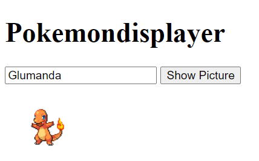
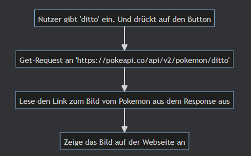

la# LZK

In dieser LZK soll dein Wissen über Web-programmierung geprüft werden.
Du erstellst eine kleine Webanwendung, die lokal bei dir läuft.

Es handelt sich um eine einfache Webseite, auf dem das Bild eines Pokemons
angezeigt werden soll. Die URL zu diesem Bild wird über die PokeAPI ermittelt.

Die Webseite soll weiterhin mit Namen der Pokemon mit verschieden Sprachen
zurechtkommen. Daher soll eine eigene API erstellt werden, mit der sich die 
Webseite verbindet, um z.B. deutsche Namen in den englischen zu übersetzen.
Dazu liegt eine csv mit Übersetzungen bereit.

Wir teilen die Aufgaben hier in kleine Arbeitspakete auf. Konzentriere dich auf eines 
zur Zeit. Die Aufgabe sind bereits in einer sinnvollen Reihenfolge vorgegeben,
können aber auch in einer anderen bearbeitet werden.

Als Hilfsmittel ist ausschließlich das Skript erlaubt.

## Teil 1: Webseite

* **HTML erstellen**: Öffne die Datei `main.html` und erstelle alle Tags, die für das Rendern
  einer Webseite nötig sind. Füge weiterhin einen `input`-, `button`- und einem `img`-Tag ein. Füge auch noch eine 
  Überschrift mit dem Titel "Pokemondisplayer" ein. Sorge dafür, dass "Pokemondisplayer" auch im Reiter deines 
  Browsers erscheint.
* **Verbindung zur PokeAPI mit JavaScript**: Füge der HTML-Datei ein `script`-tag hinzu. Füge JavaScript-Code
  hinzu, der den Inhalt vom `input`-Tag ausließt, wenn auf den Button gedrückt wird. Mit JavaScript soll ein
  Request zu [PokéAPI](https://pokeapi.co/) gesendet werden, um Informationen über das Pokemon zu erhalten,
  dass im Input-Feld eingegeben wurde. Hinweis: die Pythonmethode `my_str.tolower()`, heißt in JavaScript `my_str.toLowerCase()`.
* **Bild darstellen**: Der Link zum Bild des Pokemons findest du im Response unter `sprites -> front_default`. Erweitere das JavaScript, sodass das Bild im vorbereiteten `img`-Tag zu sehen ist.

## Teil 2: Spaß mit CSS

* **CSS einbinden**: Öffne die Datei `style.css`, die sich in static/css befindet und binde sie ins html ein. Die Überschrift sollte nun rot sein.
* **CSS anpassen**: Derzeit haben Teile der Datei noch keine Auswirkungen. 
  Diese Datei kann leicht so angepasst werden, dass `img`-Tags einen schwarzen Rand erhalten. 
  Nehmen diese Anpassung vor.
* **CSS weiter anpassen**: Sorge dafür, dass der Rand grün wird und dicker (10 Pixel breit). 

# Teil 3: Api bereitstellen

* **Route erstellen**: Öffne die Datei `translator.py` und erstelle in der Datei einen GET-Endpunkt.
  Dieser hat die Route `"\translate"`.
  Dieser erwartet als Pfadvariable den Namen eines Pokemons in einer beliebigen Sprache und übersetzt
  diesen ins Englische. Nutze zum Übersetzen zunächst die bereits implementierte Funktion `translate_to_eng`
  aus dem bereitgestellten Modul `provided_translator`.
* **Lokale Api nutzen**: Erweitere dein JavaScript um die Nutzung der lokalen Api, um die Eingabe des Nutzers zunächst
  ins Englische zu übersetzen. Mit dieser englischen
  Übersetzung lässt sich dann der Request zur PokéAPI wieder durchführen.
* **Hinweis:** Vergiss nicht, deine `translator.py` zu starten. Von nun an teste deine Website im Browser **über den Flask Server** (Route '/')!  
Falls das CSS nicht mehr eingebunden werden sollte, füge folgende Codezeile in die main.html ein:  `<link rel="stylesheet" href="{{ url_for('static', filename='css/style.css') }}">`

## Teil 4: Datenbank verbinden

* **Datenbank untersuchen**: Untersuche die beigelegte Datenbank `pokemon.db`.
* **Eigenen Translator**: Erstelle eine Datei namens `sqlalchemy_translator.py`. Implementiere die übrigen Aufgaben
  dieses Teils in dieser Datei.
* **ORM erstellen**: Erstelle mit `sqlalchemy` ein Model für die Tabelle `pokemon` in der Datenbank.
  Sollte dir nicht möglich sein, die Aufgabenstellung mit `sqlalchemy` zu lösen, kannst du auch
  `sqlite3` verwenden, um direkt eine Query an die Datenbank abzusetzen.
* **Sprache finden**: Schreibe eine Funktion `translate_to_eng`, die sich mit der Datenbank verbindet,
  umd die Funktion von `translate_to_eng` aus dem Modul `provided_translator` zu erfüllen.
* **Refactoring**: Stelle deine API um, sodass nun die Datenbankbank-basierte `translate_to_eng` Methode
  genutzt wird, die du implementiert hast.

## Wenn du fertig bist

* Sichere alle Dateien in einem zip-file und sende es an `viktor.reichert@qualidy.de`

## Kreativ

Wenn du noch Zeit hast und alle anderen Aufgaben erledigt sind, erweitere das Programm um mit denen Skills zu flexen.
Du kannst mir diese Erweiterung dann in einer seperaten Mail zusenden.
